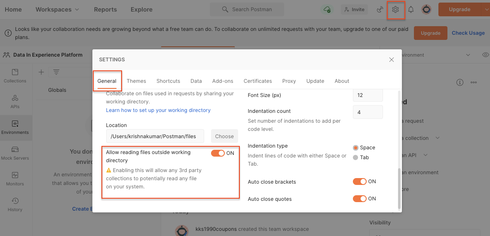
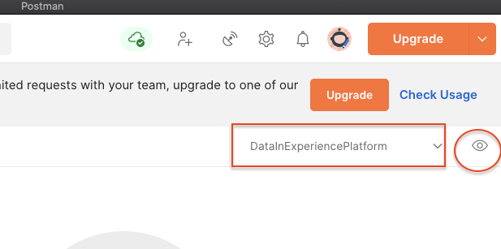
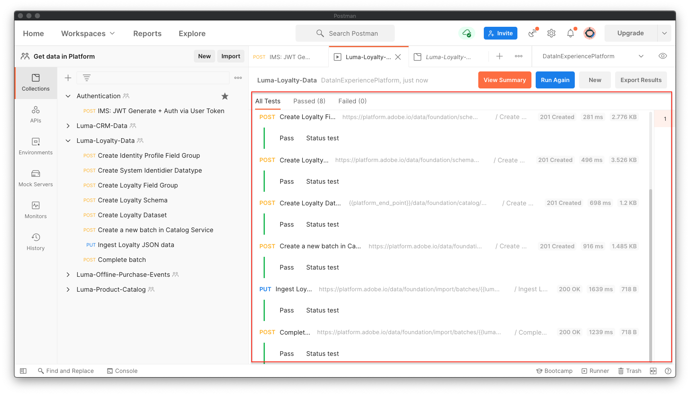

# Adobe Experience Platform으로 샘플 데이터 가져오기

샘플 데이터를 사용하여 Experience Platform 샌드박스 환경을 설정하는 방법에 대해 알아봅니다. Postman 컬렉션을 사용하여 필드 그룹, 스키마, 데이터 세트를 만든 다음 샘플 데이터를 Experience Platform으로 가져올 수 있습니다.

## 샘플 데이터 사용 사례

Experience Platform 비즈니스 사용자는 Experience Platform에서 제공하는 마케팅 기능을 탐색하려면 먼저 필드 그룹 식별, 스키마 만들기, 데이터 준비, 데이터 세트 생성, 데이터 수집 등과 같은 일련의 단계를 수행해야 합니다. 이 자습서는 일부 단계를 자동화하여 데이터를 Platform Sandbox로 가능한 한 빨리 가져올 수 있습니다.

이 자습서에서는 Luma라는 가상의 소매 브랜드에 중점을 둡니다. 충성도, CRM, 제품 카탈로그 및 오프라인 구매 데이터를 실시간 고객 프로필에 결합하고 이러한 프로필을 활성화하여 마케팅을 한 차원 끌어올리기 위해 Adobe Experience Platform에 투자하고 있습니다. Luma에 대한 샘플 데이터를 생성했으며, 이 자습서의 나머지 부분에서 이 데이터를 Experience Platform 샌드박스 환경 중 하나로 가져옵니다.

>[!NOTE]
>
>이 자습서의 최종 결과는 와 동일한 샘플 데이터를 포함하는 샌드박스입니다 [데이터 설계자 및 데이터 엔지니어를 위한 Adobe Experience Platform 시작하기 자습서](https://experienceleague.adobe.com/docs/platform-learn/getting-started-for-data-architects-and-data-engineers/overview.html).

## 전제 조건

* Experience Platform API에 액세스할 수 있고 인증 방법을 알 수 있습니다. 없는 경우 이 내용을 검토하십시오 [튜토리얼](https://experienceleague.adobe.com/docs/platform-learn/tutorials/platform-api-authentication.html?lang=ko).
* Experience Platform 개발 샌드박스에 액세스할 수 있습니다.
* Experience Platform 테넌트 ID를 알고 있습니다. 인증을 통해 얻습니다 [API 요청](https://experienceleague.adobe.com/docs/experience-platform/xdm/api/getting-started.html?lang=en#know-your-tenant_id)
또는 Platform 계정에 로그인할 때 URL에서 추출하여 사용할 수 있습니다. 예를 들어 다음 URL에서 테넌트는 &quot; 입니다.
`techmarketingdemos`&quot; `https://experience.adobe.com/#/@techmarketingdemos/sname:prod/platform/home`.

## Postman 사용 {#postman}

### 환경 변수 설정

이 단계를 따르기 전에 [Postman](https://www.postman.com/downloads/) 응용 프로그램.  그럼 시작해 보겠습니다!

1. 다운로드 [platform-utils-main.zip](../assets/data-generator/platform-utils-main.zip) 파일. 이 자습서에 필요한 모든 파일을 포함합니다.

   >[!NOTE]
   >
   >에 포함된 사용자 데이터 [platform-utils-main.zip](../assets/data-generator/platform-utils-main.zip) 파일은 가상 파일이며 데모용으로만 사용됩니다.

1. 다운로드 폴더에서 `platform-utils-main.zip` 파일을 컴퓨터의 원하는 위치에 저장하고 압축을 해제합니다.
1. 에서 `luma-data` 폴더, 모두 열기 `json` 텍스트 편집기에 있는 파일 및 `_techmarketingdemos` 자신의 테넌트 id를 사용하고 앞에 밑줄을 추가합니다.
1. 열기 `luma-offline-purchases.json` 텍스트 편집기에서 모든 타임스탬프를 업데이트하여 이벤트가 지난달에 발생하도록(예: `"timestamp":"2022-06` 연도 및 월 대체)
1. 압축을 푼 폴더의 위치를 나중에 설정할 때 필요할 때 확인합니다 `FILE_PATH` Postman 환경 변수:

   >[!NOTE]
   > Mac에서 파일 경로를 가져오려면 `platform-utils-main` 폴더를 마우스 오른쪽 단추로 클릭하고 를 선택합니다. **정보 가져오기** 선택 사항입니다.
   >
   > 

   >[!NOTE]
   > 창에서 파일 경로를 가져오려면 원하는 폴더의 위치를 클릭하여 연 다음, 주소 표시줄에서 경로 오른쪽을 마우스 오른쪽 단추로 클릭합니다. 주소를 복사하여 파일 경로를 가져옵니다.
   > 
   > 

1. Postman을 열고 **작업 공간** 드롭다운 메뉴:\
   
1. 을(를) 입력합니다. **이름** 및 옵션 **요약** 작업 공간에 대해 **작업 공간 만들기**. Postman을 만들면 새 작업 공간으로 전환됩니다.
   
1. 이제 이 작업 영역에서 Postman 컬렉션을 실행하도록 일부 설정을 조정합니다. Postman의 헤더에서 톱니바퀴 아이콘을 클릭하고 을 선택합니다 **설정** 설정 모달을 열려면 다음을 수행하십시오. 키보드 단축키 (CMD/CTRL + )를 사용하여 모달을 열 수도 있습니다.
1. 아래에 `General` 탭에서 요청 시간 제한을 ms로 업데이트합니다. `5000 ms` 및 활성화 `allow reading file outside this directory`
   

   >[!NOTE]
   > 작업 디렉토리 내에서 파일을 로드하면 동일한 파일이 다른 장치에 저장되어 있으면 장치 간에 원활하게 실행됩니다. 그러나 작업 디렉토리 외부에서 파일을 실행하려면 설정을 켜서 동일한 의도를 나타내야 합니다. 만약 `FILE_PATH` 이 Postman의 작업 디렉토리 경로와 동일하지 않으면 이 옵션을 활성화해야 합니다.

1. 닫기 **설정** 패널.
1. 을(를) 선택합니다 **환경** 그런 다음 **가져오기**:
   
1. 다운로드한 json 환경 파일을 가져옵니다. `DataInExperiencePlatform.postman_environment`
1. Postman의 오른쪽 상단 드롭다운에서 환경을 선택하고 눈 아이콘을 클릭하여 환경 변수를 확인합니다.
   

1. 다음 환경 변수가 채워졌는지 확인하십시오. 환경 변수의 값을 가져오는 방법에 대해 알아보려면 [Experience Platform API 인증](/help/platform/authentication/platform-api-authentication.md) 단계별 지침을 위한 자습서입니다.

   * `CLIENT_SECRET`
   * `API_KEY`—`Client ID` Adobe Developer 콘솔에서
   * `TECHNICAL_ACCOUNT_ID`
   * `META_SCOPE`
   * `IMS`
   * `IMS_ORG`—`Organization ID` Adobe Developer 콘솔에서
   * `PRIVATE_KEY`
   * `SANDBOX_NAME`
   * `CONTAINER_ID`
   * `TENANT_ID`- 예를 들어 밑줄을 사용하여 리드해야 합니다 `_techmarketingdemos`
   * `platform_end_point`
   * `FILE_PATH`- 압축을 푼 로컬 폴더 경로를 사용합니다. `platform-utils-main.zip` 파일. 예를 들어 폴더 이름이 포함되어 있는지 확인합니다 `/Users/dwright/Desktop/platform-utils-main`

1. **저장** 업데이트된 환경

### Postman 컬렉션 가져오기

그런 다음 컬렉션을 Postman에 가져와야 합니다.

1. 선택 **컬렉션** 그런 다음 가져오기 옵션을 선택합니다.

   

1. 다음 컬렉션을 가져옵니다.

   * `0-Authentication.postman_collection.json`
   * `1-Luma-Loyalty-Data.postman_collection.json`
   * `2-Luma-CRM-Data.postman_collection.json`
   * `3-Luma-Product-Catalog.postman_collection.json`
   * `4-Luma-Offline-Purchase-Events.postman_collection.json`

   

### 인증

그런 다음 사용자 토큰을 인증하고 생성해야 합니다. 이 자습서에서 사용되는 토큰 생성 방법은 비프로덕션 사용에만 적합합니다. 로컬 서명은 타사 호스트에서 JavaScript 라이브러리를 로드하고 원격 서명은 개인 키를 소유 및 운영되는 웹 서비스로 보냅니다. Adobe은 이 개인 키를 저장하지 않지만 프로덕션 키는 다른 사람과 공유해서는 안 됩니다.

1. 를 엽니다. `Authentication` 컬렉션에서 `IMS: JWT Generate + Auth via User Token` POST 요청을 클릭한 다음 `SEND` 액세스 토큰을 인증하고 얻습니다.

   

1. 환경 변수를 검토하고 `JWT_TOKEN` 및 `ACCESS_TOKEN` 이제 가 채워집니다.

### 데이터 가져오기

이제 데이터를 준비하여 Platform Sandbox로 가져올 수 있습니다. 가져온 Postman 컬렉션은 무거운 짐들을 모두 들어올릴 것입니다!

1. 를 엽니다. `1-Luma-Loyalty-Data` 컬렉션 을 클릭하고 **실행** 개요 탭에서 Collection Runner를 시작합니다.

   

1. 컬렉션 실행자 창의 드롭다운에서 환경을 선택하고 을(를) 업데이트합니다. **지연** to `4000ms`에서 을(를) 확인합니다. **응답 저장** 옵션을 선택하고 실행 순서가 올바른지 확인합니다. 을(를) 클릭합니다. **Luma 충성도 데이터 실행** 버튼

   

   >[!NOTE]
   >
   >**1-Luma-충성도-데이터** 고객 충성도 데이터를 위한 스키마를 만듭니다. 스키마는 XDM 개별 프로필 클래스, 표준 필드 그룹, 사용자 지정 필드 그룹 및 데이터 세트를 기반으로 합니다. 이 컬렉션은 스키마를 사용하여 데이터 세트를 만들고 샘플 고객 충성도 데이터를 Adobe Experience Platform에 업로드합니다.

   >[!NOTE]
   >
   >Postman 컬렉션 실행자 중에 컬렉션 요청이 실패하는 경우 실행을 중지하고 컬렉션 요청을 하나씩 실행합니다.

1. 모든 것이 잘 되면 `Luma-Loyalty-Data` 컬렉션이 전달되어야 합니다.

   

1. 이제 로그인하겠습니다. [Adobe Experience Platform 인터페이스](https://platform.adobe.com/) 데이터 세트로 이동합니다.
1. 를 엽니다. `Luma Loyalty Dataset` 데이터 세트 및 데이터 세트 활동 창에서 1000개의 레코드를 수집한 성공적인 배치 실행을 볼 수 있습니다. 데이터 세트 미리 보기 옵션을 클릭하여 수집된 레코드를 확인할 수도 있습니다. 1000을 확인하려면 몇 분 정도 기다려야 할 수 있습니다 [!UICONTROL 새 프로필 조각] 생성되었습니다.
   
1. 1-3단계를 반복하여 다른 컬렉션을 실행합니다.
   * `2-Luma-CRM-Data.postman_collection.json` 고객의 CRM 데이터를 위한 스키마와 채워진 데이터 세트를 만듭니다. 스키마는 인구 통계 세부 정보, 개인 연락처 세부 정보, 기본 설정 세부 사항 및 사용자 지정 ID 필드 그룹을 포함하는 XDM 개별 프로필 클래스를 기반으로 합니다.
   * `3-Luma-Product-Catalog.postman_collection.json` 제품 카탈로그 정보에 대한 스키마 및 채워진 데이터 세트를 만듭니다. 스키마는 사용자 지정 제품 카탈로그 클래스를 기반으로 하며 사용자 지정 제품 카탈로그 필드 그룹을 사용합니다.
   * `4-Luma-Offline-Purchase-Events.postman_collection.json` 고객의 오프라인 구매 이벤트 데이터를 위해 스키마와 채워진 데이터 세트를 만듭니다. 이 스키마는 XDM ExperienceEvent 클래스를 기반으로 하며, 사용자 지정 ID 및 상거래 세부 사항 필드 그룹을 포함합니다.

## 유효성 검사

샘플 데이터는 컬렉션을 실행할 때 여러 시스템의 데이터를 결합하는 실시간 고객 프로필이 빌드되도록 설계되었습니다. 다음은 충성도, CRM 및 오프라인 구매 데이터 세트의 첫 번째 레코드입니다. 해당 프로필을 검색하여 데이터가 수집되었는지 확인합니다. 에서 [Adobe Experience Platform 인터페이스](https://platform.adobe.com/):

1. 이동 **[!UICONTROL 프로필]** > **[!UICONTROL 찾아보기]**
1. 선택 `Luma Loyalty Id` 로서의 **[!UICONTROL ID 네임스페이스]**
1. 검색 대상 `5625458` 로서의 **[!UICONTROL ID 값]**
1. 를 엽니다. `Danny Wright` 프로필

에서 데이터를 검색하여 **[!UICONTROL 속성]** 및 **[!UICONTROL 이벤트]** 탭에는 다음과 같이 다양한 데이터 파일의 데이터가 프로필에 포함되어 있는 것을 볼 수 있습니다.

## 다음 단계

병합 정책, 데이터 거버넌스, 쿼리 서비스 및 세그먼트 빌더에 대해 알아보려면 로 이동합니다 [데이터 설계자 및 데이터 엔지니어 시작하기 자습서의 11 단원을 참조하십시오](https://experienceleague.adobe.com/docs/platform-learn/getting-started-for-data-architects-and-data-engineers/create-merge-policies.html?lang=en). 이 다른 자습서의 이전 단원에서는 이러한 Postman 컬렉션으로 방금 채운 모든 것을 수동으로 빌드하여 시작할 수 있습니다.

이 샌드박스에 연결할 샘플 Web SDK 구현을 빌드하려면 다음을 수행하십시오.
[웹 SDK를 사용하여 Adobe Experience Cloud 구현 자습서](https://experienceleague.adobe.com/docs/platform-learn/implement-web-sdk/overview.html?lang=ko-KR). 웹 SDK 자습서의 &quot;초기 구성&quot;, &quot;태그 구성&quot; 및 &quot;Experience Platform 설정&quot; 단원을 설정한 후, `luma-crm.json` 암호를 사용한 파일 `test` 프로필 조각을 이 자습서에 업로드된 데이터와 병합을 확인하십시오.

이 샌드박스에 연결할 샘플 Mobile SDK 구현을 빌드하려면 다음을 수행하십시오.
[모바일 앱에서 Adobe Experience Cloud 구현 자습서](https://experienceleague.adobe.com/docs/platform-learn/implement-mobile-sdk/overview.html?lang=ko). 웹 SDK 자습서의 &quot;초기 구성&quot;, &quot;앱 구현&quot; 및 &quot;Experience Platform&quot; 단원을 설정한 후에 의 첫 번째 이메일 주소를 사용하여 Luma 웹 사이트에 로그인합니다 `luma-crm.json` 파일 을 참조하십시오.

## 샌드박스 환경 재설정 {#reset-sandbox}

비프로덕션 샌드박스를 재설정하면 샌드박스의 이름 및 관련 권한을 유지하면서 해당 샌드박스와 연결된 모든 리소스(스키마, 데이터 세트 등)가 삭제됩니다. 이 &quot;clean&quot; 샌드박스는 액세스 권한이 있는 사용자에 대해 동일한 이름으로 계속 사용할 수 있습니다.

다음 단계를 수행합니다 [여기](https://experienceleague.adobe.com/docs/experience-platform/sandbox/ui/user-guide.html?lang=en#reset-a-sandbox) 샌드박스 환경을 재설정하려면 다음을 수행하십시오.
