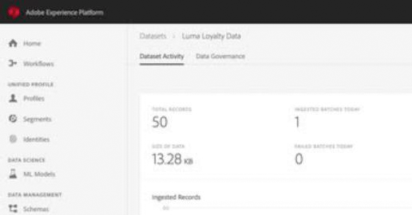

# Adobe Experience Platform 자습서

Adobe Experience Platform은 고객 경험을 이끄는 완벽한 솔루션을 구축하고 관리할 수 있는 시장에서 가장 강력하고 유연하며 개방적인 시스템입니다. Experience Platform을 사용하면 조직 내 모든 시스템의 고객 데이터와 컨텐츠를 중앙 집중화 및 표준화하고 데이터 과학 및 시스템 학습을 적용하여 풍부한 개인별 경험을 더 잘 설계하고 전달할 수 있습니다. 이 비디오와 자습서를 사용하여 Experience Platform의 다양한 구성 요소를 학습할 수 있습니다.

## 새로운 기능

* **[속성 기반 액세스 제어 구성(비디오)](admin/configure-attribute-based-access-control.md)**

   *특정 리소스에 대한 액세스 제한*
* **[데이터 위생 개요(비디오)](/help/platform/data-hygiene/overview.md)**

   *데이터 최소화 사례 개선*
* **[데이터 세트 삭제(비디오)](/help/platform/data-hygiene/delete-datasets.md)**

   *데이터 세트에 대한 사용 시간 설정*

## 직원 추천

<table style="margin-top: 0">
<tr>
  <td>
    
    

      <a href="intro-to-platform/a-customer-experience-powered-by-experience-platform.md">
    <strong>Experience Platform 기반의 고객 경험</strong>
    </a>
    

    

    <em>Platform을 사용하여 고객 경험을 향상시키는 방법 을 참조하십시오</em>
    

  </td>
  <td>
    
    

      <a href="https://experienceleague.adobe.com/docs/platform-learn/getting-started-for-data-architects-and-data-engineers/overview.html">
    <strong>데이터 설계자 및 데이터 엔지니어 시작하기</strong>
    </a>
    

    

    <em>시작하기 위한 실습 연습</em>
    

  </td>
  <td>
    
    

      <a href="sources/overview.md">
    <strong>소스 커넥터 이해</strong>
    </a>
    

    

    <em>손쉽게 데이터 수집</em>
    

  </td>
   <!--
   <td>
    
    

      <a href="data-ingestion/create-datasets-and-ingest-data.md">
    <strong>Create Datasets and Ingest Data</strong>
    </a>
    

    

    <em>Ingest your dataset.</em>
    

  </td>
  <td>
    
    

      <a href="segments/create-segments.md">
    <strong>Create Segments</strong>
    </a>
    

    

    <em>Build segments based on your data.</em>
    

  </td>-->
</tr>
</table>

