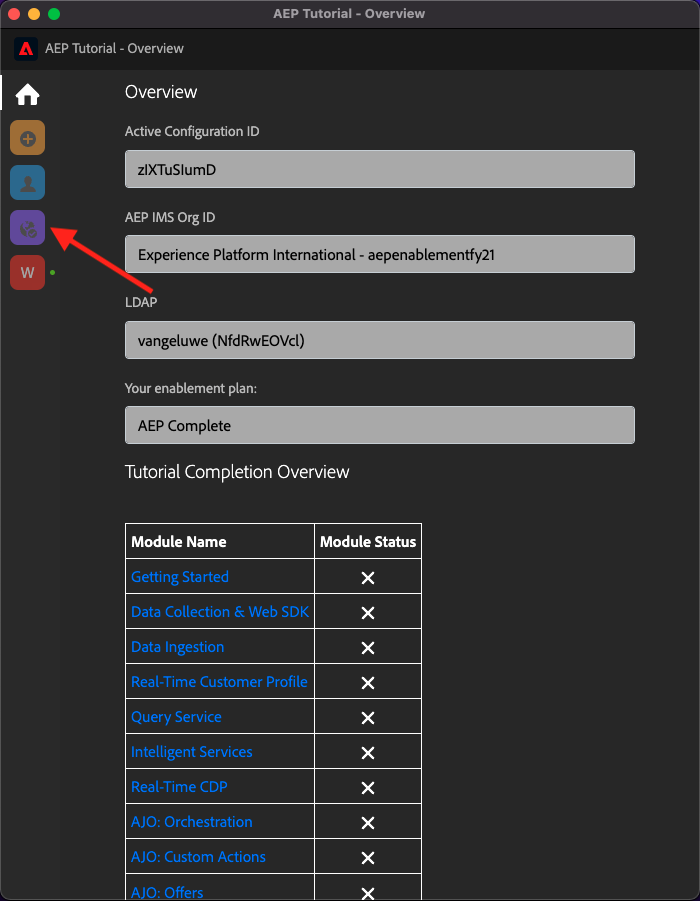
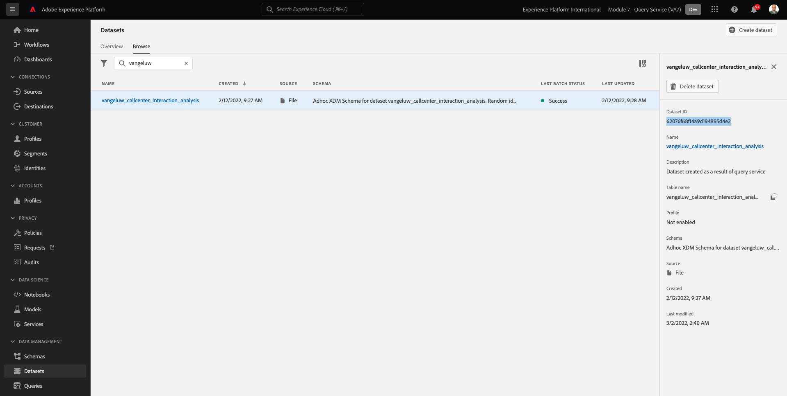

# Adobe Experience Platform에 대한 포괄적인 기술 자습서 - 완료는 어떻게 측정됩니까?

생성된 Chrome 확장을 사용하여 Adobe Experience Platform에 대한 포괄적인 기술 자습서 완료를 업데이트할 수 있습니다.

모듈 0의 지침에 따라 조직의 **구성 ID** ( Chrome 확장 프로그램)에서 등록하고 이제 Chrome 확장이 다음과 같이 표시됩니다. 자주색 아이콘을 클릭하여 모듈 완료를 제출합니다.

그러면 다음 내용이 표시됩니다.

드롭다운 메뉴를 열어 완료할 모듈을 선택할 수 있습니다.

모듈을 완료하려면 완료 증명을 제공해야 합니다.

다음은 모든 모듈에 대해 예상되는 완료 증명입니다.

## 시작하기

모듈에 대한 예상 완료 증명 **시작하기** 는 사용자가 만든 웹용 데모 시스템 프로젝트의 ID입니다.

웹 형식에 대한 데모 시스템 프로젝트의 ID는 다음과 같습니다. `--demoProfileLdap-- - OCUC`.

선택 **시작하기** 드롭다운 메뉴에서 **데모 시스템 프로젝트의 ID** 을 클릭하고 **제출** - 단추.

## 데이터 수집 및 웹 SDK

모듈에 대한 예상 완료 증명 **데이터 수집 및 웹 SDK** 는 웹용 데이터 수집 속성의 이름입니다.

웹 형식에 대한 데이터 수집 속성의 이름은 다음과 같습니다. `--demoProfileLdap-- - Demo System (05/02/2022) (enablement) 1644046719474`.

선택 **데이터 수집 및 웹 SDK** 드롭다운 메뉴에서 **웹용 데이터 수집 속성 이름** 을 클릭하고 **제출** - 단추.

## 데이터 수집

모듈에 대한 예상 완료 증명 **데이터 수집** 는 생성한 2개의 데이터 세트에 대한 데이터 세트 ID입니다.

데이터 세트 ID 형식은 다음과 같습니다. **5f069724723ef41916a8b5d2**.

`--demoProfileLdap-- - Demo System - Event Dataset for Website`

`--demoProfileLdap-- - Demo System - Profile Dataset for Website`

선택 **데이터 수집** 드롭다운 메뉴에서 **데이터 세트 ID** 입력 필드에서 두 데이터 세트에 대해 를 클릭하고 **제출** - 단추.

## 실시간 고객 프로필

모듈에 대한 예상 완료 증명 **실시간 고객 프로필** 은 **세그먼트 ID** UI를 통해 만든 세그먼트의 경우 `--demoProfileLdap-- - Male customers with interest in Montana Wind Jacket`.

세그먼트 ID 형식은 다음과 같습니다. **8cb7034d-d4ae-4d26-a61f-a76559c12457**.

선택 **실시간 고객 프로필** 드롭다운 메뉴에서 **세그먼트 ID** 입력 필드에서 **제출** - 단추.

## 쿼리 서비스

모듈에 대한 예상 완료 증명 **쿼리 서비스** 는 사용자의 데이터 세트 ID입니다 `--demoProfileLdap--_callcenter_interaction_analysis` - 모듈을 완료한 후 가져오는 데이터 세트.

형식은 다음과 같습니다. **62076f68f14a9d194995d4e2**.

선택 **쿼리 서비스** 드롭다운 메뉴에서 **데이터 세트 ID** 입력 필드에서 **제출** - 단추.

## 인텔리전트 서비스

모듈에 대한 예상 완료 증명 **Intelligent Services** 는 의 ID입니다 **제품 구매 성향 고객 AI 서비스**.

형식은 다음과 같습니다. **12729** 서비스를 열 때 URL에서 검색할 수 있습니다.

선택 **Intelligent Services** 드롭다운 메뉴에서 **고객 AI 서비스 ID** 입력 필드에서 **제출** - 단추.

## Real-Time CDP

모듈에 대한 예상 완료 증명 **Real-Time CDP** 는 의 ID입니다 **Adobe Target 활동**.

형식은 다음과 같습니다. **111804**.

선택 **Real-Time CDP** 드롭다운 메뉴에서 **Adobe Target 활동 ID** 입력 필드에서 **제출** - 단추.

## AJO: 오케스트레이션

모듈에 대한 예상 완료 증명 **AJO: 오케스트레이션** 는 용 eventID입니다 `--demoProfileLdap--AccountCreationEvent`.

형식은 다음과 같습니다. **227402c540eb8f8855c6b2333adf6d54d7153d9d7d56fa475a6866081c574736**.

선택 **AJO: 오케스트레이션** 드롭다운 메뉴에서 입력 필드에 ** eventID**를 입력하고 **제출** - 단추.

## AJO: 사용자 지정 작업

모듈에 대한 예상 완료 증명 **AJO: 사용자 지정 작업** 은 이벤트에 대한 eventID입니다 `--demoProfileLdap--GeofenceEntry`.

형식은 다음과 같습니다. **fa42ab7982ba55f039eacec24c1e32e5c51b310c67f0fa559ab49b89b63f4934**.

선택 **AJO: 사용자 지정 작업** 드롭다운 메뉴에서 **eventID** 입력 필드에서 **제출** - 단추.

## AJO: 오퍼

모듈에 대한 예상 완료 증명 **AJO: 오퍼** 는 의 ID입니다 **오퍼 결정** 생성되었습니다.

다음 항목이 있습니다. **오퍼 결정 ID**&#x200B;이렇게 보이는 경우 **xcore:offer-activity:1122fcc4603ea499**&#x200B;에는 다음이 포함되어 있습니다.

선택 **AJO: 오퍼** 드롭다운 메뉴에서 **오퍼 결정 ID** 입력 필드에서 **제출** - 단추.

## AJO: 이벤트

모듈에 대한 예상 완료 증명 **AJO: 이벤트** 는 용 eventID입니다 `--demoProfileLdap--StoreEntryEvent`.

형식은 다음과 같습니다. **e3a8f0bdc0b609667cd96a72a6b1e5aafa0ddaf6ccf121c574e6a2030860a633**.

선택 **AJO: 이벤트** 드롭다운 메뉴에서 **eventID** 입력 필드에서 **제출** - 단추.

## CJA

모듈에 대한 예상 완료 증명 **CJA** 는 프로젝트의 ID입니다 `--demoProfileLdap-- - Omnichannel Analysis`.

형식은 다음과 같습니다. **6217344f6249ac70c726db60**&#x200B;를 입력하면 프로젝트를 열 때 URL에서 찾을 수 있습니다.

선택 **CJA** 드롭다운 메뉴에서 **프로젝트 ID** 입력 필드에서 **제출** - 단추.

## CJA: BigQuery

모듈에 대한 예상 완료 증명 **CJA: BigQuery** 는 의 ID입니다 **BigQuery**-connection.

다음 항목이 있습니다. **BigQuery 연결 ID**&#x200B;이렇게 보이는 경우 **85a2394d-8b94-410c-a239-4d8b94b10c38**&#x200B;에는 다음이 포함되어 있습니다.

선택 **CJA: BigQuery** 드롭다운 메뉴에서 **BigQuery 연결 ID** 입력 필드에서 **제출** - 단추.

## RTCDP: EventHub

모듈에 대한 예상 완료 증명 **RTCDP: EventHub** 는 의 ID입니다 **Microsoft Azure 이벤트 허브** 대상(Adobe Experience Platform)을 참조하십시오.

다음 항목이 있습니다. **Microsoft Azure 이벤트 허브 대상 ID**&#x200B;이렇게 보이는 경우 **fa3f7ce5-86fd-4096-bf7c-e586fdc096ba**&#x200B;에는 다음이 포함되어 있습니다.

선택 **RTCDP: EventHub** 드롭다운 메뉴에서 **Microsoft Azure 이벤트 허브 대상 ID** 입력 필드에서 **제출** - 단추.

## RTCDP 연결

모듈에 대한 예상 완료 증명 **RTCDP 연결** 은 **이벤트 전달 속성 ID**.

다음 항목이 있습니다. **이벤트 전달 속성 ID**&#x200B;이렇게 보이는 경우 **PR40f44184c888472e9c19d8d602aab0de**&#x200B;에는 다음이 포함되어 있습니다.

선택 **RTCDP 연결** 드롭다운 메뉴에서 **이벤트 전달 속성 ID** 입력 필드에서 **제출** - 단추.

## Apache Kafka

모듈에 대한 예상 완료 증명 **Apache Kafka** 은 소스 커넥터의 ID입니다 `--demoProfileLdap-- - Kafka`.

ID는 다음과 같습니다 **f843d50a-ee30-4ca8-a766-0e4f3d29a2f7**&#x200B;여기에서 찾을 수 있습니다.

선택 **Apache Kafka** 드롭다운 메뉴에서 **흐름 ID** 입력 필드에서 **제출** - 단추.

[모든 모듈로 돌아가기](./overview.md)
