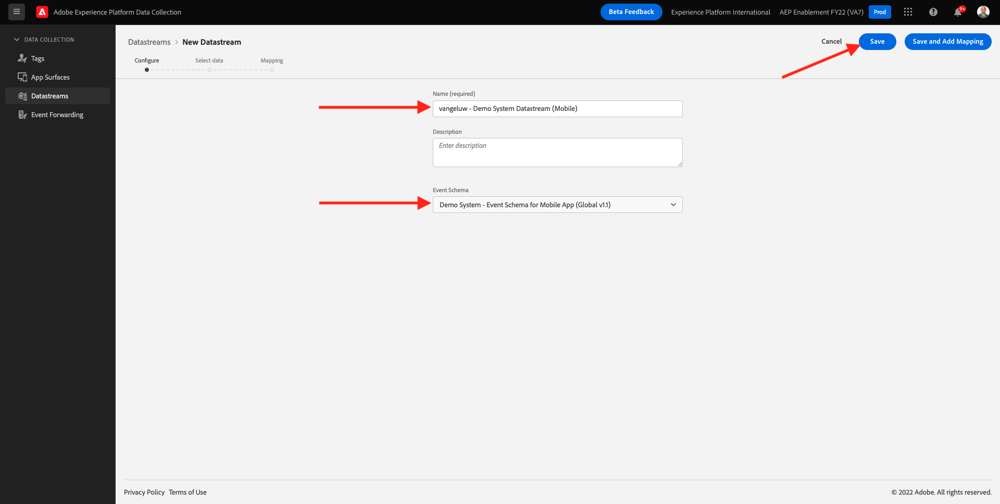
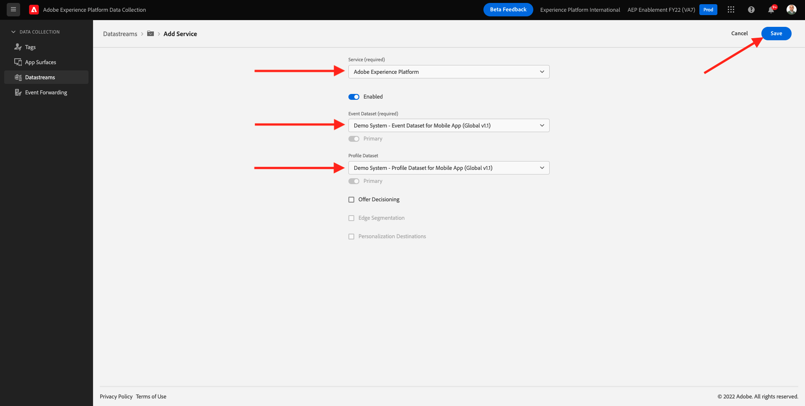
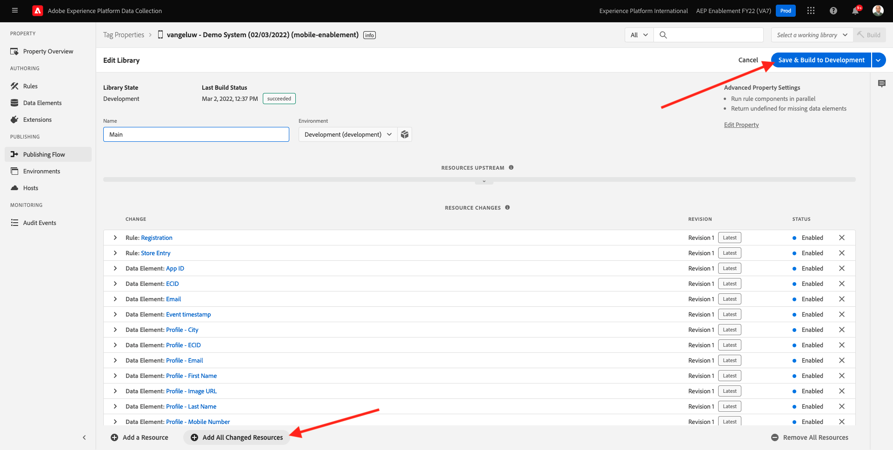

# 0.3 데이터 스트림 만들기

이동 [https://experience.adobe.com/#/data-collection/](https://experience.adobe.com/#/data-collection/). 이전 연습 후 이제 두 개의 데이터 수집 속성이 있습니다. 웹용 및 모바일용.

이러한 속성을 사용할 준비가 거의 되었지만 이러한 속성을 사용하여 데이터 수집을 시작하려면 먼저 데이터 스트림을 설정해야 합니다. 데이터 스트림의 개념 및 연습 1.2에서 의미하는 사항에 대한 자세한 정보를 얻을 수 있습니다.

지금은 다음 단계를 따르십시오.

## 0.3.1 웹용 데이터 스트림 만들기

클릭 **[!UICONTROL 데이터 스트림]** 또는 **[!UICONTROL 데이터 스트림(베타)]**.

화면의 오른쪽 상단 모서리에서 샌드박스 이름을 선택합니다. 샌드박스 이름은 다음과 같습니다. `--aepSandboxId--`.

클릭 **[!UICONTROL 새 데이터 스트림]**.

대상 **[!UICONTROL 친숙한 이름]**, 그리고 선택적 설명에 대해 다음을 입력합니다. `--demoProfileLdap-- - Demo System Datastream`. 이벤트 스키마의 경우 **데모 시스템 - 웹 사이트용 이벤트 스키마(글로벌 v1.1)**. **저장**&#x200B;을 클릭합니다.

그러면 이게 보입니다. 클릭 **서비스 추가**.

서비스를 선택합니다 **[!UICONTROL Adobe Experience Platform]**: 추가 필드가 표시됩니다. 그러면 이게 보입니다.

이벤트 데이터 세트에 대해 를 선택합니다. **데모 시스템 - 웹 사이트의 이벤트 데이터 세트(글로벌 v1.1)** 및 프로필 데이터 세트에 대해 를 선택합니다. **데모 시스템 - 웹 사이트의 프로필 데이터 세트(글로벌 v1.1)**. **저장**&#x200B;을 클릭합니다.

이제 이게 보입니다.

지금이야. in [모듈 1](./../module1/data-ingestion-launch-web-sdk.md) 웹 SDK와 모든 기능을 구성하는 방법에 대해 자세히 알아봅니다.

왼쪽 메뉴에서 **[!UICONTROL 태그]**.

검색 결과를 필터링하여 두 개의 데이터 수집 속성을 확인합니다. 에 대한 속성을 엽니다. **웹** 클릭합니다.

그러면 이게 보입니다. 클릭 **확장**.

Adobe Experience Platform 웹 SDK 확장에서 **구성**.

그러면 이게 보입니다. 대상 **데이터 스트림**, 현재 1 로 설정된 더미 값이 표시됩니다. 이제 **목록에서 선택** 라디오 단추입니다. 드롭다운 목록에서 이전에 만든 데이터 스트림을 선택합니다.

을(를) 선택했는지 확인합니다. **데이터 스트림**. 팁: 을(를) 입력하여 드롭다운에서 결과를 쉽게 필터링할 수 있습니다 `--demoProfileLdap--`.

표시될 때까지 아래로 스크롤합니다. **데이터 수집**. 에 대한 확인란을 선택하십시오. **클릭 데이터 수집 활성화** 이 활성화되어 있지 않습니다. 클릭 **저장** 변경 사항을 저장하려면 을 클릭합니다.

이동 **게시 흐름**.

을(를) 클릭합니다. **...** 대상 **기본**&#x200B;를 클릭한 다음 **편집**.

클릭 **변경된 모든 리소스 추가** 을 클릭한 다음 **개발을 위한 저장 및 구축**.

이제 변경 사항이 게시되며 2분 후에 준비됩니다.

## 0.3.2 모바일용 데이터 스트림 만들기

이동 [https://experience.adobe.com/#/data-collection/](https://experience.adobe.com/#/data-collection/).

클릭 **[!UICONTROL 데이터 스트림]** 또는 **[!UICONTROL 데이터 스트림(베타)]**.

화면의 오른쪽 상단 모서리에서 샌드박스 이름을 선택합니다. 샌드박스 이름은 다음과 같습니다. `--aepSandboxId--`.

클릭 **[!UICONTROL 새 데이터 스트림]**.

대상 **[!UICONTROL 친숙한 이름]**, 그리고 선택적 설명에 대해 다음을 입력합니다. `--demoProfileLdap-- - Demo System Datastream (Mobile)`. 이벤트 스키마의 경우 **데모 시스템 - 모바일 앱용 이벤트 스키마(글로벌 v1.1)**. **저장**&#x200B;을 클릭합니다.

**[!UICONTROL 저장]**&#x200B;을 클릭합니다.

그러면 이게 보입니다. 클릭 **서비스 추가**.

서비스를 선택합니다 **[!UICONTROL Adobe Experience Platform]**: 추가 필드가 표시됩니다. 그러면 이게 보입니다.

이벤트 데이터 세트에 대해 를 선택합니다. **데모 시스템 - 모바일 앱용 이벤트 데이터 세트(글로벌 v1.1)** 및 프로필 데이터 세트에 대해 를 선택합니다. **데모 시스템 - 모바일 앱용 프로필 데이터 세트(글로벌 v1.1)**. **저장**&#x200B;을 클릭합니다.

그러면 이게 보입니다.

이제 모바일용 Adobe Experience Platform 데이터 수집 클라이언트 속성에서 데이터 스트림을 사용할 준비가 되었습니다.

이동 **태그** 및 를 필터링하여 두 개의 데이터 수집 속성을 확인합니다. 에 대한 속성을 엽니다. **모바일** 클릭합니다.

그러면 이게 보입니다. 클릭 **확장**.

설정 **Adobe Experience Platform Edge Network** 확장을 클릭합니다. **구성**.

그러면 이게 보입니다. 이제 방금 구성한 올바른 샌드박스 및 데이터 스트림을 선택해야 합니다. 사용할 샌드박스는 다음과 같습니다 `--aepSandboxId--` 데이터 스트림은 `--demoProfileLdap-- - Demo System Datastream (Mobile)`.

대상 **Edge 네트워크 도메인**, 기본 도메인( **edge.adobedc.net**.

클릭 **저장** 변경 사항을 저장하려면 을 클릭합니다.

이동 **게시 흐름**.

을(를) 클릭합니다. **...** 다음 **기본**&#x200B;를 클릭한 다음 **편집**.

클릭 **변경된 모든 리소스 추가**&#x200B;를 클릭한 다음 **개발을 위한 저장 및 구축**.

이제 변경 사항이 게시되며 2분 후에 준비됩니다.

다음 단계: [0.4 웹 사이트 사용](./ex4.md)

[모듈 0으로 돌아가기](./getting-started.md)

[모든 모듈로 돌아가기](./../../overview.md)