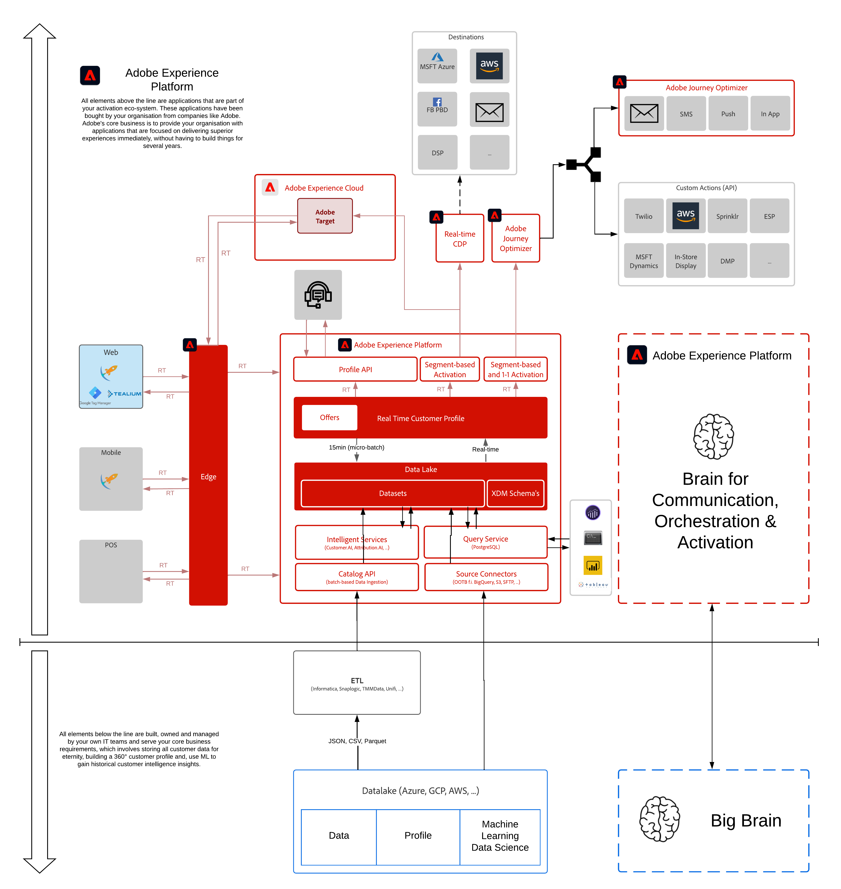

# 1. 기초 - Adobe Experience Platform 데이터 수집 및 웹 SDK 확장 설정

**작성자: [매튜 조셉 울리](https://www.linkedin.com/in/matthewjwoolley/), [우터 반 겔루위](https://www.linkedin.com/in/woutervangeluwe/)**

이 기본 모듈은 Adobe의 데이터 수집 비전을 소개하고 Adobe Experience Platform 데이터 수집, Adobe Experience Platform SDK 및 Adobe Experience Platform Edge Network를 통해 웹 사이트 및 모바일 애플리케이션에서 Adobe Experience Platform 및 기타 애플리케이션으로 데이터를 가져오는 방법을 설명합니다. 이 모듈에서는 Adobe Experience Platform 기술 자습서의 범위를 벗어난 영향을 주는 몇 가지 개념과 기술을 소개합니다. Experience Edge와 그 기능에 대해 자세히 학습하는 이러한 연습의 일부를 나머지 포괄적인 자습서에서 찾을 수 있으며, 추가 정보 및 자습서를 보려면 여기에서 확인하십시오.

## 학습 목표

- 브랜드가 Adobe Experience Platform 데이터 수집을 Tag Management 시스템(TMS)으로 사용하는 방법을 알아봅니다.
- 데이터를 Adobe 제품에 수집하는 데 브랜드가 사용하는 데이터 흐름을 알아봅니다.
- Adobe Experience Platform Edge Network를 통해 Adobe Experience Platform 및 기타 제품으로 데이터를 전송하는 방법을 알아봅니다.
- 웹 및 모바일에서 데이터를 수집하는 데이터 요소 및 규칙을 만드는 방법을 알아봅니다.
- 웹 SDK 추적 이벤트 및 해당 콘텐츠를 디버깅하는 방법에 대해 알아봅니다.
- 데이터 계층이 무엇이고 데이터 계층을 구현할 때 Adobe이 권장하는 사항을 알아봅니다.
- 처음부터 웹 SDK를 구현하는 단계를 알아봅니다.
- 웹 구현과 모바일 구현의 차이점을 알아봅니다.

## 사전 요구 사항

- Adobe Experience Platform에 액세스: [https://experience.adobe.com/platform](https://experience.adobe.com/platform)
- Adobe Experience Platform 데이터 수집에 대한 액세스: [https://experience.adobe.com/#/data-collection/](https://experience.adobe.com/#/data-collection/)
- 데모 웹 사이트에 액세스

>[!IMPORTANT]
>
>이 자습서는 특정 워크숍 형식을 용이하게 하기 위해 만들어졌습니다. 액세스 권한이 없을 수 있는 특정 시스템 및 계정을 사용합니다. 액세스 권한이 없더라도 이 매우 자세한 내용을 통해 많은 것을 배울 수 있을 것입니다. 워크샵 중 하나에 참여하고 액세스 자격 증명이 필요한 경우 Adobe 담당자에게 연락하여 필요한 정보를 제공합니다.

## 아키텍처 개요

이 모듈에서 논의하고 사용할 구성 요소를 강조 표시하는 아래 아키텍처를 살펴보십시오.

## 사용할 샌드박스

이 모듈의 경우 다음 샌드박스를 사용하십시오. `--aepSandboxId--`.

>[!NOTE]
>
>에서 참조한 대로 Chrome 확장 프로그램을 설치, 구성 및 사용하는 것을 잊지 마십시오 [0.1 - Experience League 설명서용 Chrome 확장 프로그램 설치](../module0/ex1.md)

## 연습

[1.1 Adobe Experience Platform 데이터 수집 이해](./ex1.md)

이 연습에서는 Adobe Experience Platform 데이터 수집 UI를 살펴보고 해당 기능을 이해합니다.

[1.2 Edge Network, 데이터 스트림 및 서버 측 데이터 수집](./ex2.md)

이 연습에서는 Adobe Experience Platform 데이터 수집 인터페이스에서 Adobe 제품으로 데이터를 전달하고 데모 웹 사이트에서 사용하는 데이터 스트림을 조사하는 방법을 알아봅니다.

[1.3 Adobe Experience Platform 데이터 수집 소개](./ex3.md)

이 연습에서는 확장을 설정하고, 데이터 요소 및 규칙을 빌드하고, 웹에 게시하는 방법을 알아봅니다.

[1.4 클라이언트측 웹 데이터 수집](./ex4.md)

이 연습에서는 웹 SDK가 작동하는 방식과 향후 연습에서 사용될 데이터를 이해하기 위해 설치된 웹 SDK를 디버깅합니다.

[1.5 Adobe Analytics 및 Adobe Audience Manager 구현](./ex5.md)

이 연습에서는 Adobe Analytics 및 Adobe Audience Manager에서 Web SDK로 수집한 웹 데이터를 보고 사용합니다.

[1.6 Adobe Target 구현](./ex6.md)

이 연습에서는 웹 SDK를 통해 구현된 Adobe Target에서 활동을 설정합니다.

[Adobe Experience Platform의 1.7 XDM 스키마 요구 사항](./ex7.md)

Web SDK 및 alloy.js에서 데이터를 Adobe Experience Platform에 수집할 수 있도록 Adobe Experience Platform에서 XDM 스키마의 일부로 특정 XDM Mixin이 포함되어야 합니다.

[요약 및 이점](./summary.md)

이 모듈의 요약 및 이점 개요

>[!NOTE]
>
>Adobe Experience Platform에 대해 알아야 할 모든 것을 배우는 데 시간을 투자해주셔서 감사합니다. 질문이 있는 경우 향후 컨텐츠에 대한 제안 사항이 있는 일반적인 피드백을 공유하려는 경우 Outlook Van Geluwe에게 이메일을 직접 보내주십시오 **vangeluw@adobe.com**.

[모든 모듈로 돌아가기](../../overview.md)
