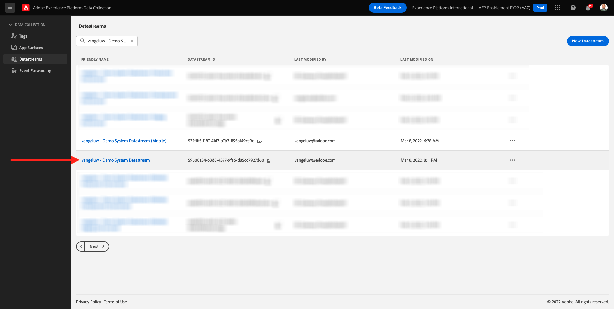

# 1.2 Edge Network, 데이터 스트림 및 서버 측 데이터 수집

## 컨텍스트

이 연습에서는 **데이터 스트림**. A **데이터 스트림** 웹 SDK에서 데이터를 수집한 후 데이터를 보낼 위치를 Adobe Edge 서버에 알려줍니다. 예를 들어 데이터를 Adobe Experience Platform으로 보내시겠습니까? Adobe Analytics? Adobe Audience Manager? Adobe Target?

데이터 저장소는 항상 Adobe Experience Platform 데이터 수집 사용자 인터페이스에서 관리되며 웹 SDK를 사용한 Adobe Experience Platform 데이터 수집에 중요합니다. 비Adobe 태그 관리 솔루션으로 웹 SDK를 구현하는 경우에도 Adobe Experience Platform 데이터 수집 사용자 인터페이스에서 데이터 스트림을 만들어야 합니다.

다음 연습에서 브라우저에서 웹 SDK를 구현합니다. 그러면 수집 중인 데이터가 어떤 모습인지 더 명확히 알 수 있습니다. 현재 Adobe에서는 데이터를 전달할 데이터 스트림을 알려줍니다.

## 데이터 스트림 만들기

in [연습 0.2](./../module0/ex2.md) 이미 데이터 스트림을 생성했지만 데이터 스트림의 배경이나 이유에 대해 설명하지 않았습니다.

데이터 스트림은 Web SDK에서 데이터를 수집한 후 데이터를 보낼 위치를 Adobe Edge 서버에 알려줍니다. 예를 들어 데이터를 Adobe Experience Platform으로 보내시겠습니까? Adobe Analytics? Adobe Audience Manager? Adobe Target? 데이터 저장소는 Adobe Experience Platform 데이터 수집 사용자 인터페이스에서 관리되며, Adobe Experience Platform 데이터 수집을 통해 웹 SDK를 구현하는지 여부에 관계없이 웹 SDK를 사용하는 플랫폼 데이터 수집에 중요합니다.

다음 사항을 검토하겠습니다 **[!UICONTROL 데이터 스트림]**:

이동 [https://experience.adobe.com/launch/](https://experience.adobe.com/launch/).

클릭 **[!UICONTROL 데이터 스트림]** 또는 **[!UICONTROL 데이터 스트림(베타)]** 왼쪽 메뉴에 있습니다.

이름이 인 데이터 스트림을 검색합니다 `--demoProfileLdap-- - Demo System Datastream`.

그러면 데이터 스트림에 대한 세부 사항이 표시됩니다.

클릭 **...** 다음 **Adobe Experience Platform** 을(를) 클릭합니다. **편집**.

그러면 이게 보입니다. 현재 Adobe Experience Platform만 활성화했습니다. 구성은 아래 구성과 유사합니다. (환경 및 Adobe Experience Platform 인스턴스에 따라 샌드박스 이름이 다를 수 있습니다.)

다음과 같이 아래 필드를 해석해야 합니다.

이 데이터 스트림의 경우..

- 수집된 모든 데이터는 `--aepSandboxId--` Adobe Experience Platform의 샌드박스
- 모든 경험 이벤트 데이터는 기본적으로 데이터 집합에 수집됩니다 **데모 시스템 - 웹 사이트의 이벤트 데이터 세트(글로벌 v1.1)**
- 모든 프로필 데이터는 기본적으로 데이터 집합에 수집됩니다 **데모 시스템 - 웹 사이트의 프로필 데이터 세트(글로벌 v1.1)** (현재 웹 SDK를 사용하여 프로필 데이터를 기본적으로 섭취하는 것은 웹 SDK에서 아직 지원되지 않으며 이후 단계에서 사용할 수 있게 됩니다.)
- 를 사용하려면 **offer decisioning** 이 데이터 스트림에 대한 응용 프로그램 서비스에서는 Offer decisioning 상자를 선택해야 합니다. (다음 항목의 일부가 됩니다. [모듈 9](./../module9/offer-decisioning.md))
- 를 사용하려면 **에지 세그멘테이션**, 에지 세그먼테이션에 대해 상자를 선택해야 합니다.
- 를 사용하려면 **개인화 대상**, 개인화 대상에 대해 상자를 선택해야 합니다.

현재 데이터 스트림에 다른 구성이 필요하지 않습니다.

다음 단계: [1.3 Adobe Experience Platform 데이터 수집 소개](./ex3.md)

[모듈 1로 돌아가기](./data-ingestion-launch-web-sdk.md)

[모든 모듈로 돌아가기](./../../overview.md)
