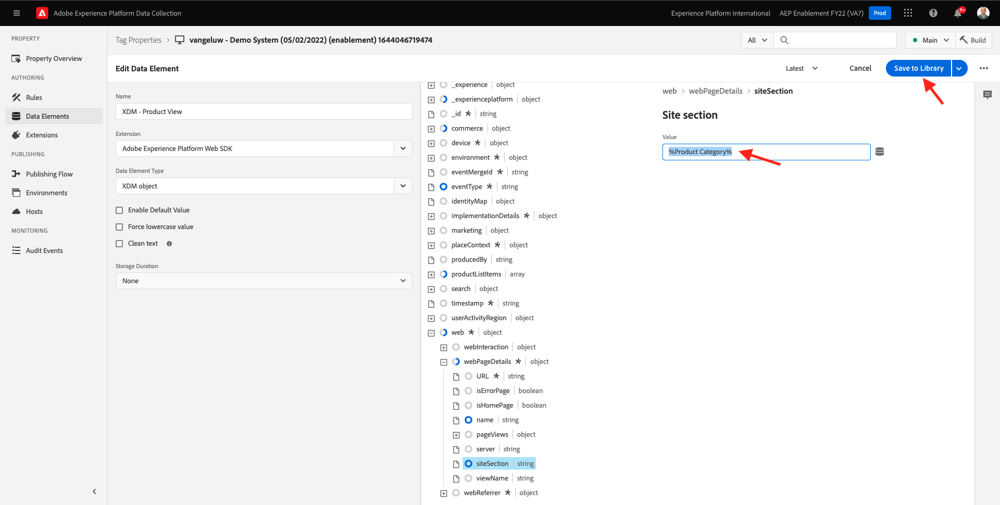

# 1.3 - Adobe Experience Platform 데이터 수집 소개

## 컨텍스트

이제 Adobe Experience Platform 데이터 수집의 기본 사항을 살펴보고 데모 웹 사이트에 설치된 사항을 이해하겠습니다. Adobe Experience Platform 웹 SDK 확장을 자세히 살펴보고 데이터 요소와 규칙을 구성하며 라이브러리를 게시하는 방법을 알아봅니다.

## 1.3.1 - Adobe Experience Platform 웹 SDK 확장 프로그램

확장은 Adobe Experience Platform 데이터 수집 인터페이스와 라이브러리 기능을 확장하는 패키지화된 코드 세트입니다. Adobe Experience Platform 데이터 수집은 플랫폼이고 확장은 플랫폼에서 실행되는 앱과 같습니다. 자습서에 사용된 모든 확장은 Adobe에서 만들고 관리되지만, 타사는 고유한 확장을 만들어 사용자 지정 코드 Adobe Experience Platform 데이터 수집 사용자가 관리해야 하는 크기를 제한할 수 있습니다.

이동 [Adobe Experience Platform 데이터 수집](https://experience.adobe.com/launch/) 을(를) 선택합니다. **태그**.

전에 본 Adobe Experience Platform 데이터 수집 속성 페이지입니다.

모듈 0에서 데모 시스템은 두 개의 클라이언트 속성을 만들었습니다. 웹 사이트용, 모바일 앱용 및 입니다. 을 검색하여 찾습니다. `--demoProfileLdap--` 에서 **[!UICONTROL 검색]** 상자.

를 엽니다. **웹** 속성을 사용합니다.

그러면 속성 개요 페이지가 표시됩니다. 클릭 **[!UICONTROL 확장]** 왼쪽 레일에 있습니다. 을(를) 클릭합니다. **[!UICONTROL 구성]** 단추를 클릭합니다.

Adobe Experience Platform 웹 SDK를 시작합니다. 여기에서 생성한 데이터 스트림으로 확장을 구성할 수 있습니다 [연습 0.2](./../module0/ex2.md) 고급 구성과 함께 사용할 수 있습니다. 이 연습에 대해 두 가지 설정만 구성하려고 합니다.

기본 에지 도메인은 항상 **edge.adobedc.net**. Adobe Experience Cloud 또는 Adobe Experience Platform 환경에서 CNAME 구성을 구현한 경우 **[!UICONTROL Edge 도메인]**. Adobe Experience Platform 인스턴스에서 다음 Edge 도메인을 사용하고 있습니다. `--webSdkEdgeDomain--`.

인스턴스의 에지 도메인이 기본 도메인과 다른 경우 에지 도메인을 업데이트하십시오. Edge 도메인을 사용하면 자사 추적 서버를 구성할 수 있으며, 이렇게 하면 백엔드에서 CNAME 구성을 사용하여 데이터가 Adobe에 수집됩니다.

이제 다음을 확인하십시오. **[!UICONTROL 목록에서 선택]** 라디오 단추 아래에서 **[!UICONTROL 데이터 스트림]** 을 클릭하고 이름이 인 데이터 스트림을 선택합니다. `--demoProfileLdap-- - Demo System Datastream`의 목록에서 **[!UICONTROL 데이터 스트림]** 상자.

클릭 **[!UICONTROL 저장]** 를 클릭하여 확장 보기로 돌아갑니다.

## 1.3.2 데이터 요소

데이터 요소는 데이터 사전(또는 데이터 맵)의 기본 구성단위입니다. 데이터 요소를 사용하여 마케팅 및 광고 기술 전반에서 데이터를 수집, 구성 및 전달합니다.

단일 데이터 요소는 쿼리 문자열, URL, 쿠키 값, JavaScript 변수 등에 값을 매핑할 수 있는 변수입니다. Adobe Experience Platform 데이터 수집 전체에서 해당 변수 이름으로 이 값을 참조할 수 있습니다. 이 데이터 요소 컬렉션은 규칙(이벤트, 조건 및 작업)을 작성하는 데 사용할 수 있는 정의된 데이터 사전이 됩니다. 이 데이터 사전은 속성에 추가한 확장에 사용하기 모두 Adobe Experience Platform 데이터 수집에서 공유됩니다.

이제 웹 SDK 친화적 포맷으로 이미 존재하는 데이터 요소를 편집하려고 합니다.

데이터 요소 페이지로 이동하려면 왼쪽 레일의 데이터 요소 를 클릭하십시오.

>[!NOTE]
>
>이 연습에서는 데이터 요소만 편집하고 있지만 **[!UICONTROL 데이터 요소 추가]** 데이터 사전에 새 변수를 추가하는 데 사용되는 이 페이지의 단추입니다. 그런 다음 Adobe Experience Platform 데이터 수집 전체에서 사용할 수 있습니다. 대부분 로컬 저장소를 데이터 소스로 사용하는 기존의 다른 데이터 요소를 자유롭게 확인할 수 있습니다.

검색 막대에서 을 입력합니다 **XDM - 제품 보기** 반환되는 데이터 요소를 클릭합니다.

이 화면에는 편집할 XDM 개체가 표시됩니다. XDM(Experience Data Model)은 이 기술 자습서 전체에서 훨씬 더 탐구할 수 있는 개념이지만 지금은 Adobe Experience Platform Web SDK에 필요한 형식으로 이해할 수 있습니다. 데모 웹 사이트의 문서 페이지에 수집된 데이터에 약간 더 많은 정보를 추가합니다.

옆에 있는 더하기 단추를 클릭합니다 **웹** 나무 아래에

옆에 있는 더하기 단추를 클릭합니다 **webPageDetails**.

클릭 **siteSection**. 이제 그 모습을 보실 수 있습니다 **siteSection** 이 아직 데이터 요소에 연결되어 있지 않습니다. 그것을 바꾸자.

위로 스크롤하여 텍스트를 입력합니다 `%Product Category%`. **[!UICONTROL 저장]**&#x200B;을 클릭합니다.

이때 Adobe Experience Platform 웹 SDK 확장이 설치되고 XDM 구조에 대해 데이터를 수집하도록 데이터 요소를 업데이트했습니다. 그런 다음 데이터를 올바른 시간에 전송할 규칙을 확인하겠습니다.

## 1.3.3 규칙

Adobe Experience Platform 데이터 수집은 규칙 기반 시스템입니다. 사용자 상호 작용과 관련 데이터를 찾습니다. 규칙에 요약된 기준이 충족되면, 규칙이 정의한 확장, 스크립트 또는 클라이언트측 코드를 트리거합니다.

서로 다른 제품을 하나의 솔루션으로 통합하는 마케팅 및 광고 기술에 대한 데이터와 기능을 통합하는 규칙을 빌드합니다.

문서 페이지에서 데이터를 보내는 규칙을 분류해 보겠습니다.

클릭 **[!UICONTROL 규칙]** 왼쪽 레일에 있습니다.

**[!UICONTROL 검색]** 대상 `Product View`.

반환되는 규칙을 클릭합니다.

이 규칙을 구성하는 개별 요소를 살펴보겠습니다. 모든 규칙에 대해 **[!UICONTROL 이벤트]** 발생합니다. **[!UICONTROL 조건]** 평가된 후 **[!UICONTROL 작업]** 필요한 경우 수행합니다.

이벤트를 클릭합니다. **사용자 지정 이벤트 - 제품 보기**. 이 보기는 로드하는 보기입니다.

을(를) 클릭합니다. **이벤트 유형** 드롭다운

조건이 true일 경우 Adobe Experience Platform 데이터 수집에 신호를 보내 작업을 실행하는 데 사용할 수 있는 몇 가지 표준 상호 작용 목록이 표시됩니다.

클릭 **[!UICONTROL 취소]** 를 눌러 규칙으로 돌아갑니다.

작업을 클릭합니다. **AEP로 &quot;제품 보기&quot; 이벤트 보내기**.

여기서는 Adobe Experience Platform Web SDK를 통해 Adobe Edge으로 전송되는 데이터를 확인할 수 있습니다. 보다 구체적으로 설명하면 **합금** **[!UICONTROL 인스턴스]** 구현합니다. 다른 설정 **[!UICONTROL 인스턴스]** 을 사용하면 여러 다른 항목 중 다른 데이터 세트를 사용할 수 있습니다. 이벤트를 지정했습니다. **[!UICONTROL 유형]** 로서의 **commerce.productViews** 전송하는 XDM 데이터는 **XDM - 제품 보기** 이전에 변경한 데이터 요소입니다.

이제 규칙을 보고 Adobe Experience Platform 데이터 수집에 모든 변경 사항을 게시할 수 있습니다.

## 1.3.4 라이브러리에 게시

마지막으로 방금 업데이트한 규칙과 데이터 요소의 유효성을 검사하려면 속성에 편집된 항목이 들어 있는 라이브러리를 게시해야 합니다. 다음 작업을 수행하는 데 필요한 몇 가지 빠른 단계가 있습니다 **[!UICONTROL 게시]** Adobe Experience Platform 데이터 수집 섹션을 참조하십시오.

클릭 **[!UICONTROL 게시 흐름]** 왼쪽 탐색

기존 라이브러리를 클릭합니다. **기본**.

을(를) 클릭합니다. **변경된 모든 리소스 추가** 버튼을 클릭합니다.

대부분의 리소스가 다음과 같이 유지되도록 아래로 스크롤합니다. **개정 1(최신)**&#x200B;하지만 두 가지가 변경되었습니다. **데이터 요소: ruleArticlePages** 및 **확장: Adobe Experience Platform Web SDK** 는 **최신 항목**.

을(를) 클릭합니다. **개발을 위한 저장 및 구축** 버튼을 클릭합니다.

라이브러리를 빌드하는 데 몇 분이 걸릴 수 있으며, 라이브러리가 완료되면 라이브러리 이름 왼쪽에 녹색 점이 표시됩니다.

게시 흐름 화면에서 볼 수 있듯이 이 자습서의 범위를 벗어난 Adobe Experience Platform 데이터 수집의 게시 프로세스에 더 많은 작업이 있습니다. 개발 환경에서 단일 라이브러리를 사용할 것입니다.

다음 단계: [1.4 클라이언트측 웹 데이터 수집](./ex4.md)

[모듈 1로 돌아가기](./data-ingestion-launch-web-sdk.md)

[모든 모듈로 돌아가기](./../../overview.md)
