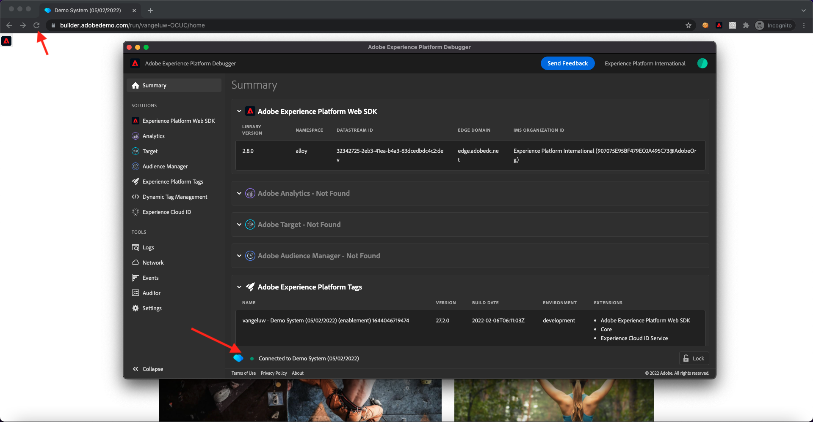

# 1.4 클라이언트측 웹 데이터 수집

## 1.4.1 요청의 데이터 유효성 검사

### Adobe Experience Platform Debugger 설치

Experience Platform 디버거는 웹 페이지에서 구현된 Adobe 기술을 보는 데 도움이 되는 Chrome 및 Firefox 브라우저에서 사용할 수 있는 확장입니다. 기본 브라우저의 버전을 다운로드합니다.

- [Firefox 확장](https://addons.mozilla.org/ko-KR/firefox/addon/adobe-experience-platform-dbg/)

- [Chrome 확장 프로그램](https://chrome.google.com/webstore/detail/adobe-experience-platform/bfnnokhpnncpkdmbokanobigaccjkpob)

이전에 디버거를 사용한 적이 없고 이전 Adobe Experience Cloud Debugger와 다른 경우 이 5분 개요 비디오를 볼 수 있습니다.

>[!VIDEO](https://video.tv.adobe.com/v/32156?quality=12&learn=on)

시크릿 모드에서 데모 웹 사이트를 로드할 경우 Experience Platform 디버거가 시크릿 모드에서도 사용 가능한지 확인해야 합니다. 이렇게 하려면 로 이동하십시오. **chrome://extensions** 브라우저에서 Experience Platform 디버거 확장을 엽니다.

다음 두 가지 설정이 활성화되어 있는지 확인합니다.

- 개발자 모드
- 시크릿 허용

### 데모 웹 사이트 열기

이동 [https://builder.adobedemo.com/projects](https://builder.adobedemo.com/projects). Adobe ID으로 로그인하면 다음이 표시됩니다. 웹 사이트 프로젝트를 클릭하여 엽니다.

설정 **Screens** 페이지를 클릭한 다음 **실행**.

그러면 데모 웹 사이트가 열립니다. URL을 선택하고 클립보드에 복사합니다.

새 시크릿 브라우저 창을 엽니다.

이전 단계에서 복사한 데모 웹 사이트의 URL을 붙여넣습니다. 그런 다음 Adobe ID을 사용하여 로그인하라는 메시지가 표시됩니다.

계정 유형을 선택하고 로그인 프로세스를 완료합니다.

그러면 시크릿 브라우저 창에서 로드되는 웹 사이트가 표시됩니다. 모든 데모에서는 신선하고 시크릿 브라우저 창을 사용하여 데모 웹 사이트 URL을 로드해야 합니다.

### Experience Platform 디버거를 사용하여 Edge로 이동하는 호출을 확인하십시오

데모 웹 사이트가 열려 있는지 확인하고 Experience Platform 디버거 확장 아이콘을 클릭합니다.

디버거가 열리고 Adobe Experience Platform 데이터 수집 속성에 생성된 구현의 세부 사항이 표시됩니다. 방금 편집한 확장 및 규칙을 디버깅하는 것입니다.

을(를) 클릭합니다. **[!UICONTROL 로그인]** 인증할 오른쪽 상단의 단추. Adobe Experience Platform 데이터 수집 인터페이스를 사용하여 브라우저 탭을 이미 연 경우 인증 단계가 자동으로 수행되며 사용자 이름과 암호를 다시 입력할 필요가 없습니다.

디버거를 특정 탭에 연결하려면 데모 웹 사이트에서 다시 로드 단추를 클릭하십시오.

디버거가 **[!UICONTROL 홈 연결]** 위에 나와 있는 대로 를 클릭한 다음 **[!UICONTROL 잠금]** 디버거 를 데모 웹 사이트에 잠글 수 있습니다. 이 작업을 수행하지 않으면 디버거가 계속해서 전환하여 포커스가 있는 모든 브라우저 탭에 대한 구현 세부 사항을 표시하므로 혼동될 수 있습니다.

다음으로, 예를 들어, 데모 웹 사이트의 모든 페이지, **남성** 카테고리 페이지.

이제 **[!UICONTROL 웹 SDK Experience Platform]** 왼쪽 탐색에서 를 클릭하여 **[!UICONTROL 네트워크 요청]**.

각 요청에는 다음이 포함됩니다 **[!UICONTROL events]** 행을 클릭합니다.

를 클릭하여 **[!UICONTROL events]** 행을 클릭합니다. 다음을 볼 수 있는 방법을 참고하십시오 **web.webpagedetails.pageViews** 이벤트와 다른 변수를 **웹 SDK ExperienceEvent XDM** 형식 지정

이러한 유형의 요청 세부 사항은 네트워크 탭에도 표시됩니다. 을 사용하여 요청 필터링 **상호 작용** 를 클릭하여 웹 SDK에서 보낸 요청을 찾습니다. 요청 페이로드 헤더에서 XDM 페이로드의 모든 세부 정보를 찾을 수 있습니다.

다음 단계: [1.5 Adobe Analytics 및 Adobe Audience Manager 구현](./ex5.md)

[모듈 1로 돌아가기](./data-ingestion-launch-web-sdk.md)

[모든 모듈로 돌아가기](./../../overview.md)
