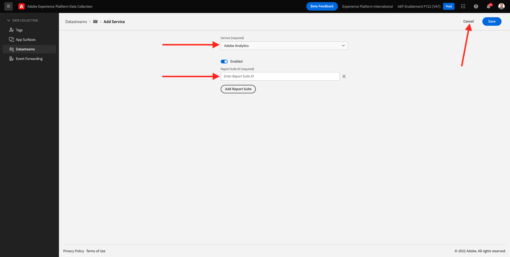

# 1.5 - Adobe Analytics 및 Adobe Audience Manager 구현

## 컨텍스트

이제 XDM 데이터가 플랫폼으로 유입되고 있음을 알 수 있습니다. XDM의 기능에 대해 자세히 알아보십시오 [모듈 2](./../module2/data-ingestion.md)뿐만 아니라 사용자 지정 변수를 추적하기 위해 자체 스키마를 구축하는 방법도 있습니다. 이제 데이터를 Analytics 및 Audience Manager으로 전달하도록 데이터 스트림을 설정할 때 발생하는 상황을 살펴보겠습니다.

## Analytics의 1.5.1 매핑 변수

Adobe Experience Platform [!DNL Web SDK] 특정 값을 자동으로 매핑하여 웹 SDK를 통해 Analytics를 가능한 한 빨리 새로 구현합니다. 자동으로 매핑된 변수가 나열됩니다 [여기](https://experienceleague.adobe.com/docs/experience-platform/edge/data-collection/adobe-analytics/automatically-mapped-vars.html#data-collection).

에 자동으로 매핑되지 않는 XDM 데이터의 경우 [!DNL Adobe Analytics], 다음 사용 가능 [컨텍스트 데이터](https://experienceleague.adobe.com/docs/analytics/implementation/vars/page-vars/contextdata.html?lang=ko-KR) 일치시키려면 [스키마](https://experienceleague.adobe.com/docs/experience-platform/xdm/schema/composition.html?lang=ko-KR-KR). 그런 다음 [!DNL Analytics] 사용 [처리 규칙](https://experienceleague.adobe.com/docs/analytics/admin/admin-tools/processing-rules/processing-rules-configuration/t-processing-rules.html?lang=ko-KR) 를 채우기 위해 [!DNL Analytics] 변수를 채우는 방법을 설명합니다. 컨텍스트 데이터 및 처리 규칙 은 이전에 Analytics에서 작업한 사용자에게 익숙한 개념이지만 새로운 개념인 경우 현재 세부 사항은 걱정하지 마십시오.

기본 작업 세트와 제품 목록을 사용하여 AEP로 데이터를 전송하거나 검색할 수도 있습니다 [!DNL Web SDK]. 이렇게 하려면 [제품](https://experienceleague.adobe.com/docs/experience-platform/edge/data-collection/collect-commerce-data.html?lang=en#data-collection)을 참조하십시오.

### 컨텍스트 데이터

사용 방법 [!DNL Analytics], XDM 데이터는 점 표기법을 사용하여 변환되고 `contextData`. 다음 값 쌍 목록은 `context data`의 예를 보여 줍니다.

```javascript
{
    "bh": "900",
    "bw": "1680",
    "c": "24",
    "c.a.d.key.[0]": "value1",
    "c.a.d.key.[1]": "value2",
    "c.a.d.object.key1": "value1",
    "c.a.d.object.key2.[0]": "value2",
    "c.a.x.environment.browserdetails.javascriptenabled": "true",
    "c.a.x.environment.type": "browser",
    "cust_hit_time_gmt": "1579781427",
    "g": "http://example.com/home",
    "gn": "home",
    "j": "1.8.5",
    "k": "Y",
    "s": "1680x1050",
    "tnta": "218287:1:0|0,218287:1:0|2,218287:1:0|1,218287:1:0|32767,218287:1:01,218287:1:0|0,218287:1:0|1,218287:1:0|0,218287:1:0|1",
    "user_agent": "Mozilla/5.0 AppleWebKit/537.36 Safari/537.36",
    "v": "Y"
}
```

### 처리 규칙

에지 네트워크에서 수집한 모든 데이터는 [처리 규칙](https://experienceleague.adobe.com/docs/analytics/admin/admin-tools/processing-rules/processing-rules-configuration/t-processing-rules.html)을 통해 액세스할 수 있습니다. in [!DNL Analytics]로 지정하는 경우 처리 규칙을 사용하여 컨텍스트 데이터를 [!DNL Analytics] 변수를 채우는 방법을 설명합니다.

## Experience Platform Edge 네트워크의 1.5.2 Audience Manager

서버측 전달은 Audience Manager에 대한 새로운 개념이 아니며, 이전과 동일한 프로세스가 적용됩니다. ID를 동기화할 수도 있습니다.

## 1.5.3 데이터 스트림을 검토하여 Adobe Analytics에 데이터 보내기

Web SDK로 수집한 데이터를 Adobe Analytics 및 Adobe Audience Manager으로 보내려면 다음 단계를 따르십시오.

이동 [https://experience.adobe.com/launch/](https://experience.adobe.com/launch/) 그리고 **데이터 스트림**.

화면의 오른쪽 상단 모서리에서 샌드박스 이름을 선택합니다. 샌드박스 이름은 다음과 같습니다. `--aepSandboxId--`. 이름이 인 특정 데이터 스트림을 엽니다 `--demoProfileLdap-- - Demo System Datastream`.


그러면 이게 보입니다. Adobe Analytics을 활성화하려면 **+서비스 추가**.


그러면 이게 보입니다. 서비스를 선택합니다 **Adobe Analytics**: 데이터를 로 전송하기 위해 Adobe Analytics에서 보고서 세트를 추가해야 합니다. 이 자습서에서는 범위를 벗어납니다. 클릭 **취소**.



## 1.5.4 데이터 스트림을 검토하여 Adobe Audience Manager에 데이터 보내기

그러면 이게 보입니다. Adobe Audience Manager을 활성화하려면 **+서비스 추가**.


그러면 이게 보입니다. 서비스를 선택합니다 **Adobe Audience Manager** 이후 Adobe Audience Manager 쿠키 대상 및/또는 URL 대상을 활성화 또는 비활성화하도록 결정할 수 있습니다. 이 자습서에서는 이 구성이 범위를 벗어났습니다. 클릭 **취소**.


다음 단계: [1.6 Adobe Target 구현](./ex6.md)

[모듈 1로 돌아가기](./data-ingestion-launch-web-sdk.md)

[모든 모듈로 돌아가기](./../../overview.md)
