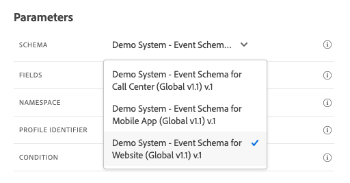
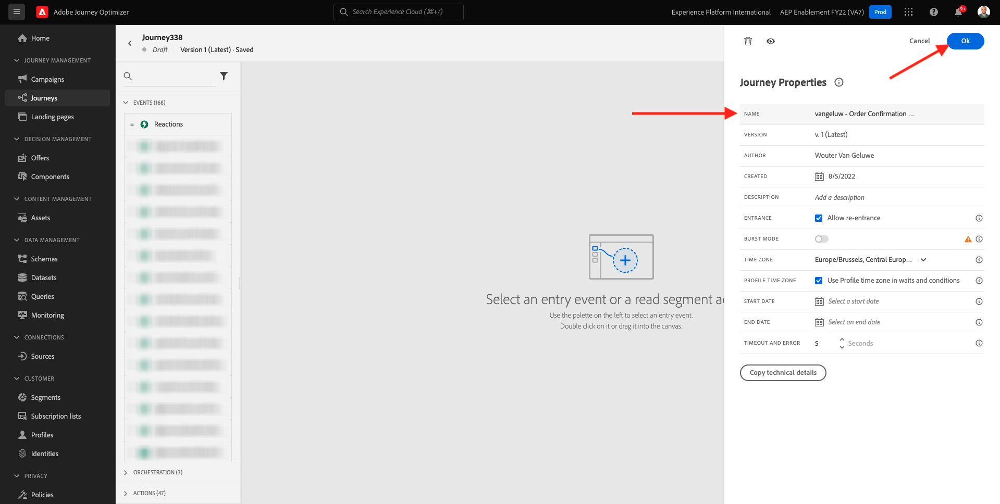
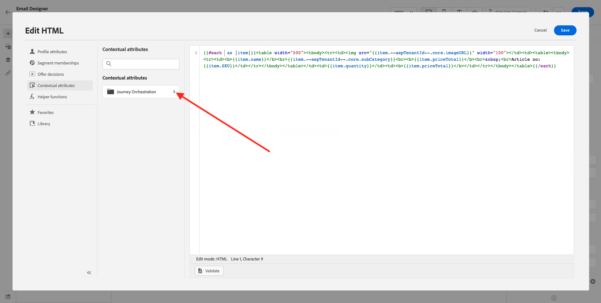
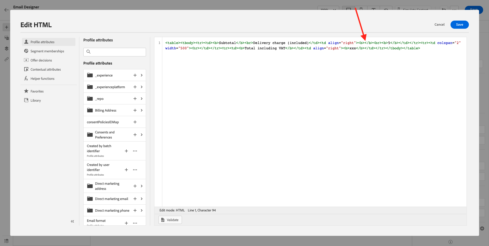
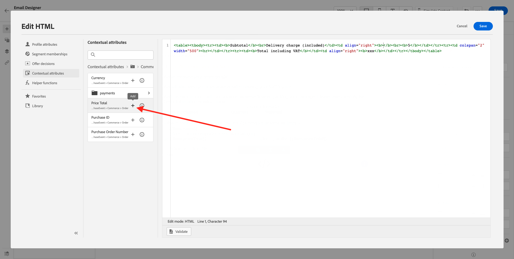
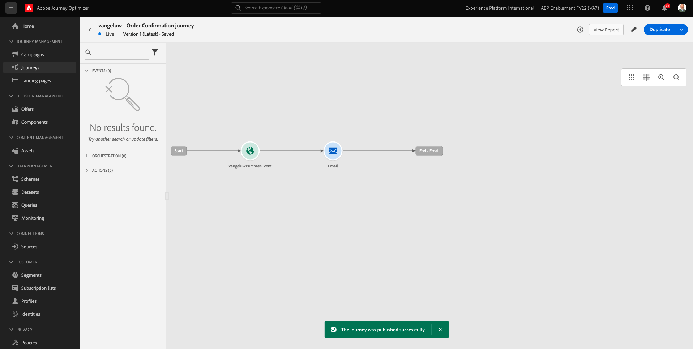
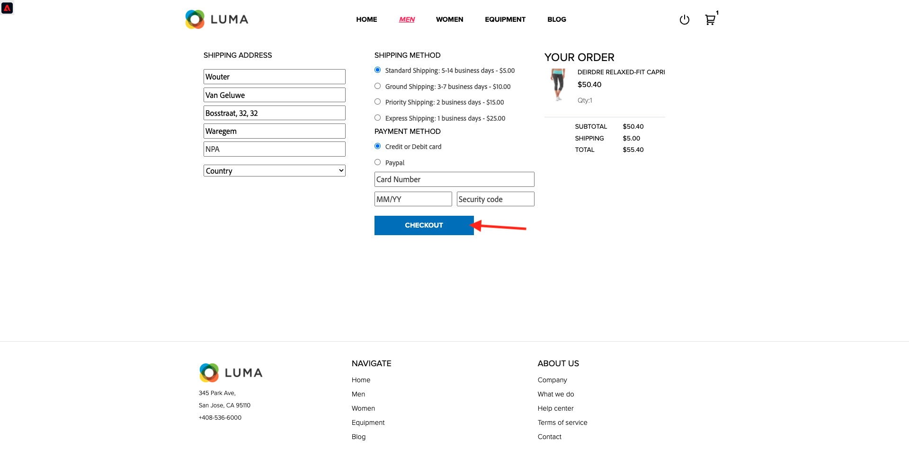

# 10.1 트리거 기반 여정 구성 - 주문 확인

다음 위치로 이동하여 Adobe Journey Optimizer에 로그인합니다 [Adobe Experience Cloud](https://experience.adobe.com). 클릭 **Journey Optimizer**.


으로 리디렉션됩니다. **홈**  Journey Optimizer에서 보기. 먼저 올바른 샌드박스를 사용하고 있는지 확인하십시오. 사용할 샌드박스를 이라고 합니다 `--aepSandboxId--`. 한 샌드박스에서 다른 샌드박스로 변경하려면 **프로덕션 제품(VA7)** 및 목록에서 샌드박스를 선택합니다. 이 예제에서 샌드박스의 이름은 다음과 같습니다 **AEP Enablement FY22**. 그러면 **홈** 샌드박스 보기 `--aepSandboxId--`.


## 10.1.1 이벤트 만들기

메뉴에서 **구성** 을(를) 클릭합니다. **관리** 아래에 **이벤트**.


설정 **이벤트** 화면에서 이와 유사한 보기가 표시됩니다. 클릭 **이벤트 만들기**.


그러면 빈 이벤트 구성이 표시됩니다.


먼저 다음과 같은 이름을 이벤트에 지정합니다. `--demoProfileLdap--PurchaseEvent`, 그리고 다음과 같은 설명을 추가합니다. `Purchase Event`.


다음은 입니다 **이벤트 유형** 선택. 선택 **단일**.


다음은 입니다 **이벤트 ID 유형** 선택. 선택 **시스템 생성**


다음은 스키마 선택입니다. 이 연습에 대한 스키마가 준비되었습니다. 스키마를 사용하십시오 `Demo System - Event Schema for Website (Global v1.1) v.1`.



스키마를 선택하면 **페이로드** 섹션을 참조하십시오. 을(를) 클릭합니다. **편집/연필** 아이콘을 사용하여 이 이벤트에 필드를 추가할 수 있습니다.


그러면 이 팝업이 표시됩니다. 이제 이 이벤트가 트리거될 때 추가 데이터에 액세스하려면 추가 확인란을 선택해야 합니다.


먼저 줄에서 확인란을 선택합니다 `--aepTenantId--`.


그런 다음 아래로 스크롤하여 라인에서 확인란을 선택합니다 `productListItems`.


그런 다음 아래로 스크롤하여 라인에서 확인란을 선택합니다 `commerce`.


다음을 클릭합니다. **확인**.

그러면 이벤트에 추가 필드가 추가되었음을 알 수 있습니다. **저장**&#x200B;을 클릭합니다.


그런 다음 새 이벤트가 공유되고 이제 사용 가능한 이벤트 목록에 이벤트가 표시됩니다.

이벤트를 다시 클릭하여 **이벤트 편집** 다시 화면 표시
마우스를 위에 놓으십시오 **페이로드** 필드를 다시 클릭하여 3개의 아이콘을 다시 확인합니다. 을(를) 클릭합니다. **페이로드 보기** 아이콘.


이제 예상 페이로드의 예를 볼 수 있습니다. 이벤트에는 고유한 오케스트레이션 eventID가 있으며, 이 ID는 표시될 때까지 해당 페이로드에서 아래로 스크롤하여 찾을 수 있습니다 `_experience.campaign.orchestration.eventID`.


이벤트 ID는 다음 단계에서 작성할 여정을 트리거하기 위해 Adobe Journey Optimizer으로 전송해야 하는 것입니다. 이 eventID를 다음 단계 중 하나로 작성합니다.
`"eventID": "ef6dd943c94fe1b4763c098ccd1772344662f2a9f614513106cb5ada8be36857"`

클릭 **확인**, 그 다음 **취소**.

이제 이벤트가 구성되었으며 사용할 준비가 되었습니다.

## 10.1.2 여정 만들기

메뉴에서 **여정** 을(를) 클릭합니다. **여정 만들기**.


그러면 이게 보입니다. 여정 이름을 지정합니다.  `--demoProfileLdap-- - Order Confirmation journey`. **확인**&#x200B;을 클릭합니다.



먼저 이벤트를 여정의 시작점으로 추가해야 합니다. 이벤트 검색 `--demoProfileLdap--PurchaseEvent` 캔버스에 끌어다 놓습니다. **확인**&#x200B;을 클릭합니다.


다음, 아래 **작업**&#x200B;를 검색하고 **이메일** 작업을 캔버스에 추가합니다.


설정 **카테고리** to **마케팅** 전자 메일을 보낼 수 있는 전자 메일 서피스를 선택합니다. 이 경우 선택할 이메일 표면은 다음과 같습니다 **이메일**. 에 대한 확인란이 **이메일 클릭 수** 및 **이메일 열기** 둘 다 활성화되어 있습니다.


다음 단계는 메시지를 만드는 것입니다. 이렇게 하려면 **컨텐츠 편집**.


이제 이게 보입니다. 을(를) 클릭합니다. **제목 줄** 텍스트 필드.


텍스트 영역에서 쓰기 시작 **주문해주셔서 감사합니다**


제목란은 아직 끝나지 않았습니다. 다음으로, 필드에 대한 개인화 토큰을 가져와야 합니다 **이름** 다음 위치에 저장됩니다. `profile.person.name.firstName`. 왼쪽 메뉴에서 아래로 스크롤하여 **개인** > **전체 이름** >  **이름** 필드를 클릭하고 **+** 아이콘을 사용하여 제목 줄에 개인화 토큰을 추가합니다. **저장**&#x200B;을 클릭합니다.


그럼 다시 오셔야 합니다 클릭 **이메일 디자이너** 전자 메일의 컨텐츠를 만들려면


다음 화면에서 **처음부터 디자인**.


왼쪽 메뉴에서 이메일의 구조(행 및 열)를 정의하는 데 사용할 수 있는 구조 구성 요소를 찾을 수 있습니다.

한 번에 8번 끌어다 놓기 **1:1 열** 캔버스에서 다음을 제공해야 합니다.


이동 **컨텐츠 구성 요소**.


끌어서 놓기 **이미지** 구성 요소를 생성하지 않습니다. **찾아보기**&#x200B;를 클릭합니다.


폴더로 이동합니다 **enablement-assets**&#x200B;에서 파일을 선택합니다 **luma-logo.png** 을(를) 클릭합니다. **선택**.


넌 이제 다시 여기 있어 이미지를 클릭하여 선택한 다음 를 사용합니다 **크기** 슬라이더 - 로고 이미지를 약간 더 작게 만듭니다.


이동 **컨텐츠 구성 요소** 끌어서 놓습니다. **이미지** 구성 요소를 생성하지 않습니다. 을(를) 선택합니다 **이미지 구성 요소** 찾아보기 를 클릭하지 마십시오.


이 이미지 URL을 필드에 붙여 넣습니다. **소스**: `https://parsefiles.back4app.com/hgJBdVOS2eff03JCn6qXXOxT5jJFzialLAHJixD9/29043bedcde632a9cbe8a02a164189c9_preparing.png`. 이 이미지는 Adobe 외부에서 호스팅됩니다.


범위를 다른 필드로 변경하면 이미지가 렌더링되고 다음과 같이 표시됩니다.


다음으로 이동 **컨텐츠 구성 요소** 드래그 앤 드롭 **텍스트** 구성 요소를 생성하지 않습니다.


해당 구성 요소에서 기본 텍스트를 선택합니다 **여기에 텍스트를 입력하십시오.** 그리고 아래 텍스트로 바꿉니다.

```javascript
You’re one step closer!

Hi 

We've received your order details!

We will also send you a separate email containing your VAT Invoice.

We'll be back in touch with you as soon as we've finished packing your package. Please read carefully the Order Information detailed below.
```


텍스트 옆에 커서를 놓습니다 **안녕** 을(를) 클릭합니다. **개인화 추가**.


로 이동합니다 **개인** > **전체 이름** > **이름** 필드를 클릭하고 **+** 아이콘을 사용하여 제목 줄에 개인화 토큰을 추가합니다. **저장**&#x200B;을 클릭합니다.


그러면 다음 내용이 표시됩니다.


다음으로 이동 **컨텐츠 구성 요소** 드래그 앤 드롭 **텍스트** 구성 요소를 생성하지 않습니다.


해당 구성 요소에서 기본 텍스트를 선택합니다 **여기에 텍스트를 입력하십시오.** 그리고 아래 텍스트로 바꿉니다.

`Order Information`

글꼴 크기를 로 변경합니다. **26px** 텍스트를 이 셀에 가운데로 그러면 다음 항목이 제공됩니다.


다음으로 이동 **컨텐츠 구성 요소** 끌어서 놓습니다. **HTML** 구성 요소를 생성하지 않습니다. HTML 구성 요소를 클릭한 다음 **소스 코드 표시**.


에서 **HTML 편집** 팝업, 이 HTML 붙여넣기:

```<table><tbody><tr><td><b>Items purchased</b></td><td></td><td><b>Quantity</b></td><td><b>Subtotal</b></td></tr><tr><td colspan="4" width="500"><hr></td></tr></tbody></table>```

**저장**&#x200B;을 클릭합니다.


그럼 이걸로 주세요 클릭 **저장** 진행 상황을 저장하려면 을 클릭합니다.


이동 **컨텐츠 구성 요소** 끌어서 놓습니다. **HTML** 구성 요소를 생성하지 않습니다. HTML 구성 요소를 클릭한 다음 **소스 코드 표시**.


에서 **HTML 편집** 팝업, 이 HTML 붙여넣기:

```{{#each xxx as |item|}}<table width="500"><tbody><tr><td></td><td><table><tbody><tr><td><b>{{item.name}}</b><br>{{item.--aepTenantId--.core.subCategory}}<br><b>{{item.priceTotal}}</b><br>&nbsp;<br>Article no: {{item.SKU}}</td></tr></tbody></table></td><td>{{item.quantity}}</td><td><b>{{item.priceTotal}}</b></td></tr></tbody></table>{{/each}}```

그러면 다음 항목이 제공됩니다.


이제 교체해야 합니다 **xxx** 여정을 트리거하는 이벤트의 일부인 productListItems 개체에 대한 참조를 통해


먼저, 삭제 **xxx** 먼저 HTML 코드에 추가합니다.


왼쪽 메뉴에서 **상황별 특성**. 이 컨텍스트는 여정에서 메시지로 전달됩니다.


그러면 이게 보입니다. 옆에 있는 화살표를 클릭합니다 **Journey Orchestration** 자세히 살펴보십시오.



옆에 있는 화살표를 클릭합니다 **이벤트** 자세히 살펴보십시오.


옆에 있는 화살표를 클릭합니다 `--demoProfileLdap--PurchaseEvent` 자세히 살펴보십시오.


옆에 있는 화살표를 클릭합니다 **productListItems** 자세히 살펴보십시오.


을(를) 클릭합니다. **+** 아이콘 옆에 있는 아이콘 **이름** 캔버스에 추가합니다. 그럼 이걸로 주세요 이제 다음을 선택해야 합니다  **.name** 아래 스크린샷에 표시된 대로 를 제거한 다음 **.name**.


그럼 이걸로 주세요 **저장**&#x200B;을 클릭합니다.


이제 이메일 디자이너로 돌아갑니다. 클릭 **저장** 진행 상황을 저장하려면 을 클릭합니다.


다음으로 이동 **컨텐츠 구성 요소** 끌어서 놓습니다. **HTML** 구성 요소를 생성하지 않습니다. HTML 구성 요소를 클릭한 다음 **소스 코드 표시**.


에서 **HTML 편집** 팝업, 이 HTML 붙여넣기:

```<table><tbody><tr><td><b>Subtotal</b><br>Delivery charge (included)</td><td align="right"><b>xxx</b><br><b>5</b></td></tr><tr><td colspan="2" width="500"><hr></td></tr><tr><td><b>Total including VAT</b></td><td align="right"><b>xxx</b></td></tr></tbody></table>```

에 대한 두 가지 참조가 있습니다 **xxx** 를 HTML 코드에 추가합니다. 이제 각 항목을 교체해야 합니다 **xxx** 여정을 트리거하는 이벤트의 일부인 productListItems 개체에 대한 참조를 통해


먼저 첫 번째 **xxx** HTML 코드에 있는 URL이나 API와 같은 URL과 같은 URL과 SPA에서 매핑해야 합니다.



왼쪽 메뉴에서 **상황별 속성**.


옆에 있는 화살표를 클릭합니다 **Journey Orchestration** 자세히 살펴보십시오.


옆에 있는 화살표를 클릭합니다 **이벤트** 자세히 살펴보십시오.


옆에 있는 화살표를 클릭합니다 `--demoProfileLdap--PurchaseEvent` 자세히 살펴보십시오.


옆에 있는 화살표를 클릭합니다 **상거래** 자세히 살펴보십시오.


옆에 있는 화살표를 클릭합니다 **주문** 자세히 살펴보십시오.


을(를) 클릭합니다. **+** 아이콘 옆에 있는 아이콘 **가격 합계** 캔버스에 추가합니다.



그럼 이걸로 주세요 이제 두 번째 항목을 삭제합니다 **xxx** HTML 코드에 있는 URL이나 API와 같은 URL과 같은 URL과 SPA에서 매핑해야 합니다.


을(를) 클릭합니다. **+** 아이콘 옆에 있는 아이콘 **가격 합계** 다시 캔버스에 추가합니다.


필드를 추가할 수도 있습니다 **통화** 내 **주문** 여기에 보이는 것처럼 캔버스에 개체를 추가합니다.
완료되면 을(를) 클릭합니다. **저장** 변경 사항을 저장하려면 을 클릭합니다.


그러면 이메일 디자이너에 다시 연결됩니다. 클릭 **저장** 다시 한 번


을(를) 클릭하여 메시지 대시보드로 돌아갑니다 **화살표** 왼쪽 상단 모서리의 제목란 텍스트 옆에 있습니다.


왼쪽 상단 모서리의 화살표를 클릭하여 여정으로 돌아갑니다.


클릭 **확인** 이메일 작업을 닫습니다.


클릭 **게시** 여정을 게시합니다.


클릭 **게시** 다시 한 번


이제 여정이 게시되었습니다.



## 10.1.5 Adobe Experience Platform 데이터 수집 클라이언트 속성 업데이트

이동 [Adobe Experience Platform 데이터 수집](https://experience.adobe.com/launch/) 을(를) 선택합니다. **태그**.

전에 본 Adobe Experience Platform 데이터 수집 속성 페이지입니다.


모듈 0에서 데모 시스템은 두 개의 클라이언트 속성을 만들었습니다. 웹 사이트용, 모바일 앱용 및 입니다. 을 검색하여 찾습니다. `--demoProfileLdap--` 에서 **[!UICONTROL 검색]** 상자. 를 클릭하여 **웹** 속성을 사용합니다.


이동 **데이터 요소**. 데이터 요소를 검색하고 엽니다. **XDM - 구매**.


그러면 이게 보입니다. 필드로 이동합니다 **_experience.campaign.orchestration.eventID** 여기에서 eventID를 입력합니다. 여기서 입력할 eventID는 experience 10.1.2의 일부로 만든 eventID입니다. **저장** 또는 **라이브러리에 저장**.


클라이언트 속성에 변경 사항을 저장한 다음 개발 라이브러리를 업데이트하여 변경 사항을 게시합니다.


이제 변경 사항이 배포되고 테스트할 수 있습니다.

## 10.1.6 데모 웹 사이트를 사용하여 주문 확인 이메일을 테스트합니다

데모 웹 사이트에서 제품을 구입하여 업데이트된 여정을 테스트해 보겠습니다.

이동 [https://builder.adobedemo.com/projects](https://builder.adobedemo.com/projects). Adobe ID으로 로그인하면 다음이 표시됩니다. 웹 사이트 프로젝트를 클릭하여 엽니다.


설정 **Screens** 페이지를 클릭한 다음 **실행**.


그러면 데모 웹 사이트가 열립니다. URL을 선택하고 클립보드에 복사합니다.


새 시크릿 브라우저 창을 엽니다.


이전 단계에서 복사한 데모 웹 사이트의 URL을 붙여넣습니다. 그런 다음 Adobe ID을 사용하여 로그인하라는 메시지가 표시됩니다.


계정 유형을 선택하고 로그인 프로세스를 완료합니다.


그러면 시크릿 브라우저 창에서 로드되는 웹 사이트가 표시됩니다. 모든 데모에서는 신선하고 시크릿 브라우저 창을 사용하여 데모 웹 사이트 URL을 로드해야 합니다.


화면 왼쪽 상단 모서리에서 Adobe 로고 아이콘을 클릭하여 프로필 뷰어를 엽니다.


를 사용하여 프로필 뷰어 패널 및 실시간 고객 프로필을 봅니다. **Experience Cloud ID** 을 현재 알 수 없는 이 고객에 대한 기본 식별자로 사용하십시오.


등록/로그인 페이지로 이동합니다. 클릭 **계정 만들기**.


세부 사항을 입력하고 **등록** 그런 다음 이전 페이지로 리디렉션됩니다.


장바구니에 제품을 추가하고 **장바구니** 페이지. 클릭 **체크아웃을 진행합니다**.


다음으로, 체크아웃 페이지의 필드를 확인하고 를 클릭합니다 **체크아웃**.



그러면 주문 확인 이메일을 몇 초 내에 받게 됩니다.


너는 이 운동을 끝마쳤다.

다음 단계: [10.2 일괄 처리 기반 뉴스레터 여정 구성](./ex2.md)

[모듈 10으로 돌아가기](./journeyoptimizer.md)

[모든 모듈로 돌아가기](../../overview.md)
