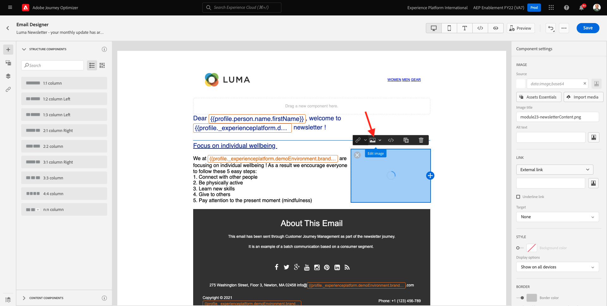

# 10.2 일괄 처리 기반 뉴스레터 여정 구성

다음 위치로 이동하여 Adobe Journey Optimizer에 로그인합니다 [Adobe Experience Cloud](https://experience.adobe.com). 클릭 **Journey Optimizer**.

으로 리디렉션됩니다. **홈**  Journey Optimizer에서 보기. 먼저 올바른 샌드박스를 사용하고 있는지 확인하십시오. 사용할 샌드박스를 이라고 합니다 `--aepSandboxId--`. 한 샌드박스에서 다른 샌드박스로 변경하려면 **프로덕션 제품(VA7)** 및 목록에서 샌드박스를 선택합니다. 이 예제에서 샌드박스의 이름은 다음과 같습니다 **AEP Enablement FY22**. 그러면 **홈** 샌드박스 보기 `--aepSandboxId--`.

## 10.2.1 뉴스레터 만들기 여정

이제 배치 기반 여정을 만듭니다. 들어오는 경험 이벤트 또는 세그먼트 항목 또는 종료에 의존하여 1개의 특정 고객에 대한 여정을 트리거하는 이전 연습의 이벤트 기반 여정과 달리, 배치 기반 여정은 뉴스레터, 일회성 프로모션 또는 일반 정보와 같은 고유한 컨텐츠나 인스턴스 생일 캠페인 및 미리 알림과 같이 정기적으로 전송되는 유사한 컨텐츠와 함께 전체 세그먼트를 한 번 타깃팅합니다.

메뉴에서 **여정** 을(를) 클릭합니다. **여정 만들기**.

오른쪽에는 여정 이름과 설명을 지정해야 하는 양식이 표시됩니다. 다음 값을 입력합니다.

- **이름**: `--demoProfileLdap-- - Newsletter Journey`. 예: **vangeluw - 뉴스레터 여정**.
- **설명**: 월별 뉴스레터

클릭 **확인**.

아래 **오케스트레이션**, 드래그 앤 드롭 **세그먼트 읽기** 캔버스에 즉, 게시되면 여정은 전체 세그먼트 대상을 검색하여 시작한 다음 여정 및 메시지의 타겟 대상이 됩니다. 클릭 **세그먼트 선택**.

에서 **세그먼트 선택** 팝업에서 ldap를 검색하고 [모듈 6 - 실시간 CDP - 세그먼트 구축 및 조치 수행](../module6/real-time-cdp-build-a-segment-take-action.md) 명명된 이름 `--demoProfileLdap-- - Interest in PROTEUS FITNESS JACKSHIRT`. 예: 바젤루 - 프로테우스 피트니스 재크셔츠의 관심사 **저장**&#x200B;을 클릭합니다.

클릭 **확인**.

왼쪽 메뉴에서 **작업** 섹션 및 끌어서 놓기 **이메일** 작업을 캔버스에 업로드합니다.

설정 **카테고리** to **마케팅** 전자 메일을 보낼 수 있는 전자 메일 서피스를 선택합니다. 이 경우 선택할 이메일 표면은 다음과 같습니다 **이메일**. 에 대한 확인란이 **이메일 클릭 수** 및 **이메일 열기** 둘 다 활성화되어 있습니다.

다음 단계는 메시지를 만드는 것입니다. 이렇게 하려면 **컨텐츠 편집**.

이제 이게 보입니다. 을(를) 클릭합니다. **제목 줄** 텍스트 필드.

제목 줄에 다음 텍스트를 입력합니다. `Luma Newsletter - your monthly update has arrived.`. **저장**&#x200B;을 클릭합니다.

그럼 다시 오셔야 합니다 클릭 **이메일 디자이너** 전자 메일 콘텐츠 만들기를 시작하려면 다음을 수행하십시오.

그러면 이게 보입니다. 클릭 **가져오기 HTML**.

팝업 화면에서 이메일의 HTML 파일을 끌어다 놓아야 합니다. HTML 템플릿을 찾을 수 있습니다 [여기](../../assets/html/ajo-newsletter.html.zip). HTML 템플릿이 있는 zip 파일을 로컬 컴퓨터에 다운로드하고 데스크탑에서 압축을 해제합니다.

파일을 끌어서 놓습니다 **ajo-newsletter.html** Journey Optimizer에서 업로드합니다. **가져오기**&#x200B;를 클릭합니다.

이 이메일 콘텐츠는 모든 예상 개인화, 이미지 및 텍스트가 있으므로 언제든지 이용할 수 있습니다. 오퍼 자리 표시자만 비어 있습니다.

오류 메시지가 표시될 수 있습니다. **자산을 가져오는 동안 오류가 발생했습니다.**. 이메일의 이미지에 연결됩니다.

이 오류가 발생하면 이미지를 선택하고 **이미지 편집** 버튼을 클릭합니다.

클릭 **Assets Essentials** AEM Assets Essentials 라이브러리로 돌아갑니다.

그러면 이 팝업이 표시됩니다. 폴더로 이동합니다 **enablement-assets** 이미지를 선택하고 **luma-newsletterContent.png**. **선택**&#x200B;을 클릭합니다.

이제 기본 뉴스레터 이메일이 준비되었습니다. **저장**&#x200B;을 클릭합니다.

을(를) 클릭하여 메시지 대시보드로 돌아갑니다 **화살표** 왼쪽 상단 모서리의 제목란 텍스트 옆에 있습니다.

왼쪽 상단 모서리의 화살표를 클릭하여 여정으로 돌아갑니다.

클릭 **확인** 이메일 작업을 닫습니다.

이제 뉴스레터 여정을 게시할 준비가 되었습니다. 이 작업을 수행하기 전에 **예약** 섹션을 통해 이 여정을 일회성 캠페인으로 전환할 수 있습니다. 을(를) 클릭합니다. **예약** 버튼을 클릭합니다.

그러면 이게 보입니다. 선택 **한 번**.

여정을 테스트할 수 있도록 다음 시간 내에 날짜 및 시간을 선택합니다. 클릭 **확인**.

>[!NOTE]
>
>메시지 전송 날짜 및 시간은 1시간 이상이어야 합니다.

클릭 **게시**.

클릭 **게시** 다시 한 번

이제 기본 뉴스레터 여정이 게시되었습니다. 뉴스레터 이메일 메시지는 예약에서 정의한 대로 전송되며 마지막 이메일이 전송되면 여정이 중지됩니다.

너는 이 운동을 끝마쳤다.

다음 단계: [10.3 이메일 메시지에 개인화 적용](./ex3.md)

[모듈 10으로 돌아가기](./journeyoptimizer.md)

[모든 모듈로 돌아가기](../../overview.md)
