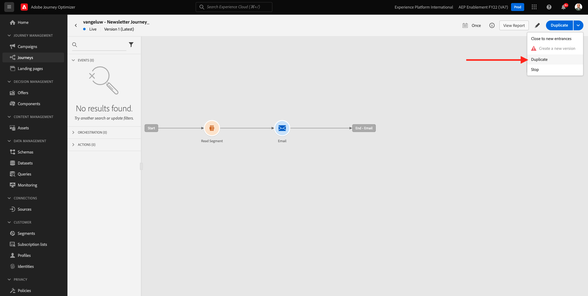
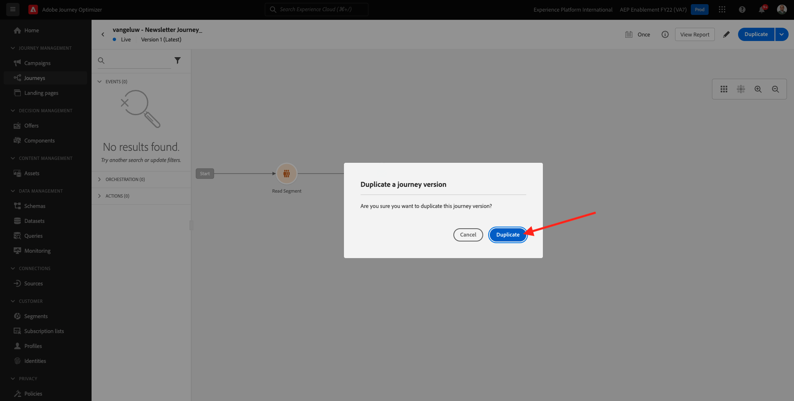
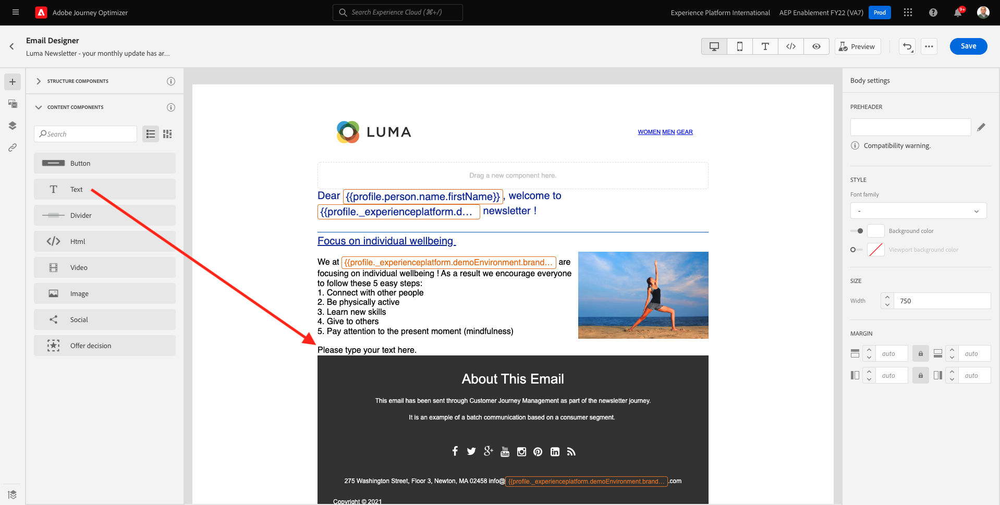
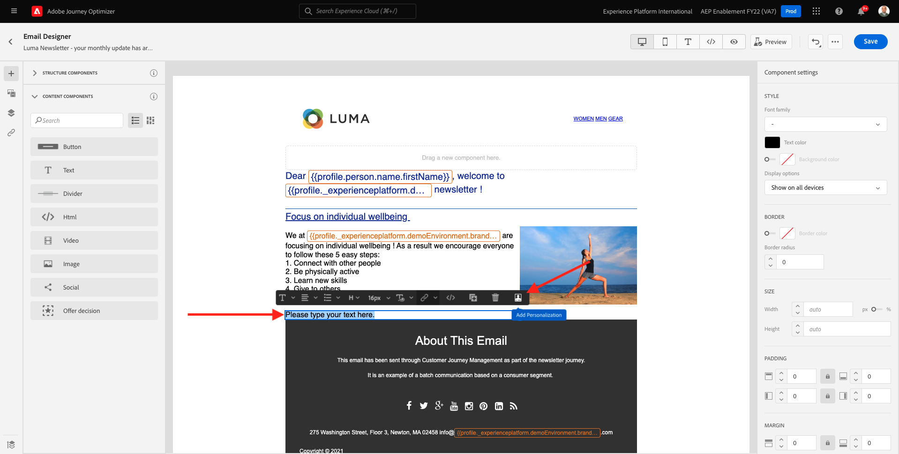
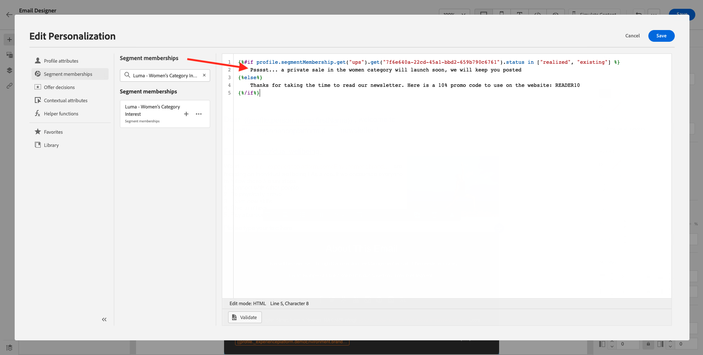
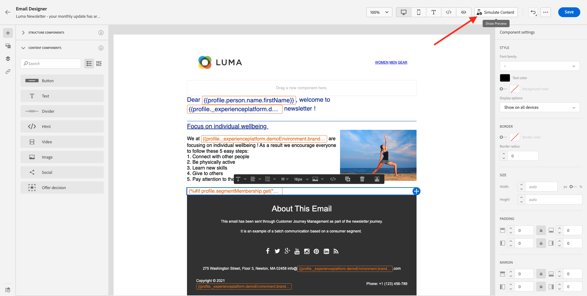

# 10.3 이메일 메시지에 개인화 적용

다음 위치로 이동하여 Adobe Experience Cloud에 로그인합니다 [Adobe Experience Cloud](https://experience.adobe.com). 클릭 **Adobe Journey Optimizer**.

으로 리디렉션됩니다. **홈** Journey Optimizer에서 보기. 계속하기 전에 **샌드박스**. 선택할 샌드박스의 이름은 다음과 같습니다 ``--aepTenantId--``. 이 작업은 텍스트를 클릭하여 수행할 수 있습니다 **[!UICONTROL 프로덕션 제품]** 화면 상단에 있는 파란색 줄에 표시됩니다.

## 10.3.1 세그먼트 기반 개인화

이 연습에서는 세그먼트 멤버십에 따라 개인화된 텍스트로 뉴스레터 이메일 메시지를 개선합니다.

이동 **여정**. 이전 연습에서 만든 뉴스레터 여정을 찾습니다. `--demoProfileLdap-- - Newsletter`을 검색합니다. 여정을 클릭하여 엽니다.

그러면 이게 보입니다. 클릭 **복제**.

** 복제** 클릭합니다.

을(를) 선택합니다 **이메일** 작업을 수행하고 **컨텐츠 편집**.

클릭 **이메일 디자이너**.

그러면 이게 보입니다.

열기 **컨텐츠 구성 요소** 끌어서 **텍스트** 구성 요소를 생성하지 않습니다.

전체 기본 텍스트를 선택하고 삭제합니다. 그런 다음 **개인화 추가** 단추를 누릅니다.

그러면 다음 내용이 표시됩니다.

왼쪽 메뉴에서 **세그먼트 멤버십**.

>[!NOTE]
>
>이 목록에서 세그먼트를 찾을 수 없는 경우 비트를 아래로 스크롤하여 세그먼트 ID를 수동으로 검색하는 방법에 대한 지침을 찾으십시오.

세그먼트 선택 `Luma - Women's Category Interest` 을 클릭하고 **+** 아이콘 표시 방법:

그런 다음 첫 번째 줄을 그대로 두고 2 및 3행을 이 코드로 바꾸십시오.

``
Psssst... a private sale in the women category will launch soon, we will keep you posted

Thanks for taking the time to read our newsletter. Here is a 10% promo code to use on the website: READER10

``

그러면 다음 항목이 제공됩니다.

클릭 **유효성 검사** 코드가 올바른지 확인하십시오. **저장**&#x200B;을 클릭합니다.

이제 다음을 클릭하여 이 메시지를 저장할 수 있습니다 **저장** 오른쪽 상단 모서리의 단추. 그런 다음 **컨텐츠 시뮬레이션**.

이 자습서의 일부로 만든 프로필 중 하나를 선택하고 을(를) 클릭합니다 **미리 보기**. 그러면 구성 결과가 표시됩니다.

그러면 이게 보입니다. 그런 다음 **닫기**.

을(를) 클릭하여 메시지 대시보드로 돌아갑니다 **화살표** 왼쪽 상단 모서리의 제목란 텍스트 옆에 있습니다.

왼쪽 상단 모서리의 화살표를 클릭하여 여정으로 돌아갑니다.

클릭 **확인** 이메일 작업을 닫습니다.

변경 **예약** to **한 번** 그리고 **날짜/시간**. 클릭 **확인**.

>[!NOTE]
>
>메시지 전송 날짜 및 시간은 1시간 이상이어야 합니다.

을(를) 클릭합니다. **게시** 버튼을 클릭합니다.

팝업 창에서 **게시** 다시 한 번

이제 기본 뉴스레터 여정이 게시되었습니다. 뉴스레터 이메일 메시지는 예약에 따라 전송되며 마지막 이메일을 전송하는 즉시 여정이 중지됩니다.

너는 이 운동을 끝마쳤다.

다음 단계: [10.4 iOS용 푸시 알림 설정 및 사용](./ex4.md)

[모듈 10으로 돌아가기](./journeyoptimizer.md)

[모든 모듈로 돌아가기](../../overview.md)
