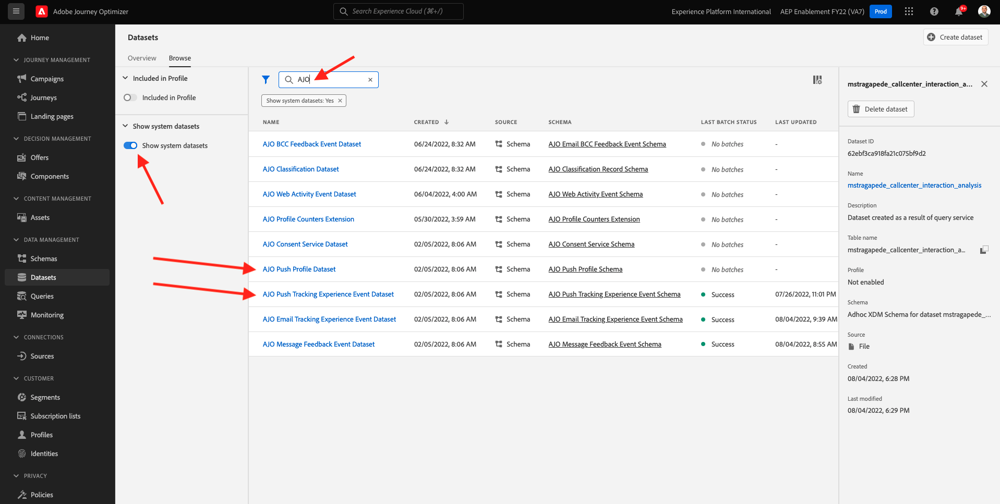
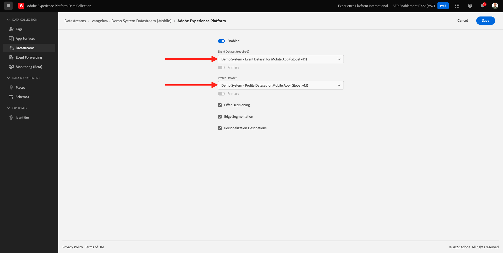
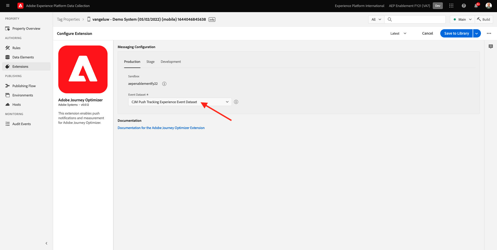
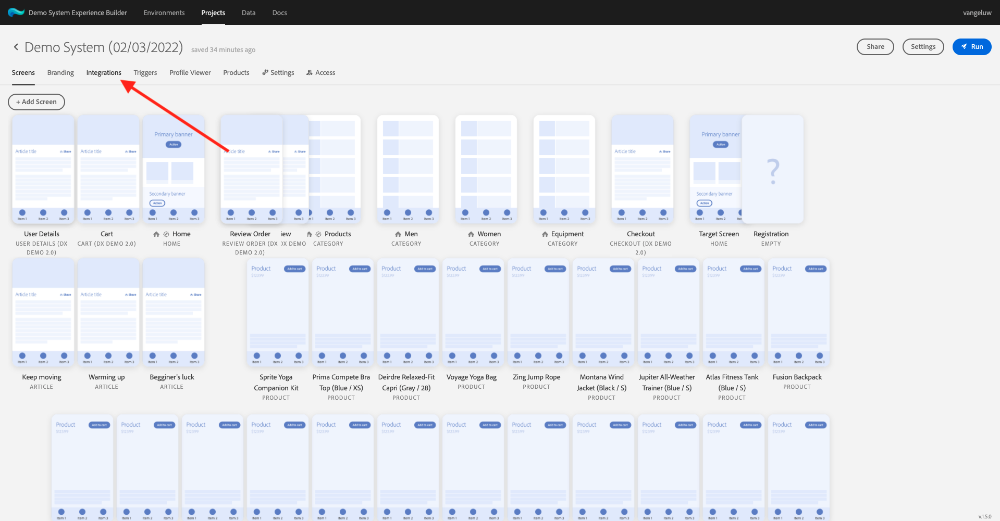
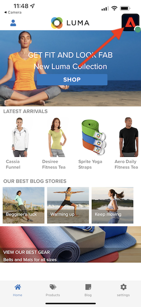
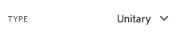
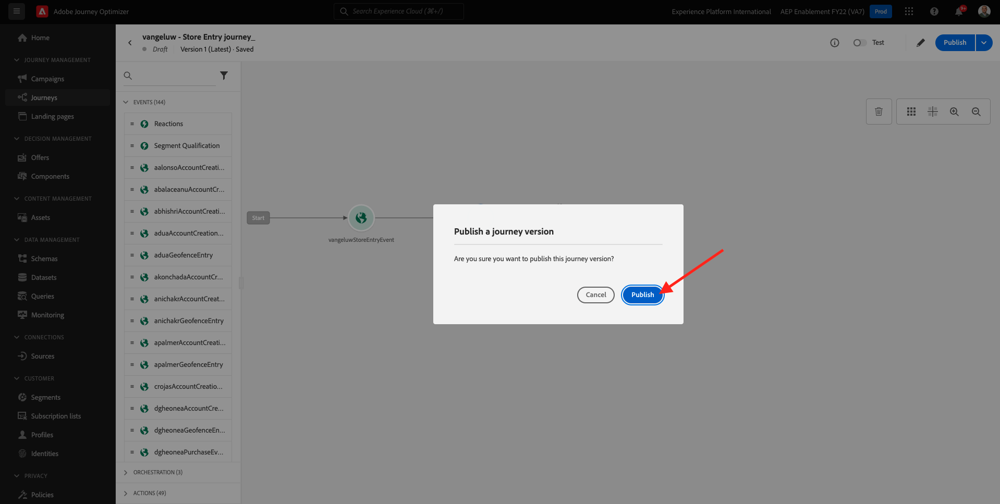

# 10.4 iOS용 푸시 알림 설정 및 사용

Adobe Journey Optimizer에서 푸시 알림을 사용하기 위해 확인하고 알아야 할 설정이 많습니다.

확인할 모든 설정은 다음과 같습니다.

- Adobe Experience Platform의 데이터 세트 및 스키마
- 모바일용 데이터 스트림
- 모바일용 데이터 수집 속성
- 푸시 인증서의 앱 표면
- AEP Assurance를 사용하여 푸시 설정 테스트

이것을 하나씩 검토해 봅시다.

다음 위치로 이동하여 Adobe Journey Optimizer에 로그인합니다 [Adobe Experience Cloud](https://experience.adobe.com). 클릭 **Journey Optimizer**.

으로 리디렉션됩니다. **홈**  Journey Optimizer에서 보기. 먼저 올바른 샌드박스를 사용하고 있는지 확인하십시오. 사용할 샌드박스를 이라고 합니다 `--aepSandboxId--`. 한 샌드박스에서 다른 샌드박스로 변경하려면 **프로덕션 제품(VA7)** 및 목록에서 샌드박스를 선택합니다. 이 예제에서 샌드박스의 이름은 다음과 같습니다 **AEP Enablement FY22**. 그러면 **홈** 샌드박스 보기 `--aepSandboxId--`.

## 10.4.1 푸시 데이터 세트

Adobe Journey Optimizer은 데이터 세트를 사용하여 모바일 장치의 푸시 토큰 또는 푸시 메시지와 함께 상호 작용(예: 메시지 전송, 메시지 열림 등)을 Adobe Journey Optimizer의 데이터 세트에 포함합니다.

다음 위치로 이동하여 이러한 데이터 세트를 찾을 수 있습니다 **[!UICONTROL 데이터 세트]** 을 클릭합니다. 시스템 데이터 세트를 표시하려면 필터 아이콘을 클릭합니다.

옵션을 활성화합니다 **시스템 데이터 세트 표시** 및 검색 **AJO**. 그러면 푸시 알림에 사용된 데이터 세트가 표시됩니다.

## 모바일용 10.4.2 데이터 스트림

이동 [https://experience.adobe.com/#/data-collection/](https://experience.adobe.com/#/data-collection/).

왼쪽 메뉴에서 **[!UICONTROL 데이터 스트림]** 에서 만든 데이터 스트림을 검색하고 [연습 0.2](./../module0/ex2.md): `--demoProfileLdap-- - Demo System Datastream (Mobile)`. 클릭하여 엽니다.

클릭 **편집** on **Adobe Experience Platform** 서비스.

정의한 데이터 스트림 설정과 저장할 데이터 세트 이벤트 및 프로필 속성을 확인할 수 있습니다.

변경할 필요가 없으며, 이제 모바일용 데이터 수집 클라이언트 속성에서 데이터 스트림을 사용할 준비가 되었습니다.

## 10.4.3 모바일에 대한 데이터 수집 속성 검토

이동 [https://experience.adobe.com/#/data-collection/](https://experience.adobe.com/#/data-collection/). 의 일부로 [연습 0.1](./../module0/ex1.md), 2개의 데이터 수집 속성이 생성되었습니다.
이러한 데이터 수집 클라이언트 속성을 이미 이전 모듈의 일부로 사용했습니다.

를 클릭하여 모바일용 데이터 수집 속성을 엽니다.

데이터 수집 속성에서 **확장**. 그런 다음 모바일 앱에 필요한 다양한 확장이 표시됩니다. 확장을 클릭하여 엽니다. **Adobe Experience Platform Edge Network**.

그러면 모바일용 데이터 스트림이 여기에 연결되어 있음을 알 수 있습니다. 다음을 클릭합니다. **취소** 확장 개요로 돌아갑니다.

그럼 다시 여기로 돌아오세요 다음에 대한 확장이 표시됩니다. **AEP Assurance**. AEP Assurance를 사용하면 모바일 앱에서 데이터를 수집하거나 경험을 제공하는 방법을 검사, 증명, 시뮬레이션 및 확인할 수 있습니다. AEP Assurance 및 Project Griffon에 대해 자세히 알아보십시오. [https://aep-sdks.gitbook.io/docs/beta/project-griffon](https://aep-sdks.gitbook.io/docs/beta/project-griffon).

다음을 클릭합니다. **구성** 확장을 열려면 **Adobe Journey Optimizer**.

그런 다음 푸시 이벤트 추적을 위한 데이터 세트가 연결된 것을 확인할 수 있습니다.

데이터 수집 속성을 변경할 필요가 없습니다.

## 10.4.4 앱 표면 설정 검토

이동 [https://experience.adobe.com/#/data-collection/](https://experience.adobe.com/#/data-collection/). 왼쪽 메뉴에서 **앱 서피스** 및 를 엽니다. **DX 데모 앱 APNS**.

그러면 iOS 및 Android용으로 구성된 앱 서피스가 표시됩니다.

## 10.4.5 AEP Assurance를 사용하여 푸시 알림 설정 테스트 .

앱이 설치되면 장치의 홈 화면에 표시됩니다. 아이콘을 클릭하여 앱을 엽니다.

앱을 처음 사용하는 경우 Adobe ID을 사용하여 로그인하라는 메시지가 표시됩니다. 로그인 프로세스를 완료합니다.

로그인하면 알림 전송 권한을 요청하는 알림이 표시됩니다. 자습서의 일부로 알림을 보내므로 **허용**.

그러면 앱의 홈 페이지가 표시됩니다. 이동 **설정**.

설정에서 현재 **공용 프로젝트** 가 앱에 로드됩니다. 클릭 **사용자 지정 프로젝트**.

이제 사용자 지정 프로젝트를 로드할 수 있습니다. 프로젝트를 쉽게 로드하려면 QR 코드를 클릭합니다.

0.1운동 후에, 당신은 이 결과를 얻었습니다. 를 클릭하여 **Mobile Retail 프로젝트** 생성되었습니다.

실수로 브라우저 창을 닫았거나 나중에 데모 또는 지원 세션을 위해 [https://builder.adobedemo.com/projects](https://builder.adobedemo.com/projects). Adobe ID으로 로그인하면 다음이 표시됩니다. 모바일 앱 프로젝트를 클릭하여 엽니다.

그러면 이게 보입니다. 클릭 **통합**.

연습 0.1에서 생성된 모바일의 데이터 수집 속성을 선택해야 합니다. 그런 다음 **실행**.

그러면 QR 코드가 포함된 이 팝업이 표시됩니다. 모바일 앱 내에서 이 QR 코드를 스캔합니다.

그러면 앱에서 프로젝트 ID가 표시되고 그 다음에 를 클릭하면 **저장**.

이제, 다시 **홈** 참조하십시오. 이제 앱을 사용할 준비가 되었습니다.

이제 모바일 장치를 AEP Assurance 세션에 연결하려면 QR 코드를 스캔해야 합니다.

AEP Assurance 세션을 시작하려면 다음 위치로 이동하십시오. [https://experience.adobe.com/#/@experienceplatform/griffon](https://experience.adobe.com/#/@experienceplatform/griffon). 클릭 **세션 만들기**.

**시작을 클릭합니다**.

다음 값을 채웁니다.

- 세션 이름: 사용 `--demoProfileLdap-- - push debugging` ldap에 의해 ldap를
- 기본 URL: 사용 **dxdemo://default**

**다음**&#x200B;을 클릭합니다.

화면에 iOS 장치로 스캔해야 하는 QR 코드가 표시됩니다.

모바일 장치에서 카메라 앱을 열고 AEP Assurance에서 표시하는 QR 코드를 스캔합니다.

그러면 팝업 화면이 표시되어 PIN-코드를 입력하도록 요청합니다. AEP Assurance 화면에서 PIN 코드를 복사하여 **Connect**.

그러면 이게 보입니다.

이제 AEP Assurance에서 장치가 AEP Assurance 세션으로 연결됨을 알 수 있습니다.

이동 **푸시 디버그**. 여러분은 이와 같은 것을 볼 것입니다.

설명:

- 첫 번째 열, **클라이언트**&#x200B;는 iOS 장치에서 사용 가능한 식별자를 표시합니다. ECID 및 푸시 토큰이 표시됩니다.
- 두 번째 열은 **프로필** 푸시 토큰이 상주하는 플랫폼(APNS 또는 APNSSandbox)에 대한 추가 정보가 포함된 정보입니다. 을 클릭하여 **Inspect 프로필** 버튼을 클릭하면 Adobe Experience Platform으로 이동하며 전체 실시간 고객 프로필이 표시됩니다.
- 세 번째 열은 **앱 구성**- 운동의 일환으로 설정됨 **Launch에서 10.5.4 앱 구성 만들기**

푸시 구성 설정을 테스트하려면 **푸시 알림 보내기** 버튼을 클릭합니다.

다음을 확인해야 합니다. **DX 데모** 앱을 클릭할 때 앱이 열리지 않음 **푸시 알림 보내기** 버튼을 클릭합니다. 앱이 열려 있으면 푸시 알림이 백그라운드에서 수신될 수 있으며 표시되지 않습니다.

그러면 모바일 장치에 이와 같은 푸시 알림이 표시됩니다.

푸시 알림을 받은 경우, 이는 설정이 올바르고 제대로 작동함을 의미합니다.

## 10.4.6 새 이벤트 만들기

메뉴에서 **여정 관리** 을(를) 클릭합니다. **관리** 아래에 **이벤트**.

설정 **이벤트** 화면에서 이와 유사한 보기가 표시됩니다. 클릭 **이벤트 만들기**.

그러면 빈 이벤트 구성이 표시됩니다.

먼저 다음과 같은 이름을 이벤트에 지정합니다. `--demoProfileLdap--StoreEntryEvent` 설명을 로 설정합니다. `Store Entry Event`.

다음은 입니다 **이벤트 유형** 선택. 선택 **단일**.

다음은 입니다 **이벤트 ID 유형** 선택. 선택 **시스템 생성**

다음은 스키마 선택입니다. 이 연습에 대한 스키마가 준비되었습니다. 스키마를 사용하십시오 `Demo System - Event Schema for Mobile App (Global v1.1) v.1`.

스키마를 선택하면 **페이로드** 섹션을 참조하십시오. 이제 이벤트가 완전히 구성되었습니다.

그러면 이게 보입니다. **저장**&#x200B;을 클릭합니다.

이제 이벤트가 구성 및 저장됩니다. 이벤트를 다시 클릭하여 **이벤트 편집** 다시 화면 표시

마우스를 위에 놓으십시오 **페이로드** 필드를 클릭하고 **페이로드 보기** 아이콘.

이제 예상 페이로드의 예를 볼 수 있습니다.

이벤트에는 고유한 오케스트레이션 eventID가 있으며, 표시될 때까지 해당 페이로드에서 아래로 스크롤하여 찾을 수 있습니다 `_experience.campaign.orchestration.eventID`.

이벤트 ID는 다음 단계에서 작성할 여정을 트리거하기 위해 Adobe Experience Platform으로 전송해야 하는 것입니다. 이 eventID를 다음 단계에서 필요하므로 적어 두십시오.
`"eventID": "e3a8f0bdc0b609667cd96a72a6b1e5aafa0ddaf6ccf121c574e6a2030860a633"`

클릭 **확인**, 그 다음 **취소**.

## 10.4.7 여정 만들기

메뉴에서 **여정** 을(를) 클릭합니다. **여정 만들기**.

그러면 이게 보입니다. 여정 이름을 지정합니다.  `--demoProfileLdap-- - Store Entry journey`. **확인**&#x200B;을 클릭합니다.

먼저 이벤트를 여정의 시작점으로 추가해야 합니다. 이벤트 검색 `--demoProfileLdap--StoreEntryEvent` 캔버스에 끌어다 놓습니다. **확인**&#x200B;을 클릭합니다.

다음, 아래 **작업**&#x200B;를 검색하고 **푸시** 작업.
을(를) 끌어다 놓습니다 **푸시** 작업을 캔버스에 업로드합니다.

설정 **카테고리** to **마케팅** 푸시 알림을 전송할 수 있는 푸시 면을 선택합니다. 이 경우 선택할 이메일 표면은 다음과 같습니다 **Push-iOS-Android**.

다음 단계는 메시지를 만드는 것입니다. 이렇게 하려면 **컨텐츠 편집**.

그러면 이게 보입니다. 을(를) 클릭합니다. **개인화** 아이콘 **제목** 필드.

그러면 이게 보입니다. 이제 실시간 고객 프로필에서 프로필 속성을 직접 선택할 수 있습니다.

필드를 검색합니다 **이름**&#x200B;를 클릭한 다음 **+** 필드 옆에 있는 아이콘 **이름**. 그러면 추가되는 이름에 대한 개인화 토큰이 표시됩니다. **{{profile.person.name.firstName}}**.

그런 다음 텍스트를 추가합니다 **저희가게입니다!** 뒤에 **{{profile.person.name.firstName}}**.

**저장**&#x200B;을 클릭합니다.

이제 이걸 가지고 있습니다. 을(를) 클릭합니다. **개인화** 아이콘 **본문** 필드.

이 텍스트 입력 **오늘 살 때 10% 할인을 받으려면 여기를 클릭하세요!** 을(를) 클릭합니다. **저장**.

그럼 이걸로 주세요 왼쪽 상단 모서리의 화살표를 클릭하여 여정으로 돌아갑니다.

클릭 **확인** 푸시 작업을 닫습니다.

클릭 **게시**.

클릭 **게시** 다시 한 번

이제 여정이 게시되었습니다.

## 10.4.8 여정 및 푸시 메시지 테스트

DX Demo 2.0 모바일 애플리케이션에서 **설정** 화면. 을(를) 클릭합니다. **저장소 항목** 버튼을 클릭합니다.

>[!NOTE]
>
>다음 **저장소 항목** 버튼이 현재 구현되고 있습니다. 앱에서 아직 찾을 수 없습니다.

를 클릭한 후 바로 앱을 닫아야 합니다. **저장소 항목** 아이콘 이외의 경우에는 푸시 메시지가 표시되지 않습니다.

몇 초 후에 메시지가 나타납니다.

너는 이 운동을 끝마쳤다.

다음 단계: [10.5 비즈니스 이벤트 여정 만들기](./ex5.md)

[모듈 10으로 돌아가기](./journeyoptimizer.md)

[모든 모듈로 돌아가기](../../overview.md)
