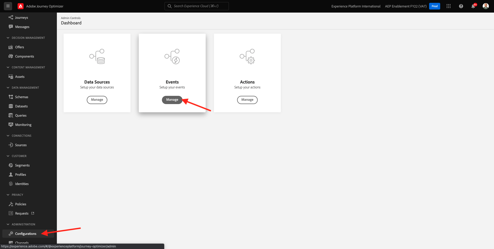

# 10.5 비즈니스 이벤트 여정 만들기

다음 위치로 이동하여 Adobe Journey Optimizer에 로그인합니다 [Adobe Experience Cloud](https://experience.adobe.com). 클릭 **Journey Optimizer**.


으로 리디렉션됩니다. **홈**  Journey Optimizer에서 보기. 먼저 올바른 샌드박스를 사용하고 있는지 확인하십시오. 사용할 샌드박스를 이라고 합니다 `--aepSandboxId--`. 한 샌드박스에서 다른 샌드박스로 변경하려면 **프로덕션 제품(VA7)** 및 목록에서 샌드박스를 선택합니다. 이 예제에서 샌드박스의 이름은 다음과 같습니다 **AEP Enablement FY22**. 그러면 **홈** 샌드박스 보기 `--aepSandboxId--`.


## 10.5.1 비즈니스 이벤트 만들기

왼쪽 메뉴에서 **구성**. 을(를) 클릭합니다. **관리** 단추 내부 **이벤트** 카드.



비즈니스 이벤트는 Journey Optimizer 내에서 만들 수 있는 새로운 유형의 이벤트입니다. 와 달리 **단일** 이전 모듈에서 만든 이벤트인 비즈니스 이벤트는 고객이 트리거하지 않고 조직에 의해 트리거됩니다. 이제 비즈니스 이벤트를 만듭니다.

클릭 **이벤트 만들기**.


이벤트 생성 양식에 다음 값을 입력합니다.

- **이름**: `--demoProfileLdap--ItemBackInStock`. 예: **vangeluwItemBackInStock**
- **설명**: 이 이벤트는 제품이 다시 재고가 있을 때 트리거됩니다
- **유형**: 선택 **비즈니스** 드롭다운


스키마에 대해 를 선택합니다. **데모 시스템 - JO 비즈니스 이벤트(글로벌 v1.1) v.1용 이벤트 스키마**. 이제 사용 사례에 필요한 스키마에서 필드를 선택해야 합니다.


다음 단계를 수행합니다.

을(를) 클릭합니다. **연필** 아이콘이 표시되는 필드의 아이콘 **선택한 필드 1개**.


스키마에서 사용 가능한 모든 필드를 선택한 다음 **확인**.


조건: 이 스키마에서 비즈니스 이벤트를 트리거할 레코드를 지정해야 합니다.

다음 단계를 수행합니다.

을(를) 클릭합니다. **연필** 아이콘이 표시되는 필드의 아이콘 **조건 추가**.


왼쪽에서 `--aepTenantId--` 개체, 개체 확장 **joBusinessEvents** 필드를 끌어서 놓습니다 **eventName** 캔버스에


필드 **eventName**&#x200B;다음 값을 입력합니다. `--demoProfileLdap--ItemBackInStock`. 예: vangeluwItemBackInStock
**확인**&#x200B;을 클릭합니다.


**확인**&#x200B;을 클릭합니다.


마지막으로 이벤트 만들기 양식은 다음과 같습니다. 클릭 **저장** 비즈니스 이벤트를 저장하려면 다음을 수행하십시오.


## 10.5.2 비즈니스 이벤트 여정 만들기

이제 이 비즈니스 이벤트와 여정 내부의 메시지를 활용할 수 있습니다. 이동 **여정**. 클릭 **여정 만들기**.


오른쪽에는 여정 이름과 설명을 지정해야 하는 양식이 표시됩니다. 다음 값을 입력합니다.

- **이름**: `--demoProfileLdap-- - Item back in stock journey`. 예: vangeluw - 재고 여정에 다시 있는 품목
- **설명**: 이 여정은 관심 있는 방문자에게 항목이 다시 재고가 있으면 SMS를 보냅니다.

**확인**&#x200B;을 클릭합니다.


왼쪽 메뉴에서 **이벤트**&#x200B;를 검색하는 경우 ldap를 검색합니다. 이전에 만든 비즈니스 이벤트를 찾을 수 있습니다 `--demoProfileLdap--ItemBackInStock`. 이 이벤트를 여정 시작점이 되므로 캔버스에 끌어다 놓습니다.


보시다시피 **세그먼트 읽기** 활동이 자동으로 캔버스에 추가되었습니다. 비즈니스 이벤트는 여정이 특정 세그먼트를 읽을 수 있도록 트리거만 전송하여 해당 여정의 프로필 목록을 검색하게 되기 때문입니다.

을(를) 클릭합니다. **세그먼트 읽기** 활동.
다음 **세그먼트 읽기** 구성에서는 방금 발생한 비즈니스 이벤트에 대해 알릴 세그먼트를 선택해야 합니다. 을(를) 클릭합니다. **세그먼트 선택** 필드.


에서 **세그먼트 선택** 팝업에서 ldap를 검색하고 [모듈 6 - 실시간 CDP - 세그먼트 구축 및 조치 수행](../module6/real-time-cdp-build-a-segment-take-action.md) 명명된 이름 `--demoProfileLdap-- - Interest in PROTEUS FITNESS JACKSHIRT`. 예: 바젤루 - 프로테우스 피트니스 재크셔츠의 관심사 **저장**&#x200B;을 클릭합니다.


다음을 클릭합니다. **확인**.


다음 단계는 이 여정에서 수행할 작업을 끌어서 놓는 것입니다. 작업을 선택합니다 **SMS**&#x200B;를 클릭한 다음 방금 추가한 조건 뒤에 끌어서 놓습니다.


설정 **카테고리** to **마케팅** sms를 보낼 수 있는 sms 서피스를 선택합니다. 이 경우 선택할 이메일 표면은 다음과 같습니다 **SMS**.


다음 단계는 메시지를 만드는 것입니다. 이렇게 하려면 **컨텐츠 편집**.


이제 SMS 텍스트를 구성할 수 있는 메시지 대시보드가 표시됩니다. 을(를) 클릭합니다. **메시지 작성** 영역을 사용하여 메시지를 만들 수 있습니다.


다음 텍스트를 입력합니다. `Hi {{profile.person.name.firstName}}, the Proteus Fitness Jackshirt is back in stock at Luma.`. **저장**&#x200B;을 클릭합니다.


을(를) 클릭하여 메시지 대시보드로 돌아갑니다 **화살표** 왼쪽 상단 모서리의 제목란 텍스트 옆에 있습니다.


이제 완료된 SMS 작업이 표시됩니다. 클릭 **확인**.


이제 여정을 게시할 준비가 되었습니다. 클릭 **게시**.


클릭 **게시** 다시 한 번


이제 여정이 게시되었습니다. 이제 테스트할 수 있습니다.


## 10.5.3 비즈니스 이벤트 여정 테스트

이제 다음에 대해 새로운 이벤트를 수집하여 제품의 재재고를 시뮬레이션합니다 **데모 시스템 - JO 비즈니스 이벤트(글로벌 v1.1) v.1용 이벤트 스키마** Postman 사용.

왼쪽 메뉴에서 **소스** 그런 다음 **계정** 탭.


설정 **계정** 탭에서 **Journey Optimizer 비즈니스 이벤트**. 클릭하여 엽니다.


이 계정에는 데이터 흐름이 하나만 있습니다. 데이터 흐름 이름을 클릭하여 선택하십시오.


클릭 **스키마 페이로드 복사** 오른쪽 메뉴에 있습니다. 이 옵션은 전체 **curl** 레코드를 삽입할 명령 **데모 시스템 - JO 비즈니스 이벤트(글로벌 v1.1) v.1용 이벤트 스키마** 클립보드에 복사합니다.


텍스트 편집기 내에 Curl 명령을 붙여넣습니다


이 요청을 좀더 자세히 살펴보도록 하죠

- POST 요청은 DCS Inlet ID로 전송됩니다
- 이 요청은 스키마, 데이터 세트 및 조직 ID를 참조합니다.
- 마지막으로 데이터 집합 내에 만들 데이터를 나타내는 xdmEntity 노드가 포함되어 있습니다.

이제 다음을 교체해야 합니다 `xdmEntity` 줄..

```json
"xdmEntity": {
  "_experienceplatform": {
    "joBusinessEvents": {
      "eventDescription": "string",
      "eventName": "string",
      "stockEventId": "string"
    }
  },
  "_id": "/uri-reference",
  "eventType": "advertising.completes",
  "timestamp": "2018-11-12T20:20:39+00:00"
}
```

...이 행에서는 필드 eventName이 표시되는지 확인해야 합니다. `--demoProfileLdap--ItemBackInStock`: 여정을 트리거하기 위해 비즈니스 이벤트에 지정한 조건을 나타냅니다.

```json
"xdmEntity": {
  "_experienceplatform": {
    "joBusinessEvents": {
      "eventDescription": "Product Proteus Fitness Jackshirt is back in stock",
      "eventName": "--demoProfileLdap--ItemBackInStock",
      "stockEventId": "1"
    }
  },
  "_id": "/uri-reference",
  "eventType": "productBackInStock",
  "timestamp": "2021-04-19T15:25:39+00:00"
}
```

업데이트된 내용 **curl** 명령 형식은 다음과 같습니다.


모두 선택하고 클립보드에 복사합니다.

Postman을 엽니다. Postman의 왼쪽에서 **가져오기**.


을(를) 선택합니다 **원시 텍스트** 탭하고 이전에 복사한 명령을 여기에 붙여넣습니다. **계속을 클릭합니다**.


**가져오기**&#x200B;를 클릭합니다.


Postman은 자동으로 전환되었습니다 **curl** 트리거할 수 있는 REST 명령에 명령을 입력하고 **보내기** 단추를 클릭하여 데이터 집합 내에 해당 레코드 만들기를 요청합니다.


요청이 성공적으로 수신되었는지 확인합니다. 검색 **200 OK** postman의 상태.


SMS가 휴대폰에 도착하는 데 2분 정도 걸릴 수 있습니다. 그렇지 않으면 **Proteus Fitness Jackshirt에 대한 관심** 세그먼트에 올바른 휴대 전화를 사용하는 프로필이 포함되지 않을 수 있습니다. 있는 경우 Luma 웹 사이트로 이동하여 **프로테우스 피트니스 자크셔츠** 제품을 등록하고 올바른 휴대폰 번호를 입력해야 합니다.


이제 이 운동을 끝마쳤습니다.

다음 단계: [요약 및 이점](./summary.md)

[모듈 10으로 돌아가기](./journeyoptimizer.md)

[모든 모듈로 돌아가기](../../overview.md)
