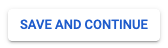
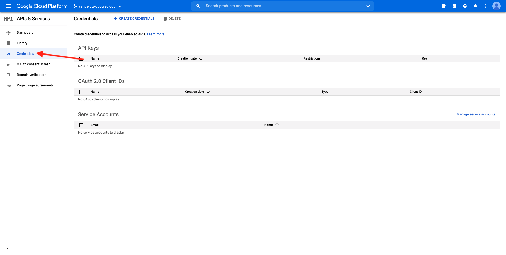
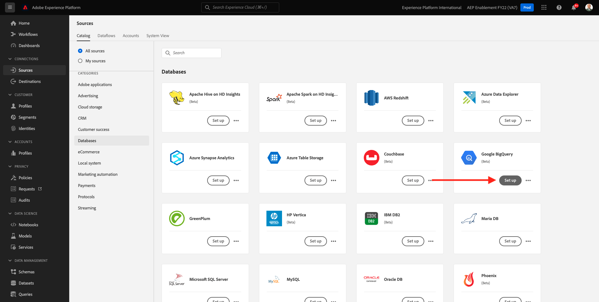

# 12.3 GCP 및 BigQuery를 Adobe Experience Platform에 연결

## 목표

- Google Cloud Platform에서 API 및 서비스 살펴보기
- Google API를 테스트하기 위한 OAuth 필드 를 잘 알고 있습니다
- Adobe Experience Platform에서 첫 번째 BigQuery 연결 만들기

## 컨텍스트

Adobe Experience Platform은 내에서 커넥터를 제공합니다 **소스** 이렇게 하면 BigQuery 데이터 세트를 Adobe Experience Platform으로 가져올 수 있습니다. 이 데이터 커넥터는 Google BigQuery API를 기반으로 합니다. 따라서 Adobe Experience Platform에서 API 호출을 받을 수 있도록 Google Cloud Platform 및 BigQuery 환경을 제대로 준비해야 합니다.

Adobe Experience Platform에서 BigQuery 소스 커넥터를 구성하려면 다음 4개의 값이 필요합니다.

- 프로젝트
- clientId
- clientSecret
- refreshToken

지금까지 당신은 오직 첫번째, **프로젝트 ID**. 이 **프로젝트 ID** 값은 연습 12.1 동안 BigQuery 프로젝트를 만들 때 Google에서 생성한 무작위 ID입니다.

분리된 텍스트 파일에 프로젝트 ID를 복사하십시오.

| 자격 증명 | 이름 지정 | 예 |
| ----------------- |-------------| -------------|
| 프로젝트 ID | random | completed-task-306413 |

언제든지 **프로젝트 이름** 상단 메뉴 막대에서 다음을 수행합니다.

프로젝트 ID가 오른쪽에 표시됩니다.

이 연습에서는 다른 3개의 필수 필드를 가져오는 방법을 알아봅니다.

- clientId
- clientSecret
- refreshToken

## 12.3.1 Google Cloud API &amp; Services

시작하려면 Google Cloud Platform 홈 페이지로 돌아갑니다. 이렇게 하려면 화면 왼쪽 상단 모서리에 있는 로고를 클릭하면 됩니다.

홈 페이지를 방문하면 왼쪽 메뉴로 이동하고 **API 및 서비스**&#x200B;을 클릭한 다음 을 클릭합니다. **대시보드**.

이제 다음을 확인할 수 있습니다. **API 및 서비스** 홈 페이지.

이 페이지에서는 다양한 Google API 연결의 사용을 볼 수 있습니다. BigQuery에서 읽을 수 있도록 API 연결을 설정하려면 다음 단계를 수행해야 합니다.

- 먼저 향후 인증을 활성화하려면 OAuth 동의 화면을 만들어야 합니다. 또한 프로그래밍 방식의 액세스가 허용되기 전에 Google의 보안 때문에 첫 번째 인증을 수행해야 합니다.
- 두 번째, API 인증 및 BigQuery Connector에 액세스하는 데 사용할 API 자격 증명(clientId 및 clientSecret)이 필요합니다.

## 12.3.2 OAuth 동의 화면

먼저 OAuth 동의 화면 만들기를 시작하십시오. 왼쪽 메뉴에서 **API 및 서비스** homepage 를 클릭하여 **OAuth 동의 화면**.

그러면 다음 내용이 표시됩니다.

사용자 유형을 선택합니다. **외부**. 다음을 클릭합니다. **만들기**.

그러면 다음 작업을 수행할 수 있습니다. **OAuth 동의 화면 구성** 창을 엽니다.

여기서 할 일은 동의 화면의 이름을 **애플리케이션 이름** 필드를 선택하고 **사용자 지원 이메일**. 응용 프로그램 이름의 경우 다음 이름 지정 규칙을 사용합니다.

| 이름 지정 | 예 |
| ----------------- |-------------| 
| `--demoProfileLdap-- - AEP BigQuery Connector` | vangeluw - AEP BigQuery 커넥터 |

다음으로, **개발자 연락처 정보** 이메일 주소를 입력합니다.

클릭 **저장 후 계속**.

그러면 이게 보입니다. 클릭 **저장 후 계속**.

그러면 이게 보입니다. 클릭 **저장 후 계속**.

그러면 이게 보입니다. 클릭 **대시보드로 돌아가기**.

그러면 이게 보입니다. 클릭 **앱 게시**.

클릭 **확인**.

그러면 이게 보입니다.

다음 단계에서 API 설정을 완료하고 API 자격 증명을 가져옵니다.

## 12.3.3 Google API 자격 증명: 클라이언트 암호 및 클라이언트 Id

왼쪽 메뉴에서 **자격 증명**. 그러면 다음 내용이 표시됩니다.

을(를) 클릭합니다. **+ 자격 증명 만들기** 버튼을 클릭합니다.

3가지 옵션이 표시됩니다. 을(를) 클릭합니다. **OAuth 클라이언트 ID**:

다음 화면에서 을 선택합니다. **웹 애플리케이션**.

몇 개의 새 필드가 표시됩니다. 이제 을(를) 입력해야 합니다. **이름** OAuth 클라이언트 ID 및에 **허가된 리디렉션 URI**.

다음 명명 규칙을 따르십시오.

| 필드 | 값 | 예 |
| ----------------- |-------------| -------------| 
| 이름 | ldap - AEP BigQuery 커넥터 | vangeluw - Platform BigQuery 커넥터 |
| 허가된 리디렉션 URI | https://developers.google.com/oauthplayground | https://developers.google.com/oauthplayground |

다음 **허가된 리디렉션 URI** 필드는 나중에 RefreshToken을 가져오려면 Adobe Experience Platform에서 BigQuery Source Connector 설정을 완료해야 하므로 매우 중요한 필드입니다.

계속하기 전에 물리적으로 **Enter 키** URL을 입력하여 **허가된 리디렉션 URI** 필드. 를 클릭하지 않으면 **Enter 키** 버튼, 나중에, **OAuth 2.0 놀이터**.

다음을 클릭합니다. **만들기**:

이제 클라이언트 ID와 클라이언트 암호가 표시됩니다.

이 두 필드를 복사하여 데스크톱의 텍스트 파일에 붙여 넣으십시오. 나중에 이러한 자격 증명에 항상 액세스할 수 있지만 BigQuery 프로젝트 ID 옆에 있는 텍스트 파일에 저장하면 더 쉽습니다.

Adobe Experience Platform의 BigQuery 소스 커넥터 설정에 대한 요약으로, 이제 다음 값을 이미 사용할 수 있습니다.

| BigQuery Connector 자격 증명 | 값 |
| ----------------- |-------------| 
| 프로젝트 ID | 고유한 프로젝트 ID(예:: completed-task-306413) |
| clientid | yourclientid |
| cilentsecret | yourclientsecret |

아직 실종상태야 **refreshToken**. 보안상의 이유로 refreshToken은 요구 사항입니다. API의 세계에서 토큰은 일반적으로 24시간마다 만료됩니다. 따라서 **refreshToken** 은 24시간마다 보안 토큰을 새로 고치는 데 필요합니다. 따라서 소스 커넥터 설정이 Google Cloud Platform 및 BigQuery에 계속 연결할 수 있습니다.

## 12.3.4 BigQuery API 및 refreshToken

Google Cloud Platform API에 액세스하기 위해 refreshToken을 가져오는 방법에는 여러 가지가 있습니다. 이러한 옵션 중 하나는 Postman 사용 예입니다.
그러나 Google은 API를 사용하여 쉽게 테스트하고 재생할 수 있는 **OAuth 2.0 놀이터**.

에 액세스하려면 **OAuth 2.0 놀이터**, 이동 [https://developers.google.com/oauthplayground](https://developers.google.com/oauthplayground).

그러면 **OAuth 2.0 놀이터** 홈 페이지.

을(를) 클릭합니다. **기어** 화면 오른쪽 상단의 아이콘:

설정이 위의 이미지에서 볼 수 있는 설정과 동일한지 확인합니다.

설정을 100% 확실히 확인합니다.

작업을 완료하고 나면 **고유한 OAuth 자격 증명 사용**

두 개의 필드가 표시되어야 하며 값 가 있습니다.

다음 표를 입력하십시오.

| 놀이터 API 설정 | Google API 자격 증명 |
| ----------------- |-------------| 
| OAuth 클라이언트 ID | 고유한 클라이언트 ID(데스크탑의 텍스트 파일) |
| OAuth 클라이언트 암호 | 사용자의 클라이언트 암호(데스크탑의 텍스트 파일)를 |

를 복사합니다. **클라이언트 ID** 및 **클라이언트 암호** 바탕 화면에서 만든 텍스트 파일에서

자격 증명을 입력한 후 **닫기**

왼쪽 메뉴에서 사용 가능한 모든 Google API를 볼 수 있습니다. 검색 대상 **BigQuery API v2**.

다음으로 아래 이미지에 표시된 대로 범위를 선택합니다.

선택했으면 파란색 버튼이 표시됩니다 **API 인증**. 클릭합니다.

GCP 및 BigQuery를 설정하는 데 사용한 Google 계정을 선택합니다.

큰 경고가 표시될 수 있습니다. **이 앱이 확인되지 않았습니다.**. Platform BigQuery Connector가 아직 공식적으로 검토하지 않았기 때문에 Google에서 실제 앱인지 확인하지 못합니다. 이 알림을 무시해야 합니다.

클릭 **고급**.

다음을 클릭합니다. **ldap - AEP BigQuery Connector(unsafe)로 이동합니다.**.

만든 OAuth 동의 화면으로 리디렉션됩니다.

2FA(Two-Factor Authentication)를 사용하는 경우 사용자에게 전송된 확인 코드를 입력합니다.

Google에서 이제 8개의 다른 **권한** 프롬프트. 클릭 **허용** 모든 8개의 권한 요청에 대해 사용할 수 없습니다. (API에서 프로그래밍 방식 요청을 허용하기 전에 실제 사람이 한 번 따르고 확인해야 하는 절차)

다시, **8개의 다른 팝업 창** 표시되지 않습니다. **허용** 모든 이들을 위해

8개의 권한 요청 후에 이 개요가 표시됩니다. 클릭 **허용** 프로세스를 마칩니다.

마지막 이후 **허용**-click(OAuth 2.0 놀이터로 다시 전송되며, 다음이 표시됩니다.

클릭 **토큰에 대한 Exchange 인증 코드**.

몇 초 후에 **2단계 - 토큰에 대한 인증 코드 교환** 보기가 자동으로 닫히고 **3단계 - API에 대한 요청 구성**.

다시 **2단계 토큰에 대한 인증 코드 교환**&#x200B;을(를) 클릭한 다음 **2단계 토큰에 대한 인증 코드 교환** 다시 시각화 **새로 고침 토큰**.

이제 다음을 확인할 수 있습니다. **새로 고침 토큰**.

를 복사합니다. **새로 고침 토큰** 데스크탑의 텍스트 파일에 다른 BigQuery 소스 커넥터 자격 증명과 함께 붙여넣습니다.

| BigQuery 원본 커넥터 자격 증명 | 값 |
| ----------------- |-------------| 
| 프로젝트 ID | 고유한 랜덤 프로젝트 ID(예:: apt-summer-273608) |
| clientid | yourclientid |
| cilentsecret | yourclientsecret |
| 새로 고침 토큰 | crefreshtoken |

다음으로, Adobe Experience Platform에서 소스 커넥터를 설정하겠습니다.

## 연습 12.3.5 - 플랫폼을 고유한 BigQuery 테이블과 연결

다음 URL로 이동하여 Adobe Experience Platform에 로그인합니다. [https://experience.adobe.com/platform](https://experience.adobe.com/platform).

로그인하면 Adobe Experience Platform 홈 페이지가 표시됩니다.

계속하기 전에 **샌드박스**. 선택할 샌드박스의 이름은 다음과 같습니다 ``--aepSandboxId--``. 이 작업은 텍스트를 클릭하여 수행할 수 있습니다 **[!UICONTROL 프로덕션 제품]** 화면 상단에 있는 파란색 줄에 표시됩니다. 적절한 샌드박스를 선택하면 화면 변경 사항이 표시되고 이제 전용 샌드박스에 있습니다.

왼쪽 메뉴에서 소스로 이동합니다. 그러면 **소스** 홈 페이지. 에서 **소스** 메뉴에서 **데이터베이스**. 을(를) 클릭합니다. **Google BigQuery** 카드. 다음을 클릭합니다. **설정** 또는 **+ 구성**.

이제 새 연결을 만들어야 합니다.

클릭 **새 계정**. 이제 GCP 및 BigQuery에서 수행한 설정을 기반으로 아래 필드를 모두 작성해야 합니다.

먼저 연결 이름을 지정합니다.

다음 명명 규칙을 사용하십시오.

| BigQuery Connector 자격 증명 | 값 | 예 |
| ----------------- |-------------| -------------| 
| 계정 이름 | `--demoProfileLdap-- - BigQuery Connection` | vangeluw - BigQuery 연결 |
| 설명 | `--demoProfileLdap-- - BigQuery Connection` | vangeluw - BigQuery 연결 |

어떤 것이 다음과 같이 제공되어야 합니까?

이제 GCP 및 BigQuery API를 채웁니다 **계정 인증**-데스크탑의 텍스트 파일에 저장한 세부 정보:

| BigQuery Connector 자격 증명 | 값 |
| ----------------- |-------------| 
| 프로젝트 ID | 고유한 랜덤 프로젝트 ID(예:: apt-summer-273608) |
| clientId | ... |
| clientSecret | ... |
| refreshToken | ... |

사용자 **계정 인증**&#x200B;이제 세부 사항이 다음과 같이 표시됩니다.

이러한 필드를 모두 채운 후 **소스에 연결**.

만약 **계정 인증** 세부 사항이 올바르게 작성되었으므로 이제 를 확인하여 연결이 제대로 작동하는지 시각적으로 확인할 수 있습니다 **연결됨** 확인.

연결이 만들어졌으므로 이제 **다음**:

이제 연습 12.2에서 만든 BigQuery 데이터 세트가 표시됩니다.

잘 했다! 다음 연습에서는 해당 테이블의 데이터를 로드하여 Adobe Experience Platform의 스키마 및 데이터 세트에 매핑합니다.

다음 단계: [12.4 BigQuery에서 Adobe Experience Platform으로 데이터 로드](./ex4.md)

[모듈 12로 돌아가기](./customer-journey-analytics-bigquery-gcp.md)

[모든 모듈로 돌아가기](./../../overview.md)
