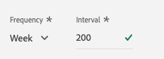

# 12.4 BigQuery에서 Adobe Experience Platform으로 데이터 로드

## 목표

- BigQuery 데이터를 XDM 스키마에 매핑
- Adobe Experience Platform에 BigQuery 데이터 로드
- BigQuery 소스 커넥터 UI에 익숙해지십시오

## 시작하기 전에

연습 12.3 후 Adobe Experience Platform에서 이 페이지를 열어야 합니다.

**열려 있는 경우 연습 12.4.1을 계속 진행합니다.**

**열려 있지 않으면 다음 위치로 이동하십시오. [Adobe Experience Platform](https://experience.adobe.com/platform/home).**

왼쪽 메뉴에서 소스로 이동합니다. 그러면 **소스** 홈 페이지. 에서 **소스** 메뉴에서 **데이터베이스**.

을(를) 선택합니다 **Google BigQuery** 소스 커넥터 를 클릭하고 **+ 구성**.

그러면 Google BigQuery 계정 선택 화면이 표시됩니다.

계정을 선택하고 을(를) 클릭합니다. **다음**.

그러면 **데이터 추가** 보기.

## 12.4.1 BigQuery 테이블 선택

에서 **데이터 추가** BigQuery 데이터 집합을 봅니다.

이제 BigQuery에서 Google Analytics 데이터의 샘플 데이터 미리 보기를 볼 수 있습니다.

**다음**&#x200B;을 클릭합니다.

## 12.4.2 XDM 매핑

이제 다음을 확인할 수 있습니다.

이제 새 데이터 세트를 만들거나 기존 데이터 세트를 선택하여 Google Analytics 데이터를 으로 로드해야 합니다. 이 연습에서는 데이터 집합 및 스키마가 이미 만들어졌습니다. 새 스키마나 데이터 세트를 만들 필요가 없습니다.

선택 **기존 데이터 세트**. 드롭다운 메뉴를 열어 데이터 세트를 선택합니다. 이름이 지정된 데이터 세트를 검색합니다. `Demo System - Event Dataset for BigQuery (Global v1.1)` 그리고 선택합니다. **다음**&#x200B;을 클릭합니다.

아래로 스크롤합니다. 이제 모든 **소스 필드** Google Analytics/BigQuery에서 XDM으로 **Target 필드**, 필드별 필드

이 연습에서는 아래 매핑 테이블을 사용하십시오.

| 소스 필드 | Target 필드 |
| ----------------- |-------------| 
| **_ID** | _ID |
| **_ID** | 채널._ID |
| timeStamp | timestamp |
| GA_ID | ``--aepTenantId--``.identification.core.gaid |
| customerID | ``--aepTenantId--``.identification.core.충성도Id |
| 페이지 | web.webPageDetails.name |
| 디바이스 | device.type |
| 브라우저 | environment.browserDetails.vendor |
| 마케팅 채널 | marketing.trackingCode |
| 트래픽 소스 | channel.typeAtSource |
| 트래픽 미디어 | channel.mediaType |
| TransactionID | commerce.order.payments.transactionID |
| Ecommerce_Action_Type | eventType |
| 페이지 보기 수 | web.webPageDetails.pageViews.value |
| Unique_Purchases | commerce.purchases.value |
| Product_Detail_Views | commerce.productViews.value |
| Adds_To_Cart | commerce.productListAdds.value |
| Product_Removes_From_Cart | commerce.productListRemovals.value |
| Product_Checkout | commerce.checkouts.value |

위의 매핑을 Adobe Experience Platform UI에 복사하여 붙여넣은 후 오인이나 선행/후행 공백으로 인해 오류가 표시되지 않는지 확인하십시오.

이제 **매핑** 다음과 같습니다.

소스 필드 **GA_ID** 및 **customerID** 는 이 XDM 스키마의 식별자에 매핑됩니다. 이렇게 하면 충성도 또는 콜 센터 데이터와 같은 다른 데이터 세트로 Google Analytics 데이터(웹/앱 동작 데이터)를 보강할 수 있습니다.

**다음**&#x200B;을 클릭합니다.

## 12.4.3 연결 및 데이터 수집 예약

이제 다음을 확인할 수 있습니다. **예약** 탭:

에서 **예약** 탭에서 이 데이터 수집 프로세스의 빈도를 정의할 수 있습니다 **매핑** 및 데이터를 포함합니다.

새로 고쳐지지 않는 Google BigQuery에서 데모 데이터를 사용하고 있으므로 이 연습에서 일정을 설정할 필요가 없습니다. 항목을 선택해야 하며, 너무 많은 불필요한 데이터 수집 프로세스를 사용하지 않으려면 다음과 같이 빈도를 설정해야 합니다.

- 빈도: **주**
- 간격: **200년**

**중요 사항**: 활성화 **채우기** 스위치.

마지막으로 다음을 정의해야 합니다 **델타** 필드.

다음 **델타** 필드는 연결을 예약하고 BigQuery 데이터 세트에 들어 있는 새 행만 업로드하는 데 사용됩니다. 델타 필드는 일반적으로 타임스탬프 열입니다. 따라서 나중에 예약된 데이터 수집을 위해 최근 타임스탬프가 새로 추가된 행만 수집됩니다.

선택 **timeStamp** 델타 필드로 사용할 수 있습니다.

이제 이걸 가지고 있습니다.

**다음**&#x200B;을 클릭합니다.

## 12.4.4 연결 검토 및 시작

에서 **데이터 집합 흐름 세부 정보** 보기. 연결에 이름을 지정해야 합니다. 그러면 나중에 찾을 수 있습니다.

다음 명명 규칙을 사용하십시오.

| 필드 | 이름 지정 | 예 |
| ----------------- |-------------| -------------|
| 데이터 집합 흐름 이름 | DataFlow - ldap - BigQuery 웹 사이트 상호 작용 | DataFlow - Vangeluw - BigQuery 웹 사이트 상호 작용 |
| 설명 | DataFlow - ldap - BigQuery 웹 사이트 상호 작용 | DataFlow - Vangeluw - BigQuery 웹 사이트 상호 작용 |

**다음**&#x200B;을 클릭합니다.

이제 연결에 대한 자세한 개요를 볼 수 있습니다. XDM 매핑과 같이 나중에 일부 설정을 변경할 수 없으므로 계속하기 전에 모든 설정이 올바른지 확인하십시오.

**마침을 클릭합니다**.

연결을 설정하는 데 시간이 걸릴 수 있으므로 다음 사항이 표시되더라도 걱정하지 마십시오.

연결이 만들어지면 다음과 같이 표시됩니다.

이제 Customer Journey Analytics을 사용하여 Google Analytics 데이터 위에 강력한 시각화를 만드는 다음 연습을 계속할 준비가 되었습니다.

다음 단계: [12.5 Customer Journey Analytics을 사용하여 Google Analytics 데이터 분석](./ex5.md)

[모듈 12로 돌아가기](./customer-journey-analytics-bigquery-gcp.md)

[모든 모듈로 돌아가기](./../../overview.md)
