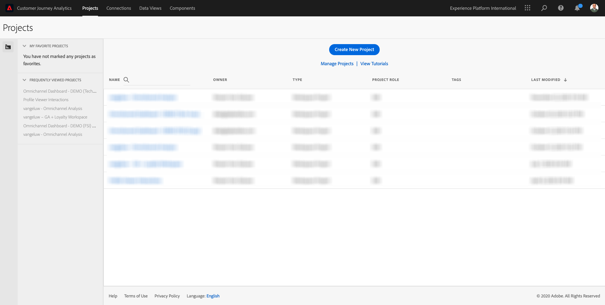
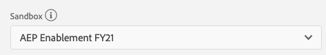
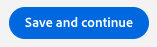
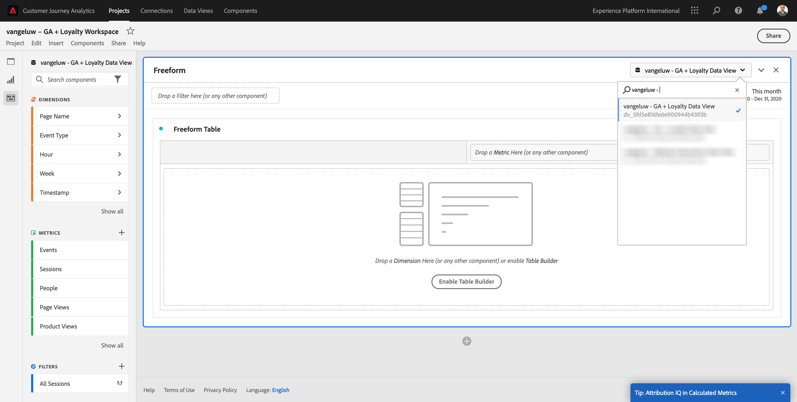
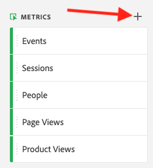
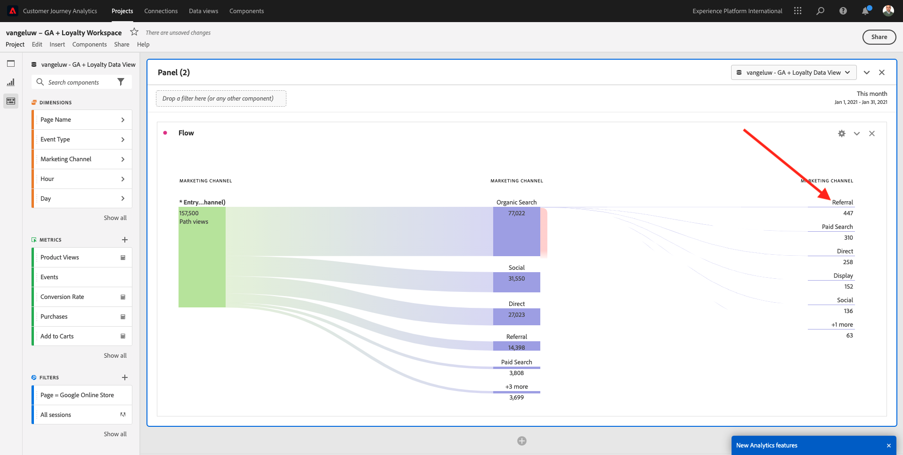

# 12.5 Customer Journey Analytics을 사용하여 Google Analytics 데이터 분석

## 목표

- BigQuery 데이터 세트를 Customer Journey Analytics(CJA)로 연결합니다
- 충성도 데이터를 사용하여 Google Analytics을 연결하고 결합합니다.
- CJA UI에 익숙해지십시오

## 12.5.1 연결 만들기

이동 [analytics.adobe.com](https://analytics.adobe.com) Customer Journey Analytics에 액세스합니다.

Customer Journey Analytics 홈페이지에서 **연결**.

여기서는 CJA와 플랫폼 간에 서로 다른 모든 연결을 볼 수 있습니다. 이러한 연결은 Adobe Analytics의 보고서 세트와 동일한 목표를 갖습니다. 그러나 이 자료의 수집은 전혀 다르다. 모든 데이터는 Adobe Experience Platform 데이터 세트에서 가져옵니다.

**새 연결 만들기**&#x200B;를 클릭합니다.

그러면 **연결 만들기** UI.

먼저 사용할 올바른 샌드박스를 선택해야 합니다. 샌드박스 메뉴에서 다음 샌드박스를 선택합니다 `--aepSandboxId--`. 이 예제에서 사용할 샌드박스는 다음과 같습니다 **AEP Enablement FY21**.

샌드박스를 선택하면 사용 가능한 데이터 세트가 업데이트됩니다.

왼쪽 메뉴에서 사용 가능한 모든 Adobe Experience Platform 데이터 세트를 볼 수 있습니다. 데이터 집합 검색 `Demo System - Event Dataset for BigQuery (Global v1.1)`. 클릭 **+** 데이터 세트를 이 연결에 추가하려면

추가한 후에는 연결 내에 데이터 세트가 표시됩니다.

이제 **개인 ID**. 다음 사항을 확인하십시오 **충성도Id** 을 개인 ID로 선택합니다.

이제 다른 Adobe Experience Platform 데이터 세트와 함께 Google Analytics 웹 사이트 상호 작용 데이터를 보강합니다.

데이터 집합 검색 `Demo System - Profile Dataset for Loyalty (Global v1.1)` 데이터 세트를 설정하고 이 연결에 추가합니다.

그러면 다음 내용이 표시됩니다.

두 데이터 세트를 모두 병합하려면 **개인 ID** 에는 동일한 유형의 ID가 포함되어 있습니다. 데이터 세트 `Demo System - Profile Dataset for Loyalty (Global v1.1)` 사용 **충성도Id** 와 동일한 유형의 ID를 포함하는 개인 ID로서, `Demo System - Event Dataset for BigQuery (Global v1.1)`- 도 사용합니다 **충성도Id** 개인 ID로 사용.

**다음**&#x200B;을 클릭합니다.

그러면 다음 내용이 표시됩니다.

여기에서 연결에 이름을 지정해야 합니다.

다음 명명 규칙을 사용하십시오. `ldap - GA + Loyalty Data Connection`.

예: `vangeluw - GA + Loyalty Data Connection`

완료하기 전에 를 활성화하십시오 **오늘부터 이 연결에 있는 모든 데이터 세트에 대한 새 데이터를 모두 자동으로 가져옵니다.** 아래와 같이 변경하는 것을 의미합니다.

이렇게 하면 60분마다 Adobe Experience Platform에서 CJA로 데이터 흐름이 시작되지만 데이터가 많으면 24시간이 걸릴 수 있습니다.

내역 데이터를 입력해야 하므로, 다음 식에 대한 확인란을 선택하십시오 **기존 데이터 모두 가져오기** 을(를) 선택합니다. **100만 미만** 아래에 **일일 평균 이벤트 수**.

을(를) 만든 후 **연결** CJA에서 데이터를 사용할 수 있으려면 몇 시간이 걸릴 수 있습니다.

클릭 **저장** 다음 연습으로 가보세요.

그러면 사용 가능한 연결 목록에 연결이 표시됩니다.

## 12.5.2 데이터 보기 만들기

연결이 완료되면 이제 시각화에 영향을 주는 것으로 진행할 수 있습니다. Adobe Analytics과 CJA의 차이점은 시각화 전에 데이터를 정리하고 준비하려면 CJA에 데이터 보기가 필요하다는 것입니다.

데이터 보기는 컨텍스트 인식 방문 정의, 필터링 및 구성 요소를 호출하는 방법을 정의하는 Adobe Analytics의 가상 보고서 세트 개념과 유사합니다.

연결당 최소 하나의 데이터 보기가 필요합니다. 그러나 일부 사용 사례의 경우 다른 팀에 다른 통찰력을 제공한다는 목표를 가지고 동일한 연결에 대해 여러 데이터 보기를 갖는 것이 좋습니다.

회사가 데이터 중심적이 되도록 하려면 각 팀에서 데이터를 보는 방식을 조정해야 합니다. 예:

- UX 디자인 팀을 위한 UX 지표만
- Digital Analytics 팀이 1개의 언어만 사용할 수 있도록 Google Analytics에 대해 KPI 및 지표와 동일한 이름을 Customer Journey Analytics에 사용합니다.
- 데이터 보기는 1개 시장에만 대한 인스턴스 데이터, 1개 브랜드 또는 모바일 장치에 대해서만 표시하도록 필터링됩니다.

설정 **연결** 화면에서 방금 만든 연결 앞에 있는 확인란을 선택합니다.

이제 **데이터 보기 만들기**.

으로 리디렉션됩니다. **데이터 보기 만들기** 워크플로우.

이제 데이터 보기에 대한 기본 정의를 구성할 수 있습니다. 시간대, 세션 시간 초과 또는 데이터 보기 필터링과 같은 항목(세그먼테이션 부분은 Adobe Analytics의 가상 보고서 세트와 유사).

다음 **연결** 이전 연습에서 생성한 이 이미 선택되어 있습니다. 연결 이름이 `ldap - GA + Loyalty Data Connection`.

그런 다음 이 명명 규칙에 따라 데이터 보기에 이름을 지정합니다. `ldap - GA + Loyalty Data View`.

설명에 동일한 값을 입력합니다. `ldap - GA + Loyalty Data View`.

분석 또는 시각화를 수행하기 전에 모든 필드, 차원 및 지표 및 속성 설정이 있는 데이터 보기를 만들어야 합니다.

| 필드 | 이름 지정 규칙 | 예 |
| ----------------- |-------------|-------------|  
| 이름 연결 | ldap - GA + 충성도 데이터 보기 | vangeluw - GA + 충성도 데이터 보기 |
| 설명 | ldap - GA + 충성도 데이터 보기 | vangeluw - GA + 충성도 데이터 보기 |

클릭 **저장 후 계속**.

이제 데이터 보기에 구성 요소를 추가할 수 있습니다. 알 수 있듯이 일부 지표와 차원이 자동으로 추가됩니다.

데이터 보기에 다음 구성 요소를 추가합니다.

| 구성 요소 이름 | 구성 요소 유형 | 구성 요소 경로 |
| -----------------|-----------------|-----------------|
| 않습니다 | 차원 | _experienceplatform.로열티Details.level |
| 포인트 | 지표 | _experienceplatform.충성도Details.points |
| commerce.checkouts.value | 지표 | commerce.checkouts.value |
| commerce.productListRemovals.value | 지표 | commerce.productListRemovals.value |
| commerce.productListAdds | 지표 | commerce.productListAdds |
| commerce.productViews.value | 지표 | commerce.productViews.value |
| commerce.purchases.value | 지표 | commerce.purchases.value |
| web.webPageDetails.pageViews | 지표 | web.webPageDetails.pageViews |
| 거래 ID | 차원 | commerce.order.payments.transactionID |
| channel.mediaType | 차원 | channel.mediaType |
| channel.typeAtSource | 차원 | channel.typeAtSource |
| 추적 코드 | 차원 | marketing.trackingCode |
| gaid | 차원 | _experienceplatform.identification.core.gaid |
| web.webPageDetails.name | 차원 | web.webPageDetails.name |
| 이벤트 유형 | 차원 | eventType |
| 공급업체 | 차원 | environment.browserDetails.vendor |
| 식별자 | 차원 | _ID |
| 타임스탬프 | 차원 | timestamp |
| 유형 | 차원 | device.type |
| 충성도Id | 차원 | _experienceplatform.identification.core.로열티Id |

그러면 다음 항목이 제공됩니다.

그런 다음 분석을 빌드할 때 쉽게 사용할 수 있도록 위의 일부 지표 및 차원의 친숙한 이름을 변경해야 합니다. 이렇게 하려면 지표나 차원을 선택하고 **이름** 아래 이미지에 표시된 필드.

| 구성 요소 원래 이름 | 표시 이름 |
| -----------------|-----------------|
| 않습니다 | 충성도 수준 |
| 포인트 | 충성도 포인트 |
| commerce.checkouts.value | 체크아웃 |
| commerce.productListRemovals.value | 장바구니 제거 |
| commerce.productListAdds | 장바구니 추가 |
| commerce.productViews.value | 제품 보기 |
| commerce.purchases.value | 구매 |
| web.webPageDetails.pageViews | 페이지 보기 횟수 |
| channel.mediaType | 트래픽 미디어 |
| channel.typeAtSource | 트래픽 소스 |
| 추적 코드 | 마케팅 채널 |
| gaid | Google Analytics ID |
| 이름 | 페이지 제목 |
| 공급업체 | 브라우저 |
| 유형 | 장치 유형 |
| 충성도Id | 충성도 ID |

그러면 다음과 같은 항목이 제공됩니다.

그런 다음, **속성 설정**.

다음 사항을 변경하십시오 **속성 설정** 아래 구성 요소에 대해서는 다음을 수행하십시오.

| 구성 요소 |
| -----------------|
| 트래픽 소스 |
| 마케팅 채널 |
| 브라우저 |
| 트래픽 미디어 |
| 장치 유형 |
| Google Analytics ID |
| 충성도 ID |
| 충성도 수준 |
| 충성도 포인트 |

이렇게 하려면 구성 요소를 선택하고 **사용자 지정 속성 모델 사용** 그리고 **모델** to **마지막 터치**, 및 **만료** to **개인(보고 기간)**. 위에 언급된 모든 구성 요소에 대해 이 단계를 반복합니다.

위에 언급된 모든 구성 요소에 대한 속성 설정을 변경한 후에는 다음 보기가 있어야 합니다.

이제 데이터 보기가 구성되었습니다. **저장**&#x200B;을 클릭합니다.

이제 Adobe Analytics Analysis Workspace 내에서 Google Analytics 데이터를 분석할 준비가 되었습니다. 다음 연습으로 넘어갑시다.

## 12.5.3 프로젝트 만들기

Customer Journey Analytics에서 **프로젝트**.

그러면 다음 내용이 표시됩니다.

을 클릭하여 프로젝트 만들기 **새 프로젝트 만들기**.

이제 빈 프로젝트가 있습니다.

먼저 프로젝트를 저장하고 이름을 지정합니다. 다음 명령을 사용하여 저장할 수 있습니다.

| OS | 짧은 컷 |
| ----------------- |-------------| 
| Windows | Control + S |
| Mac | Command+S |

다음 팝업이 표시됩니다.

다음 명명 규칙을 사용하십시오.

| 이름 | 설명 |
| ----------------- |-------------| 
| ldap - GA + 충성도 작업 공간 | ldap - GA + 충성도 작업 공간 |

다음을 클릭합니다. **프로젝트 저장**.

그런 다음 화면의 오른쪽 상단 모서리에서 올바른 데이터 보기를 선택해야 합니다. 이전 연습에서 만든 데이터 보기이며 이름 지정 규칙을 사용합니다 `ldap - GA + Loyalty Data View`. 이 예에서 선택할 데이터 보기는 다음과 같습니다 `ldap - GA + Loyalty Data View`.

### 12.5.3.1 자유 형식 테이블

자유 형식 테이블은 Excel 내의 피벗 테이블로 더 이상 작동하지 않습니다. 왼쪽 막대에서 항목을 선택하고 자유 형식 보고서로 끌어다 놓으면 테이블 보고서가 표시됩니다.

자유 형식 테이블은 거의 무한합니다. 모든 작업을 수행할 수 있습니다(거의). 이 경우 Google Analytics과 비교하면 매우 많은 가치를 가져옵니다(이 도구에는 분석 제한 사항이 있으므로). Google Analytics 데이터를 다른 분석 도구로 로드해야 하는 이유 중 하나입니다.

SQL, BigQuery 및 일부 시간을 사용하여 Google Analytics UI 또는 Google Data Studio 내에서 수행할 수 없는 간단한 질문에 답변해야 하는 두 가지 예를 살펴보겠습니다.

- 마케팅 채널로 분할된 Safari 브라우저에서 체크아웃에 도착하는 사람은 몇 명입니까? 체크아웃 지표가 Safari 브라우저로 필터링되고 있는지 확인하십시오. 변수 Browser = Safari를 체크아웃 열 맨 위에 끌어서 놓습니다.

- 분석가로서, 소셜 마케팅 채널에 전환율이 낮은 것이 보입니다. 마지막 터치 속성을 기본값으로 사용하고 있지만 첫 번째 터치는 어떻습니까? 마우스로 지표를 가리키면 지표 설정이 표시됩니다. 원하는 속성 모델을 선택할 수 있습니다. GA(Data Studio가 아님)에서 속성을 독립형 활동으로 수행할 수 있지만, 동일한 테이블 내에서 속성 분석과 관련이 없는 다른 지표나 차원을 가질 수는 없습니다.

CJA에서 Analysis Workspace을 사용하여 이 질문에 답변하고 더 자세히 살펴보겠습니다.

먼저 올바른 날짜 범위(**지난 53주 전체**)을 클릭하여 제품에서 사용할 수 있습니다.

그런 다음 **적용** 날짜 범위를 적용하려면 다음 연습을 위해 이 단계를 기억하십시오.

>[!NOTE]
>
>방금 **데이터 연결** 및 **데이터 보기** 몇 시간 정도 기다리셔야 할 것 같습니다 CJA에서는 대량의 데이터 레코드가 있는 경우 내역 데이터를 채우는 시간이 필요합니다.

몇 가지 차원과 지표를 드래그하여 마케팅 채널을 분석하겠습니다. 먼저 차원을 사용합니다 **마케팅 채널** 캔버스에 끌어다 놓습니다 **자유 형식 테이블**. (클릭 **모두 표시** 지표 메뉴에 바로 지표가 표시되지 않는 경우)

그러면 다음 내용이 표시됩니다.

다음으로, 자유 형식 테이블에 지표를 추가해야 합니다. 다음 지표를 추가해야 합니다. **사람**, **세션**, **제품 보기**, **체크아웃**, **구매**, **전환율** (계산된 지표).

이를 수행하려면 먼저 계산된 지표를 만들어야 합니다 **전환율**. 이렇게 하려면 **+** 지표 옆에 있는 아이콘:

계산된 지표의 이름으로 **전환율**. 그런 다음 지표를 드래그합니다 **구매** 및 **세션** 캔버스에 설정 **형식** to **Percent** 및 **소수점 이하 자리 수** to **2개**. 마지막으로 **저장**.

다음으로, **자유 형식 테이블**&#x200B;을(를) 하나씩 드래그하여 놓습니다 **자유 형식 테이블**. 아래 예를 참조하십시오.

이런 탁자가 나올 겁니다.

위에서 언급했듯이 **자유 형식 테이블** 심층 분석 작업에 필요한 자유를 제공합니다. 예를 들어 다른 지표를 선택하여 테이블 내에서 특정 지표를 분류할 수 있습니다.

예를 들어, 차원으로 이동하여 을 검색하고 선택합니다 **브라우저** 변수를 채우는 방법을 설명합니다.

그런 다음 이 Dimension에 사용할 수 있는 값에 대한 개요를 볼 수 있습니다.

Dimension 선택 **Safari** 예를 들어 지표 위에 끌어다 놓습니다 **체크아웃**. 그러면 다음 내용이 표시됩니다.

이렇게 하면, 여러분은 여러분이 가지고 있는 잠재적인 질문에 단지 대답했습니다. 마케팅 채널로 분할된 Safari를 사용하여 체크아웃 페이지에 도착하는 사람 수는 몇 명입니까?

이제 속성 질문에 답하겠습니다.

를 찾습니다. **구매** 지표에 있는 지표.

마우스를 지표 및 지표 위로 가져갑니다. **설정** 아이콘이 표시됩니다. 클릭합니다.

상황별 메뉴가 나타납니다. 에 대한 확인란을 선택합니다. **비기본 속성 모델**.

팝업에서 속성 모델 및 전환 확인 기간을 쉽게 변경할 수 있습니다(SQL을 사용하여 수행하기에 매우 복잡함).

선택 **첫 번째 터치** 를 기여도 분석 모델로 사용하십시오.

선택 **개인** 을 반환합니다.

이제 **적용**.

이제 해당 특정 지표에 대한 속성 모델이 첫 번째 터치임을 확인할 수 있습니다.

변수 유형, 세그먼트, 차원 또는 날짜 범위의 제한 없이 원하는 만큼 분류를 수행할 수 있습니다.

보다 특별한 것은 Adobe Experience Platform의 모든 데이터 세트에 결합하여 Google Analytics의 디지털 행동 데이터를 보강하는 기능입니다. 예를 들어 오프라인, 콜 센터, 충성도 또는 CRM 데이터가 있습니다.

이 기능을 보여주기 위해 오프라인 데이터와 온라인 데이터가 결합된 첫 번째 분류를 구성하겠습니다. 차원 선택 **충성도 수준** 원하는 위치에 드래그하여 놓습니다 **마케팅 채널**, 예 **유기 검색**:

다음으로, 어떤 것을 분석합시다 **장치 유형** 는 **유기 검색** 사용 **충성도 수준** 그건 **청동**. Dimension 가져오기 **장치 유형** 끌어서 놓습니다 **청동**. 그러면 다음 내용이 표시됩니다.

첫 번째 분류에서 충성도 수준이 사용됨을 확인할 수 있습니다. 이 차원은 BigQuery 커넥터에 사용한 스키마와 다른 데이터 세트에서 가져옵니다. 개인 ID **충성도ID** (데모 시스템 - BigQuery용 이벤트 스키마(전역 v1.1) 및 **충성도ID** (데모 시스템 - 충성도를 위한 프로필 스키마(전역 v1.1)가 서로 일치합니다. 이를 위해 Google Analytics의 경험 이벤트와 충성도 스키마의 프로필 데이터를 결합할 수 있습니다.

세그먼트나 특정 날짜 범위가 있는 행을 계속 분할하여(특정 TV 캠페인을 반영할 수 있음) Customer Journey Analytics에 대한 질문을 하고 가기에 대한 답변을 얻을 수 있습니다.

SQL과 타사 시각화 도구를 사용하여 동일한 결과를 도출하는 것은 매우 어렵습니다. 특히 질문을 하고 즉석에서 답을 얻으려고 할 때. Customer Journey Analytics은 이러한 과제를 해결하지 않으며 데이터 분석가가 데이터를 유연하게 실시간으로 쿼리할 수 있습니다.

## 12.5.3.2 단계 또는 폴아웃 분석

목표는 고객 여정의 주요 단계를 이해하는 좋은 메커니즘입니다. 이러한 단계는 오프라인 상호 작용(예: 콜 센터)에서 가져온 다음, 동일한 단계의 디지털 터치 포인트와 결합할 수도 있습니다.

Customer Journey Analytics을 사용하면 그 이상의 작업을 수행할 수 있습니다. 모듈 13을 기억하면 마우스 오른쪽 버튼을 클릭하고 다음과 같은 작업을 수행할 수 있습니다.

- 폴아웃 단계 후 사용자의 진행 상황 분석
- 단계의 모든 지점에서 세그먼트를 만듭니다
- 선 그래프 시각화의 모든 단계에서 트렌드 를 참조하십시오

다른 작업을 살펴보겠습니다. 이번 달 고객 여정 단계 은 이전 달과 어떻게 일치합니까? 모바일과 데스크탑은 어떻게 됩니까?

아래에 두 개의 패널을 만듭니다.

- 단계 분석(1월)
- 단계 분석(2월)

장치 유형별로 분할된 서로 다른 기간(1월 및 2월)에 대해 단계를 비교하는 것을 볼 수 있습니다.

이러한 유형의 분석은 Google Analytics UI 내에서 불가능하거나 매우 제한적입니다. 따라서 CJA는 Google Analytics이 캡처하는 데이터에 다시 많은 값을 추가합니다.

첫 번째 폴아웃 시각화를 만들려면 새 패널로 시작하려면 현재 패널을 닫으십시오.

패널 오른쪽을 보고 화살표를 클릭하여 닫습니다.

다음을 클릭합니다. **+** 새 패널을 만들려면

이제 을(를) 선택합니다 **폴아웃** 시각화.

분석가로서 주요 전자 상거래 단계 관련 사항을 이해하고 싶다고 가정해 보십시오. 홈 > 내부 검색 > 제품 세부 사항 > 체크아웃 > 구매.

먼저 단계에 몇 가지 새로운 단계를 추가하겠습니다. 이렇게 하려면 **페이지 이름** 차원.

방문한 모든 사용 가능한 페이지가 표시됩니다.

드래그 앤 드롭 **홈** 를 클릭합니다.

두 번째 단계에서는 **검색 결과 저장**

이제 몇 가지 전자 상거래 작업을 추가해야 합니다. Dimension에서 Dimension을 검색합니다 **이벤트 유형** 차원. 을(를) 클릭하여 차원을 엽니다.

선택 **Product_Detail_Views** 다음 단계로 끌어서 놓습니다.

선택 **Product_Checkout** 다음 단계로 끌어서 놓습니다.

폴아웃 시각화의 크기를 조정합니다.

이제 폴아웃 시각화를 사용할 수 있습니다.

인사이트를 분석하고 문서화하기 시작하려면 항상 을(를) 통해 **텍스트** 시각화. 을(를) 추가하려면 **텍스트** 시각화를 클릭하고 **그래프** 아이콘을 클릭하여 사용 가능한 모든 시각화를 확인합니다. 그런 다음 **텍스트** 시각화를 캔버스에 업로드합니다. 아래 이미지와 비슷하게 보이도록 크기를 조정하고 이동합니다.

대시보드에 맞게 크기를 조정합니다.

폴아웃 시각화 를 사용하면 분류도 사용할 수 있습니다. 를 사용하십시오 **장치 유형** 차원을 열고 값 일부를 시각화에 하나씩 드래그하여 놓습니다.

그러면 더 고급 시각화가 표시됩니다.

Customer Journey Analytics을 사용하면 그 이상의 작업을 수행할 수 있습니다. 폴아웃의 아무 곳이나 마우스 오른쪽 단추로 클릭하여 다음을 수행할 수 있습니다.

- 폴아웃 단계에서 사용자가 이동하는 위치를 분석합니다
- 단계의 모든 지점에서 세그먼트를 만듭니다
- 라인 시각화에서 모든 단계의 트렌드를 표시합니다
- 시각적인 방법으로 모든 단계를 다른 기간과 비교합니다.

예를 들어 폴아웃 단계를 마우스 오른쪽 단추로 클릭하여 이러한 분석 옵션 중 일부를 확인합니다.

## 12.5.3.3 흐름 분석 및 시각화

Google Analytics을 사용하여 고급 흐름 분석을 수행하려면 SQL을 사용하여 데이터를 추출한 다음 시각화 부분에 대한 타사 솔루션을 사용해야 합니다. Customer Journey Analytics이 도움이 됩니다.

이 단계에서는 흐름 분석을 구성하여 이 질문에 답합니다. 특정 랜딩 페이지 앞에 주 기여 채널은 무엇입니까?  분석가로서 두 개의 드래그 앤 드롭 및 한 번의 클릭으로 두 개의 마케팅 채널의 마지막 터치로 사용자의 랜딩 페이지 흐름을 확인할 수 있습니다.

Customer Journey Analytics이 답변하는 데 도움이 되는 기타 질문:

- 특정 랜딩 페이지 앞에 있는 채널의 주 결합은 무엇입니까?
- 사용자가 Product_Checkout에 도착하면 세션이 종료되는 이유는 무엇입니까? 이전 단계는 어디입니까?

이 질문에 대한 답변을 위해 빈 패널로 다시 시작하겠습니다. 현재 패널을 닫고 를 클릭합니다. **+**.

이제 을(를) 선택합니다 **흐름** 시각화.

이제 다중 경로 마케팅 채널 흐름 분석을 설정하겠습니다. 을(를) 끌어다 놓습니다 **마케팅 채널** 차원 **시작 Dimension** 영역.

이제 첫 번째 시작 경로를 볼 수 있습니다.

첫 번째 경로를 클릭하여 드릴다운합니다.

이제 다음 경로(마케팅 채널)를 볼 수 있습니다.

세 번째 드릴다운 합시다. 새 경로 내의 첫 번째 옵션을 클릭합니다. **참조**.

이제 다음과 같은 시각화가 표시됩니다.

복잡한 일을 합시다. 두 개의 마케팅 경로 후에 랜딩 페이지가 어떤 페이지인지 분석한다고 가정해 보십시오. 이렇게 하려면 보조 차원을 사용하여 마지막 경로를 변경할 수 있습니다. 를 찾습니다. **페이지 이름** 다음과 같이 차원을 끌어서 놓습니다.

이제 다음을 확인할 수 있습니다.

다른 흐름 분석을 해보겠습니다. 이번에는 특정 종료 지점 이후에 발생한 사항을 분석할 것입니다. 다른 Analytics 솔루션에서는 SQL/ETL을 사용해야 하며, 타사 시각화 도구를 사용하여 동일한 작업을 수행할 수 있습니다.

새 항목 가져오기 **플로우 시각화** 를 클릭합니다.

그러면 다음 항목이 제공됩니다.

Dimension 찾기 **이벤트 유형** 끌어서 놓습니다 **종료 차원** 영역.

이제 어떤 것을 볼 수 있습니다 **이벤트 유형**-경로 때문에 고객이 출구로 이동했습니다.

체크아웃 작업을 종료하기 전에 발생한 사항을 조사하겠습니다. 을(를) 클릭합니다. **Product_Checkout** 경로:

통찰력 없는 일부 데이터가 있는 새 작업 경로가 표시됩니다.

더 분석하자! Dimension 검색 **페이지 이름** 새로 생성된 경로로 끌어서 놓습니다.

이제 고급 흐름 분석을 수 분 내에 완료했습니다. 다른 경로를 클릭하여 출원에서 이전 단계로 연결하는 방법을 확인할 수 있습니다.

이제 디지털 뿐만 아니라 오프라인 터치 포인트에서 고객 행동의 경로를 분석하고 분석할 수 있는 강력한 키트가 제공됩니다.

변경 사항을 저장하는 것을 잊지 마십시오!

## 12.5.4 프로젝트 공유

>[!IMPORTANT]
>
>아래 컨텐츠는 FYI로서 제작되었습니다. **NOT** 프로젝트를 다른 사람과 공유해야 합니다.

FYI - 이 프로젝트를 동료와 공유하여 협업하거나 함께 비즈니스 질문을 분석할 수 있습니다.

다음 단계: [요약 및 이점](./summary.md)

[모듈 12로 돌아가기](./customer-journey-analytics-bigquery-gcp.md)

[모든 모듈로 돌아가기](./../../overview.md)
