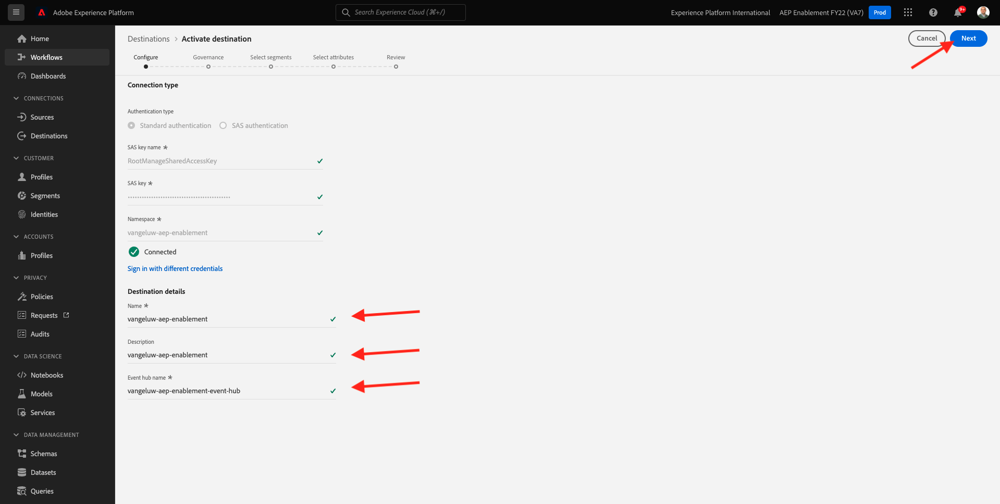

# 13.2 Adobe Experience Platform에서 Azure 이벤트 허브 대상 구성

## 13.2.1 필수 Azure 연결 매개 변수 식별

Adobe Experience Platform에서 이벤트 허브 대상을 정의하려면

- 이벤트 허브 네임스페이스
- 이벤트 허브
- Azure SAS 키 이름
- Azure SAS 키

이벤트 허브 및 EventHub 네임스페이스가 이전 연습에서 정의되었습니다. [연습 1 - Azure에서 이벤트 허브 설정](./ex1.md)

### 이벤트 허브 네임스페이스

Azure 포털에서 위의 정보를 조회하려면 다음 위치로 이동합니다. [https://portal.azure.com/#home](https://portal.azure.com/#home). 올바른 Azure 계정을 사용하고 있는지 확인하십시오.

선택 **모든 리소스** Azure 포털에서:

### 이벤트 허브

리소스 유형이 있는 리소스 찾기 **이벤트 허브 네임스페이스**&#x200B;를 지정하는 경우 이전 연습에서 사용된 이름 지정 규칙을 따르면 이벤트 허브 네임스페이스가 됩니다 `--demoProfileLdap---aep-enablement`. 주의하세요, 다음 연습에서는 필요할 거예요.

이벤트 허브 네임스페이스 이름을 클릭하여 세부 정보를 가져옵니다.

선택 **이벤트 허브** 이벤트 허브 네임스페이스에 정의된 이벤트 허브 목록을 가져오려면 이전 연습에서 사용된 이름 지정 규칙을 따를 경우 이름이 인 이벤트 허브를 찾습니다. `--demoProfileLdap---aep-enablement-event-hub`. 주의하세요, 다음 연습에서는 필요할 거예요.

### SAS 키 이름

선택 **공유 액세스 정책** 에 대해 **이벤트 허브 네임스페이스**

공유 액세스 정책 목록이 표시됩니다. 우리가 찾고 있는 SAS 키는 다음과 같습니다 **RootManageSharedAccessKey**. SAS 키 이름입니다. 적어

### SAS 키 값

을(를) 클릭합니다. **RootManageSharedAccessKey** SAS 키 값을 가져올 수 있습니다. 그리고 **클립보드에 복사** 아이콘을 클릭하여 복사합니다. **기본 키**:

### 대상 값 요약

이 시점에서 Adobe Experience Platform 실시간 CDP에서 Azure 이벤트 허브 대상을 정의하는 데 필요한 모든 값을 식별해야 합니다.

| 대상 속성 이름 | 대상 속성 값 | 값 예 |
|---|---|---|
| sasKeyName | SAS 키 이름 | RootManageSharedAccessKey |
| sasKey | SAS 키 값 | srREx9ShJG1Rv7f/... |
| namespace | 이벤트 허브 네임스페이스 | `--demoProfileLdap---aep-enablement` |
| eventHubName | 이벤트 허브 | `--demoProfileLdap---aep-enablement-event-hub` |

## Adobe Experience Platform에서 Azure 이벤트 허브 대상 만들기 13.2.2

다음 URL로 이동하여 Adobe Experience Platform에 로그인합니다. [https://experience.adobe.com/platform](https://experience.adobe.com/platform).

로그인하면 Adobe Experience Platform 홈 페이지가 표시됩니다.

계속하기 전에 **샌드박스**. 선택할 샌드박스의 이름은 다음과 같습니다 ``--aepSandboxId--``. 이 작업은 텍스트를 클릭하여 수행할 수 있습니다 **[!UICONTROL 프로덕션 제품]** 화면 상단에 있는 파란색 줄에 표시됩니다. 적절한 샌드박스를 선택하면 화면 변경 사항이 표시되고 이제 전용 샌드박스에 있습니다.

이동 **대상**, 그런 다음 **카탈로그**.

선택 **클라우드 스토리지** 그리고 **Azure 이벤트 허브** 을(를) 클릭합니다. **설정** 또는 **구성**:

이전 연습에서 수집한 대상 값을 입력합니다. 다음을 클릭합니다. **대상에 연결**.

자격 증명이 올바르면 확인 메시지가 표시됩니다. **연결됨**.

이제 이름과 설명을 형식으로 입력해야 합니다 `--demoProfileLdap---aep-enablement`. 을(를) 입력합니다. **eventHubName** (이전 연습 참조: `--demoProfileLdap---aep-enablement-event-hub`) 를 클릭하고 를 클릭합니다. **다음**.

클릭 **저장 및 종료**.

이제 대상이 생성되어 Adobe Experience Platform에서 사용할 수 있습니다.

다음 단계: [13.3 세그먼트 만들기](./ex3.md)

[모듈 13으로 돌아가기](./segment-activation-microsoft-azure-eventhub.md)

[모든 모듈로 돌아가기](./../../overview.md)
