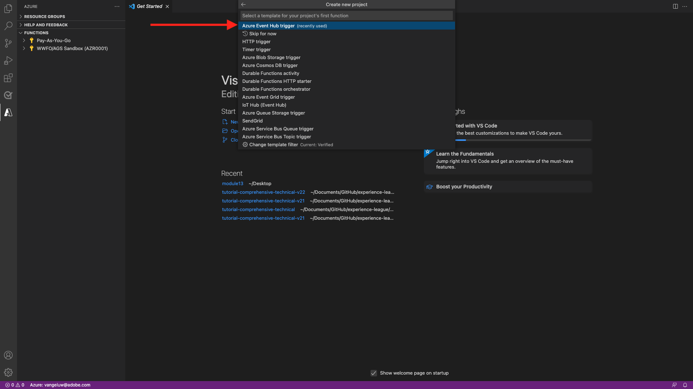

# 13.5 Microsoft Azure 프로젝트 만들기

## 13.5.1 Azure 이벤트 허브 기능 살펴보기

Azure 함수를 사용하면 작은 코드 부분( **함수**) 애플리케이션 인프라에 대한 걱정 없이 클라우드 인프라에서는 Azure 함수를 사용하여 응용 프로그램을 규모에 맞게 실행하는 데 필요한 모든 최신 서버를 제공합니다.

함수는 **트리거됨** 특정 유형의 이벤트에 의해 정의됩니다. 지원되는 트리거에는 데이터의 변경 사항에 응답하고 메시지(예: 이벤트 허브)에 응답하거나, 일정에 따라 실행하거나, HTTP 요청의 결과로 응답하는 작업이 포함됩니다.

Azure Functions는 인프라를 명시적으로 프로비저닝하거나 관리할 필요 없이 이벤트 트리거된 코드를 실행할 수 있도록 해주는 서버를 사용하지 않는 계산 서비스입니다.

Azure 이벤트 허브는 서버를 사용하지 않는 아키텍처를 위해 Azure 함수와 통합됩니다.

## 13.5.2 Visual Studio 코드 열기 및 Azure에 로그온

Visual Studio 코드를 사용하면 쉽게 다음을 수행할 수 있습니다.

- 이벤트 허브에 Azure 함수 정의 및 바인딩
- 로컬에서 테스트
- azure에 배포
- 원격 로그 기능 실행

### Visual Studio 코드 열기

Visual Studio 코드를 열려면 다음을 입력합니다. **visual** 운영 체제의 검색(OSX의 Spotlight 검색, Window의 작업 표시줄에서 검색)에서 볼 수 있습니다. 찾을 수 없는 경우, [연습 0 - 전제 조건](./ex0.md).


### Azure에 로그온

등록할 때 사용한 Azure 계정으로 로그온할 때 [연습 0 - 전제 조건](./ex0.md)Visual Studio 코드를 사용하면 모든 이벤트 허브 리소스를 찾아 바인딩할 수 있습니다.

을(를) 클릭합니다. **Azure** 아이콘을 클릭합니다. 이 선택 사항이 없다면 필요한 확장 설치에 문제가 발생할 수 있습니다.

다음 선택 **Azure에 로그인**:


로그인하도록 브라우저로 리디렉션됩니다. 등록하는 데 사용한 Azure 계정을 선택해야 합니다.


브라우저에 다음 화면이 표시되면 Visual Code Studio로 로그인됩니다.


Visual Code Studio로 돌아갑니다. 예를 들어 Azure 구독의 이름이 표시됩니다 **Azure 구독 1**):


## 13.5.3 Azure 프로젝트 만들기

마우스로 가리키면 **Azure 구독 1**&#x200B;를 선택하면 섹션 위에 메뉴가 표시되며 **새 프로젝트 만들기...**:


프로젝트를 저장할 로컬 폴더를 선택하고 을(를) 클릭합니다 **선택**:


이제 프로젝트 생성 마법사를 입력합니다. 선택 **Javascript** 를 프로젝트의 언어로:


선택 **Azure 이벤트 허브 트리거** 프로젝트의 첫 번째 함수 템플릿으로:



함수의 이름을 입력하고 다음 형식을 사용합니다 `--demoProfileLdap---aep-event-hub-trigger` enter 키를 누릅니다.


선택 **새 로컬 앱 설정 만들기**:


이벤트 허브 네임스페이스를 선택합니다. 에 정의한 이벤트 허브가 표시됩니다 **연습 2**. 이 예에서 이벤트 허브 네임스페이스는 **vangeluw-aep-enablement**:


이벤트 허브를 선택합니다. 에 정의한 이벤트 허브가 표시됩니다 **연습 2**. 내 경우에는 **vangeluw-aep-enablement-event-hub**:


선택 **RootManageSharedAccessKey** 이벤트 허브 정책으로서:


사용할 을 입력합니다. **$기본값**:


선택 **작업 공간에 추가** 프로젝트를 여는 방법에 대해 다음을 수행하십시오.


프로젝트를 만든 후 을(를) 클릭합니다 **index.js** 편집기에서 파일을 열려면 다음을 수행하십시오.


Adobe Experience Platform에서 이벤트 허브로 보낸 페이로드에는 세그먼트 ID의 가 포함됩니다.

```json
[{
"segmentMembership": {
"ups": {
"ca114007-4122-4ef6-a730-4d98e56dce45": {
"lastQualificationTime": "2020-08-31T10:59:43Z",
"status": "realized"
},
"be2df7e3-a6e3-4eb4-ab12-943a4be90837": {
"lastQualificationTime": "2020-08-31T10:59:56Z",
"status": "realized"
},
"39f0feef-a8f2-48c6-8ebe-3293bc49aaef": {
"lastQualificationTime": "2020-08-31T10:59:56Z",
"status": "realized"
}
}
},
"identityMap": {
"ecid": [{
"id": "08130494355355215032117568021714632048"
}]
}
}]
```

Visual Studio 코드의 index.js에 있는 코드를 아래 코드로 바꿉니다. 이 코드는 실시간 CDP가 세그먼트 자격을 Event Hub 대상으로 전송할 때마다 실행됩니다. 이 예제에서 코드는 수신한 페이로드를 표시 및 향상시키는 것입니다. 하지만 세그먼트 자격을 실시간으로 처리하는 모든 기능을 상상할 수 있습니다.

```javascript
// Marc Meewis - Solution Consultant Adobe - 2020
// Adobe Experience Platform Enablement - Module 13

// Main function
// -------------
// This azure function is fired for each segment activated to the Adobe Exeperience Platform Real-time CDP Azure 
// Eventhub destination
// This function enriched the received segment payload with the name fo the segment. 
// You can replace this function with any logic that is require to process and deliver
// Adobe Experience Platform segments in real-time to any application or platform that 
// would need to act upon an AEP segment qualiification.
// 

module.exports = async function (context, eventHubMessages) {

    return new Promise (function (resolve, reject) {

        context.log('Message : ' + JSON.stringify(eventHubMessages, null, 2));

        resolve();

    });    

};
```

결과는 다음과 같습니다.


## 13.5.4 Azure 프로젝트 실행

이제 프로젝트를 실행할 차례입니다. 이 단계에서는 프로젝트를 Azure에 배포하지 않습니다. 디버그 모드에서 로컬로 실행합니다. 실행 아이콘을 선택하고 녹색 화살표를 클릭합니다.


디버그 모드에서 프로젝트를 처음 실행할 때는 Azure 저장소 계정을 연결한 다음 를 클릭합니다. **저장소 계정 선택**.


저장소 계정 목록에서 [13.1.4 Azure 저장소 계정 설정](./ex1.md). 저장소 계정 이름이 지정되어 있습니다 `--demoProfileLdap--aepstorage`, 예: **mmewisaepstorage**.


이제 프로젝트가 실행 중이며 이벤트 허브의 이벤트에 대한 목록이 표시됩니다. 다음 연습에서는 Luma 데모 웹 사이트에서 해당 세그먼트에 대한 자격을 부여하는 동작을 보여줍니다. 그 결과, 이벤트 허브 트리거 함수의 터미널에서 세그먼트 자격 페이로드를 수신하게 됩니다.


## 13.5.5 Azure 프로젝트 중지

프로젝트를 중지하려면 **터미널** 탭을 클릭하고 터미널 창을 클릭한 다음 키를 누릅니다 **CMD-C** OSX 또는 **CTRL-C** Windows:


다음 단계: [13.6 엔드 투 엔드 시나리오](./ex6.md)

[모듈 13으로 돌아가기](./segment-activation-microsoft-azure-eventhub.md)

[모든 모듈로 돌아가기](./../../overview.md)
