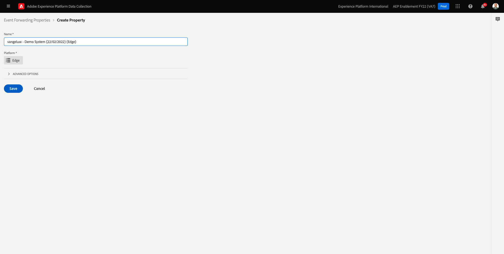

# 14.1 Adobe Experience Platform 데이터 수집 이벤트 전달 속성 만들기

>[!NOTE]
>
>Adobe Experience Platform Edge 모바일 확장은 현재 베타 버전입니다. 이 확장의 사용은 초대장에만 사용됩니다. 자세한 내용은 Adobe 고객 성공 관리자에게 문의하여 이 자습서의 자료에 액세스하십시오.

## 14.1.1 Adobe Experience Platform 데이터 수집 이벤트 전달 속성이란 무엇입니까?

일반적으로 Adobe Experience Platform 데이터 컬렉션을 사용하여 데이터를 수집하면 **고객측**. 다음 **고객측** 는 웹 사이트 또는 모바일 애플리케이션과 같은 환경입니다. 모듈 0 및 모듈 1에서는 Adobe Experience Platform 데이터 수집 클라이언트 속성의 구성에 대해 자세히 논의했으며, 이 속성을 웹 사이트 및 모바일 애플리케이션에 구현했으므로 고객이 웹 사이트 및 모바일 애플리케이션과 상호 작용할 때 데이터를 수집할 수 있도록 했습니다.

Adobe Experience Platform 데이터 수집 클라이언트 속성에 의해 해당 상호 작용 데이터가 수집되면 웹 사이트 또는 모바일 앱에서 Adobe의 Edge로 요청이 전송됩니다. Edge는 Adobe의 데이터 수집 환경이며, Adobe 에코시스템으로 클릭스트림 데이터를 위한 시작점입니다. 그런 다음 Edge에서 수집된 데이터는 Adobe Experience Platform, Adobe Analytics, Adobe Audience Manager 또는 Adobe Target과 같은 애플리케이션으로 전송됩니다.

Adobe Experience Platform 데이터 수집 이벤트 전달 속성이 추가되어 이제 Edge에서 들어오는 데이터를 수신하는 Adobe Experience Platform 데이터 수집 속성을 구성할 수 있습니다. Edge에서 실행 중인 Adobe Experience Platform 데이터 수집 이벤트 전달 속성에 들어오는 데이터가 표시되면 해당 데이터를 사용하여 다른 위치로 전달할 수 있습니다. 이제 다른 곳에 있는 경우에도 비 Adobe 외부 웹 후크가 될 수 있으므로 해당 데이터를 원하는 데이터 레이크, 의사 결정 애플리케이션 또는 웹 후크를 열 수 있는 기능을 가진 다른 모든 애플리케이션에 보낼 수 있습니다.

Adobe Experience Platform 데이터 수집 이벤트 전달 속성의 구성은 Adobe Experience Platform 데이터 수집 클라이언트 속성을 사용하여 예전처럼 데이터 요소 및 규칙을 구성하는 기능을 사용하여 클라이언트 속성에 익숙해 보입니다. 그러나 데이터 액세스 및 사용 방법은 사용 사례에 따라 약간 다릅니다.

먼저 Adobe Experience Platform 데이터 수집 이벤트 전달 속성을 만듭니다.

## 14.1.2 Adobe Experience Platform 데이터 수집 이벤트 전달 속성 만들기

이동 [https://experience.adobe.com/#/data-collection/](https://experience.adobe.com/#/data-collection/). 왼쪽 메뉴에서 **이벤트 전달**. 사용 가능한 모든 Adobe Experience Platform 데이터 수집 이벤트 전달 속성에 대한 개요가 표시됩니다. 을(를) 클릭합니다. **새 속성** 버튼을 클릭합니다.

이제 Adobe Experience Platform 데이터 수집 이벤트 전달 속성의 이름을 입력해야 합니다. 명명 규칙으로, `--demoProfileLdap-- - Demo System (DD/MM/YYYY) (Edge)`. 예를 들어 이 예제에서 이름은 **vangeluw - 데모 시스템(22/02/2022)(Edge)**. **저장**&#x200B;을 클릭합니다.

그런 다음 Adobe Experience Platform 데이터 수집 이벤트 전달 속성 목록에 다시 포함됩니다. 를 클릭하여 방금 만든 속성을 엽니다.

## 14.1.2 Adobe Cloud 커넥터 확장 구성

왼쪽 메뉴에서 **확장**. 이제 **코어** 확장이 이미 구성되어 있습니다.

이동 **카탈로그**. 이 표시됩니다 **Adobe 클라우드 커넥터** 확장. **설치**&#x200B;를 클릭하여 설치합니다.

그러면 확장이 추가됩니다. 이 단계에서는 구성할 구성이 없습니다. 설치된 확장에 대한 개요로 다시 전송됩니다.

## 14.1.3 Adobe Experience Platform 데이터 수집 이벤트 전달 속성 배포

왼쪽 메뉴에서 **게시 흐름**. 클릭 **라이브러리 추가**.

이름을 입력합니다 **기본**&#x200B;에서 환경을 선택합니다 **개발(개발)** 을(를) 클릭합니다. **+ 변경된 모든 리소스 추가**.

그러면 이게 보입니다. **개발을 위한 저장 및 구축**&#x200B;을 클릭합니다.

라이브러리가 구축되고, 이 작업은 1-2분 정도 걸릴 수 있습니다.

마지막으로 라이브러리가 빌드되고 준비됩니다.

다음 단계: [14.2 데이터 스트림을 업데이트하여 데이터 수집 이벤트 전달 속성에 데이터를 사용할 수 있도록 합니다](./ex2.md)

[모듈 14로 돌아가기](./aep-data-collection-ssf.md)

[모든 모듈로 돌아가기](./../../overview.md)
