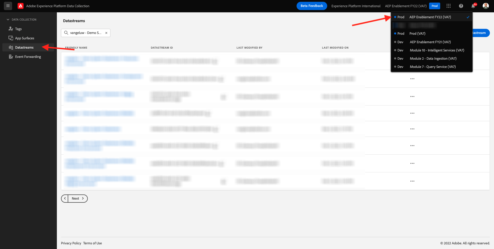

# 14.2 Adobe Experience Platform 데이터 수집 서버 속성에 데이터를 사용할 수 있도록 데이터 스트림을 업데이트합니다

## 14.2.1 데이터 스트림 업데이트

in [연습 0.2](./../../modules/module0/ex2.md)를 직접 만들었습니다 **[!UICONTROL 데이터 스트림]**. 그런 다음 이름을 사용했습니다 `--demoProfileLdap-- - Demo System Datastream`.

이 연습에서는 다음을 구성해야 합니다 **[!UICONTROL 데이터 스트림]** 와 함께 작업하십시오. **[!DNL Data Collection Server property]**.

이렇게 하려면 다음 위치로 이동하십시오. [https://experience.adobe.com/#/data-collection/](https://experience.adobe.com/#/data-collection/). 그러면 이게 보입니다. 왼쪽 메뉴에서 **[!UICONTROL 데이터 스트림]**.

화면의 오른쪽 상단 모서리에서 샌드박스 이름을 선택합니다. 샌드박스 이름은 다음과 같습니다. `--aepSandboxId--`.

을 검색합니다. **[!UICONTROL 데이터 스트림]**: `--demoProfileLdap-- - Demo System Datastream`. 을(를) 클릭합니다. **[!UICONTROL 데이터 스트림]** 열려고

그러면 이게 보입니다. 클릭 **[!UICONTROL + 서비스 추가]**.

서비스를 선택합니다 **이벤트 전달**. 2개의 추가 설정이 표시됩니다. 이전 연습에서 만들고 이름이 지정된 이벤트 전달 속성을 선택합니다 `--demoProfileLdap-- - Demo System (DD/MM/YYYY) (Edge)`. 그런 다음 을(를) 선택합니다 **개발** 아래에 **환경**. **저장**&#x200B;을 클릭합니다.

이제 데이터 스트림이 업데이트되어 사용할 준비가 되었습니다.

이제 데이터 스트림이 사용자의 **[!DNL Event Forwarding property]**.

다음 단계: [14.3 사용자 지정 웹 후크 만들기 및 구성](./ex3.md)

[모듈 14로 돌아가기](./aep-data-collection-ssf.md)

[모든 모듈로 돌아가기](./../../overview.md)
