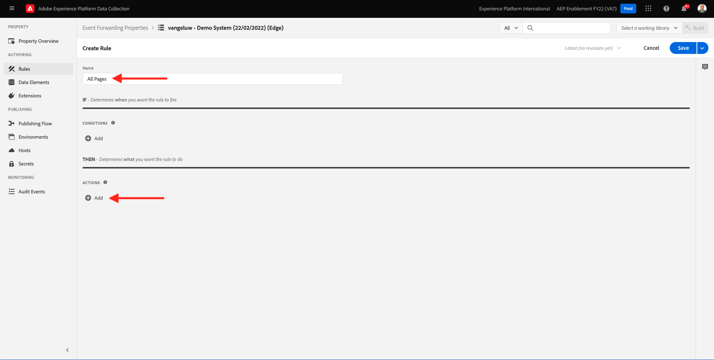
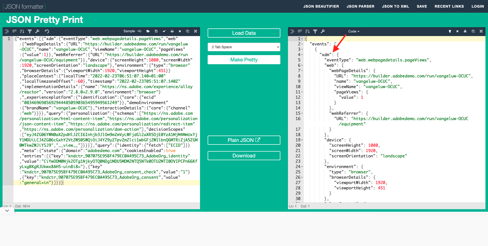

# 14.3 사용자 지정 웹 후크 만들기 및 구성

## 14.3.1 사용자 지정 웹 후크 만들기

이동 [https://webhook.site/](https://webhook.site/). 다음과 같은 내용을 보게 됩니다.

다음과 같은 고유한 URL이 표시됩니다. `https://webhook.site/585126a1-41fc-4721-864b-d4aa8c268a1d`.

이제 이 웹 사이트에서 이 웹 후크를 만들었으며, 이 웹 후크를 **[!DNL Event Forwarding property]** 이벤트 전달 테스트를 시작하려면 다음을 수행하십시오.

## 14.3.2 이벤트 전달 속성 업데이트: 데이터 요소 만들기

이동 [https://experience.adobe.com/#/data-collection/](https://experience.adobe.com/#/data-collection/) 그리고 **이벤트 전달**. 이벤트 전달 속성을 검색하고 클릭하여 엽니다.

왼쪽 메뉴에서 **데이터 요소**. **새 데이터 요소 만들기**&#x200B;를 클릭합니다.

그러면 구성할 새 데이터 요소가 표시됩니다.

다음을 선택합니다.

- 로서의 **이름**, 입력 **XDM 이벤트**.
- 로서의 **확장**, 선택 **코어**.
- 로서의 **데이터 요소 유형**, 선택 **경로**.
- 로서의 **경로**, 입력 **arc.event.xdm**. 이 경로를 입력하면 **XDM** 섹션(웹 사이트 또는 모바일 앱에서 Adobe Edge으로 전송된 이벤트 페이로드)

이제 이걸로 하시겠어요 **저장**&#x200B;을 클릭합니다.

>[!NOTE]
>
>위의 경로에서 에 대한 참조가 작성됩니다 **arc**. **arc** Adobe 리소스 컨텍스트 및 **arc** 항상 서버 측 컨텍스트에서 사용할 수 있는 가장 높은 사용 가능한 개체를 나타냅니다. 데이터 보강 및 변형도 여기에 추가될 수 있습니다 **arc** Adobe Experience Platform 데이터 수집 서버 함수를 사용하는 개체.
>
>위의 경로에서 에 대한 참조가 작성됩니다 **이벤트**. **이벤트** 은 고유한 이벤트를 나타내며 Adobe Experience Platform 데이터 수집 서버는 항상 모든 이벤트를 개별적으로 평가합니다. 경우에 따라 **events** 웹 SDK 클라이언트측에서 전송하지만 Adobe Experience Platform 데이터 수집 서버에서는 모든 이벤트를 개별적으로 평가합니다.

## 14.3.3 Adobe Experience Platform 데이터 수집 서버 속성 업데이트: 규칙 만들기

왼쪽 메뉴에서 **규칙**. **새 규칙 만들기**&#x200B;를 클릭합니다.

그러면 구성할 새 규칙이 표시됩니다. 을(를) 입력합니다. **이름**: **모든 페이지**. 이 연습에서는 조건을 구성할 필요가 없습니다. 대신 작업을 설정합니다. 을(를) 클릭합니다. **+ 추가** 버튼 아래 **작업**.

그러면 이게 보입니다. 다음을 선택합니다.

- 을(를) 선택합니다 **확장**: **Adobe 클라우드 커넥터**.
- 을(를) 선택합니다 **작업 유형**: **가져오기 호출 만들기**.

그러면 이렇게 될 겁니다 **이름**: **Adobe 클라우드 커넥터 - 가져오기 호출 만들기**. 이제 다음을 볼 수 있습니다.

다음으로, 다음을 구성합니다.

- 요청 메서드를 GET에서 로 변경합니다. **POST**
- 의 이전 단계 중 하나에서 만든 사용자 지정 웹 후크의 URL을 입력합니다. [https://webhook.site/](https://webhook.site/) 웹 사이트(예: `https://webhook.site/585126a1-41fc-4721-864b-d4aa8c268a1d`

이제 이걸 가져가세요 다음으로 이동 **본문**.

그러면 이게 보입니다. 아래에 표시된 대로 데이터 요소 아이콘을 클릭합니다.

팝업에서 데이터 요소를 선택합니다 **XDM 이벤트** 이전 단계에서 만든 구성. **선택**&#x200B;을 클릭합니다.

그러면 이게 보입니다. **변경사항 유지**&#x200B;를 클릭합니다.

그러면 이게 보입니다. **저장**&#x200B;을 클릭합니다.

이제 이벤트 전달 속성에서 첫 번째 규칙을 구성했습니다. 이동 **게시 흐름** 변경 사항을 게시하려면 다음을 수행하십시오.
개발 라이브러리를 엽니다. **기본** 를 클릭합니다. **편집** 표시된 대로.

을(를) 클릭합니다. **변경된 모든 리소스 추가** 버튼을 클릭하면 규칙 및 데이터 요소가 이 라이브러리에 표시됩니다. 다음을 클릭합니다. **개발을 위한 저장 및 구축**. 이제 변경 사항을 배포하고 있습니다.

몇 분 후에 배포가 완료되고 테스트를 받을 준비가 되었음을 알 수 있습니다.

## 14.3.4 구성 테스트

이동 [https://builder.adobedemo.com/projects](https://builder.adobedemo.com/projects). Adobe ID으로 로그인하면 다음이 표시됩니다. 웹 사이트 프로젝트를 클릭하여 엽니다.

이제 아래 흐름을 따라 웹 사이트에 액세스할 수 있습니다. 클릭 **통합**.

설정 **통합** 페이지에서 연습 0.1에서 생성된 데이터 수집 속성을 선택해야 합니다.

그러면 데모 웹 사이트가 열립니다. URL을 선택하고 클립보드에 복사합니다.

새 시크릿 브라우저 창을 엽니다.

이전 단계에서 복사한 데모 웹 사이트의 URL을 붙여넣습니다. 그런 다음 Adobe ID을 사용하여 로그인하라는 메시지가 표시됩니다.

계정 유형을 선택하고 로그인 프로세스를 완료합니다.

그러면 시크릿 브라우저 창에서 로드되는 웹 사이트가 표시됩니다. 모든 데모에서는 신선하고 시크릿 브라우저 창을 사용하여 데모 웹 사이트 URL을 로드해야 합니다.

브라우저 개발자 보기를 열면 아래에 표시된 대로 네트워크 요청을 검사할 수 있습니다. 필터를 사용하는 경우 **상호 작용**, Adobe Experience Platform 데이터 수집 클라이언트가 Adobe Edge에 보내는 네트워크 요청을 볼 수 있습니다.

원시 페이로드를 선택하는 경우 로 이동합니다. [https://jsonformatter.org/json-pretty-print](https://jsonformatter.org/json-pretty-print) 페이로드를 붙여넣습니다. 클릭 **예쁘게 만들기**. JSON 페이로드와 **events** 개체 및 **xdm** 개체. 이전 단계 중 하나에서 데이터 요소를 정의할 때 참조를 사용했습니다 **arc.event.xdm**&#x200B;를 입력하면 구문 분석됩니다 **xdm** 이 페이로드의 개체입니다.

웹 사이트로 보기 전환 [https://webhook.site/](https://webhook.site/) 이전 단계 중 하나에서 사용한 것입니다. 이제 왼쪽 메뉴에 네트워크 요청이 표시되고 이 뷰와 유사한 보기가 있어야 합니다. 이제 **xdm** 위에 표시된 네트워크 요청에서 필터링된 페이로드.

페이로드에서 비트를 아래로 스크롤하여 페이지 이름을 찾습니다. 이 경우 다음과 같습니다 **vangeluw-OCUC** (데모 웹 사이트의 프로젝트 이름)

이제 웹 사이트를 탐색하면 이 사용자 지정 웹 후크에서 실시간 추가 네트워크 요청을 사용할 수 있습니다.

이제 웹 SDK/XDM 페이로드의 서버측 전달을 외부 사용자 지정 웹 후크에 구성했습니다. 다음 연습에서는 유사한 방법을 구성하게 되며, 동일한 데이터를 Google 및 AWS 환경에 보내게 됩니다.

다음 단계: [14.4 Google 클라우드 기능 만들기 및 구성](./ex4.md)

[모듈 14로 돌아가기](./aep-data-collection-ssf.md)

[모든 모듈로 돌아가기](./../../overview.md)
