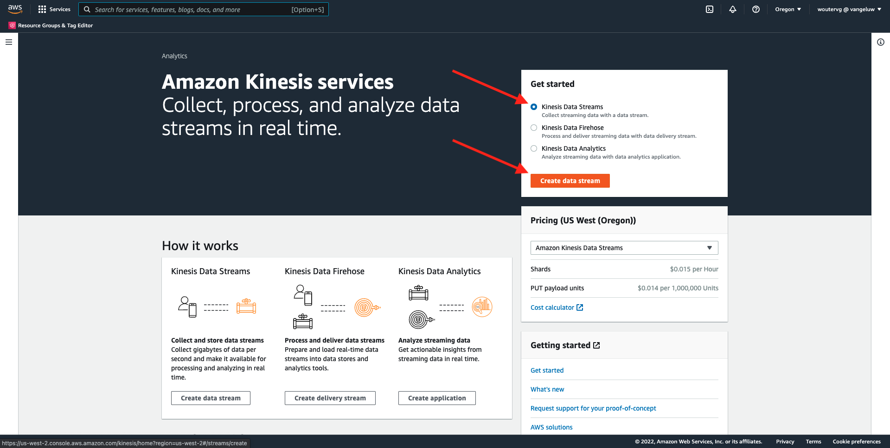
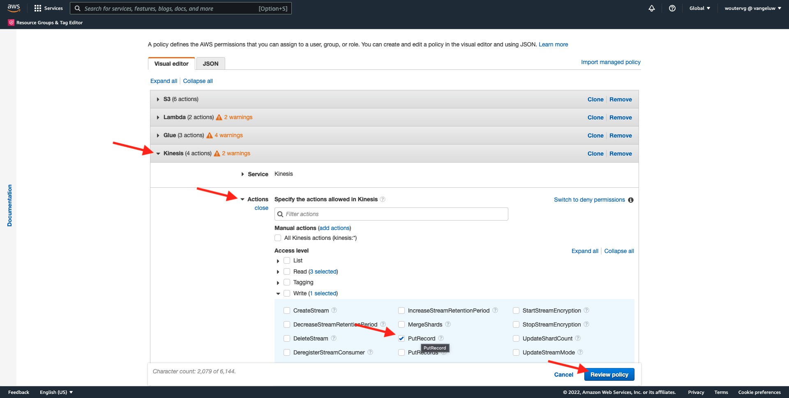
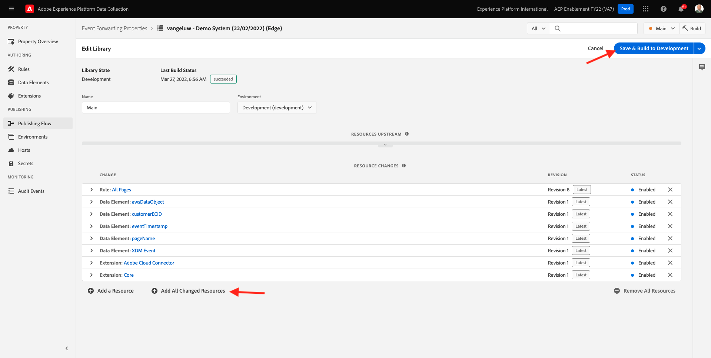

# 14.5 AWS 에코시스템을 위한 Forward 이벤트

>[!IMPORTANT]
>
>이 연습은 선택 사항이며 AWS Kinesis을 사용하는 데 드는 비용이 포함되어 있습니다. AWS에서는 비용 없이 많은 서비스를 테스트하고 구성할 수 있는 무료 계층 계정을 제공하지만 AWS Kinesis은 해당 무료 계층 계정의 일부가 아닙니다. 따라서 이 연습을 구현하고 테스트하려면 AWS Kinesis을 사용하는 데 비용이 듭니다.

## 잘 알고 있습니다

Adobe Experience Platform은 대상으로 다양한 Amazon 서비스를 지원합니다.
Kinesis과 S3는 모두 [프로필 내보내기 대상](https://experienceleague.adobe.com/docs/experience-platform/destinations/destination-types.html?lang=en) 및 은 Adobe Experience Platform의 Real-Time CDP의 일부로 사용할 수 있습니다.
고부가가치 세그먼트 이벤트 및 관련 프로필 속성을 선택한 시스템에 쉽게 제공할 수 있습니다.

이 노트에서는 Adobe Experience Platform Edge 에코시스템에서 Amazon S3 등의 클라우드 스토리지 대상으로 들어오는 이벤트 데이터를 스트리밍하도록 고유한 Amazon Kinesis 스트림을 설정하는 방법을 알아봅니다. 이 기능은 분석 및 운영 보고를 위해 웹 및 모바일 속성에서 경험 이벤트를 수집하고 데이터 세트에 푸시하려는 경우에 유용합니다. Datalakes는 일반적으로 대규모 일별 파일 가져오기로 일괄 처리를 통해 데이터를 수집하지만 이벤트 전달과 함께 사용할 수 있는 공개 http 종단점은 노출하지 않습니다.

위의 사용 사례를 지원하는 것은 스트리밍된 데이터를 파일에 쓰기 전에 버퍼링하거나 큐에 배치해야 한다는 것을 의미합니다. 여러 프로세스에서 쓰기 액세스를 위해 파일을 열지 않도록 주의해야 합니다. 이 일을 전용 시스템으로 위임하는 것은 좋은 수준의 서비스를 보장하면서도 잘 확장시키기에 이상적인 일이며, Kinesis이 바로 이 곳에서 구조 작업을 하는 것이다.

Amazon Kinesis 데이터 스트림은 데이터 스트림 수집 및 저장에 중점을 둡니다. Kinesis Data Firehose는 S3 버킷과 같은 대상 선택을 위해 데이터 스트림을 전달하는 데 중점을 둡니다.

이 연습의 일부로서, 당신은...

- Kinesis 데이터 스트림의 기본 설정 수행
- Firehose 게재 스트림을 만들고 S3 버킷을 대상으로 사용
- 이벤트 데이터를 수신하도록 Amazon API 게이트웨이를 rest api 엔드포인트로 구성
- 원시 이벤트 데이터를 Adobe의 Edge에서 Kinesis 스트림으로 전달합니다

## 14.5.1 AWS S3 버킷 구성

이동 [https://console.aws.amazon.com](https://console.aws.amazon.com) 이전에 만든 Amazon 계정으로 로그인합니다.


로그인하면 **AWS Management Console**.


에서 **서비스 찾기** 메뉴, 검색 **s3**. 첫 번째 검색 결과를 클릭합니다. **S3 - 클라우드의 확장 가능한 스토리지**.


그러면 **Amazon S3** 홈 페이지. 클릭 **버킷 만들기**.


에서 **버킷 만들기** 화면에서 다음 두 가지 사항을 구성해야 합니다.

- 이름: 이름 사용 `eventforwarding---demoProfileLdap--`. 예를 들어 이 연습에서는 버킷 이름이 입니다. **aepmoduertcdpvangeluw**
- 지역: 지역 사용 **EU(프랑크푸르트) eu-central-1**


다른 모든 기본 설정은 그대로 둡니다. 아래로 스크롤하여 클릭 **버킷 만들기**.


그러면 버킷이 만들어지고 Amazon S3 홈 페이지로 리디렉션됩니다.


## 14.5.2 AWS Kinesis 데이터 스트림 구성

에서 **서비스 찾기** 메뉴, 검색 **kinesis**. 첫 번째 검색 결과를 클릭합니다. **Kinesis - 실시간 스트리밍 데이터 작업**.


선택 **Kinesis 데이터 스트림**. 클릭 **데이터 스트림 만들기**.



대상 **데이터 스트림 이름**, 사용 `--demoProfileLdap---datastream`.


다른 설정을 변경할 필요가 없습니다. 아래로 스크롤하여 클릭 **데이터 스트림 만들기**.


그러면 이게 보입니다. 데이터 스트림을 성공적으로 만들면 다음 연습으로 이동할 수 있습니다.


## 14.5.3 AWS Firehose 게재 스트림 구성

에서 **서비스 찾기** 메뉴, 검색 **kinesis**. 클릭 **Kinesis Data Firehose**.


클릭 **게재 스트림 만들기**.


대상 **소스**, 선택 **Amazon Kinesis 데이터 스트림**. 대상 **대상**, 선택 **Amazon S3**. 클릭 **찾아보기** 를 클릭하여 데이터 스트림을 선택합니다.


데이터 스트림을 선택합니다. 클릭 **선택**.


그러면 이게 보입니다. 다음 사항을 기억하십시오 **게재 스트림 이름** 나중에 필요하실 테니까


표시될 때까지 아래로 스크롤합니다. **대상 설정**. 클릭 **찾아보기** 을 눌러 S3 버킷을 선택합니다.


S3 버킷을 선택하고 을(를) 클릭합니다 **선택**.


그런 다음 이와 같은 것을 볼 수 있습니다. 다음 설정을 업데이트합니다.

- 동적 분할: 설정 **활성화됨**
- 다중 레코드 중복 제거: 설정 **비활성화됨**
- 새 줄 구분 기호: 설정 **활성화됨**
- JSON에 대한 인라인 구문 분석: 설정 **활성화됨**


조금 아래로 스크롤하면, 이것이 보입니다. 다음 설정을 업데이트합니다.

- 동적 분할 키
   - 키 이름: **dynamicPartitioningKey**
   - JQ 표현식: **.dynamicPartitioningKey**
- S3 버킷 접두사: 다음 코드를 추가합니다.

```bash
!{partitionKeyFromQuery:dynamicPartitioningKey}/!{timestamp:yyyy}/!{timestamp:MM}/!{timestamp:dd}/!{timestamp:HH}/}
```

- S3 버킷 오류 출력 접두사: 설정 **오류**


마지막으로 아래로 스크롤하여 **게재 스트림 만들기**


2분 후에 게재 스트림이 생성되고 **활성**.


## 14.5.4 AWS IAM 역할 구성

에서 **서비스 찾기** 메뉴, 검색 **iam**. 클릭 **API 게이트웨이**.


클릭 **역할**.


을 검색합니다. **KinesisFirehose** 역할. 클릭하여 엽니다.


권한 정책 이름을 클릭하여 엽니다.


열리는 새 화면에서 **정책 편집**.


아래 **Kinesis** - **작업**, **쓰기** 권한 **PutRecord** 이 활성화되어 있습니다. 클릭 **정책 검토**.



**변경 내용 저장**&#x200B;을 클릭합니다.


그럼 다시 오셔야 합니다 클릭 **역할**.


을 검색합니다. **KinesisFirehose** 역할. 클릭하여 엽니다.


이동 **신뢰 관계** 을(를) 클릭합니다. **트러스트 정책 편집**.


기존 코드를 바꾸기 위해 이 코드를 붙여 넣어 현재 트러스트 정책을 덮어씁니다.

```json
{
	"Version": "2012-10-17",
	"Statement": [
		{
			"Effect": "Allow",
			"Principal": {
				"Service": [
                    "firehose.amazonaws.com",
                    "kinesis.amazonaws.com",
                    "apigateway.amazonaws.com"
                ]
			},
			"Action": "sts:AssumeRole"
		}
	]
}
```

클릭 **정책 업데이트**


그러면 이게 보입니다. 을(를) 지정해야 합니다 **ARN** 참조하십시오.


## 14.5.5 AWS API 게이트웨이 구성

Amazon API Gateway는 규모에 상관없이 REST, HTTP 및 WebSocket API를 생성, 게시, 유지 관리, 모니터링 및 보호하기 위한 AWS 서비스입니다. API 개발자는 AWS 또는 기타 웹 서비스에 액세스하는 API와 AWS Cloud에 저장된 데이터를 만들 수 있습니다.

이제 이벤트 전달과 같은 Adobe 서비스에서 직접 사용할 수 있는 HTTPS 엔드포인트를 통해 Kinesis 데이터 스트림을 인터넷에 노출합니다.

에서 **서비스 찾기** 메뉴, 검색 **api 게이트웨이**. 클릭 **API 게이트웨이**.


그런 다음 이와 같은 것을 볼 수 있습니다. 클릭 **API 만들기**.


클릭 **빌드** on **REST API** 카드.


그러면 이게 보입니다. 다음과 같은 설정을 입력합니다.

- 프로토콜을 선택합니다. 선택 **REST**
- 새 API 만들기: 선택 **새 API**
- 설정:
   - API 이름: 사용 `--demoProfileLdap---eventforwarding`
   - 끝점 유형: 선택 **지역**

클릭 **API 만들기**.


그러면 이게 보입니다. 클릭 **작업** 을 클릭한 다음 **리소스 만들기**.


그러면 이게 보입니다. 설정 **리소스 이름** to **스트림**. 클릭 **리소스 만들기**.


그러면 이게 보입니다. 클릭 **작업** 을 클릭한 다음 **메서드 만들기**.


드롭다운에서 을(를) 선택합니다. **POST** 을 클릭하고 **v** 버튼을 클릭합니다.


그러면 이게 보입니다. 다음과 같은 설정을 입력합니다.

- 통합 유형: **AWS 서비스**
- AWS 지역: Kinesis 데이터 스트림이 사용하는 지역(이 경우)을 선택합니다. **us-west-2**
- AWS 서비스: 선택 **Kinesis**
- AWS 하위 도메인: 비워 둡니다.
- HTTP 메서드: 선택 **POST**
- 작업 유형: 선택 **작업 이름 사용**
- 작업: enter **PutRecord**
- 실행 역할: 붙여넣기 **ARN** 이전 연습에서 설명한 대로 Kinesis 데이터 방화벽에서 사용하는 실행 역할의 수입니다.
- 컨텐츠 처리: 선택 **통과**
- 기본 시간 초과 사용: 확인란 활성화

**저장**&#x200B;을 클릭합니다.


그러면 이게 보입니다. 클릭 **통합 요청**.


클릭 **HTTP 헤더**.


비트 아래로 스크롤하여 클릭 **헤더 추가**.


설정 **이름** to **컨텐츠 유형**, 설정 **매핑된 위치** to `'application/x-amz-json-1.1'`. 을(를) 클릭합니다. **v** 아이콘을 클릭하여 변경 사항을 저장합니다.


그러면 이게 보입니다. 대상 **본문 통과 요청**, 선택 **정의된 템플릿이 없는 경우(권장)**. 다음을 클릭합니다. **매핑 템플릿 추가**.


아래 **컨텐츠 유형**, 입력 **application/json**. 을(를) 클릭합니다. **v** 아이콘을 클릭하여 변경 사항을 저장합니다.


아래로 스크롤하여 코드 편집기 창을 찾습니다. 여기에 아래 코드를 붙여 넣습니다.

```json
{
  "StreamName": "$input.path('StreamName')",
  "Data": "$util.base64Encode($input.json('$.Data'))",
  "PartitionKey": "$input.path('$.PartitionKey')"
}
```

**저장**&#x200B;을 클릭합니다.


그런 다음 위로 스크롤하여 **&lt;- 메서드 실행** 다시 돌아가려고


클릭 **테스트**.


아래로 스크롤하여 이 코드를 아래에 붙여 넣습니다. **요청 본문**. 클릭 **테스트**.

```json
{
  "Data": {
    "message": "Hello World",
    "dynamicPartitioningKey": "v2"
  },
  "PartitionKey": "1",
  "StreamName": "--demoProfileLdap---datastream"
}
```


그러면 비슷한 결과가 표시됩니다.


그러면 이게 보입니다. 클릭 **작업** 을 클릭한 다음 **API 배포**.


대상 **배포 단계**, 선택 **새 단계**. 로서의 **스테이지 이름**, 입력 **prod**. 클릭 **배포**.


그러면 이게 보입니다. **변경 내용 저장**&#x200B;을 클릭합니다. FYI: 이미지의 URL은 (이 예에서 ) 데이터를 전송하는 데 사용할 URL입니다. https://vv1i5vwg2k.execute-api.us-west-2.amazonaws.com/prod).


아래 cURL 요청을 사용하여 설정을 테스트할 수 있습니다. 필요한 모든 작업은 아래 URL을 사용자의 URL로 바꾸는 것입니다. `https://vv1i5vwg2k.execute-api.us-west-2.amazonaws.com/prod` 이 예에서 를 추가하고 `/stream` 를 입력합니다.

```json
curl --location --request POST 'https://vv1i5vwg2k.execute-api.us-west-2.amazonaws.com/prod/stream' \
--header 'Content-Type: application/json' \
--data-raw '{
    "Data": {
        "userid": "--demoProfileLdap--@adobe.com",
        "firstName":"--demoProfileLdap--",
        "offerName":"10% off on outdoor gears",
        "offerCode": "10OFF-SPRING",
        "dynamicPartitioningKey": "campaign"
    },
    "PartitionKey": "1",
    "StreamName": "--demoProfileLdap---datastream"
}'
```

위의 업데이트된 코드를 터미널 창에 붙여 넣은 다음 Enter 키를 누릅니다. 그러면 위의 테스트 시 볼 수 있는 응답과 유사한 이 응답이 표시됩니다.


## 14.5.6 이벤트 전달 속성 업데이트

이제 AWS API Gateway를 통해 AWS Kinesis 데이터 스트림에 활성화할 수 있으므로 이제 원시 경험 이벤트를 AWS 에코시스템으로 보낼 수 있습니다. 이제 Real-Time CDP 연결 및 이벤트 전달을 사용하여 새로 만든 AWS API 게이트웨이 엔드포인트에 이벤트 전달을 쉽게 활성화할 수 있습니다.

### 14.5.6.1 이벤트 전달 속성 업데이트: 데이터 요소 만들기

이동 [https://experience.adobe.com/#/data-collection/](https://experience.adobe.com/#/data-collection/) 그리고 **이벤트 전달**. 이벤트 전달 속성을 검색하고 클릭하여 엽니다.


왼쪽 메뉴에서 **데이터 요소**. 클릭 **데이터 요소 추가**.


그러면 구성할 새 데이터 요소가 표시됩니다.


다음을 선택합니다.

- 로서의 **이름**, 입력 **awsDataObject**.
- 로서의 **확장**, 선택 **코어**.
- 로서의 **데이터 요소 유형**, 선택 **사용자 지정 코드**.

이제 이걸로 하시겠어요 클릭 **&lt;/> 편집기 열기**.


편집기에서 3행에 다음 코드를 붙여넣습니다. **저장**&#x200B;을 클릭합니다.

```javascript
const newObj = {...arc.event.xdm, dynamicPartitioningKey: "event_forwarding"}
return JSON.stringify(newObj);
```


>[!NOTE]
>
>위의 경로에서 에 대한 참조가 작성됩니다 **arc**. **arc** Adobe 리소스 컨텍스트 및 **arc** 항상 서버 측 컨텍스트에서 사용할 수 있는 가장 높은 사용 가능한 개체를 나타냅니다. 데이터 보강 및 변형도 여기에 추가될 수 있습니다 **arc** Adobe Experience Platform 데이터 수집 서버 함수를 사용하는 개체.
>
>위의 경로에서 에 대한 참조가 작성됩니다 **이벤트**. **이벤트** 은 고유한 이벤트를 나타내며 Adobe Experience Platform 데이터 수집 서버는 항상 모든 이벤트를 개별적으로 평가합니다. 경우에 따라 **events** 웹 SDK 클라이언트측에서 전송했지만, Adobe Experience Platform 데이터 수집 이벤트 전달에서는 모든 이벤트를 개별적으로 평가합니다.

그럼 다시 오셔야 합니다 클릭 **저장** 또는 **라이브러리에 저장**.


### 14.5.6.2 Adobe Experience Platform 데이터 수집 서버 속성 업데이트: 규칙 업데이트

왼쪽 메뉴에서 **규칙**. 를 클릭하여 규칙을 엽니다 **모든 페이지** 이전 연습 중 하나에서 생성한 작업입니다.


그러면 이게 보입니다. 을(를) 클릭합니다. **+** 아이콘을 클릭하여 새 작업을 추가합니다.


그러면 이게 보입니다. 다음을 선택합니다.

- 을(를) 선택합니다 **확장**: **Adobe 클라우드 커넥터**.
- 을(를) 선택합니다 **작업 유형**: **가져오기 호출 만들기**.

그러면 이렇게 될 겁니다 **이름**: **Adobe 클라우드 커넥터 - 가져오기 호출 만들기**. 이제 다음을 볼 수 있습니다.


다음으로, 다음을 구성합니다.

- 요청 메서드를 GET에서 로 변경합니다. **POST**
- 이전 단계 중 하나에서 만든 AWS API 게이트웨이 엔드포인트의 URL을 입력합니다. 이 URL은 다음과 같습니다. `https://vv1i5vwg2k.execute-api.us-west-2.amazonaws.com/prod/stream`

이제 이걸 가져가세요 다음으로 이동 **머리글**.


headers에서 키가 있는 새 헤더를 추가합니다 **컨텐츠 유형** 및 값 **application/json**. 다음으로 이동 **본문**.


그러면 이게 보입니다. 필드에 다음 코드를 붙여넣습니다. **본문(원시)**. **변경사항 유지**&#x200B;를 클릭합니다.

```json
{
    "Data":{{awsDataObject}},
    "PartitionKey": "1",
    "StreamName": "--demoProfileLdap---datastream"
}
```


그러면 다시 이곳에 올 겁니다 클릭 **저장** 또는 **라이브러리에 저장**.


이제 이벤트 전달 속성에서 첫 번째 규칙을 구성했습니다. 이동 **게시 흐름** 변경 사항을 게시하려면 다음을 수행하십시오.
를 클릭하여 개발 라이브러리를 엽니다. **기본**.


을(를) 클릭합니다. **변경된 모든 리소스 추가** 버튼을 클릭하면 규칙 및 데이터 요소 변경 사항이 이 라이브러리에 표시됩니다. 다음을 클릭합니다. **개발을 위한 저장 및 구축**. 이제 변경 사항을 배포하고 있습니다.



몇 분 후에 배포가 완료되고 테스트를 받을 준비가 되었음을 알 수 있습니다.


## 14.5.7 구성 테스트

이동 [https://builder.adobedemo.com/projects](https://builder.adobedemo.com/projects). Adobe ID으로 로그인하면 다음이 표시됩니다. 웹 사이트 프로젝트를 클릭하여 엽니다.


이제 아래 흐름을 따라 웹 사이트에 액세스할 수 있습니다. 클릭 **통합**.


설정 **통합** 페이지에서 연습 0.1에서 생성된 데이터 수집 속성을 선택해야 합니다.


그러면 데모 웹 사이트가 열립니다. URL을 선택하고 클립보드에 복사합니다.


새 시크릿 브라우저 창을 엽니다.


이전 단계에서 복사한 데모 웹 사이트의 URL을 붙여넣습니다. 그런 다음 Adobe ID을 사용하여 로그인하라는 메시지가 표시됩니다.


계정 유형을 선택하고 로그인 프로세스를 완료합니다.


그러면 시크릿 브라우저 창에서 로드되는 웹 사이트가 표시됩니다. 모든 데모에서는 신선하고 시크릿 브라우저 창을 사용하여 데모 웹 사이트 URL을 로드해야 합니다.


브라우저 개발자 보기를 열면 아래에 표시된 대로 네트워크 요청을 검사할 수 있습니다. 필터를 사용하는 경우 **상호 작용**, Adobe Experience Platform 데이터 수집 클라이언트가 Adobe Edge에 보내는 네트워크 요청을 볼 수 있습니다.


원시 페이로드를 선택하는 경우 로 이동합니다. [https://jsonformatter.org/json-pretty-print](https://jsonformatter.org/json-pretty-print) 페이로드를 붙여넣습니다. 클릭 **예쁘게 만들기**. JSON 페이로드와 **events** 개체 및 **xdm** 개체. 이전 단계 중 하나에서 데이터 요소를 정의할 때 참조를 사용했습니다 **arc.event.xdm**&#x200B;를 입력하면 구문 분석됩니다 **xdm** 이 페이로드의 개체입니다.


보기를 다음으로 전환 **AWS**. 데이터 스트림을 열고 **모니터링** 이제 들어오는 트래픽이 표시됩니다.


그런 다음 게재 스트림을 열고 로 이동합니다 **모니터링** 탭하면 들어오는 트래픽도 표시됩니다.


마지막으로 S3 버킷을 보면 이제 데이터 섭취 결과로 생성되는 파일이 여기에 표시됩니다.


이러한 파일을 다운로드하여 텍스트 편집기를 사용하여 열면 전달된 이벤트의 XDM 페이로드가 포함되어 있음을 알 수 있습니다.


다음 단계: [요약 및 이점](./summary.md)

[모듈 14로 돌아가기](./aep-data-collection-ssf.md)

[모든 모듈로 돌아가기](./../../overview.md)
