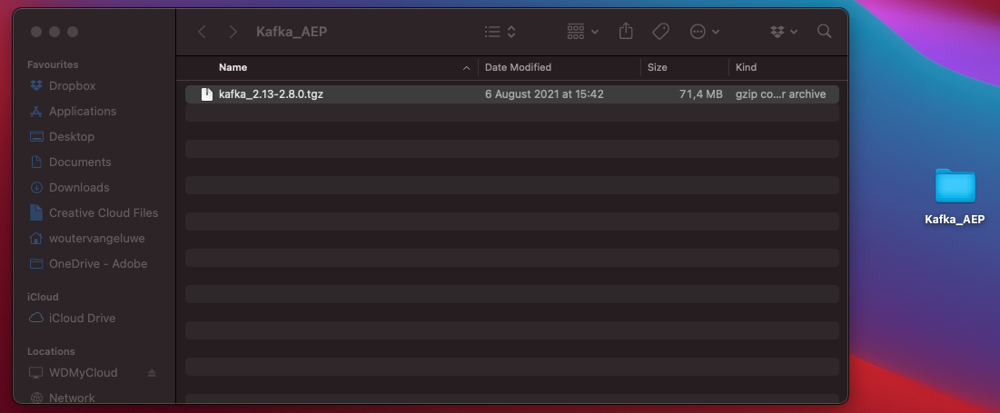
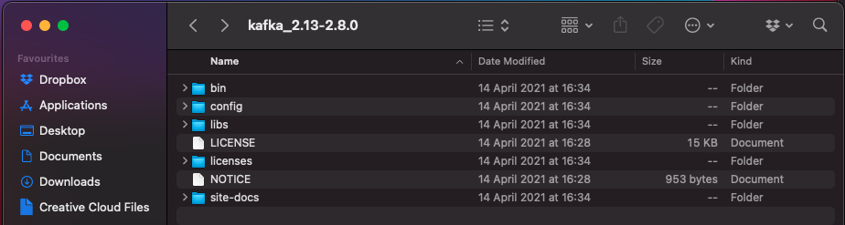
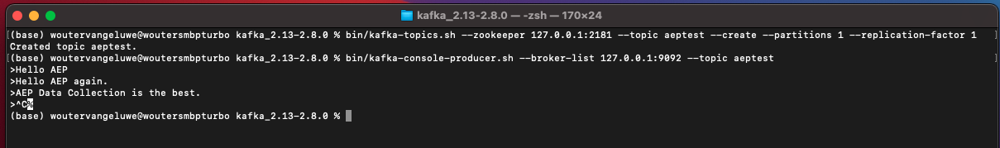

# 15.2 Kafka 클러스터 설치 및 구성

## 15.2.1 Apache Kafka 다운로드

이동 [https://kafka.apache.org/downloads](https://kafka.apache.org/downloads) 최신 릴리스 버전을 다운로드하십시오. 최신 이진 릴리스를 선택합니다(이 경우) **스칼라 2.13**.

그러면 미러 사이트로 이동합니다. 제안된 링크를 클릭하여 Kafka를 다운로드합니다.

이름이 인 데스크탑에서 폴더 만들기 **Kafka_AEP** 다운로드한 파일을 해당 디렉토리에 배치합니다.

열기 **터미널** 폴더를 마우스 오른쪽 단추로 클릭하고 **폴더의 새 터미널**.

터미널 창에서 이 명령을 실행하여 다운로드한 파일의 압축을 해제합니다.

`tar -xvf kafka_2.13-3.1.0.tgz`

>[!NOTE]
>
>위의 명령이 다운로드한 파일의 버전과 일치하는지 확인하십시오. 버전이 최신 버전인 경우 해당 버전과 일치하도록 위의 명령을 업데이트해야 합니다.

그러면 다음 내용이 표시됩니다.

해당 파일의 압축을 푼 후에 다음과 같은 디렉토리가 있습니다.

그리고 이 디렉토리에 다음과 같은 하위 디렉토리가 표시됩니다.

터미널 창으로 돌아갑니다. 다음 명령을 입력합니다.

`cd kafka_2.13-3.1.0`

>[!NOTE]
>
>위의 명령이 다운로드한 파일의 버전과 일치하는지 확인하십시오. 버전이 최신 버전인 경우 해당 버전과 일치하도록 위의 명령을 업데이트해야 합니다.

그런 다음 명령을 입력합니다 `bin/kafka-topics.sh`.

그러면 이 응답이 표시됩니다. 즉, Kafka가 제대로 설치되어 있고 Java가 제대로 작동하는 것입니다. (미리 알림: 이 작업을 수행하려면 Java 8 JDK 또는 Java 11 JDK가 설치되어 있어야 합니다. 명령을 사용하여 설치한 Java 버전을 확인할 수 있습니다 `java -version`)

## 15.2.2 Kafka 시작

Kafka를 시작하려면 Kafka Zookeeper와 Kafka를 이 순서로 시작해야 합니다.

열기 **터미널** 폴더를 마우스 오른쪽 단추로 클릭하여 창을 엽니다. **kafka_2.13-3.1.0** 및 **폴더의 새 터미널**.

다음 명령을 입력하십시오.

`bin/zookeeper-server-start.sh config/zookeeper.properties`

그러면 다음 내용이 표시됩니다.

이 연습을 하는 동안 이 창을 열어 두십시오!

다른 새 **터미널** 폴더를 마우스 오른쪽 단추로 클릭하여 창을 엽니다. **kafka_2.13-3.1.0** 및 **폴더의 새 터미널**.

다음 명령을 입력하십시오.

`bin/kafka-server-start.sh config/server.properties`

그러면 다음 내용이 표시됩니다.

이 연습을 하는 동안 이 창을 열어 두십시오!

## 15.2.3 Kafka 항목 만들기

열기 **터미널** 폴더를 마우스 오른쪽 단추로 클릭하여 창을 엽니다. **kafka_2.13-3.1.0** 및 **폴더의 새 터미널**.

이 명령을 입력하여 이름으로 새 Kafka 항목을 만듭니다 **aeptest**. 이 항목은 이 연습에서 테스트하는 데 사용됩니다.

`bin/kafka-topics.sh --create --topic aeptest --bootstrap-server localhost:9092`

그러면 유사한 확인 메시지가 표시됩니다.

이 명령을 입력하여 이름으로 새 Kafka 항목을 만듭니다 **aep**. 이 항목은 다음 연습에서 구성할 Adobe Experience Platform 싱크 커넥터에 사용됩니다.

`bin/kafka-topics.sh --create --topic aep --bootstrap-server localhost:9092`

그러면 유사한 확인 메시지가 표시됩니다.

## 15.2.4 이벤트 생성

첫 번째 Kafka 항목을 만든 터미널 창으로 돌아가서 다음 명령을 입력합니다.

`bin/kafka-console-producer.sh --broker-list 127.0.0.1:9092 --topic aeptest`

그러면 이게 보입니다. Enter 단추를 누른 후 새 줄이 있으면 새 메시지가 주제에 전송됩니다 **aeptest**.

Enter 키 `Hello AEP` Enter 키를 누릅니다. 이제 첫 번째 이벤트가 로컬 Kafka 인스턴스로 전송되어 항목으로 전송됩니다 **aeptest**.

Enter 키 `Hello AEP again.` Enter 키를 누릅니다.

Enter 키 `AEP Data Collection is the best.` Enter 키를 누릅니다.

이제 3개의 이벤트를 주제로 작성했습니다 **aeptest**. 이제 해당 데이터가 필요한 애플리케이션에서 이러한 이벤트를 사용할 수 있습니다.

키보드에서 `Control` 및 `C` 동시에 제작자를 닫습니다.

## 15.2.4 이벤트 사용

이벤트를 생성하는 데 사용한 것과 동일한 터미널 창에서 다음 명령을 입력합니다.

`bin/kafka-console-consumer.sh --bootstrap-server 127.0.0.1:9092 --topic aeptest --from-beginning`

그러면 이 주제에 대한 이전 연습에서 생성된 모든 메시지가 표시됩니다 **aeptest**&#x200B;에 표시된다면, Apache Kafka가 작동하는 방식입니다. 생성자는 이벤트를 파이프라인으로 만들고 소비자는 이러한 이벤트를 사용합니다.

키보드에서 `Control` 및 `C` 동시에 제작자를 닫습니다.

이 연습에서는 로컬 Kafka 클러스터를 설정하고, Kafka 항목을 만들고, 이벤트를 만들고, 이벤트를 사용하는 모든 기본 사항을 살펴보았습니다.

이 모듈의 목표는 실제 조직이 이미 Apache Kafka 클러스터를 구현하고 Kafka 클러스터의 데이터를 Adobe Experience Platform으로 스트리밍하려고 할 경우 발생하는 결과를 시뮬레이션하는 것입니다.

이러한 구현을 용이하게 하기 위해 Kafka Connect를 사용하여 구현할 수 있는 Adobe Experience Platform 싱크 커넥터가 생성되었습니다. 해당 Adobe Experience Platform 싱크 커넥터의 설명서는 다음과 같습니다. [https://github.com/adobe/experience-platform-streaming-connect](https://github.com/adobe/experience-platform-streaming-connect).

다음 연습에서는 로컬 Kafka 클러스터 내에서 해당 Adobe Experience Platform 싱크 커넥터를 사용하는 데 필요한 모든 것을 구현합니다.

터미널 창을 닫습니다.

너는 이 운동을 끝마쳤다.

다음 단계: [15.3 Adobe Experience Platform에서 HTTP API 엔드포인트 구성](./ex3.md)

[모듈 15로 돌아가기](./aep-apache-kafka.md)

[모든 모듈로 돌아가기](../../overview.md)
