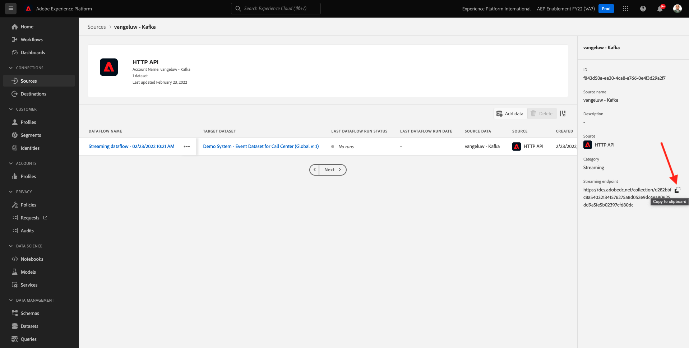

# 15.3 Adobe Experience Platform에서 HTTP API 스트리밍 끝점 구성

Kafka에서 Adobe Experience Platform 싱크 커넥터를 설정하려면 먼저 Adobe Experience Platform에서 HTTP API 소스 커넥터를 만들어야 합니다. Adobe Experience Platform 싱크 커넥터를 설정하려면 HTTP API 스트리밍 끝점 URL이 필요합니다.

HTTP API 소스 커넥터를 만들려면 다음 URL로 이동하여 Adobe Experience Platform에 로그인합니다. [https://experience.adobe.com/platform](https://experience.adobe.com/platform).

로그인하면 Adobe Experience Platform 홈 페이지가 표시됩니다.

계속하기 전에 **샌드박스**. 선택할 샌드박스의 이름은 다음과 같습니다 ``--aepSandboxId--``. 이 작업은 텍스트를 클릭하여 수행할 수 있습니다 **[!UICONTROL 프로덕션 제품]** 화면 상단에 있는 파란색 줄에 표시됩니다. 적절한 샌드박스를 선택하면 화면 변경 사항이 표시되고 이제 전용 샌드박스에 있습니다.

왼쪽 메뉴에서 **소스** 아래로 스크롤하여 **소스 카탈로그** 우리가 **HTTP API**. 클릭 **데이터 추가**.

클릭 **새 계정**. 사용 `--demoProfileLdap-- - Kafka` 를 HTTP API 연결의 이름으로(이 경우) **vangeluw - Kafka**. 에 대한 확인란을 활성화합니다 **XDM 호환 가능**. 클릭 **소스에 연결**.

그러면 이 항목이 표시되고 **다음**.

선택 **기존 데이터 세트**&#x200B;를 클릭하여 드롭다운 메뉴를 엽니다. 데이터 세트를 검색하고 선택합니다 **데모 시스템 - 콜 센터의 이벤트 데이터 세트(글로벌 v1.1)**.

**다음**&#x200B;을 클릭합니다.

**다음**&#x200B;을 클릭합니다.

**마침을 클릭합니다**.

방금 만든 HTTP API 소스 커넥터에 대한 개요를 볼 수 있습니다.

이 파일을 복사해야 합니다 **스트리밍 끝점** 다음 연습에서 필요한 URL로서, 아래 URL과 비슷합니다.

`https://dcs.adobedc.net/collection/d282bbfc8a540321341576275a8d052e9dc4ea80625dd9a5fe5b02397cfd80dc`

너는 이 운동을 끝마쳤다.

다음 단계: [15.4 Kafka Connect 및 Adobe Experience Platform Sink Connector 설치 및 구성](./ex4.md)

[모듈 15로 돌아가기](./aep-apache-kafka.md)

[모든 모듈로 돌아가기](../../overview.md)
