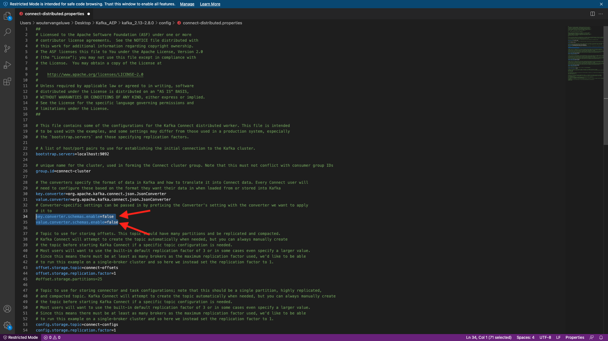
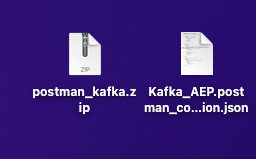
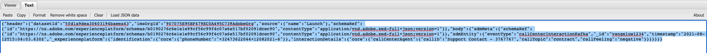

# 15.4 Kafka Connect 및 Adobe Experience Platform Sink Connector 설치 및 구성

## 15.4.1 Adobe Experience Platform 싱크 커넥터 다운로드

이동 [https://github.com/adobe/experience-platform-streaming-connect/releases](https://github.com/adobe/experience-platform-streaming-connect/releases) Adobe Experience Platform 싱크 커넥터의 최신 공식 릴리스를 다운로드할 수 있습니다.


다운로드 파일 배치, **streaming-connect-sink-0.0.14-java-11.jar**&#x200B;로 설정되면 eVar를 바탕 화면에 표시할 수 있습니다.


## 15.4.2 Kafka Connect 구성

이름이 인 바탕 화면의 폴더로 이동합니다 **Kafka_AEP** 폴더로 이동합니다 `kafka_2.13-3.1.0/config`.
해당 폴더에서 파일을 엽니다 **connect-distributed.properties** 텍스트 편집기 사용.


텍스트 편집기에서 34행 및 35줄로 이동하고 필드를 설정해야 합니다 `key.converter.schemas.enable` 및 `value.converter.schemas.enable` to `false`

```json
key.converter.schemas.enable=false
value.converter.schemas.enable=false
```

이 파일에 변경 내용을 저장합니다.



그런 다음 폴더로 돌아갑니다 `kafka_2.13-3.1.0` 새 폴더를 수동으로 만들고 이름을 지정합니다 `connectors`.


폴더를 마우스 오른쪽 단추로 클릭하고 **폴더의 새 터미널**.


그러면 이게 보입니다. 명령을 입력합니다 `pwd` 를 입력하여 해당 폴더의 전체 경로를 검색합니다. 전체 경로를 선택하고 클립보드에 복사합니다.


텍스트 편집기에서 파일로 돌아갑니다 **connect-distributed.properties** 마지막 줄(스크린샷의 86행)로 스크롤합니다. 다음으로 시작하는 줄의 주석을 해제해야 합니다 `# plugin.path=` 전체 경로를 `connectors`. 결과는 다음과 유사해야 합니다.

`plugin.path=/Users/woutervangeluwe/Desktop/Kafka_AEP/kafka_2.13-3.1.0/connectors`

파일에 변경 사항을 저장합니다 **connect-distributed.properties** 텍스트 편집기를 닫습니다.


그런 다음 다운로드한 Adobe Experience Platform 싱크 커넥터의 최신 공식 릴리스를 이름이 인 폴더로 복사합니다 `connectors`. 이전에 다운로드한 파일의 이름은 **streaming-connect-sink-0.0.14-java-11.jar**&#x200B;로 이동하여 `connectors` 폴더를 입력합니다.


다음으로, **kafka_2.13-3.1.0** 폴더를 입력합니다. 해당 폴더를 마우스 오른쪽 단추로 클릭하고 **폴더의 새 터미널**.

터미널 창에서 다음 명령을 붙여 넣습니다. `bin/connect-distributed.sh config/connect-distributed.properties` 을(를) 클릭합니다. **Enter 키**. 이 명령은 Kafka 연결을 시작하고 Adobe Experience Platform 싱크 커넥터의 라이브러리를 로드합니다.


몇 초 후에, 다음과 같은 것을 볼 수 있습니다.


## 15.4.3 Postman을 사용하여 Adobe Experience Platform 싱크 커넥터 만들기

이제 Postman을 사용하여 Kafka Connect와 상호 작용할 수 있습니다. 이렇게 하려면 을(를) 다운로드합니다. [이 Postman 컬렉션](../../assets/postman/postman_kafka.zip) 바탕 화면의 로컬 컴퓨터에 압축을 해제합니다. 그러면 라는 파일이 표시됩니다 `Kafka_AEP.postman_collection.json`.



Postman에서 이 파일을 가져와야 합니다. 이렇게 하려면 Postman을 열고 **가져오기**&#x200B;를 클릭하고 파일을 드래그하여 놓습니다 `Kafka_AEP.postman_collection.json` 팝업으로 이동하고 **가져오기**.


그러면 Postman의 왼쪽 메뉴에서 이 컬렉션을 찾을 수 있습니다. 첫 번째 요청을 클릭하고 **GET 사용 가능한 Kafka Connect 커넥터** 열려고


그러면 이게 보입니다. 파란색 클릭 **보내기** 버튼, 빈 응답이 표시됩니다. `[]`. 빈 응답은 Kafka Connect 커넥터가 현재 정의되어 있지 않기 때문입니다.


커넥터를 만들려면 Kafka 컬렉션에서 두 번째 요청을 클릭하여 엽니다. **POST AEP 싱크 커넥터 만들기**. 그러면 이게 보입니다. 11호선에서, 어디에 써있는지 **&quot;aep.endpoint&quot;: &quot;&quot;**&#x200B;를 채울 때는 연습 종료 시 받은 HTTP API 스트리밍 끝점 URL에 붙여넣어야 합니다 [15.3](./ex3.md). HTTP API 스트리밍 끝점 URL은 다음과 같습니다. `https://dcs.adobedc.net/collection/d282bbfc8a540321341576275a8d052e9dc4ea80625dd9a5fe5b02397cfd80dc`.


붙여넣은 후 요청 본문은 다음과 같아야 합니다. 파란색 클릭 **보내기** 단추를 클릭하여 커넥터를 만듭니다. 커넥터를 만들 때 즉시 응답할 수 있습니다.


첫 번째 요청을 클릭하고 **GET 사용 가능한 Kafka Connect 커넥터** 다시 열고 파란색을 클릭합니다. **보내기** 다시 단추를 누릅니다. 이제 Kafka Connect 커넥터가 생성되었습니다.


그런 다음 Kafka 컬렉션에서 세 번째 요청을 엽니다. **GET Kafka Connect 커넥터 상태 확인**. 파란색 클릭 **보내기** 그런 다음 커넥터가 실행 중임을 나타내는 아래 응답과 같은 응답을 받게 됩니다.


## 15.4.4 경험 이벤트 생성

새 열기 **터미널** 폴더를 마우스 오른쪽 단추로 클릭하여 창을 엽니다. **kafka_2.13-3.1.0** 및 **폴더의 새 터미널**.


다음 명령을 입력합니다.

`bin/kafka-console-producer.sh --broker-list 127.0.0.1:9092 --topic aep`


그러면 이게 보입니다. Enter 단추를 누른 후 새 줄이 있으면 새 메시지가 주제에 전송됩니다 **aep**.


이제 메시지를 보낼 수 있으며, 이로 인해 Adobe Experience Platform 싱크 커넥터에 의해 소비되며 실시간으로 Adobe Experience Platform에 수집됩니다.

이것을 테스트하기 위해 간단한 데모를 해보겠습니다.

이동 [https://builder.adobedemo.com/projects](https://builder.adobedemo.com/projects). Adobe ID으로 로그인하면 다음이 표시됩니다. 웹 사이트 프로젝트를 클릭하여 엽니다.


설정 **Screens** 페이지를 클릭한 다음 **실행**.


그러면 데모 웹 사이트가 열립니다. URL을 선택하고 클립보드에 복사합니다.


새 시크릿 브라우저 창을 엽니다.


이전 단계에서 복사한 데모 웹 사이트의 URL을 붙여넣습니다. 그런 다음 Adobe ID을 사용하여 로그인하라는 메시지가 표시됩니다.


계정 유형을 선택하고 로그인 프로세스를 완료합니다.


그러면 시크릿 브라우저 창에서 로드되는 웹 사이트가 표시됩니다. 모든 데모에서는 신선하고 시크릿 브라우저 창을 사용하여 데모 웹 사이트 URL을 로드해야 합니다.


화면 왼쪽 상단 모서리에서 Adobe 로고 아이콘을 클릭하여 프로필 뷰어를 엽니다.


를 사용하여 프로필 뷰어 패널 및 실시간 고객 프로필을 봅니다. **Experience Cloud ID** 을 현재 알 수 없는 이 고객에 대한 기본 식별자로 사용하십시오.


등록/로그인 페이지로 이동합니다. 클릭 **계정 만들기**.


세부 사항을 입력하고 **등록** 그런 다음 이전 페이지로 리디렉션됩니다.


프로필 뷰어 패널을 열고 실시간 고객 프로필로 이동합니다. 프로필 뷰어 패널에서는 새로 추가한 이메일 및 휴대폰 식별자와 같이 모든 개인 데이터가 표시됩니다.


과거 활동을 기반으로 한 일부 경험 이벤트가 표시될 수 있습니다.


이를 변경하고 Kafka에서 Adobe Experience Platform으로 콜센터 경험 이벤트를 전송하겠습니다.

아래 샘플 경험 이벤트 페이로드를 가져와 텍스트 편집기에 복사합니다.

```json
{
  "header": {
    "datasetId": "61fe23fd242870194a6d779c",
    "imsOrgId": "--aepImsOrgID--",
    "source": {
      "name": "Launch"
    },
    "schemaRef": {
      "id": "https://ns.adobe.com/experienceplatform/schemas/b0190276c6e1e1e99cf56c99f4c07a6e517bf02091dcec90",
      "contentType": "application/vnd.adobe.xed-full+json;version=1"
    }
  },
  "body": {
    "xdmMeta": {
      "schemaRef": {
        "id": "https://ns.adobe.com/experienceplatform/schemas/b0190276c6e1e1e99cf56c99f4c07a6e517bf02091dcec90",
        "contentType": "application/vnd.adobe.xed-full+json;version=1"
      }
    },
    "xdmEntity": {
      "eventType": "callCenterInteractionKafka",
      "_id": "",
      "timestamp": "2022-02-23T09:54:12.232Z",
      "_experienceplatform": {
        "identification": {
          "core": {
            "phoneNumber": ""
          }
        },
        "interactionDetails": {
          "core": {
            "callCenterAgent": {
              "callID": "Support Contact - 3767767",
              "callTopic": "contract",
              "callFeeling": "negative"
            }
          }
        }
      }
    }
  }
}
```

그러면 이게 보입니다. 다음 2개의 필드를 수동으로 업데이트해야 합니다.

- **_id**: 무작위 id로 설정해 주세요 `--demoProfileLdap--1234`
- **timestamp**: 타임스탬프를 현재 날짜 및 시간으로 업데이트
- **phoneNumber**: 데모 웹 사이트에서 방금 만든 계정의 phoneNumber를 입력합니다. 아래의 프로필 뷰어 패널에서 찾을 수 있습니다 **ID**.

다음 필드를 확인하고 업데이트해야 합니다.
- **datasetId**: 데이터 세트 데모 시스템 - 콜 센터의 이벤트 데이터 세트(글로벌 v1.1)에 대한 데이터 세트 ID를 복사해야 합니다
- **imsOrgID**: IMS 조직 ID는 `--aepImsOrgId--`

>[!NOTE]
>
>필드 **_id** 는 모든 데이터 처리에 대해 고유해야 합니다. 여러 이벤트를 생성하는 경우 필드를 업데이트해야 합니다 **_id** 매번 새로운 고유한 값에.


그러면 다음과 같은 항목이 있어야 합니다.


그런 다음 전체 경험 이벤트를 클립보드에 복사합니다. JSON 페이로드의 공백을 제거해야 하며 이를 위해 온라인 도구를 사용합니다. 이동 [http://jsonviewer.stack.hu/](http://jsonviewer.stack.hu/) 그렇게 하려고


경험 이벤트를 편집기에 붙여넣고 을 클릭합니다 **공백 제거**.


그런 다음 출력 텍스트를 모두 선택하고 클립보드에 복사합니다.



터미널 창으로 돌아갑니다.


공백 없이 새 페이로드를 터미널 창에 붙여 넣고 **Enter 키**.


그런 다음 데모 웹 사이트로 돌아가서 페이지를 새로 고칩니다. 이제 프로필 아래에 경험 이벤트가 표시됩니다. **기타 이벤트**&#x200B;아래와 같이 변경하는 것을 의미합니다.


>[!NOTE]
>
>프로필 뷰어 패널에 콜 센터 상호 작용을 표시하려면 아래 레이블을 추가하고 프로젝트에서 필터링해야 합니다 [https://builder.adobedemo.com/projects](https://builder.adobedemo.com/projects)로 이동 **프로필 뷰어**.


너는 이 운동을 끝마쳤다.

다음 단계: [요약 및 이점](./summary.md)

[모듈 15로 돌아가기](./aep-apache-kafka.md)

[모든 모듈로 돌아가기](../../overview.md)
