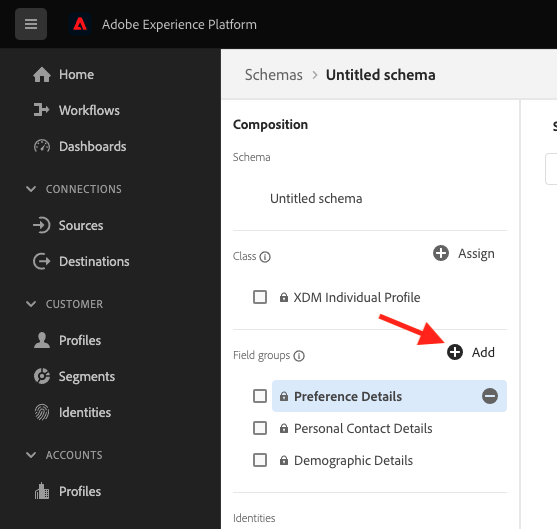
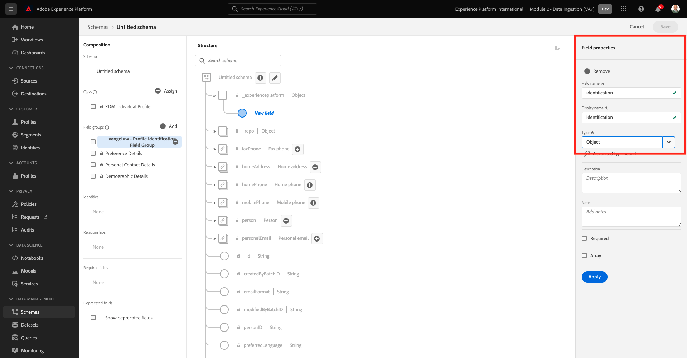
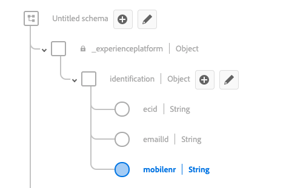
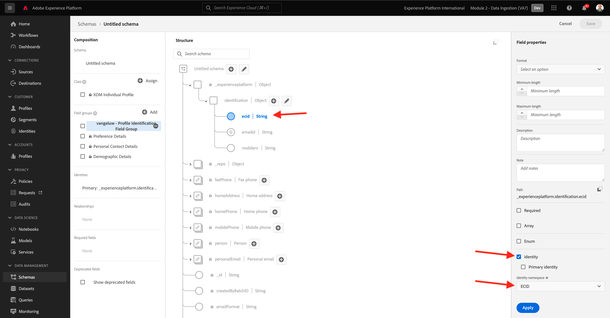
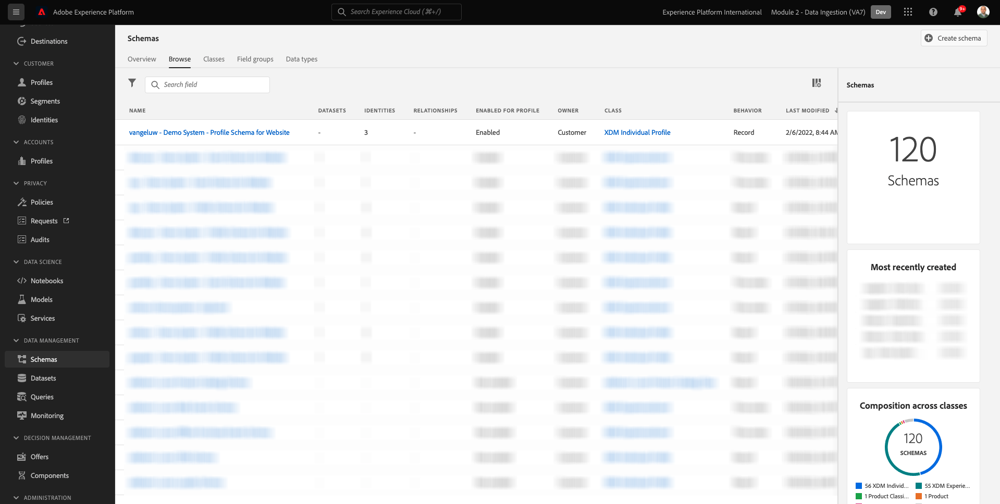
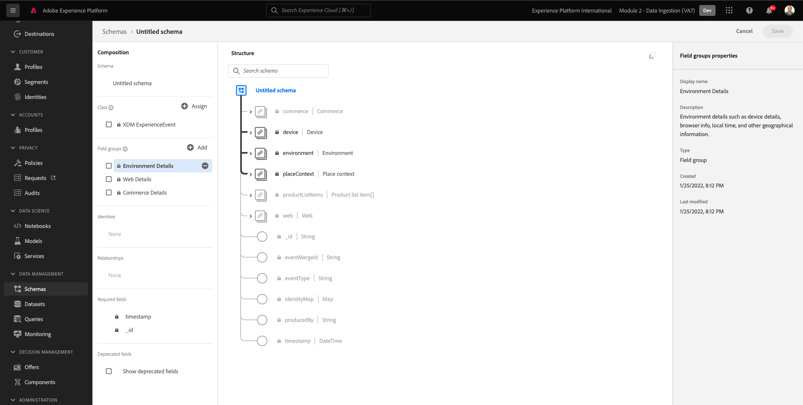

# 2.2 스키마 구성 및 식별자 설정

이 연습에서는 프로필 정보 및 고객 동작을 분류하도록 필요한 XDM 스키마를 구성합니다. 모든 XDM 스키마에서는 모든 정보를 연결할 기본 식별자를 구성해야 합니다.

## Story

XDM 스키마 구성 및 기본 식별자 설정을 시작하려면 먼저 수행하려는 작업의 비즈니스 컨텍스트에 대해 고려해야 합니다.

- 데이터를 원하는 경우
- 고객에 데이터를 연결하려는 경우
- 점진적, 실시간 고객 프로필을 빌드하려고 합니다

캡처할 데이터에는 다음 두 가지 유형이 있습니다.

- 이 고객은 누구입니까?
- 이 고객은 무엇을 합니까?

하지만, **이 고객은 누구입니까?** 그것은 많은 해답을 가진 매우 열린 질문입니다. 귀사에서 이 질문에 대한 답변을 확인하고자 하는 경우 이름, 성 및 주소와 같은 인구 통계 정보를 찾고 있습니다. 하지만 이메일 주소나 휴대폰 번호와 같은 연락처 정보를 위해 또한 Language, OptIn/OptOut 및 Profile Picture에 연결된 정보도 제공합니다. 마지막으로, 여러분이 정말 알아야 할 것은 귀사가 사용하는 다양한 시스템에서 어떻게 이 고객을 식별하게 될 것인가입니다.

그 질문에도 같은 것이 있다 **이 고객은 무엇을 합니까?** 질문에 답합니다. 그것은 많은 해답들로 매우 열린 질문입니다. 회사에서 이 질문에 대한 답변을 확인하려는 경우 고객이 온라인과 오프라인 자산에서 보유한 모든 상호 작용을 모색하고 있습니다. 방문한 페이지 또는 제품은 무엇입니까? 이 고객이 장바구니에 제품을 추가했습니까 아니면 심지어 품목을 구입했습니까? 웹 사이트를 탐색하는 데 사용된 장치와 브라우저는 무엇입니까? 이 고객은 어떤 종류의 정보를 찾고 있으며, 이를 사용하여 고객에게 쾌적한 경험을 구성하고 전달할 수 있습니까? 마지막으로, 우리가 정말 알아야 할 것은 귀사에서 사용하게 될 다양한 시스템에서 이 고객을 어떻게 식별하게 될 것인가입니다.

## 2.1.1 - 이 고객은 누구입니까?

응답 캡처 **이 고객은 누구입니까?** 의 경우 로그인/등록 페이지를 통해 수행됩니다.

스키마 관점에서 이것을 **클래스**. 질문: **이 고객은 누구입니까?** Class에서 정의하는 것입니다. **[!UICONTROL XDM 개별 프로필]**.

따라서 XDM 스키마를 만들어 답을 캡처하면 **이 고객은 누구입니까?**&#x200B;먼저 클래스를 참조하는 스키마 1개를 만들고 정의해야 합니다 **[!UICONTROL XDM 개별 프로필]**.

해당 질문에 지정할 수 있는 답변을 지정하려면 다음을 정의해야 합니다 [!UICONTROL 필드 그룹]. [!UICONTROL 필드 그룹] 는 프로필 클래스의 확장이며 매우 구체적인 구성을 가집니다. 예를 들어 이름, 성, 성별 및 생일과 같은 인구 통계 정보는 [!UICONTROL 필드 그룹]: **[!UICONTROL 인구 통계 세부 정보]**.

둘째, 귀사는 이 고객을 식별하는 방법을 결정해야 합니다. 회사의 경우 알려진 고객의 주 식별자는 이메일 주소와 같은 특정 고객 ID일 수 있습니다. 하지만 기술적으로, 휴대폰 번호를 사용하는 것과 같이 회사에서 고객을 식별하는 다른 방법이 있습니다.
이 실습에서는 이메일 주소를 기본 식별자로 정의하고 전화 번호를 보조 식별자로 정의합니다.

마지막으로 데이터가 캡처된 채널을 구분하는 것이 중요합니다. 이 경우 웹 사이트 등록 및 정의해야 하는 스키마에 대해 설명하겠습니다 **여기서** 등록 데이터가 캡처되었습니다. 또한 이 채널은 데이터가 캡처되는 것에 영향을 주는 중요한 역할을 합니다. 이와 같이 수집된 데이터의 모든 조합, 기본 식별자 및 유형마다 스키마 를 정의하는 것이 좋습니다.

위의 내용을 기반으로 Adobe Experience Platform에서 스키마를 구성해야 합니다.

다음 URL로 이동하여 Adobe Experience Platform에 로그인합니다. [https://experience.adobe.com/platform](https://experience.adobe.com/platform).

로그인하면 Adobe Experience Platform 홈 페이지가 표시됩니다.

계속하기 전에 **샌드박스**. 선택할 샌드박스의 이름은 다음과 같습니다 ``--module2sandbox--``. 이 작업은 텍스트를 클릭하여 수행할 수 있습니다 **[!UICONTROL 프로덕션 제품]** 화면 상단에 있는 파란색 줄에 표시됩니다. 적절한 샌드박스를 선택하면 화면 변경 사항이 표시되고 이제 전용 샌드박스에 있습니다.

Adobe Experience Platform에서 **[!UICONTROL 스키마]** 을 클릭합니다. 사용 가능한 목록 이 표시됩니다 [!UICONTROL 스키마].

새 스키마를 만들어야 합니다. 새 스키마를 만들려면 버튼을 클릭합니다 **[!UICONTROL + 스키마 만들기]** 을(를) 선택합니다. **[!UICONTROL XDM 개별 프로필]**.

을 클릭한 후 **[!UICONTROL + 스키마 만들기]** 단추를 클릭하면 새 스키마가 만들어지고 선택 또는 만들라는 메시지가 표시됩니다 **필드 그룹**.

이제 질문에 대한 답을 정의해야 합니다 **이 고객은 누구입니까?** 비슷해야 합니다.
이 실습의 도입에서는 고객을 정의해야 하는 다음과 같은 특성이 필요하다는 점을 설명했습니다.

- 이름, 성 및 주소와 같은 인구 통계 정보
- 집 주소, 이메일 주소 또는 휴대폰 번호와 같은 연락처 정보
- 언어, OptIn/OptOut 및 프로필 그림과 연결된 기타 정보.
- 고객의 기본 식별자

해당 정보를 스키마의 일부로 만들려면 다음을 추가해야 합니다 [!UICONTROL 필드 그룹] 스키마에서 다음을 수행합니다.

- 인구 통계 세부 정보(인구 통계 정보)
- 개인 연락처 세부 정보(연락처 정보)
- 기본 설정 세부 정보(기타 정보)
- 회사의 사용자 지정 프로필 식별 필드 그룹(기본 및 보조 식별자)

에서 **[!UICONTROL 필드 그룹 추가]** 화면에서 을 선택합니다. [!UICONTROL 필드 그룹] **[!UICONTROL 인구 통계 세부 정보]**, **[!UICONTROL 개인 연락처 세부 정보]** 및 **[!UICONTROL 기본 설정 세부 정보]**.

을(를) 클릭합니다. **[!UICONTROL 필드 그룹 추가]** 버튼을 클릭하여 [!UICONTROL 필드 그룹] 를 스키마 로 전환합니다.

이제 다음을 수행합니다.

다음으로, 새로운 기능이 필요합니다 [!UICONTROL 필드 그룹] 캡처 **[!UICONTROL 식별자]** 데이터 수집에 사용됩니다. 이전 연습에서 보듯이, 기본 및 보조 식별자의 개념이 있습니다. 기본 식별자는 가장 중요한 식별자로, 수집된 모든 데이터가 이 식별자와 연결됩니다.

이제 자신만의 사용자 지정 규칙을 만듭니다 [!UICONTROL 필드 그룹] 그렇게 하면 [!UICONTROL XDM 스키마] 회사의 요구 사항을 충족하기 위한 것입니다.

을(를) 클릭합니다. **[!UICONTROL + 추가]** 단추를 클릭하여 추가 [!UICONTROL 필드 그룹].

기존 를 재사용하는 대신 [!UICONTROL 필드 그룹]: 이제 직접 만듭니다 [!UICONTROL 필드 그룹]. 이 작업은 을(를) 선택하여 수행할 수 있습니다 **[!UICONTROL 새 필드 그룹 만들기]**.

이제 다음을 제공해야 합니다 **[!UICONTROL 표시 이름]** 및 **[!UICONTROL 설명]** 새로운 [!UICONTROL 필드 그룹].

스키마 이름으로 다음 항목을 사용합니다.
`--demoProfileLdap-- - Profile Identification Field Group`

예를 들어 ldap의 경우 **[!UICONTROL vangeluw]**, 스키마 이름이어야 합니다.

**[!UICONTROL vangeluw - 프로필 식별 필드 그룹]**

그러면 다음과 같은 이점이 있습니다.

을(를) 클릭합니다. **[!UICONTROL 필드 그룹 추가]** 새로 만든 버튼을 추가하는 방법 [!UICONTROL 필드 그룹] 를 스키마 로 전환합니다.

이제 이 스키마 구조가 제자리에 있어야 합니다.

새로운 [!UICONTROL 필드 그룹] 가 아직 비어 있으므로 이제 해당 필드에 필드를 추가해야 합니다 [!UICONTROL 필드 그룹].
에서 [!UICONTROL 필드 그룹]-list에서 사용자 지정 [!UICONTROL 필드 그룹].

이제 여러 개의 새 단추가 표시됩니다.

스키마의 최상위 수준에서 **[!UICONTROL + 필드 추가]** 버튼을 클릭합니다.

을 클릭한 후 **[!UICONTROL + 필드 추가]** 단추, 이제 새 **[!UICONTROL 개체]** 를 스키마 내에 지정합니다. 이 개체는 사용자 지정 항목을 나타냅니다 **[!UICONTROL 개체]** 는 스키마에서 Adobe Experience Platform 테넌트 ID의 이름을 따서 지정합니다. Adobe Experience Platform 테넌트 ID는 `--aepTenantId--`.

이제 해당 테넌트 아래에 새 개체를 추가합니다. 이렇게 하려면 필드를 클릭합니다 **[!UICONTROL 새 필드]** tenant-object 아래에 표시됩니다.

다음 개체 정의 사용:

- 필드 이름: **[!UICONTROL 식별]**
- 표시 이름:  **[!UICONTROL 식별]**
- 유형: **[!UICONTROL 개체]**

클릭 **[!UICONTROL 적용]** 변경 사항을 저장하려면 을 클릭합니다.

클릭 후 **[!UICONTROL 적용]**: 이제 **[!UICONTROL 식별]** 스키마 내의 객체입니다.

이제 아래에 3개의 새 필드를 추가합니다  **[!UICONTROL 식별]** 개체:

- ecid:
   - 필드 이름: **[!UICONTROL ecid]**
   - 표시 이름:  **[!UICONTROL ecid]**
   - 유형:**[!UICONTROL 문자열]**

- emailId
   - 필드 이름: **[!UICONTROL emailId]**
   - 표시 이름:  **[!UICONTROL emailId]**
   - 유형:**[!UICONTROL 문자열]**

- mobilenr
   - 필드 이름: **[!UICONTROL mobilenr]**
   - 표시 이름:  **[!UICONTROL mobilenr]**
   - 유형:**[!UICONTROL 문자열]**

각 필드는 유형으로 정의됩니다 **[!UICONTROL 문자열]** 그리고 다음 필드를 **[!UICONTROL ID]**. 스키마 **[!UICONTROL 웹 사이트 등록 스키마]**, 고객은 항상 이메일 주소로 식별된다고 가정하지만 이는 사용자가 필드를 구성해야 함을 의미합니다 **[!UICONTROL emailId]** 로서의 **[!UICONTROL 기본]** 식별자 및 다른 필드는 다음과 같습니다. **[!UICONTROL 보조]** 식별자.

필드를 추가하려면 **[!UICONTROL +]** 버튼 옆에 있음 **[!UICONTROL 식별]** 개체.

이제 빈 필드가 있습니다. 표시된 대로 위의 3개 필드를 구성해야 합니다.

다음은 각 필드가 초기 필드 구성을 확인하는 방법입니다.

을(를) 클릭합니다. **[!UICONTROL +]** 버튼 옆에 있음 **[!UICONTROL 식별]** 개체를 사용하여 새 필드를 만들고 지정된 대로 필드를 채웁니다.

- ecid

필드를 저장하려면 **[!UICONTROL 필드 속성]** 버튼을 볼 때까지 **[!UICONTROL 적용]**. 을(를) 클릭합니다. **[!UICONTROL 적용]** 버튼을 클릭합니다.

을(를) 클릭합니다. **[!UICONTROL +]** 버튼 옆에 있음 **[!UICONTROL 식별]** 개체를 사용하여 새 필드를 만들고 지정된 대로 필드를 채웁니다.

- emailId

필드를 저장하려면 **[!UICONTROL 필드 속성]** 버튼을 볼 때까지 **[!UICONTROL 적용]**. 을(를) 클릭합니다. **[!UICONTROL 적용]** 버튼을 클릭합니다.

을(를) 클릭합니다. **[!UICONTROL +]** 버튼 옆에 있음 **[!UICONTROL 식별]** 개체를 사용하여 새 필드를 만들고 지정된 대로 필드를 채웁니다.

- mobilenr

필드를 저장하려면 **[!UICONTROL 필드 속성]** 버튼을 볼 때까지 **[!UICONTROL 적용]**. 을(를) 클릭합니다. **[!UICONTROL 적용]** 버튼을 클릭합니다.

이제 3개의 필드가 있지만 이러한 필드가 **[!UICONTROL ID]**-fields 아직 없습니다.

이러한 필드를 **[!UICONTROL ID]**-fields, 다음 단계를 수행합니다.

- 필드를 선택합니다 **[!UICONTROL emailId]**.
- 오른쪽의 필드 속성에서 다음을 볼 때까지 아래로 스크롤합니다. **[!UICONTROL ID]**. 에 대한 확인란을 선택합니다. **[!UICONTROL ID]**.

   

- 이제 다음에 대한 확인란을 선택합니다. **[!UICONTROL 기본 ID]**.

   

- 마지막으로 네임스페이스를 선택합니다 **[!UICONTROL 이메일]** 목록 **[!UICONTROL 네임스페이스]**. 네임스페이스 는 Adobe Experience Platform의 ID 그래프에서 네임스페이스에서 식별자를 분류하고 이러한 네임스페이스 간의 관계를 정의하는 데 사용됩니다.

   

- 마지막으로 **[!UICONTROL 적용]** 변경 사항을 저장하려면 을 클릭합니다.

   

다음으로, **[!UICONTROL ecid]** 및 **[!UICONTROL mobilenr]** 를 보조 식별자로 사용합니다.

- 필드를 선택합니다 **[!UICONTROL ecid]**.
- 오른쪽의 필드 속성에서 다음을 볼 때까지 아래로 스크롤합니다. **[!UICONTROL ID]**. 에 대한 확인란을 선택합니다. **[!UICONTROL ID]**.

   

- 그런 다음 네임스페이스를 선택합니다 **[!UICONTROL ECID]** 목록 **[!UICONTROL 네임스페이스]**. A [!UICONTROL 네임스페이스] Adobe Experience Platform의 Identity Graph에서 네임스페이스에서 식별자를 분류하고 이러한 네임스페이스 간의 관계를 정의하는 데 사용됩니다.

   

- 클릭 **[!UICONTROL 적용]** 변경 사항을 저장하려면 을 클릭합니다.

   

- 필드를 선택합니다 **[!UICONTROL mobilenr]**.
- 오른쪽의 필드 속성에서 다음을 볼 때까지 아래로 스크롤합니다. **[!UICONTROL ID]**. 에 대한 확인란을 선택합니다. **[!UICONTROL ID]**.

   

- 네임스페이스를 선택해야 합니다 **[!UICONTROL 전화]** 목록 **[!UICONTROL 네임스페이스]**. 네임스페이스 는 Adobe Experience Platform의 ID 그래프에서 네임스페이스에서 식별자를 분류하고 이러한 네임스페이스 간의 관계를 정의하는 데 사용됩니다.

   

- 클릭 **[!UICONTROL 적용]** 변경 사항을 저장하려면 을 클릭합니다.

   

다음 **[!UICONTROL 식별]** 이제 3개의 id 필드가 표시되면서 개체가 다음과 같이 표시되어야 합니다 **[!UICONTROL 지문]** 아이콘을 사용하여 식별자로 정의되었음을 나타냅니다.

이제 스키마에 이름을 지정하겠습니다. 필드를 선택합니다 **제목 없는 스키마**.

스키마 이름으로 다음 항목을 사용합니다.

`--demoProfileLdap-- - Demo System - Profile Schema for Website`

바꾸기 **[!UICONTROL ldap]** 특정 ldap에 의해 설정됩니다. 예를 들어 ldap의 경우 **[!UICONTROL vangeluw]**, 스키마 이름이어야 합니다.

**[!UICONTROL vangeluw - 데모 시스템 - 웹 사이트용 프로필 스키마]**

그러면 다음과 같은 이점이 있습니다.

이제 스키마를 정의했으며, 기존 스키마와 새로 만들었습니다 [!UICONTROL 필드 그룹] 및에 정의된 식별자가 있습니다.

클릭 **[!UICONTROL 저장]** 변경 사항을 저장하려면 을 클릭합니다.

여기서 마지막으로 수행할 작업은 스키마에 연결할 스키마를 활성화하는 것입니다 **[!UICONTROL 프로필]**.
프로필에 대한 스키마를 활성화하면 이 스키마에 대해 Adobe Experience Platform으로 전송되는 모든 데이터가 실시간 고객 프로필 환경의 일부가 되도록 하여, 모든 데이터를 쿼리, 세그멘테이션 및 활성화를 위해 실시간으로 사용할 수 있도록 합니다.

이렇게 하려면 스키마 이름을 선택합니다.

스키마의 오른쪽 탭에 **[!UICONTROL 프로필 전환]**: 현재 비활성화되어 있습니다.

를 활성화합니다 [!UICONTROL 프로필] - 클릭하여 전환합니다.

다음 메시지가 표시됩니다.

클릭 **[!UICONTROL 활성화]** 를 사용하여 프로필에 대해 이 스키마를 활성화하십시오.

이제 스키마가 [!UICONTROL 실시간 고객 프로필].

마지막으로 **[!UICONTROL 저장]** 스키마를 저장하려면 을 클릭합니다.

### 2.1.2 - 이 고객이 수행하는 작업

질문에 대한 답변 캡처 **이 고객은 무엇을 합니까?** 귀사에 대해서는 예를 들어 제품 페이지의 제품 보기를 통해 수행됩니다.

스키마 관점에서 우리는 이것을 **[!UICONTROL 클래스]**. 질문: **이 고객은 무엇을 합니까?** 우리가 수업에서 정의한 것들입니다 **[!UICONTROL ExperienceEvent]**.

따라서 [!UICONTROL XDM 스키마] 에 대한 답변을 **이 고객은 무엇을 합니까?**&#x200B;먼저 클래스를 참조하는 스키마 1개를 만들고 정의해야 합니다 **[!UICONTROL ExperienceEvent]**.

해당 질문에 지정할 수 있는 답변을 지정하려면 다음을 정의해야 합니다 [!UICONTROL 필드 그룹]. [!UICONTROL 필드 그룹] 는 [!UICONTROL ExperienceEvent]-class이고, 매우 구체적인 구성을 가집니다. 예를 들어 고객이 열람하거나 장바구니에 추가한 제품 종류에 대한 정보가 [!UICONTROL 필드 그룹] **상거래 세부 사항**.

두 번째, 귀사는 고객이 어떤 행동을 하는지 파악하는 방법을 결정해야 합니다. 웹 사이트에서의 상호 작용에 대해 얘기하고 있으므로 귀사는 고객을 알고 있을 수 있지만, 익명의 방문자가 웹 사이트에서 활성 상태인 것이 마찬가지로 가능합니다. 따라서 이메일 주소와 같은 식별자를 사용할 수 없습니다. 이 경우 귀사는 아마도 [!UICONTROL Experience Cloud ID(ECID)] 를 기본 식별자로 사용합니다.

마지막으로 데이터가 캡처된 채널을 구분하는 것이 중요합니다. 이 경우 웹 사이트 상호 작용 및 정의해야 하는 스키마에 대해 설명하겠습니다 **여기서** 상호 작용 데이터가 캡처되었습니다. 또한 이 채널은 데이터가 캡처되는 것에 영향을 주는 중요한 역할을 합니다. 이와 같이 수집된 데이터의 모든 조합, 기본 식별자 및 유형마다 스키마 를 정의하는 것이 좋습니다.

위의 내용을 기반으로 Adobe Experience Platform에서 스키마를 구성해야 합니다.

로그인하면 Adobe Experience Platform 홈 페이지가 표시됩니다.

계속하기 전에 **[!UICONTROL 샌드박스]**. 다음 [!UICONTROL 샌드박스] 선택하려면 이름이 지정됩니다. ``--module2sandbox--``. 이 작업은 텍스트를 클릭하여 수행할 수 있습니다 **[!UICONTROL 프로덕션 제품]** 화면 상단에 있는 파란색 줄에 표시됩니다. 적절한 샌드박스를 선택하면 화면 변경 사항이 표시되고 이제 전용 샌드박스에 있습니다.

Adobe Experience Platform에서 **[!UICONTROL 스키마]** 을 클릭합니다.

in [!UICONTROL 스키마]기존 스키마가 모두 표시됩니다.

새 스키마를 만들어야 합니다. 새 스키마를 만들려면 버튼을 클릭합니다 **[!UICONTROL + 스키마 만들기]** 을(를) 선택합니다. **[!UICONTROL XDM ExperienceEvent]**.

을 클릭한 후 **[!UICONTROL + 스키마 만들기]** 단추를 클릭하면 새 스키마가 만들어지고 선택 또는 만들라는 메시지가 표시됩니다 **필드 그룹**.

이제 질문에 대한 답을 정의해야 합니다 **이 고객은 무엇을 합니까?** 비슷해야 합니다.
이 실습의 도입에서는 고객이 수행하는 작업을 정의하기 위해 다음 특성이 필요하다는 점을 명시했습니다.

- 방문한 페이지 또는 제품은 무엇입니까?
- 이 고객이 장바구니에 제품을 추가했습니까 아니면 심지어 품목을 구입했습니까?
- 웹 사이트를 탐색하는 데 사용된 장치와 브라우저는 무엇입니까?
- 이 고객은 어떤 종류의 정보를 찾고 있으며, 이를 사용하여 고객에게 쾌적한 경험을 구성하고 전달할 수 있습니까?
- 고객의 기본 식별자

해당 정보를 스키마의 일부로 만들려면 다음을 추가해야 합니다 [!UICONTROL 필드 그룹] 스키마에서 다음을 수행합니다.

- 웹 세부 사항
- 상거래 세부 사항
- 환경 세부 정보
- 회사의 사용자 지정 프로필 식별 [!UICONTROL 필드 그룹] (기본 및 보조 식별자)

에서 **[!UICONTROL 필드 그룹 추가]** 화면에서 을 선택합니다. [!UICONTROL 필드 그룹] **[!UICONTROL 웹 세부 사항]**, **[!UICONTROL 상거래 세부 사항]** 및 **[!UICONTROL 환경 세부 사항]**.

을(를) 클릭합니다. **[!UICONTROL 필드 그룹 추가]** 필드 그룹을 스키마에 추가하는 단추.

그러면 다음 항목이 제공됩니다.

다음으로, 새 [!UICONTROL 필드 그룹] 캡처 **[!UICONTROL 식별자]** 데이터 수집에 사용됩니다. 이전 연습에서 보듯이, 기본 및 보조 식별자의 개념이 있습니다. 기본 식별자는 가장 중요한 식별자로, 수집된 모든 데이터가 이 식별자와 연결됩니다.

이제 자신만의 사용자 지정 규칙을 만듭니다 [!UICONTROL 필드 그룹] 그렇게 하면 [!UICONTROL XDM 스키마] 회사의 요구 사항을 충족하기 위한 것입니다.

A [!UICONTROL 필드 그룹] 에 연결되어 있습니다 [!UICONTROL 클래스]를 사용 중이기 때문에 이전에 만든 을 단순히 재사용할 수 없습니다 [!UICONTROL 필드 그룹].

을(를) 클릭합니다. **[!UICONTROL + 추가]** 단추를 클릭하여 추가 [!UICONTROL 필드 그룹].

기존 를 재사용하는 대신 [!UICONTROL 필드 그룹]: 이제 직접 만듭니다 [!UICONTROL 필드 그룹]. 이 작업은 을(를) 선택하여 수행할 수 있습니다 **[!UICONTROL 새 필드 그룹 만들기]**.

이제 다음을 제공해야 합니다 **[!UICONTROL 표시 이름]** 및 **[!UICONTROL 설명]** 새 필드 그룹에 사용할 수 있습니다.

필드 그룹의 이름으로 다음 항목을 사용하십시오.

`--demoProfileLdap-- - ExperienceEvent Identification Field Group`

예를 들어 ldap의 경우 **[!UICONTROL vangeluw]**, 스키마 이름이어야 합니다.

**[!UICONTROL vangeluw - ExperienceEvent Id 필드 그룹]**

그러면 다음과 같은 이점이 있습니다.

을(를) 클릭합니다. **[!UICONTROL 필드 그룹 추가]** 새로 만든 버튼을 추가하는 방법 [!UICONTROL 필드 그룹] 를 스키마 로 전환합니다.

이제 이것을 가지고 있어야 합니다 [!UICONTROL 스키마] 구조 내.

새로운 [!UICONTROL 필드 그룹] 가 아직 비어 있으므로 해당 필드 그룹에 필드를 추가해야 합니다.
에서 [!UICONTROL 필드 그룹]-list에서 사용자 지정 [!UICONTROL 필드 그룹].

이제 여러 개의 새 단추가 표시됩니다.

스키마 최상위 수준의 스키마 - 이름 옆에 있는 **[!UICONTROL +]** 버튼을 클릭합니다.

을 클릭한 후 **[!UICONTROL +]** 단추, 이제 새 **[!UICONTROL 개체]** 를 스키마 내에 지정합니다. 이 개체는 사용자 지정 항목을 나타냅니다 **[!UICONTROL 개체]** 다음 위치에서 [!UICONTROL 스키마] 및 는 Adobe Experience Platform 테넌트 ID의 이름을 따라 명명됩니다. Adobe Experience Platform 테넌트 ID는 `--aepTenantId--`.

이제 해당 테넌트 아래에 새 개체를 추가합니다. 이렇게 하려면 필드를 클릭합니다 **[!UICONTROL 새 필드]** tenant-object 아래에 표시됩니다.

다음 개체 정의 사용:

- 필드 이름: **[!UICONTROL 식별]**
- 표시 이름:  **[!UICONTROL 식별]**
- 유형: **[!UICONTROL 개체]**

아래로 스크롤하여 클릭 **[!UICONTROL 적용]** 변경 사항을 저장하려면 을 클릭합니다.

클릭 후 **[!UICONTROL 적용]**: 이제 **[!UICONTROL 식별]** 스키마 내의 객체입니다.

이제 아래에 1개의 새 필드를 추가합니다.  **[!UICONTROL 식별]** 개체.

을(를) 클릭합니다. **[!UICONTROL +]** 버튼 옆에 있음 **[!UICONTROL 식별]** 새 필드를 만드는 개체

ECID-필드가 유형으로 정의됩니다 **[!UICONTROL 문자열]** 이 필드를 **[!UICONTROL ID]**. 스키마 **[!UICONTROL 데모 시스템 - 웹 사이트용 이벤트 스키마]**, 고객은 항상 해당 고객으로 식별된다고 가정합니다 [!UICONTROL ECID]즉, 필드를 구성해야 합니다 **[!UICONTROL ECID]** 로서의 **기본** 식별자

이제 빈 필드가 있습니다. 표시된 대로 위의 필드를 구성해야 합니다.

- ecid:

   - 필드 이름: **[!UICONTROL ecid]**
   - 표시 이름:  **[!UICONTROL ecid]**
   - 유형:**[!UICONTROL 문자열]**

다음은 [!UICONTROL ecid]-field는 초기 필드 구성을 살펴보아야 합니다.

아래로 스크롤하여 클릭 **[!UICONTROL 적용]**.

이제 새 필드가 있지만 이 필드가 **[!UICONTROL ID]**&#x200B;아직 없습니다.

이러한 필드를 **[!UICONTROL ID]**-fields, 다음 단계를 수행합니다.

- 필드를 선택합니다 **[!UICONTROL ecid]**.
- 오른쪽의 필드 속성에서 다음을 볼 때까지 아래로 스크롤합니다. **[!UICONTROL ID]**. 에 대한 확인란을 선택합니다. **[!UICONTROL ID]**.

- 이제 다음에 대한 확인란을 선택합니다. **[!UICONTROL 기본 ID]**.

- 마지막으로 네임스페이스를 선택합니다 **[!UICONTROL ECID]** 목록 **[!UICONTROL 네임스페이스]**. A [!UICONTROL 네임스페이스] 이 [!UICONTROL ID 그래프] Adobe Experience Platform에서 네임스페이스에서 식별자를 분류하고 이러한 네임스페이스 간의 관계를 정의합니다.

   

- 마지막으로 **[!UICONTROL 적용]** 변경 사항을 저장하려면 을 클릭합니다.

   

다음 **[!UICONTROL 식별]** 이제 개체가 이렇게 표시되어야 하며 ecid-field에서도 가 표시됩니다 **지문** 아이콘을 사용하여 식별자로 정의되었음을 나타냅니다.

이제 스키마에 이름을 지정하겠습니다. 필드를 선택합니다 **제목 없는 스키마**.

스키마 이름으로 다음 항목을 사용합니다.
`--demoProfileLdap-- - Demo System - Event Schema for Website`

예를 들어 ldap의 경우 **[!UICONTROL vangeluw]**, 스키마 이름이어야 합니다.

**[!UICONTROL vangeluw - 데모 시스템 - 웹 사이트용 이벤트 스키마]**

그러면 다음과 같은 이점이 있습니다.

클릭 **[!UICONTROL 저장]** 변경 사항을 저장하려면 을 클릭합니다.

결국 이 스키마에 대해 데이터를 수집할 때 일부 필드가 필요하다는 점에 유의해야 합니다.
예를 들어, 필드 **[!UICONTROL _id]** 및 **[!UICONTROL timestamp]** 필수 필드입니다.

- _id에는 특정 데이터 수집에 대한 고유 id가 포함되어야 합니다.
- 타임스탬프는 이 히트의 타임스탬프여야 합니다(형식) **[!UICONTROL &quot;YYYY-MM-DDHH:MM:SSSZ&quot;]**, 예: **[!UICONTROL &quot;2019-04-08T07:20:000Z&quot;]**

이제 스키마를 정의했으며, 기존 스키마와 새로 만들었습니다 [!UICONTROL 필드 그룹] 및에 정의된 식별자가 있습니다.

여기서 마지막으로 수행할 작업은 스키마에 연결할 스키마를 활성화하는 것입니다 **[!UICONTROL 프로필]**.
스키마 활성화 [!UICONTROL 프로필]를 설정하는 경우 이 스키마에 대해 Adobe Experience Platform으로 전송되는 모든 데이터가 실시간 고객 프로필에 포함되는지 확인합니다. 이 프로필은 모든 데이터를 쿼리, 세그멘테이션 및 활성화를 위해 실시간으로 사용할 수 있도록 합니다.

이렇게 하려면 스키마 이름을 선택합니다.

스키마의 오른쪽 탭에 **[!UICONTROL 프로필] 전환**: 현재 비활성화되어 있습니다.

를 활성화합니다 [!UICONTROL 프로필] - 클릭하여 전환합니다.

다음 메시지가 표시됩니다.

클릭 **[!UICONTROL 활성화]** 를 사용하여 프로필에 대해 이 스키마를 활성화하십시오.

이제 스키마가 실시간 고객 프로필에 포함되도록 구성되었습니다.

마지막으로 **[!UICONTROL 저장]** 스키마를 저장하려면 을 클릭합니다.

이제 실시간 고객 프로필에서 사용할 수 있도록 활성화된 스키마 작성을 마쳤습니다.

다음 연습에서 데이터 세트를 살펴보겠습니다.

다음 단계: [2.3 데이터 세트 구성](./ex3.md)

[모듈 2로 돌아가기](./data-ingestion.md)

[모든 모듈로 돌아가기](../../overview.md)
