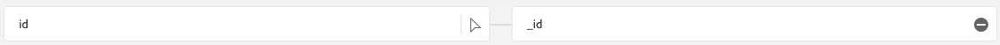
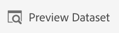

# 2.4 오프라인 소스에서 데이터 수집

이 연습에서 목표는 플랫폼에서 CRM 데이터와 같은 외부 데이터를 온보딩하는 것입니다.

## 학습 목표

- 테스트 데이터를 생성하는 방법 알아보기
- CSV를 수집하는 방법을 알아봅니다
- 워크플로우를 통해 데이터 처리에 웹 UI를 사용하는 방법을 알아봅니다
- Experience Platform의 데이터 거버넌스 기능 이해

## 리소스

- 미사로 UI: [https://www.mockaroo.com/](https://www.mockaroo.com/)
- Experience Platform UI: [https://experience.adobe.com/platform/](https://experience.adobe.com/platform/)

## Tasks

- 데모 날짜가 있는 CSV 파일을 만듭니다. 사용 가능한 워크플로우를 사용하여 Adobe Experience Platform에서 CSV 파일을 섭취합니다.
- Adobe Experience Platform의 데이터 거버넌스 옵션 이해

## 2.4.1 데이터 생성기 도구를 통해 CRM 데이터 세트 만들기

이를 위해서는 CRM 데이터 샘플 줄이 1000개 필요합니다.

로 이동하여 Mockaro 템플릿을 엽니다. [https://www.mockaroo.com/12674210](https://www.mockaroo.com/12674210).

템플릿에서 다음 필드를 확인할 수 있습니다.

- ID
- first_name
- last_name
- 이메일
- 성별
- firstDate
- home_latitude
- home_longitude
- country_code
- city
- 국가

이러한 모든 필드는 Platform과 호환되는 데이터를 생성하도록 정의되어 있습니다.

CSV 파일을 생성하려면 **[!UICONTROL 데이터 다운로드]** 1,000줄 데모 데이터가 있는 CSV 파일을 제공하는 단추입니다.

콘텐츠를 시각화하려면 Microsoft Excel에서 CSV 파일을 엽니다.

CSV 파일이 준비되면 XDM에 대한 매핑을 계속 진행할 수 있습니다.

### 2.4.2 Adobe Experience Platform에서 CRM 온보딩 데이터 세트 확인

열기 [Adobe Experience Platform](https://experience.adobe.com/platform) 그리고 **[!UICONTROL 데이터 세트]**.

계속하기 전에 **[!UICONTROL 샌드박스]**. 선택할 샌드박스의 이름은 다음과 같습니다 ``--module2sandbox--``. 이 작업은 텍스트를 클릭하여 수행할 수 있습니다 **[!UICONTROL 프로덕션 제품]** 화면 상단에 있는 파란색 줄에 표시됩니다. 적절한 [!UICONTROL 샌드박스]이렇게 하면 화면 변경 사항이 표시되고 이제 전용 화면에 표시됩니다 [!UICONTROL 샌드박스].

Adobe Experience Platform에서 **[!UICONTROL 데이터 세트]** 을 클릭합니다.

이 지원 기반의 공유 데이터 세트를 사용합니다. 공유 데이터 세트가 이미 만들어졌고 이 호출됩니다 **[!UICONTROL 데모 시스템 - CRM용 프로필 데이터 세트(글로벌 v1.1)]**.

데이터 세트를 엽니다. **[!UICONTROL 데모 시스템 - CRM용 프로필 데이터 세트(글로벌 v1.1)]**.

개요 화면에서는 3가지 주요 정보를 볼 수 있습니다.

우선, [!UICONTROL 데이터 집합 활동] 대시보드는 데이터 집합 및 수집된 일괄 처리의 총 CRM 레코드 수와 해당 상태를 보여줍니다

두 번째, 페이지에서 아래로 스크롤하여 데이터 배치가 수집되는 시기, 온보딩된 레코드 수와 일괄 처리가 성공적으로 온보딩되었는지 여부를 확인할 수 있습니다. 다음 **[!UICONTROL 배치 ID]** 은 특정 배치 작업의 식별자이며, **[!UICONTROL 배치 ID]** 은 특정 일괄 처리가 성공적으로 온보딩되지 않은 이유를 해결하는 데 사용할 수 있으므로 중요합니다.

마지막으로, [!UICONTROL 데이터 집합 정보] 탭에는 다음과 같은 중요한 정보가 표시됩니다 [!UICONTROL 데이터 세트 ID] (다시 말하지만, 문제 해결 관점에서 중요), 데이터 세트의 이름 및 데이터 세트가 프로필에 대해 활성화되었는지 여부.

여기서 가장 중요한 설정은 데이터 세트와 스키마 간의 링크입니다. 스키마는 수집할 수 있는 데이터와 그 데이터의 모양을 정의합니다.

이 경우 **[!UICONTROL 데모 시스템 - CRM용 프로필 스키마(전역 v1.1)]**: 의 클래스에 대해 매핑됩니다 **[!UICONTROL 프로필]** 및 는 필드 그룹이라고도 하는 확장을 구현했습니다.

스키마 이름을 클릭하면 [!UICONTROL 스키마] 개요 를 클릭하면 이 스키마에 대해 활성화된 모든 필드를 볼 수 있습니다.

모든 스키마에는 사용자 정의 기본 설명자가 정의되어 있어야 합니다. CRM 데이터 세트의 경우 스키마에서 해당 필드를 정의합니다 **[!UICONTROL crmId]** 는 기본 식별자여야 합니다. 스키마를 만들어 [!UICONTROL 실시간 고객 프로필], 사용자 지정 을 정의해야 합니다 [!UICONTROL 필드 그룹] 기본 설명자를 참조합니다.

위의 스크린샷에서는 설명자가 `--aepTenantId--.identification.core.crmId`: [!UICONTROL 기본 식별자]에 연결된 [!UICONTROL namespace] 의 **[!UICONTROL 데모 시스템 - CRMID]**.

모든 스키마 및 이와 같이 [!UICONTROL 실시간 고객 프로필] 하나 있어야 합니다 [!UICONTROL 기본 식별자]. 이 [!UICONTROL 기본 식별자] 는 해당 데이터 세트에 있는 고객에 대한 브랜드의 식별자 사용자입니다. CRM 데이터 세트의 경우 이메일 주소 또는 CRM ID일 수 있으며, 콜 센터 데이터 세트의 경우 고객의 모바일 번호일 수 있습니다.

모든 데이터 세트에 대해 별도의 특정 스키마를 만들고, 브랜드가 사용하는 현재 솔루션의 작동 방식과 일치하도록 특별히 모든 데이터 세트에 대한 설명자를 설정하는 것이 좋습니다.

### 2.4.3 워크플로우를 사용하여 CSV 파일을 XDM 스키마에 매핑

목적은 플랫폼에서 CRM 데이터를 온보딩하는 것입니다. 플랫폼에서 수집된 모든 데이터는 특정 XDM 스키마에 대해 매핑해야 합니다. 현재 가지고 있는 것은 한 쪽에 1,000개의 줄이 있는 CSV 데이터 세트와 다른 쪽의 스키마에 연결된 데이터 세트입니다. 해당 데이터 세트에 해당 CSV 파일을 로드하려면 매핑이 수행되어야 합니다. 이러한 매핑 연습을 용이하게 하기 위해 **[!UICONTROL 워크플로우]** Adobe Experience Platform에서 사용할 수 있습니다.

다음 [!UICONTROL 워크플로우] 우리가 여기서 사용할 수 있는 건 [!UICONTROL 워크플로우] 명명된 이름 **[!UICONTROL XDM 스키마에 CSV 매핑]** 에서 [!UICONTROL 데이터 수집] 메뉴 아래의 제품에서 사용할 수 있습니다.

을(를) 클릭합니다. **[!UICONTROL XDM 스키마에 CSV 매핑]** 버튼을 클릭합니다. 클릭 **[!UICONTROL Launch]** 프로세스를 시작합니다.

다음 화면에서 파일을 수집할 데이터 세트를 선택해야 합니다. 이미 존재하는 데이터 세트를 선택하거나 새 데이터 세트를 만들 수 있습니다. 이 연습에서는 기존 연습을 다시 사용합니다. 다음을 선택하십시오. **[!UICONTROL 데모 시스템 - CRM용 프로필 데이터 세트(글로벌 v1.1)]** 아래에 표시된 대로 다른 설정을 기본값으로 설정된 상태로 둡니다.

클릭 **[!UICONTROL 다음]** 를 눌러 다음 단계로 이동합니다.

CSV 파일을 끌어다 놓거나 를 클릭합니다 **[!UICONTROL 찾아보기]** 컴퓨터에서 바탕 화면으로 이동하여 CSV 파일을 선택합니다.

CSV 파일을 선택하면 즉시 업로드되며 몇 초 내에 파일의 미리 보기가 표시됩니다.

클릭 **[!UICONTROL 다음]** 를 눌러 다음 단계로 이동합니다. 파일을 완전히 처리하는 데 몇 초 정도 걸릴 수 있습니다.

이제 CSV 열 헤더를 의 XDM 속성에 매핑해야 합니다 **[!UICONTROL 데모 시스템 - CRM용 프로필 데이터 세트]**.

Adobe Experience Platform이 이미 몇 가지 제안을 했습니다. [!UICONTROL 소스 속성] 사용 [!UICONTROL Target 스키마 필드].

대상 [!UICONTROL 스키마 매핑], Adobe Experience Platform은 이미 필드를 함께 연결하려고 했습니다. 그러나, 매핑의 모든 제안이 올바른 것은 아닙니다. 이제 다음을 수행해야 합니다. **대상 필드 수락** 하나씩

#### firstDate

소스 스키마 필드 **firstDate** 대상 필드에 연결해야 합니다 **person.firstDate**.

#### city

소스 스키마 필드 **city** 대상 필드에 연결해야 합니다 **homeAddress.city**.

#### 국가

소스 스키마 필드 **국가** 대상 필드에 연결해야 합니다 **homeAddress.country**.

#### country_code

소스 스키마 필드 **country_code** 대상 필드에 연결해야 합니다 **homeAddress.countryCode**.

#### 이메일

소스 스키마 필드 **이메일** 대상 필드에 연결해야 합니다 **personalEmail.address**.

#### crmid

소스 스키마 필드 ****는 대상 필드에 연결해야 합니다 **`--aepTenantId--`.identification.core.crmId**.

#### first_name

소스 스키마 필드 **first_name** 대상 필드에 연결해야 합니다 **person.name.firstName**.

#### 성별

소스 스키마 필드 **성별** 대상 필드에 연결해야 합니다 **person.gender**.

#### home_latitude

소스 스키마 필드 **home_latitude** 대상 필드에 연결해야 합니다 **homeAddress._schema.latitude**.

#### home_longitude

소스 스키마 필드 **home_longitude** 대상 필드에 연결해야 합니다 **homeAddress._schema.longitude**.

#### ID

소스 스키마 필드 **id** 대상 필드에 연결해야 합니다 **_id**.

#### last_name

소스 스키마 필드 **last_name** 대상 필드에 연결해야 합니다 **person.name.lastName**.

이제 다음을 수행해야 합니다.

을(를) 클릭합니다. **[!UICONTROL 완료]** 버튼을 클릭하여 워크플로우를 완료합니다.

클릭 후 **[!UICONTROL 완료]**&#x200B;로 설정되면 **데이터 흐름** 개요 및 몇 분 후에 화면을 새로 고쳐 워크플로우가 성공적으로 완료되었는지 확인할 수 있습니다. 을(를) 클릭합니다. **Target 데이터 세트 이름**.

그러면 수집이 처리된 데이터 세트가 표시됩니다.

데이터 집합에 [!UICONTROL 배치 ID] 방금 수집된 1000개의 레코드 및 상태 **[!UICONTROL 성공]**.

을(를) 클릭합니다. **[!UICONTROL 데이터 집합 미리 보기]**- 로드된 데이터가 올바른지 확인하기 위해 작은 데이터 세트 샘플을 빠르게 보려면 버튼을 클릭합니다.

데이터가 로드되면 데이터 세트에 대한 올바른 데이터 거버넌스 접근 방식을 정의할 수 있습니다.

### 2.5.4 데이터 세트에 데이터 거버넌스 추가

고객 데이터를 수집하므로 사용 및 내보내기 제어에 대해 이 데이터 세트가 제대로 제어되는지 확인해야 합니다. 을(를) 클릭합니다. **[!UICONTROL 데이터 거버넌스]** 탭하고 다음 세 가지 제한 유형을 설정할 수 있는지 확인합니다. 계약, ID 및 중요 데이터.

이 링크의 정책 프레임워크를 통해 다양한 레이블과 향후 적용되는 방법에 대한 자세한 정보를 찾을 수 있습니다. [https://www.adobe.io/apis/experienceplatform/home/dule/duleservices.html](https://www.adobe.io/apis/experienceplatform/home/dule/duleservices.html)

전체 데이터 세트에 대한 ID 데이터를 제한하겠습니다. 데이터 세트 이름 위로 마우스를 가져간 다음 연필 아이콘을 클릭하여 설정을 편집합니다.

이동 **[!UICONTROL ID 데이터]** 그리고 당신은 **[!UICONTROL I2]** 선택 사항 - 이 데이터 세트에 있는 모든 정보가 적어도 해당 사람에게 간접적으로 식별 가능한 것으로 가정합니다.

클릭 **[!UICONTROL 변경 내용 저장]** 그리고 관찰해서 **[!UICONTROL I2]** 이제 데이터 집합에 있는 모든 데이터 필드에 대해 설정됩니다.

개별 데이터 필드(예: **[!UICONTROL firstName]** 필드는 **[!UICONTROL I1]** 직접 식별 가능한 정보에 대한 수준입니다.

필드를 선택합니다 **[!UICONTROL firstName]** 확인란을 선택하고 을(를) 클릭합니다. **[!UICONTROL 거버넌스 레이블 편집]** 화면 오른쪽 상단 모서리에서 을(를) 클릭합니다.

이동 **[!UICONTROL ID 데이터]** 그리고 당신은 **[!UICONTROL I2]** 옵션이 이미 선택되어 있습니다(데이터 세트에서 상속됨). 필드 firstName도 필드별 구성을 가지며 **[!UICONTROL I1 - 직접 식별 가능한 데이터]**.

이제 Adobe Experience Platform에서 CRM 데이터를 성공적으로 수집하여 분류했습니다.

다음 단계: [2.5 데이터 랜딩 영역](./ex5.md)

[모듈 2로 돌아가기](./data-ingestion.md)

[모든 모듈로 돌아가기](../../overview.md)
