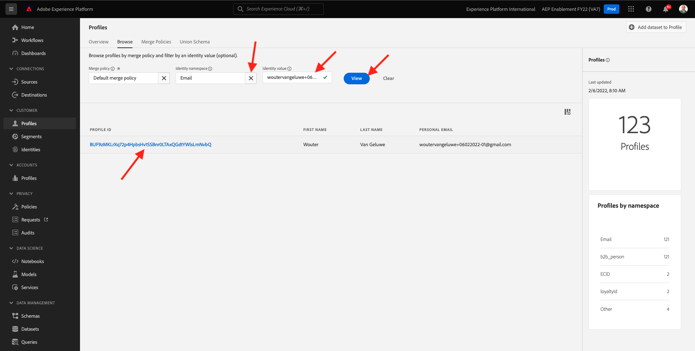
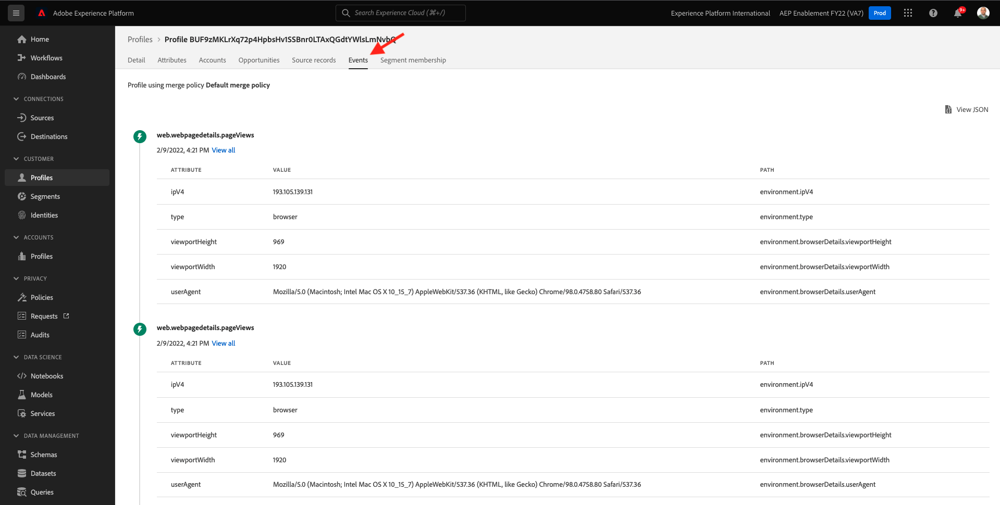

# 3.2 자신만의 실시간 고객 프로필 시각화 - UI

이 연습에서는 Adobe Experience Platform에 로그인하고 UI에서 고유한 실시간 고객 프로필을 봅니다.

## Story

실시간 고객 프로필에서는 모든 프로필 데이터가 이벤트 데이터와 기존 세그먼트 멤버십과 함께 표시됩니다. 표시된 데이터는 Adobe 애플리케이션과 외부 솔루션에서 가져온 것입니다. Adobe Experience Platform에서 가장 강력한 보기이며 기록의 실제 경험 시스템입니다.

## 3.2.1 Adobe Experience Platform에서 고객 프로필 보기 사용

이동 [Adobe Experience Platform](https://experience.adobe.com/platform). 로그인하면 Adobe Experience Platform 홈 페이지가 표시됩니다.

계속하기 전에 **샌드박스**. 선택할 샌드박스의 이름은 다음과 같습니다 ``--aepSandboxId--``. 이 작업은 텍스트를 클릭하여 수행할 수 있습니다 **[!UICONTROL 프로덕션 제품]** 화면 상단에 있는 파란색 줄에 표시됩니다. 적절한 [!UICONTROL 샌드박스]이렇게 하면 화면 변경 사항이 표시되고 이제 전용 화면에 표시됩니다 [!UICONTROL 샌드박스].

왼쪽 메뉴에서 **프로필** 및 **찾아보기**.

웹 사이트의 프로필 뷰어 패널에서 여러 ID를 찾을 수 있습니다. 모든 ID는 네임스페이스에 연결됩니다.

프로필 뷰어 패널에서는 ID 및 네임스페이스의 조합을 볼 수 있습니다.

| 신원 | 네임스페이스 |
|:-------------:| :---------------:|
| ECID(Experience Cloud ID) | 12507560687324495704459439363261812234 |
| 이메일 ID | woutervangeluwe+06022022-01@gmail.com |
| 모바일 번호 ID | +32473622044+06022022-01 |

Adobe Experience Platform을 사용하면 모든 ID가 동일하게 중요합니다. 이전에는 ECID가 Adobe 컨텍스트에서 가장 중요한 ID였고 다른 모든 ID는 계층 구조의 관계에서 ECID에 연결되어 있었습니다. Adobe Experience Platform을 사용하면 더 이상 이 문제가 발생하지 않으며 모든 ID를 기본 식별자로 간주할 수 있습니다.

일반적으로 기본 식별자는 컨텍스트에 따라 다릅니다. 콜센터에 문의하시면, **가장 중요한 ID는 무엇입니까?** 그들은 아마 대답할 것입니다. **전화 번호!** 하지만 CRM 팀에 문의하면 응답할 것입니다. **이메일 주소!**  Adobe Experience Platform은 이러한 복잡성을 이해하고 자동으로 관리합니다. Adobe 애플리케이션이든 Adobe이 아닌 애플리케이션이든 모든 애플리케이션은 기본 ID로 간주되는 ID를 참조하여 Adobe Experience Platform과 교류합니다. 그리고 그것은 단지 작동합니다.

필드 **ID 네임스페이스**, 선택 **이메일** 및 **ID 값** 이전 연습에서 등록할 때 사용한 이메일 주소를 입력합니다. 클릭 **보기**. 그러면 목록에 프로필이 표시됩니다. 을(를) 클릭합니다. **프로필 ID** 를 클릭하여 프로필을 엽니다.

이제 몇 가지 중요한 사항을 개괄적으로 볼 수 있습니다 **프로필 속성** 고객 프로필 정보.

프로필에 대해 사용 가능한 모든 프로필 속성을 보려면 **속성**.

이동 **이벤트**: 프로필에 연결된 모든 경험 이벤트에 대한 항목을 볼 수 있습니다.

마지막으로 메뉴 옵션으로 이동합니다 **세그먼트 멤버십**. 이제 이 프로필에 적합한 모든 세그먼트가 표시됩니다.

이제 Adobe Experience Platform의 사용자 인터페이스를 사용하여 고객의 실시간 프로필을 보는 방법을 알았으므로 Postman 및 Adobe I/O을 사용하여 Adobe Experience Platform의 API에 대해 쿼리하여 API를 통해 동일한 작업을 수행하겠습니다.

다음 단계: [3.3 실시간 고객 프로필 시각화 - API](./ex3.md)

[모듈 3으로 돌아가기](./real-time-customer-profile.md)

[모든 모듈로 돌아가기](../../overview.md)
