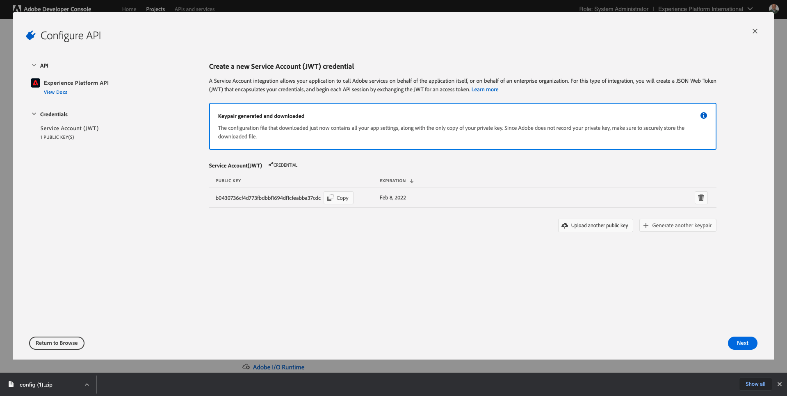
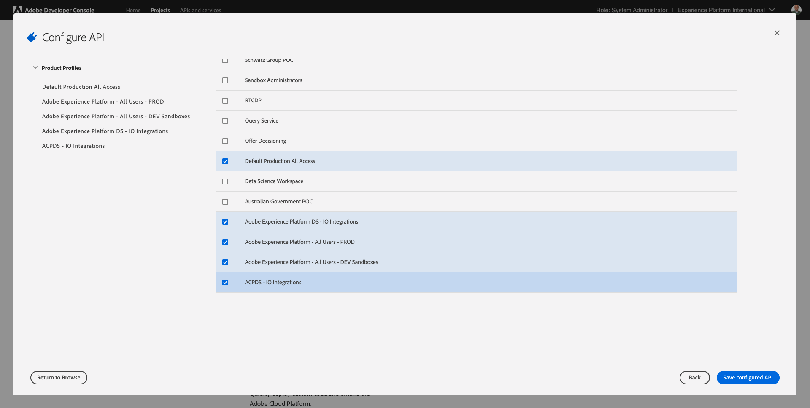
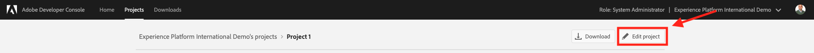
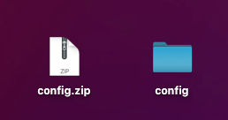
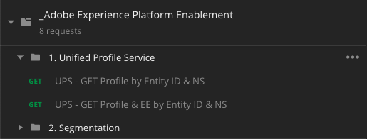
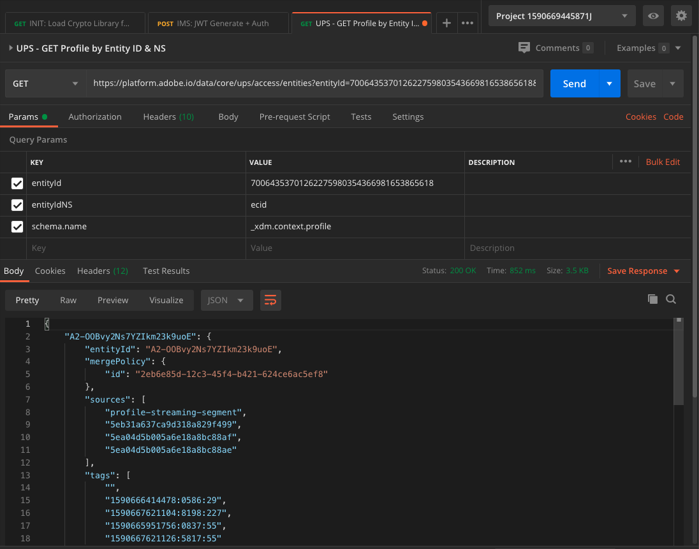
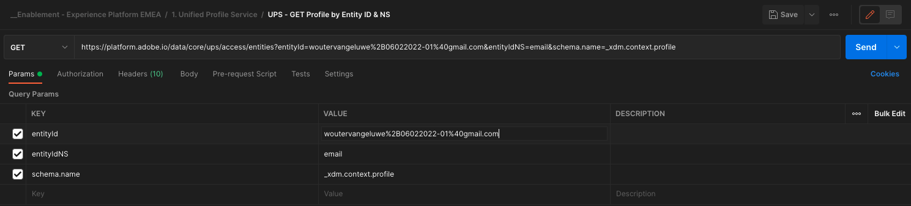

# 3.3 실시간 고객 프로필 시각화 - API

이 연습에서는 Postman 및 Adobe I/O을 사용하여 Adobe Experience Platform의 API를 쿼리하여 고유한 실시간 고객 프로필을 봅니다.

## Story

실시간 고객 프로필에서는 모든 프로필 데이터가 이벤트 데이터와 기존 세그먼트 멤버십과 함께 표시됩니다. 표시된 데이터는 Adobe 애플리케이션과 외부 솔루션에서 가져온 것입니다. 경험 기록 시스템인 Adobe Experience Platform에서 가장 강력한 보기입니다.

실시간 고객 프로필은 모든 Adobe 애플리케이션뿐만 아니라 콜 센터나 매장 내 클라이언트 앱과 같은 외부 솔루션으로도 사용할 수 있습니다. 이렇게 하는 방법은 외부 솔루션을 Adobe Experience Platform의 API에 연결하는 것입니다.

## 3.3.1 식별자

웹 사이트의 프로필 뷰어 패널에서 여러 ID를 찾을 수 있습니다. 모든 ID는 네임스페이스에 연결됩니다.


X선 패널에서는 4개의 서로 다른 ID 및 네임스페이스 조합을 볼 수 있습니다.

| 신원 | 네임스페이스 |
|:-------------:| :---------------:|
| ECID(Experience Cloud ID) | 12507560687324495704459439363261812234 |
| 이메일 ID | woutervangeluwe+06022022-01@gmail.com |
| 모바일 번호 ID | +32473622044+06022022-01 |

다음 단계에 대해 이 식별자를 기억합니다.

이러한 ID를 염두에 두고 Postman으로 이동하십시오.

## 3.3.2 Adobe I/O 프로젝트 설정

이 연습에서는 Adobe I/O을 사용하여 플랫폼의 API에 대해 집중적으로 쿼리합니다. 아래 단계에 따라 Adobe I/O을 설정하십시오.

이동 [https://developer.adobe.com/console/home](https://developer.adobe.com/console/home)


화면의 오른쪽 상단 모서리에서 올바른 Adobe Experience Platform 인스턴스를 선택해야 합니다. 인스턴스는 `--envName--`.


**새 프로젝트 만들기**&#x200B;를 클릭합니다.

 또는


선택 **+ 프로젝트에 추가** 을(를) 선택합니다. **API**.


그러면 다음 내용이 표시됩니다.


을(를) 클릭합니다. **Adobe Experience Platform** 아이콘.


클릭 **Experience Platform API**.


**다음**&#x200B;을 클릭합니다.


이제 Adobe I/O에서 보안 키 쌍을 생성하도록 선택하거나 기존 키 쌍을 업로드할 수 있습니다.

선택 **옵션 1 - 키 쌍 생성**.


클릭 **키 쌍 생성**.


약 30초 동안 스피너가 보일 거예요.


그러면 이렇게 표시되고 생성된 키 쌍이 zip 파일로 다운로드됩니다. **config.zip**.

파일 압축 해제 **config.zip** 데스크탑에는 다음 2개의 파일이 포함되어 있습니다.


- **certificate_pub.crt** 는 공개 키 인증서입니다. 보안 관점에서 볼 때, 온라인 애플리케이션과의 통합을 설정하는 데 자유롭게 사용되는 인증서입니다.
- **private.key** 은 개인 키입니다. 이것은 절대로 누구와도 공유되어서는 안 된다. 개인 키는 API 구현을 인증하는 데 사용하는 것으로, 비밀 키여야 합니다. 개인 키를 공유하는 경우 해당 사용자는 구현에 액세스하고 API를 남용하여 악의적인 데이터를 Platform으로 수집하고 Platform에 있는 모든 데이터를 추출할 수 있습니다.



를 저장해야 합니다. **config.zip** 다음 단계에 필요한 경우 Adobe I/O 및 Adobe Experience Platform API에 나중에 액세스할 수 있도록 안전한 위치에 파일을 저장합니다.

**다음**&#x200B;을 클릭합니다.


이제 **제품 프로필** 를 사용하도록 선택할 수 있습니다.

필요한 제품 프로필을 선택합니다.

**FYI**: Adobe Experience Platform 인스턴스에서 제품 프로필의 이름이 서로 다릅니다. 적절한 액세스 권한이 있는 제품 프로필을 하나 이상 선택해야 합니다. 제품 프로필은 Adobe Admin Console에서 설정됩니다.



클릭 **구성된 API 저장**.


몇 초 동안 스피너가 보일 거예요.


다음으로, 통합이 표시됩니다.


을(를) 클릭합니다. **Postman 다운로드** 단추를 클릭한 다음 **서비스 계정(JWT)** Postman 환경을 다운로드하려면(환경이 다운로드될 때까지 기다리십시오. 2초 정도 걸릴 수 있습니다.)


표시될 때까지 아래로 스크롤합니다. **서비스 계정(JWT)**: Adobe Experience Platform과의 통합을 구성하는 데 사용되는 모든 통합 세부 사항을 찾을 수 있는 위치입니다.


현재 IO 프로젝트에 일반 이름이 있습니다. 통합에 친숙한 이름을 지정해야 합니다. 클릭 **프로젝트 1** (또는 유사한 이름)으로 표시됩니다


클릭 **프로젝트 편집**.



통합에 사용할 이름 및 설명을 입력합니다. 명명 규칙으로, `AEP API --demoProfileLdap--`. ldap를 ldap로 바꿉니다.
예를 들어 ldap가 vangeluw인 경우 통합에 대한 이름과 설명은 AEP API vangeluw가 됩니다.

Enter 키 `AEP API --demoProfileLdap--` 로서의 **프로젝트 제목**. **저장**&#x200B;을 클릭합니다.


이제 Adobe I/O 통합이 끝났습니다.


## 3.3.3 Adobe I/O에 대한 Postman 인증

이동 [https://www.getpostman.com/](https://www.getpostman.com/).

클릭 **시작하기**.


그런 다음 Postman을 다운로드하여 설치합니다.


Postman을 설치한 후 애플리케이션을 시작합니다.

Postman에는 두 가지 개념이 있습니다. 환경 및 컬렉션.

- 환경에는 일관성에 가까운 모든 환경 변수가 포함되어 있습니다. 환경에서는 개인 키 및 기타 와 같은 보안 자격 증명과 함께 플랫폼 환경의 IMSOrg와 같은 항목을 찾을 수 있습니다. 환경 파일은 이전 연습에서 Adobe I/O 설정 중에 다운로드한 파일이며, 이 파일의 이름은 다음과 같습니다. **service.postman_environment.json**.

- Collection에는 사용할 수 있는 많은 API 요청이 포함되어 있습니다. 2개의 컬렉션을 사용합니다
   - Adobe I/0에 대한 인증을 위한 1 수집
   - 1 이 모듈의 연습에 대한 컬렉션
   - 대상 작성용 Real-Time CDP 모듈의 연습에 대한 1개 컬렉션

파일을 다운로드하십시오 [postman.zip](../../assets/postman/postman_profile.zip) 로컬 데스크탑으로 이동합니다.

이 **postman.zip** 파일, 다음 파일을 찾을 수 있습니다.

- `_Adobe I-O - Token.postman_collection.json`
- `_Adobe Experience Platform Enablement.postman_collection.json`
- `Destination_Authoring_API.json`

압축 해제 **postman.zip** 이 3개의 파일을 Adobe I/O에서 다운로드한 Postman 환경과 함께 데스크탑의 폴더에 저장합니다. 해당 폴더에 다음 4개의 파일이 있어야 합니다.


Postman으로 돌아갑니다. **가져오기**&#x200B;를 클릭합니다.


클릭 **파일 업로드**.


다운로드한 4개의 파일을 추출한 바탕 화면의 폴더로 이동합니다. 이 4개의 파일을 동시에 선택하고 **열기**.


클릭한 후 **열기**, Postman에서는 가져오려는 환경 및 컬렉션에 대한 개요를 표시합니다. **가져오기**&#x200B;를 클릭합니다.


이제 API를 통해 Adobe Experience Platform과 상호 작용할 수 있도록 Postman에 필요한 모든 것이 제공됩니다.

첫 번째 방법은 제대로 인증되었는지 확인하는 것입니다. 인증하려면 액세스 토큰을 요청해야 합니다.

요청을 실행하기 전에 올바른 환경이 선택되었는지 확인하십시오. 오른쪽 상단 모서리에서 환경 드롭다운 목록을 확인하여 현재 선택한 환경을 확인할 수 있습니다.

선택한 환경의 이름은 다음과 유사해야 합니다.


을(를) 클릭합니다. **눈** 아이콘을 클릭한 다음 **편집** 환경 파일에서 개인 키를 업데이트하려면


그러면 이게 보입니다. 필드를 제외하고 모든 필드가 미리 채워집니다 **PRIVATE_KEY**.


Adobe I/O 프로젝트를 만들 때 개인 키가 생성되었습니다. zip 파일로 다운로드되었으며, 이름이 지정됩니다. **config.zip**. 해당 zip 파일을 바탕 화면에 추출합니다.



폴더를 엽니다. **config** 파일을 열고 **private.key** 원하는 텍스트 편집기로 작업할 수 있습니다.


그러면 이와 비슷한 것이 보입니다. 모든 텍스트를 클립보드에 복사합니다.


Postman으로 돌아가서 변수 옆에 있는 필드에 개인 키를 붙여 넣습니다 **PRIVATE_KEY**&#x200B;두 열 모두에 대해 **초기값** 및 **현재 값**. **저장**&#x200B;을 클릭합니다.


이제 Postman 환경 및 컬렉션이 구성 및 작동합니다. 이제 Postman에서 Adobe I/O으로 인증할 수 있습니다.

이렇게 하려면 통신의 암호화 및 암호 해독을 처리할 외부 라이브러리를 로드해야 합니다. 이 라이브러리를 로드하려면 이름으로 요청을 실행해야 합니다 **초기화: RS256용 암호화 라이브러리 로드**. 에서 이 요청을 선택합니다. **_Adobe I/O - 토큰 컬렉션** 화면 중간에 표시되실 겁니다.


파란색 클릭 **보내기** 버튼을 클릭합니다. 2초 후에 **본문** Postman 섹션:


이제 암호화 라이브러리가 로드되면 Adobe I/O을 인증할 수 있습니다.

에서 **\_Adobe I/O - 토큰 컬렉션**&#x200B;를 클릭하고 이름을 사용하여 요청을 선택합니다 **IMS: JWT 생성 + 인증**. 화면 중간에 요청 세부 사항이 표시됩니다.


파란색 클릭 **보내기** 버튼을 클릭합니다. 2초 후에 **본문** Postman 섹션:


구성이 성공하면 다음 정보가 포함된 유사한 응답이 표시됩니다.

| 키 | 값 |
|:-------------:| :---------------:| 
| token_type | **bearer** |
| access_token | **eyJ4NXUiOiJpbXNfbmEx..QT7mqZkumN1tdsPEioOEl4087Dg** |
| expires_in | **86399973** |

Adobe I/O이 **bearer**-token - 특정 값(이 매우 긴 access_token)과 만료 창이 있는 경우

우리가 받은 토큰은 이제 24시간 동안 유효합니다. 즉, 24시간 후에 Postman을 사용하여 Adobe I/O을 인증하려는 경우 이 요청을 다시 실행하여 새 토큰을 생성해야 합니다.

## 3.3.4 실시간 고객 프로필 API, 스키마: 프로필

이제 계속해서 Platform의 실시간 고객 프로필 API에 첫 번째 요청을 보낼 수 있습니다.

Postman에서 컬렉션을 찾습니다 **_Adobe Experience Platform 지원**.



in **1. 통합 프로필 서비스**, 이름이 인 첫 번째 요청을 선택합니다 **UPS - 엔티티 ID 및 NS별 GET 프로필**.


이 요청에는 다음 세 가지 필수 변수가 있습니다.

| 키 | 값 | 정의 |
|:-------------:| :---------------:| :---------------:| 
| entityId | **ID** | 특정 고객 ID |
| entityIdNS | **namespace** | ID에 적용할 수 있는 특정 네임스페이스 |
| schema.name | **_xdm.context.profile** | 정보를 받을 특정 스키마 |

따라서 Adobe Experience Platform의 API에 고유한 ECID에 대한 모든 프로필 정보를 제공하도록 요청하려면 다음과 같이 요청을 구성해야 합니다.

| 키 | 값 |
|:-------------:| :---------------:| 
| entityId | **yourECID** |
| entityIdNS | **ecid** |
| schema.name | **_xdm.context.profile** |


또한 **Header** - 요청 필드. 이동 **머리글**. 그러면 다음 내용이 표시됩니다.


| 키 | 값 |
| ----------- | ----------- |
| x-sandbox-name | `--aepSandboxId--` |

>[!NOTE]
>
>사용 중인 Adobe Experience Platform 샌드박스의 이름을 지정해야 합니다. x-sandbox-name은 `--aepSandboxId--`.

클릭 **보내기** 요청을 Platform에 전송하기 위해

Platform에서 다음과 같은 응답을 즉시 받게 됩니다.



다음은 Platform의 전체 응답입니다.

```javascript
{
    "A28iM3aJBJRbEQpOnUh5HOM9": {
        "entityId": "A28iM3aJBJRbEQpOnUh5HOM9",
        "mergePolicy": {
            "id": "e632ccb8-882a-4b5e-8375-96a1ba3df1aa"
        },
        "sources": [
            "61fe23c5be4b5f19485dc379",
            "profile-streaming-segment",
            "61fe23cfa07c1219489b3ba4"
        ],
        "tags": [
            "1644130566774:1542:232:va7",
            "0a1e9dd4-940a-46ec-9114-7e371cf5c4d0",
            "aep_ups_partitioned_profile_cdc_low_lag_sla_0:106:1090888313",
            "a6fed09e-2c56-403e-8692-4e99e4779dfa:IRL1",
            "1644419616318:2989:31:va7",
            "aep_ups_profile_change_event_prod_va7:71:7946633524-8361f22c-c09e-4364-b24b-b57435c4d14f"
        ],
        "identityGraph": [
            "BUF9zMKLrXq72p4HpbsHv1SSBnr0LTAxQGdtYWlsLmNvbQ",
            "GkicrkFjgmCjUg",
            "GtCbrkFjgkSOFg",
            "A2-AP9zOsakzNTe9Rqwf7Wse",
            "BkFuK4QcJpSPByuSBnr0LTAx",
            "A28jSB484ziuECF3fEoXmFlF",
            "A28iM3aJBJRbEQpOnUh5HOM9"
        ],
        "entity": {
            "_experienceplatform": {
                "individualCharacteristics": {},
                "loyaltyDetails": {
                    "level": "Basic",
                    "points": 0
                },
                "identification": {
                    "core": {
                        "phoneNumber": "+32473622044+06022022-01",
                        "email": "woutervangeluwe+06022022-01@gmail.com",
                        "loyaltyId": "5415776",
                        "ecid": "12019606991718502754997192487345616673",
                        "crmId": "1478212"
                    }
                }
            },
            "personalEmail": {
                "address": "woutervangeluwe+06022022-01@gmail.com"
            },
            "_repo": {
                "createDate": "2022-02-06T06:56:06.424Z"
            },
            "testProfile": true,
            "homeAddress": {
                "postalCode": "1831",
                "city": "Diegem",
                "street1": "Culliganlaan 2F"
            },
            "mobilePhone": {
                "number": "+32473622044+06022022-01"
            },
            "segmentMembership": {
                "ups": {
                    "bc999ded-b6d7-40d4-87a7-d3a280b950e3": {
                        "lastQualificationTime": "2022-02-09T20:38:33Z",
                        "status": "exited"
                    },
                    "23b1cd4e-d62f-44bd-8392-3095a33109c4": {
                        "lastQualificationTime": "2022-02-09T20:38:33Z",
                        "status": "exited"
                    },
                    "f0807704-a1c8-4ac4-85dd-60db2fbf18f1": {
                        "lastQualificationTime": "2022-02-09T20:38:33Z",
                        "status": "existing"
                    }
                }
            },
            "person": {
                "name": {
                    "lastName": "Van Geluwe",
                    "firstName": "Wouter"
                },
                "gender": "female",
                "birthDate": "1982-07-08"
            },
            "userActivityRegions": {
                "IRL1": {
                    "captureTimestamp": "2022-02-09T15:21:11Z"
                }
            },
            "identityMap": {
                "email": [
                    {
                        "id": "woutervangeluwe+06022022-01@gmail.com"
                    }
                ],
                "crmid": [
                    {
                        "id": "1478212"
                    }
                ],
                "ecid": [
                    {
                        "id": "12507560687324495704459439363261812234"
                    },
                    {
                        "id": "12019606991718502754997192487345616673"
                    },
                    {
                        "id": "38335942889672702722192106363935964471"
                    }
                ],
                "phone": [
                    {
                        "id": "+32473622044+06022022-01"
                    }
                ],
                "loyaltyid": [
                    {
                        "id": "5415776"
                    }
                ]
            }
        },
        "lastModifiedAt": "2022-02-09T20:38:36Z"
    }
}
```

현재 이 ECID에 대해 Platform에서 사용할 수 있는 모든 프로필 데이터입니다.

플랫폼의 실시간 고객 프로필에서 프로필 데이터를 요청하는 데 ECID를 사용할 필요가 없으며, 모든 네임스페이스에서 ID를 사용하여 이 데이터를 요청할 수 있습니다.

Postman으로 돌아가서 Adobe가 콜 센터인 것처럼 하고 Platform에 의 네임스페이스를 지정하여 요청을 보내겠습니다 **전화** 모바일 번호와 함께 표시합니다.

따라서 Platform의 API에 특정 휴대폰에 대한 모든 프로필 정보를 반환하도록 요청하려면 다음과 같이 요청을 구성해야 합니다.

| 키 | 값 |
|:-------------:| :---------------:| 
| entityId | **전화 번호** |
| entityIdNS | **phone** (ecid를 전화로 바꾸기) |
| schema.name | **_xdm.context.profile** |

전화 번호에 다음과 같은 특수 기호가 포함되어 있는 경우 **+**&#x200B;을 클릭합니다. 전체 전화 번호를 선택하고 마우스 오른쪽 단추를 클릭한 다음 **EncodeURIComponent**.


그러면 다음 항목이 제공됩니다.


또한 **Header** - 요청 필드. 이동 **머리글**. 그러면 다음 내용이 표시됩니다.


| 키 | 값 |
| ----------- | ----------- |
| x-sandbox-name | `--aepSandboxId--` |

>[!NOTE]
>
>사용 중인 Adobe Experience Platform 샌드박스의 이름을 지정해야 합니다. x-sandbox-name은 `--aepSandboxId--`.

파란색 클릭 **보내기** 버튼을 클릭하고 응답을 확인합니다.


전자 메일 주소에도 같은 작업을 수행하여 의 네임스페이스를 지정하겠습니다 **이메일** 이메일 주소를 입력합니다.

따라서 Platform의 API에 특정 이메일 주소에 대한 모든 프로필 정보를 제공하도록 요청하려면 다음과 같이 요청을 구성해야 합니다.

| 키 | 값 |
|:-------------:| :---------------:| 
| entityId | **이메일** |
| entityIdNS | **이메일** (휴대폰을 이메일로 바꾸기) |
| schema.name | **_xdm.context.profile** |

이메일 주소에 다음과 같은 특수 기호가 포함되어 있는 경우 **+**&#x200B;을(를) 사용하려면 전체 이메일 주소를 선택하고 마우스 오른쪽 버튼을 클릭한 다음 **EncodeURIComponent**.


그러면 다음 항목이 제공됩니다.



또한 **Header** - 요청 필드. 이동 **머리글**. 그러면 다음 내용이 표시됩니다.


| 키 | 값 |
| ----------- | ----------- |
| x-sandbox-name | `--aepSandboxId--` |

>[!NOTE]
>
>사용 중인 Adobe Experience Platform 샌드박스의 이름을 지정해야 합니다. x-sandbox-name은 `--aepSandboxId--`.

파란색 클릭 **보내기** 버튼을 클릭하고 응답을 확인합니다.


이는 브랜드에게 제공되는 매우 중요한 유연성입니다. 즉, 모든 환경에서 여러 네임스페이스와 ID의 복잡성을 이해하지 않고도 자체 ID와 네임스페이스를 사용하여 Platform에 요청을 보낼 수 있습니다.

예:

- 콜 센터는 네임스페이스를 사용하여 플랫폼에서 데이터를 요청합니다 **phone**
- 충성도 시스템은 네임스페이스를 사용하여 Platform에서 데이터를 요청합니다 **이메일**
- 온라인 응용 프로그램은 네임스페이스를 사용할 수 있습니다 **ecid**

콜 센터는 반드시 충성도 시스템에서 사용되는 식별자의 종류를 알지 못하며 충성도 시스템은 온라인 애플리케이션에서 사용하는 식별자의 종류를 반드시 알지 못합니다. 각 개별 시스템은 그들이 갖고 있고 이해한 정보를 그들이 필요할 때 필요로 하는 정보를 얻기 위해 사용할 수 있습니다.

## 3.3.5 실시간 고객 프로필 API, 스키마: 프로필 및 ExperienceEvent

이제 플랫폼의 API에 프로필 데이터를 쿼리한 후 ExperienceEvent 데이터를 사용하여 동일하게 수행합니다.

Postman에서 컬렉션을 찾습니다 **_Adobe Experience Platform 지원**.


in **1. 통합 프로필 서비스**&#x200B;를 클릭하고 이름을 사용하여 두 번째 요청을 선택합니다 **UPS - 엔티티 ID 및 NS별 GET 프로필 및 EE**.


이 요청의 경우 네 가지 필수 변수가 있습니다.

| 키 | 값 | 정의 |
|:-------------:| :---------------:|  :---------------:| 
| schema.name | **_xdm.context.experienceevent** | 정보를 받을 특정 스키마. 이 경우 ExperienceEvent 스키마에 대해 매핑되는 데이터를 찾고 있습니다. |
| relatedSchema.name | **_xdm.context.profile** | ExperienceEvent 스키마에 대해 매핑되는 데이터를 찾으려면 해당 데이터를 받을 ID를 지정해야 합니다. ID에 액세스할 수 있는 스키마는 프로필 스키마이므로 여기에 relatedSchema가 있습니다. |
| relatedEntityId | **ID** | 특정 고객 ID |
| relatedEntityIdNS | **namespace** | ID에 적용할 수 있는 특정 네임스페이스 |

따라서 고유한 ecid에 대한 모든 프로필 정보를 제공하도록 Platform의 API를 요청하려면 다음과 같이 요청을 구성해야 합니다.

| 키 | 값 |
|:-------------:| :---------------:| 
| schema.name | **_xdm.context.experienceevent** |
| relatedSchema.name | **_xdm.context.profile** |
| relatedEntityId | **yourECID** |
| relatedEntityIdNS | **ecid** |


또한 **Header** - 요청 필드. 이동 **머리글**. 그러면 다음 내용이 표시됩니다.


| 키 | 값 |
| ----------- | ----------- |
| x-sandbox-name | `--aepSandboxId--` |

>[!NOTE]
>
>사용 중인 Adobe Experience Platform 샌드박스의 이름을 지정해야 합니다. x-sandbox-name은 `--aepSandboxId--`.

클릭 **보내기** 요청을 Platform에 전송하기 위해

Platform에서 다음과 같은 응답을 즉시 받게 됩니다.


다음은 Platform의 전체 응답입니다. 이 예에는 이 고객의 ECID에 연결된 8개의 ExperienceEvents가 있습니다. 아래 내용을 보고 요청에서 다른 변수를 확인하십시오. 아래 표시된 것은 이전 연습에서 Launch에서 구성을 직접 수행한 결과이기 때문입니다.

또한 X-ray 패널에 ExperienceEvent 정보가 표시되면 아래 페이로드를 사용하여 제품 이름(아래 페이로드에서 productName 검색) 및 제품 이미지 URL(아래 페이로드에서 productImageUrl 검색)과 같은 정보를 구문 분석하고 검색할 수 있습니다.

```javascript
{
    "_page": {
        "orderby": "timestamp",
        "start": "d686ab8a-2d0c-4722-9ff5-bfc1020b0b55-0",
        "count": 31,
        "next": ""
    },
    "children": [
        {
            "relatedEntityId": "A28iM3aJBJRbEQpOnUh5HOM9",
            "entityId": "d686ab8a-2d0c-4722-9ff5-bfc1020b0b55-0",
            "timestamp": 1644127126596,
            "entity": {
                "environment": {
                    "ipV4": "213.118.129.117",
                    "type": "browser",
                    "browserDetails": {
                        "viewportHeight": 969,
                        "viewportWidth": 1920,
                        "userAgent": "Mozilla/5.0 (Macintosh; Intel Mac OS X 10_15_7) AppleWebKit/537.36 (KHTML, like Gecko) Chrome/98.0.4758.80 Safari/537.36"
                    }
                },
                "web": {
                    "webPageDetails": {
                        "pageViews": {
                            "value": 1
                        },
                        "name": "vangeluw-OCUC",
                        "URL": "https://builder.adobedemo.com/run/vangeluw-OCUC"
                    },
                    "webReferrer": {
                        "URL": "https://adobe.okta.com/"
                    }
                },
                "_experienceplatform": {
                    "interactionDetails": {
                        "core": {
                            "channel": "web"
                        }
                    },
                    "demoEnvironment": {
                        "brandName": "vangeluw-OCUC"
                    },
                    "identification": {
                        "core": {
                            "ecid": "12507560687324495704459439363261812234"
                        }
                    }
                },
                "implementationDetails": {
                    "name": "https://ns.adobe.com/experience/alloy/reactor",
                    "version": "2.8.0+2.9.0",
                    "environment": "browser"
                },
                "identityMap": {
                    "ECID": [
                        {
                            "id": "12507560687324495704459439363261812234",
                            "authenticatedState": "ambiguous",
                            "primary": true
                        }
                    ]
                },
                "eventType": "web.webpagedetails.pageViews",
                "_id": "d686ab8a-2d0c-4722-9ff5-bfc1020b0b55-0",
                "placeContext": {
                    "localTime": "2022-02-06T06:58:46.596+01:00",
                    "localTimezoneOffset": -60
                },
                "device": {
                    "screenOrientation": "landscape",
                    "screenWidth": 1920,
                    "screenHeight": 1080
                },
                "timestamp": "2022-02-06T05:58:46.596Z"
            },
            "lastModifiedAt": "2022-02-06T05:59:48Z"
        },
        {
            "relatedEntityId": "A28iM3aJBJRbEQpOnUh5HOM9",
            "entityId": "919a46bf-a591-4c32-9201-b72250d5f5d9-0",
            "timestamp": 1644127129876,
            "entity": {
                "environment": {
                    "ipV4": "213.118.129.117",
                    "type": "browser",
                    "browserDetails": {
                        "viewportHeight": 969,
                        "viewportWidth": 1920,
                        "userAgent": "Mozilla/5.0 (Macintosh; Intel Mac OS X 10_15_7) AppleWebKit/537.36 (KHTML, like Gecko) Chrome/98.0.4758.80 Safari/537.36"
                    }
                },
                "web": {
                    "webPageDetails": {
                        "pageViews": {
                            "value": 1
                        },
                        "name": "vangeluw-OCUC#",
                        "URL": "https://builder.adobedemo.com/run/vangeluw-OCUC#"
                    },
                    "webReferrer": {
                        "URL": "https://adobe.okta.com/"
                    }
                },
                "_experienceplatform": {
                    "interactionDetails": {
                        "core": {
                            "channel": "web"
                        }
                    },
                    "demoEnvironment": {
                        "brandName": "vangeluw-OCUC"
                    },
                    "identification": {
                        "core": {
                            "ecid": "12507560687324495704459439363261812234"
                        }
                    }
                },
                "implementationDetails": {
                    "name": "https://ns.adobe.com/experience/alloy/reactor",
                    "version": "2.8.0+2.9.0",
                    "environment": "browser"
                },
                "identityMap": {
                    "ECID": [
                        {
                            "id": "12507560687324495704459439363261812234",
                            "authenticatedState": "ambiguous",
                            "primary": true
                        }
                    ]
                },
                "eventType": "web.webpagedetails.pageViews",
                "_id": "919a46bf-a591-4c32-9201-b72250d5f5d9-0",
                "placeContext": {
                    "localTime": "2022-02-06T06:58:49.876+01:00",
                    "localTimezoneOffset": -60
                },
                "device": {
                    "screenOrientation": "landscape",
                    "screenWidth": 1920,
                    "screenHeight": 1080
                },
                "timestamp": "2022-02-06T05:58:49.876Z"
            },
            "lastModifiedAt": "2022-02-06T05:59:48Z"
        },
        {
            "relatedEntityId": "A28iM3aJBJRbEQpOnUh5HOM9",
            "entityId": "41a80489-00d4-446c-b456-8cb19c3f309a-0",
            "timestamp": 1644130597134,
            "entity": {
                "environment": {
                    "ipV4": "213.118.129.117",
                    "type": "browser",
                    "browserDetails": {
                        "viewportHeight": 1001,
                        "viewportWidth": 1920,
                        "userAgent": "Mozilla/5.0 (Macintosh; Intel Mac OS X 10_15_7) AppleWebKit/537.36 (KHTML, like Gecko) Chrome/98.0.4758.80 Safari/537.36"
                    }
                },
                "web": {
                    "webPageDetails": {
                        "pageViews": {
                            "value": 1
                        },
                        "name": "login",
                        "URL": "https://builder.adobedemo.com/run/vangeluw-OCUC/login"
                    },
                    "webReferrer": {
                        "URL": "https://builder.adobedemo.com/run/vangeluw-OCUC/login"
                    }
                },
                "_experienceplatform": {
                    "interactionDetails": {
                        "core": {
                            "channel": "web"
                        }
                    },
                    "demoEnvironment": {
                        "brandName": "vangeluw-OCUC"
                    },
                    "identification": {
                        "core": {
                            "ecid": "12507560687324495704459439363261812234"
                        }
                    }
                },
                "implementationDetails": {
                    "name": "https://ns.adobe.com/experience/alloy/reactor",
                    "version": "2.8.0+2.9.0",
                    "environment": "browser"
                },
                "identityMap": {
                    "ECID": [
                        {
                            "id": "12507560687324495704459439363261812234",
                            "authenticatedState": "ambiguous",
                            "primary": true
                        }
                    ]
                },
                "eventType": "web.webpagedetails.pageViews",
                "_id": "41a80489-00d4-446c-b456-8cb19c3f309a-0",
                "placeContext": {
                    "localTime": "2022-02-06T07:56:37.134+01:00",
                    "localTimezoneOffset": -60
                },
                "device": {
                    "screenOrientation": "landscape",
                    "screenWidth": 1920,
                    "screenHeight": 1080
                },
                "timestamp": "2022-02-06T06:56:37.134Z"
            },
            "lastModifiedAt": "2022-02-06T06:56:38Z"
        },
        {
            "relatedEntityId": "A28jSB484ziuECF3fEoXmFlF",
            "entityId": "8ACC7B6C-2320-4865-B414-3B0CFA01F628",
            "timestamp": 1644419615000,
            "entity": {
                "environment": {
                    "ipV4": "213.118.129.117",
                    "browserDetails": {
                        "userAgent": "Mozilla/5.0 (iPhone; CPU OS 15_3 like Mac OS X; en_BE)"
                    }
                },
                "eventType": "application.login",
                "_id": "8ACC7B6C-2320-4865-B414-3B0CFA01F628",
                "_experienceplatform": {
                    "interactionDetails": {
                        "core": {
                            "channel": "mobile"
                        }
                    },
                    "demoEnvironment": {
                        "brandName": "vangeluw-2L6V"
                    },
                    "identification": {
                        "core": {
                            "ecid": "12019606991718502754997192487345616673",
                            "email": "woutervangeluwe+06022022-01@gmail.com"
                        }
                    }
                },
                "timestamp": "2022-02-09T15:13:35Z",
                "identityMap": {
                    "ECID": [
                        {
                            "id": "12019606991718502754997192487345616673",
                            "authenticatedState": "ambiguous",
                            "primary": true
                        }
                    ]
                }
            },
            "lastModifiedAt": "2022-02-09T15:13:38Z"
        },
        {
            "relatedEntityId": "A28jSB484ziuECF3fEoXmFlF",
            "entityId": "54F68CE5-E9E1-4AD0-91B1-7B607A9285C4",
            "timestamp": 1644419658000,
            "entity": {
                "environment": {
                    "ipV4": "213.118.129.117",
                    "browserDetails": {
                        "userAgent": "Mozilla/5.0 (iPhone; CPU OS 15_3 like Mac OS X; en_BE)"
                    }
                },
                "_experienceplatform": {
                    "interactionDetails": {
                        "core": {
                            "channel": "mobile"
                        }
                    },
                    "demoEnvironment": {
                        "brandName": "vangeluw-2L6V"
                    },
                    "identification": {
                        "core": {
                            "ecid": "12019606991718502754997192487345616673"
                        }
                    }
                },
                "identityMap": {
                    "ECID": [
                        {
                            "id": "12019606991718502754997192487345616673",
                            "authenticatedState": "ambiguous",
                            "primary": true
                        }
                    ]
                },
                "eventType": "commerce.productViews",
                "_id": "54F68CE5-E9E1-4AD0-91B1-7B607A9285C4",
                "commerce": {
                    "productViews": {
                        "value": 1
                    }
                },
                "productListItems": [
                    {
                        "quantity": 1,
                        "productAddMethod": "Mobile",
                        "_experienceplatform": {
                            "core": {
                                "mainCategory": "Women",
                                "productURL": "product1",
                                "imageURL": "https://contentviewer.s3.amazonaws.com/helium/wh08-white_main.jpg"
                            }
                        },
                        "priceTotal": 42,
                        "name": "Cassia Funnel Sweatshirt",
                        "SKU": "product1",
                        "currencyCode": "USD"
                    }
                ],
                "timestamp": "2022-02-09T15:14:18Z"
            },
            "lastModifiedAt": "2022-02-09T15:14:21Z"
        },
        {
            "relatedEntityId": "A2-AP9zOsakzNTe9Rqwf7Wse",
            "entityId": "bfe26684-bc3b-40c5-9fe5-5aba854c3227-0",
            "timestamp": 1644420036035,
            "entity": {
                "environment": {
                    "ipV4": "193.105.139.131",
                    "type": "browser",
                    "browserDetails": {
                        "viewportHeight": 969,
                        "viewportWidth": 1920,
                        "userAgent": "Mozilla/5.0 (Macintosh; Intel Mac OS X 10_15_7) AppleWebKit/537.36 (KHTML, like Gecko) Chrome/98.0.4758.80 Safari/537.36"
                    }
                },
                "web": {
                    "webPageDetails": {
                        "pageViews": {
                            "value": 1
                        },
                        "name": "vangeluw-OCUC",
                        "URL": "https://builder.adobedemo.com/run/vangeluw-OCUC"
                    },
                    "webReferrer": {
                        "URL": "https://adobe.okta.com/"
                    }
                },
                "_experienceplatform": {
                    "interactionDetails": {
                        "core": {
                            "channel": "web"
                        }
                    },
                    "demoEnvironment": {
                        "brandName": "vangeluw-OCUC"
                    },
                    "identification": {
                        "core": {
                            "ecid": "38335942889672702722192106363935964471"
                        }
                    }
                },
                "implementationDetails": {
                    "name": "https://ns.adobe.com/experience/alloy/reactor",
                    "version": "2.8.0+2.9.0",
                    "environment": "browser"
                },
                "identityMap": {
                    "ECID": [
                        {
                            "id": "38335942889672702722192106363935964471",
                            "authenticatedState": "ambiguous",
                            "primary": true
                        }
                    ]
                },
                "eventType": "web.webpagedetails.pageViews",
                "_id": "bfe26684-bc3b-40c5-9fe5-5aba854c3227-0",
                "placeContext": {
                    "localTime": "2022-02-09T16:20:36.035+01:00",
                    "localTimezoneOffset": -60
                },
                "device": {
                    "screenOrientation": "landscape",
                    "screenWidth": 1920,
                    "screenHeight": 1080
                },
                "timestamp": "2022-02-09T15:20:36.035Z"
            },
            "lastModifiedAt": "2022-02-09T15:20:39Z"
        },
        {
            "relatedEntityId": "A2-AP9zOsakzNTe9Rqwf7Wse",
            "entityId": "0480c434-8fcd-4a80-b298-c561276ac989-0",
            "timestamp": 1644420037078,
            "entity": {
                "environment": {
                    "ipV4": "193.105.139.131",
                    "type": "browser",
                    "browserDetails": {
                        "viewportHeight": 969,
                        "viewportWidth": 1920,
                        "userAgent": "Mozilla/5.0 (Macintosh; Intel Mac OS X 10_15_7) AppleWebKit/537.36 (KHTML, like Gecko) Chrome/98.0.4758.80 Safari/537.36"
                    }
                },
                "web": {
                    "webPageDetails": {
                        "pageViews": {
                            "value": 1
                        },
                        "name": "vangeluw-OCUC#",
                        "URL": "https://builder.adobedemo.com/run/vangeluw-OCUC#"
                    },
                    "webReferrer": {
                        "URL": "https://adobe.okta.com/"
                    }
                },
                "_experienceplatform": {
                    "interactionDetails": {
                        "core": {
                            "channel": "web"
                        }
                    },
                    "demoEnvironment": {
                        "brandName": "vangeluw-OCUC"
                    },
                    "identification": {
                        "core": {
                            "ecid": "38335942889672702722192106363935964471"
                        }
                    }
                },
                "implementationDetails": {
                    "name": "https://ns.adobe.com/experience/alloy/reactor",
                    "version": "2.8.0+2.9.0",
                    "environment": "browser"
                },
                "identityMap": {
                    "ECID": [
                        {
                            "id": "38335942889672702722192106363935964471",
                            "authenticatedState": "ambiguous",
                            "primary": true
                        }
                    ]
                },
                "eventType": "web.webpagedetails.pageViews",
                "_id": "0480c434-8fcd-4a80-b298-c561276ac989-0",
                "placeContext": {
                    "localTime": "2022-02-09T16:20:37.078+01:00",
                    "localTimezoneOffset": -60
                },
                "device": {
                    "screenOrientation": "landscape",
                    "screenWidth": 1920,
                    "screenHeight": 1080
                },
                "timestamp": "2022-02-09T15:20:37.078Z"
            },
            "lastModifiedAt": "2022-02-09T15:20:39Z"
        },
        {
            "relatedEntityId": "A2-AP9zOsakzNTe9Rqwf7Wse",
            "entityId": "6b1b3983-6966-4551-a711-6b6e410fd819-0",
            "timestamp": 1644420045993,
            "entity": {
                "environment": {
                    "ipV4": "193.105.139.131",
                    "type": "browser",
                    "browserDetails": {
                        "viewportHeight": 969,
                        "viewportWidth": 1920,
                        "userAgent": "Mozilla/5.0 (Macintosh; Intel Mac OS X 10_15_7) AppleWebKit/537.36 (KHTML, like Gecko) Chrome/98.0.4758.80 Safari/537.36"
                    }
                },
                "web": {
                    "webPageDetails": {
                        "pageViews": {
                            "value": 1
                        },
                        "name": "login",
                        "URL": "https://builder.adobedemo.com/run/vangeluw-OCUC/login"
                    },
                    "webReferrer": {
                        "URL": "https://adobe.okta.com/"
                    }
                },
                "_experienceplatform": {
                    "interactionDetails": {
                        "core": {
                            "channel": "web"
                        }
                    },
                    "demoEnvironment": {
                        "brandName": "vangeluw-OCUC"
                    },
                    "identification": {
                        "core": {
                            "ecid": "38335942889672702722192106363935964471"
                        }
                    }
                },
                "implementationDetails": {
                    "name": "https://ns.adobe.com/experience/alloy/reactor",
                    "version": "2.8.0+2.9.0",
                    "environment": "browser"
                },
                "identityMap": {
                    "ECID": [
                        {
                            "id": "38335942889672702722192106363935964471",
                            "authenticatedState": "ambiguous",
                            "primary": true
                        }
                    ]
                },
                "eventType": "web.webpagedetails.pageViews",
                "_id": "6b1b3983-6966-4551-a711-6b6e410fd819-0",
                "placeContext": {
                    "localTime": "2022-02-09T16:20:45.993+01:00",
                    "localTimezoneOffset": -60
                },
                "device": {
                    "screenOrientation": "landscape",
                    "screenWidth": 1920,
                    "screenHeight": 1080
                },
                "timestamp": "2022-02-09T15:20:45.993Z"
            },
            "lastModifiedAt": "2022-02-09T15:20:47Z"
        },
        {
            "relatedEntityId": "A2-AP9zOsakzNTe9Rqwf7Wse",
            "entityId": "ae0f3551-7753-4467-8547-8fdbb66c2214-0",
            "timestamp": 1644420058565,
            "entity": {
                "environment": {
                    "ipV4": "193.105.139.131",
                    "type": "browser",
                    "browserDetails": {
                        "viewportHeight": 969,
                        "viewportWidth": 1920,
                        "userAgent": "Mozilla/5.0 (Macintosh; Intel Mac OS X 10_15_7) AppleWebKit/537.36 (KHTML, like Gecko) Chrome/98.0.4758.80 Safari/537.36"
                    }
                },
                "web": {
                    "webPageDetails": {
                        "URL": "https://builder.adobedemo.com/run/vangeluw-OCUC/home"
                    },
                    "webReferrer": {
                        "URL": "https://adobe.okta.com/"
                    }
                },
                "_experienceplatform": {
                    "interactionDetails": {
                        "core": {
                            "channel": "web"
                        }
                    },
                    "demoEnvironment": {
                        "brandName": "vangeluw-OCUC"
                    },
                    "identification": {
                        "core": {
                            "ecid": "38335942889672702722192106363935964471",
                            "email": "woutervangeluwe+06022022-01@gmail.com"
                        }
                    }
                },
                "implementationDetails": {
                    "name": "https://ns.adobe.com/experience/alloy/reactor",
                    "version": "2.8.0+2.9.0",
                    "environment": "browser"
                },
                "identityMap": {
                    "ECID": [
                        {
                            "id": "38335942889672702722192106363935964471",
                            "authenticatedState": "ambiguous",
                            "primary": true
                        }
                    ]
                },
                "eventType": "web.login",
                "_id": "ae0f3551-7753-4467-8547-8fdbb66c2214-0",
                "placeContext": {
                    "localTime": "2022-02-09T16:20:58.565+01:00",
                    "localTimezoneOffset": -60
                },
                "device": {
                    "screenOrientation": "landscape",
                    "screenWidth": 1920,
                    "screenHeight": 1080
                },
                "timestamp": "2022-02-09T15:20:58.565Z"
            },
            "lastModifiedAt": "2022-02-09T15:20:59Z"
        },
        {
            "relatedEntityId": "A2-AP9zOsakzNTe9Rqwf7Wse",
            "entityId": "5e67a9c9-b201-4e21-bd3a-4d10475f6156-0",
            "timestamp": 1644420058653,
            "entity": {
                "environment": {
                    "ipV4": "193.105.139.131",
                    "type": "browser",
                    "browserDetails": {
                        "viewportHeight": 969,
                        "viewportWidth": 1920,
                        "userAgent": "Mozilla/5.0 (Macintosh; Intel Mac OS X 10_15_7) AppleWebKit/537.36 (KHTML, like Gecko) Chrome/98.0.4758.80 Safari/537.36"
                    }
                },
                "web": {
                    "webPageDetails": {
                        "pageViews": {
                            "value": 1
                        },
                        "name": "home",
                        "URL": "https://builder.adobedemo.com/run/vangeluw-OCUC/home"
                    },
                    "webReferrer": {
                        "URL": "https://adobe.okta.com/"
                    }
                },
                "_experienceplatform": {
                    "interactionDetails": {
                        "core": {
                            "channel": "web"
                        }
                    },
                    "demoEnvironment": {
                        "brandName": "vangeluw-OCUC"
                    },
                    "identification": {
                        "core": {
                            "ecid": "38335942889672702722192106363935964471"
                        }
                    }
                },
                "implementationDetails": {
                    "name": "https://ns.adobe.com/experience/alloy/reactor",
                    "version": "2.8.0+2.9.0",
                    "environment": "browser"
                },
                "identityMap": {
                    "ECID": [
                        {
                            "id": "38335942889672702722192106363935964471",
                            "authenticatedState": "ambiguous",
                            "primary": true
                        }
                    ]
                },
                "eventType": "web.webpagedetails.pageViews",
                "_id": "5e67a9c9-b201-4e21-bd3a-4d10475f6156-0",
                "placeContext": {
                    "localTime": "2022-02-09T16:20:58.653+01:00",
                    "localTimezoneOffset": -60
                },
                "device": {
                    "screenOrientation": "landscape",
                    "screenWidth": 1920,
                    "screenHeight": 1080
                },
                "timestamp": "2022-02-09T15:20:58.653Z"
            },
            "lastModifiedAt": "2022-02-09T15:21:00Z"
        },
        {
            "relatedEntityId": "A2-AP9zOsakzNTe9Rqwf7Wse",
            "entityId": "33253c5a-6a7e-4858-a7d2-4e6d4a1c7901-0",
            "timestamp": 1644420061804,
            "entity": {
                "environment": {
                    "ipV4": "193.105.139.131",
                    "type": "browser",
                    "browserDetails": {
                        "viewportHeight": 969,
                        "viewportWidth": 1920,
                        "userAgent": "Mozilla/5.0 (Macintosh; Intel Mac OS X 10_15_7) AppleWebKit/537.36 (KHTML, like Gecko) Chrome/98.0.4758.80 Safari/537.36"
                    }
                },
                "web": {
                    "webPageDetails": {
                        "pageViews": {
                            "value": 1
                        },
                        "name": "vangeluw-OCUC",
                        "URL": "https://builder.adobedemo.com/run/vangeluw-OCUC"
                    },
                    "webReferrer": {
                        "URL": "https://builder.adobedemo.com/run/vangeluw-OCUC/home"
                    }
                },
                "_experienceplatform": {
                    "interactionDetails": {
                        "core": {
                            "channel": "web"
                        }
                    },
                    "demoEnvironment": {
                        "brandName": "vangeluw-OCUC"
                    },
                    "identification": {
                        "core": {
                            "ecid": "38335942889672702722192106363935964471"
                        }
                    }
                },
                "implementationDetails": {
                    "name": "https://ns.adobe.com/experience/alloy/reactor",
                    "version": "2.8.0+2.9.0",
                    "environment": "browser"
                },
                "identityMap": {
                    "ECID": [
                        {
                            "id": "38335942889672702722192106363935964471",
                            "authenticatedState": "ambiguous",
                            "primary": true
                        }
                    ]
                },
                "eventType": "web.webpagedetails.pageViews",
                "_id": "33253c5a-6a7e-4858-a7d2-4e6d4a1c7901-0",
                "placeContext": {
                    "localTime": "2022-02-09T16:21:01.804+01:00",
                    "localTimezoneOffset": -60
                },
                "device": {
                    "screenOrientation": "landscape",
                    "screenWidth": 1920,
                    "screenHeight": 1080
                },
                "timestamp": "2022-02-09T15:21:01.804Z"
            },
            "lastModifiedAt": "2022-02-09T15:21:03Z"
        },
        {
            "relatedEntityId": "A2-AP9zOsakzNTe9Rqwf7Wse",
            "entityId": "d8e81fb7-6de9-44c1-b9c6-60d93b520209-0",
            "timestamp": 1644420071737,
            "entity": {
                "environment": {
                    "ipV4": "193.105.139.131",
                    "type": "browser",
                    "browserDetails": {
                        "viewportHeight": 969,
                        "viewportWidth": 1920,
                        "userAgent": "Mozilla/5.0 (Macintosh; Intel Mac OS X 10_15_7) AppleWebKit/537.36 (KHTML, like Gecko) Chrome/98.0.4758.80 Safari/537.36"
                    }
                },
                "web": {
                    "webPageDetails": {
                        "pageViews": {
                            "value": 1
                        },
                        "name": "vangeluw-OCUC",
                        "URL": "https://builder.adobedemo.com/run/vangeluw-OCUC"
                    },
                    "webReferrer": {
                        "URL": "https://builder.adobedemo.com/run/vangeluw-OCUC/home"
                    }
                },
                "_experienceplatform": {
                    "interactionDetails": {
                        "core": {
                            "channel": "web"
                        }
                    },
                    "demoEnvironment": {
                        "brandName": "vangeluw-OCUC"
                    },
                    "identification": {
                        "core": {
                            "ecid": "38335942889672702722192106363935964471"
                        }
                    }
                },
                "implementationDetails": {
                    "name": "https://ns.adobe.com/experience/alloy/reactor",
                    "version": "2.8.0+2.9.0",
                    "environment": "browser"
                },
                "identityMap": {
                    "ECID": [
                        {
                            "id": "38335942889672702722192106363935964471",
                            "authenticatedState": "ambiguous",
                            "primary": true
                        }
                    ]
                },
                "eventType": "web.webpagedetails.pageViews",
                "_id": "d8e81fb7-6de9-44c1-b9c6-60d93b520209-0",
                "placeContext": {
                    "localTime": "2022-02-09T16:21:11.737+01:00",
                    "localTimezoneOffset": -60
                },
                "device": {
                    "screenOrientation": "landscape",
                    "screenWidth": 1920,
                    "screenHeight": 1080
                },
                "timestamp": "2022-02-09T15:21:11.737Z"
            },
            "lastModifiedAt": "2022-02-09T15:21:14Z"
        }
    ],
    "_links": {
        "next": {
            "href": ""
        }
    }
}
```

현재 이 ECID에 대해 플랫폼에서 사용할 수 있는 모든 ExperienceEvent 데이터입니다.

Adobe Experience Platform의 실시간 프로필에서 ExperienceEvent 데이터를 요청하는 데 ECID를 사용할 필요는 없으며, 모든 네임스페이스에서 ID를 사용하여 이 데이터를 요청할 수 있습니다.

다음 단계: [3.4 세그먼트 만들기 - UI](./ex4.md)

[모듈 3으로 돌아가기](./real-time-customer-profile.md)

[모든 모듈로 돌아가기](../../overview.md)
