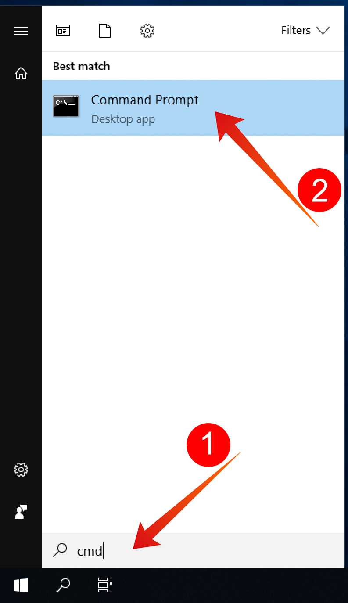

# 4.1 시작하기

## 4.1.1 Adobe Experience Platform UI 사용하기

이동 [Adobe Experience Platform](https://experience.adobe.com/platform). 로그인하면 Adobe Experience Platform 홈 페이지가 표시됩니다.

계속하기 전에 **샌드박스**. 선택할 샌드박스의 이름은 다음과 같습니다 ``--module7sandbox--``. 이 작업은 텍스트를 클릭하여 수행할 수 있습니다 **[!UICONTROL 프로덕션 제품]** 화면 상단에 있는 파란색 줄에 표시됩니다. 적절한 [!UICONTROL 샌드박스]이렇게 하면 화면 변경 사항이 표시되고 이제 전용 화면에 표시됩니다 [!UICONTROL 샌드박스].

## 4.1.2 플랫폼에서 데이터 살펴보기

다양한 채널에서 데이터를 가져오는 것은 모든 브랜드를 위한 어려운 작업입니다. 그리고 이 연습에서, 시티신호 고객들은 웹사이트, 그것의 모바일 앱에서 시티신호를 사용하고, 시티신호의 판매 지점 시스템에 의해 구매 데이터를 수집하고, 그들은 CRM 및 로열티 데이터를 가지고 있습니다. Citi Signal은 Adobe Analytics 및 Adobe Launch를 사용하여 웹 사이트, 모바일 앱 및 POS 시스템에서 데이터를 캡처하고 있으므로 이 데이터가 이미 Adobe Experience Platform으로 유입되고 있습니다. Adobe Experience Platform에 이미 존재하는 시티신호에 대한 모든 데이터를 살펴보도록 하겠습니다.

왼쪽 메뉴에서 **데이터 세트**.

Citi Signal은 Adobe Experience Platform으로 데이터를 스트리밍하고 이 데이터는 `Demo System - Event Dataset for Website (Global v1.1)` 데이터 세트. `Demo System - Event Dataset for Website`을 검색합니다. 

Citi Signal의 Callcenter 상호 작용 데이터는 `Demo System - Event Dataset for Call Center (Global v1.1)` 데이터 세트. 검색 대상 `Demo System - Event Dataset for Call Center` 검색 상자의 데이터. 데이터 집합 이름을 클릭하여 엽니다.

데이터 세트를 클릭하면 수집된 일괄 처리 및 실패한 일괄 처리와 같은 데이터 세트 활동에 대한 개요를 알 수 있습니다.

클릭 **데이터 집합 미리 보기** 에 저장된 데이터의 샘플을 보려면 `Demo System - Event Dataset for Call Center (Global v1.1)` 데이터 세트. 왼쪽 패널에는 이 데이터 세트에 대한 스키마 구조가 표시됩니다.

을(를) 클릭합니다. **닫기** 단추를 클릭하여 닫습니다. **데이터 집합 미리 보기** 창을 엽니다.

## 4.1.3 Query Service 소개

Adobe Experience Platform 쿼리 서비스는 **쿼리** 왼쪽 메뉴에 있습니다.

다음으로 이동 **로그** 이 조직에서 실행한 모든 질의 목록을 제공하는 질의 목록 페이지가 표시되며 맨 위에 최신 항목이 있습니다.

목록에서 SQL 쿼리를 클릭하고 오른쪽 레일에 제공된 세부 사항을 확인합니다.

창을 스크롤하여 전체 쿼리를 보거나 아래 강조 표시된 아이콘을 클릭하여 전체 쿼리를 메모장에 복사할 수 있습니다. 지금은 쿼리를 복사할 필요가 없습니다.

실행된 쿼리를 볼 수 없으며 이 사용자 인터페이스를 사용하면 쿼리에서 새 데이터 세트를 만들 수 있습니다. 이러한 데이터 세트는 Adobe Experience Platform의 실시간 고객 프로필에 연결되거나 Adobe Experience Platform Data Science Workspace에 대한 입력으로 사용할 수 있습니다.

## 4.1.4 PSQL 클라이언트를 Query Service에 연결

쿼리 서비스는 PostgreSQL용 드라이버가 있는 클라이언트를 지원합니다. 여기서는 PSQL, 명령줄 인터페이스, Power BI 또는 타블로를 사용합니다. PSQL에 연결하겠습니다.

클릭 **자격 증명**.

아래 화면이 표시됩니다. 구성 화면에서는 Query Service에 인증하기 위한 서버 정보 및 자격 증명을 제공합니다. 현재 PSQL에 대한 connect 명령이 포함된 화면 오른쪽에 초점을 둡니다. Copy 단추를 클릭하여 명령을 클립보드에 복사합니다.

Windows의 경우: Windows 키를 누르고 cmd 를 입력한 다음 명령 프롬프트 결과를 클릭하여 명령줄을 엽니다.

macOS의 경우: Spotlight 검색을 통해 terminal.app을 엽니다.

Query Service UI에서 복사한 connect 명령을 붙여넣고 명령 프롬프트 창에 enter 키를 누릅니다.

Windows:

MacOS:

이제 PSQL을 사용하여 Query Service에 연결됩니다.

다음 연습에서는 이 창과 약간의 상호 작용이 있을 것입니다. 우리는 그것을 당신의 **PSQL 명령줄 인터페이스**.

이제 쿼리 제출을 시작할 준비가 되었습니다.

다음 단계: [4.2 쿼리 서비스 사용](./ex2.md)

[모듈 4로 돌아가기](./query-service.md)

[모든 모듈로 돌아가기](../../overview.md)
