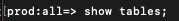

# 4.2 쿼리 서비스 사용

## 목표

- 데이터 세트 찾기 및 탐색
- 쿼리에서 Experience Data Model 개체 및 특성을 처리하는 방법을 알아봅니다

## 컨텍스트

이 단원에서는 PSQL을 사용하여 사용 가능한 데이터 세트에 대한 정보를 검색하고, XDM(Experience Data Model)에 대한 쿼리를 작성하고, Query Service 및 Citi Signal 데이터 세트를 사용하여 첫 번째 간단한 보고 쿼리를 작성하는 방법을 알아봅니다.

## 4.2.1 기본 쿼리

이 단원에서는 사용 가능한 데이터 세트에 대한 정보를 검색하는 방법과 XDM 데이터 세트에서 쿼리를 사용하여 데이터를 올바르게 검색하는 방법에 대해 알아봅니다.

1부터 Adobe Experience Platform을 통해 탐색한 모든 데이터 세트는 SQL 인터페이스를 표를 통해 액세스할 수도 있습니다. 이러한 테이블을 나열하려면 **표 표시** 명령.

실행 **표 표시** 다음 위치에서 **PSQL 명령줄 인터페이스**. ( 세미콜론으로 명령을 종료하십시오.)

명령 복사 **표 표시** 를 프롬프트에 붙여 넣습니다.



다음 결과가 표시됩니다.

```text
aepenablementfy21:all=> show tables;
                            name                            |        dataSetId         |                            dataSet                             | description | resolved 
------------------------------------------------------------+--------------------------+----------------------------------------------------------------+-------------+----------
 demo_system_event_dataset_for_call_center_global_v1_1      | 5fd1a9dea30603194baeea43 | Demo System - Event Dataset for Call Center (Global v1.1)      |             | false
 demo_system_event_dataset_for_mobile_app_global_v1_1       | 5fd1a9de250e4f194bec84cd | Demo System - Event Dataset for Mobile App (Global v1.1)       |             | false
 demo_system_event_dataset_for_voice_assistants_global_v1_1 | 5fd1a9de49ee76194b85f73c | Demo System - Event Dataset for Voice Assistants (Global v1.1) |             | false
 demo_system_event_dataset_for_website_global_v1_1          | 5fd1a9dee3224d194cdfe786 | Demo System - Event Dataset for Website (Global v1.1)          |             | false
 demo_system_profile_dataset_for_loyalty_global_v1_1        | 5fd1a9de250e4f194bec84cc | Demo System - Profile Dataset for Loyalty (Global v1.1)        |             | false
 demo_system_profile_dataset_for_ml_predictions_global_v1_1 | 5fd1a9de241f58194b0cb117 | Demo System - Profile Dataset for ML Predictions (Global v1.1) |             | false
 demo_system_profile_dataset_for_mobile_app_global_v1_1     | 5fd1a9deddf353194a2e00b7 | Demo System - Profile Dataset for Mobile App (Global v1.1)     |             | false
 demo_system_profile_dataset_for_website_global_v1_1        | 5fd1a9de42a61c194dd7b810 | Demo System - Profile Dataset for Website (Global v1.1)        |             | false
 journey_step_events                                        | 5fd1a7f30268c5194bbb7e5e | Journey Step Events                                            |             | false
```

콜론에서 공백 표시줄을 눌러 결과 세트의 다음 페이지를 보거나 를 입력합니다. `q` 명령 프롬프트로 되돌리기

Platform의 모든 데이터 세트에는 해당 쿼리 서비스 테이블이 있습니다. 데이터 세트 UI를 통해 데이터 세트의 테이블을 찾을 수 있습니다.


다음 `demo_system_event_dataset_for_website_global_v1_1` 표는 `Demo System - Event Schema for Website (Global v1.1)` 데이터 세트.

제품을 본 위치에 대한 정보를 쿼리하려면 **지리적 위치** 정보.

아래 구문을 복사하여 **PSQL 명령줄 인터페이스** 다음을 입력합니다.

```sql
select placecontext.geo
from   demo_system_event_dataset_for_website_global_v1_1
where  eventType = 'commerce.productViews'
and placecontext.geo.countryCode <> ''
limit 1;
```

쿼리 결과에서 XDM(Experience Data Model)의 열은 스칼라 유형뿐만 아니라 복잡한 유형일 수 있습니다. 위의 쿼리에서 **commerce.productViews** 발생합니다. 를 식별하려면 **commerce.productViews** XDM 모델을 통해 **.** (점) 표기법.

```text
aepenablementfy21:all=> select placecontext.geo
aepenablementfy21:all-> from   demo_system_event_dataset_for_website_global_v1_1
aepenablementfy21:all-> where  eventType = 'commerce.productViews'
aepenablementfy21:all-> and placecontext.geo.countryCode <> ''
aepenablementfy21:all-> limit 1;
                  geo                   
----------------------------------------
 ("(57.4694803,-3.1269422)",Tullich,GB)
(1 row)
```

결과가 단일 값이 아닌 플랫 객체임을 알 수 있습니까? 다음 **placecontext.geo** 객체에는 네 가지 속성이 포함됩니다. 스키마, 국가 및 도시. 그리고 개체가 열로 선언되면 전체 개체가 문자열로 반환됩니다. XDM 스키마는 익숙한 스키마보다 복잡할 수 있지만 매우 강력하며 많은 솔루션, 채널 및 사용 사례를 지원하도록 설계되었습니다.

객체의 개별 속성을 선택하려면 **.** (점) 표기법.

아래 구문을 복사하여 **PSQL 명령줄 인터페이스**:

```sql
select placecontext.geo._schema.longitude
      ,placecontext.geo._schema.latitude
      ,placecontext.geo.city
      ,placecontext.geo.countryCode
from   demo_system_event_dataset_for_website_global_v1_1
where  eventType = 'commerce.productViews'
and placecontext.geo.countryCode <> ''
limit 1;
```

위의 쿼리 결과는 다음과 같습니다.
이제 결과는 단순 값 집합입니다.

```text
aepenablementfy21:all=> select placecontext.geo._schema.longitude
aepenablementfy21:all->       ,placecontext.geo._schema.latitude
aepenablementfy21:all->       ,placecontext.geo.city
aepenablementfy21:all->       ,placecontext.geo.countryCode
aepenablementfy21:all-> from   demo_system_event_dataset_for_website_global_v1_1
aepenablementfy21:all-> where  eventType = 'commerce.productViews'
aepenablementfy21:all-> and placecontext.geo.countryCode <> ''
aepenablementfy21:all-> limit 1;
 longitude  |  latitude  |  city   | countrycode 
------------+------------+---------+-------------
 -3.1269422 | 57.4694803 | Tullich | GB
(1 row)
```

걱정하지 마십시오. 특정 속성에 대한 경로를 쉽게 가져올 수 있습니다. 다음 부분에서는 방법을 학습합니다.

쿼리를 편집해야 하므로 먼저 편집기를 엽니다.

Windows에서

을(를) 클릭합니다. **검색** windows 도구 모음의 아이콘, **메모장** 에서 **검색** 필드에서 **메모장** 결과:


Mac에서

설치 [대괄호](https://github.com/adobe/brackets/releases/download/release-1.14/Brackets.Release.1.14.dmg) 또는 다른 텍스트 편집기를 설치하지 않은 경우 선택하고 지침을 따릅니다. 설치 후 을 검색합니다. **대괄호** Mac의 spotlight 검색을 통해 열고 엽니다.

메모장 또는 대괄호로 다음 문을 복사합니다.

```sql
select your_attribute_path_here
from   demo_system_event_dataset_for_website_global_v1_1
where  eventType = 'commerce.productViews'
and placecontext.geo.countryCode <> ''
limit 1;
```

Adobe Experience Platform UI로 돌아가거나(브라우저에서 열려야 함) 다음 위치로 이동합니다. [https://platform.adobe.com](https://platform.adobe.com).

선택 **스키마**, 입력 `Demo System - Event Schema for Website (Global v1.1)` 에서 **검색** 필드 및 선택 `Demo System - Event Schema for Website (Global v1.1) Schema` 참조하십시오.


에 대한 XDM 모델 살펴보기 **데모 시스템 - 웹 사이트용 이벤트 스키마(글로벌 v1.1)**&#x200B;를 눌러 객체를 누릅니다. 트리 확장 **placecontext**, **지리적 위치** 및 **스키마**. 실제 속성을 선택하는 경우 **longitude**&#x200B;그러면 강조 표시된 빨간색 상자에 전체 경로가 표시됩니다. 속성의 경로를 복사하려면 경로 복사 아이콘을 클릭합니다.


메모장/브래킷으로 전환한 후 제거 **your_attribute_path_here** 첫 번째 줄에서 다음 뒤에 커서 위치 지정 **선택** 첫 번째 줄에 있는 를 붙여넣습니다(CTRL-V).

수정된 문을 메모장/대괄호로 복사하여 **PSQL 명령줄 인터페이스** 을 눌러 enter 키를 누릅니다.

결과는 다음과 같습니다.

```text
aepenablementfy21:all=> select placeContext.geo._schema.longitude
aepenablementfy21:all-> from   demo_system_event_dataset_for_website_global_v1_1
aepenablementfy21:all-> where  eventType = 'commerce.productViews'
aepenablementfy21:all-> and placecontext.geo.countryCode <> ''
aepenablementfy21:all-> limit 1;
 longitude  
------------
 -3.1269422
```

다음 단계: [4.3 쿼리, 쿼리, 쿼리... 및 이탈 분석](./ex3.md)

[모듈 4로 돌아가기](./query-service.md)

[모든 모듈로 돌아가기](../../overview.md)
