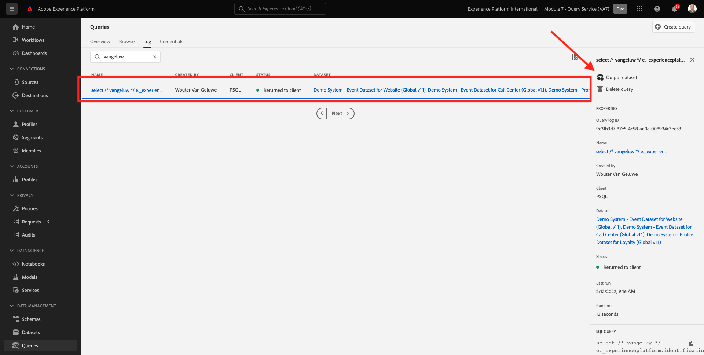
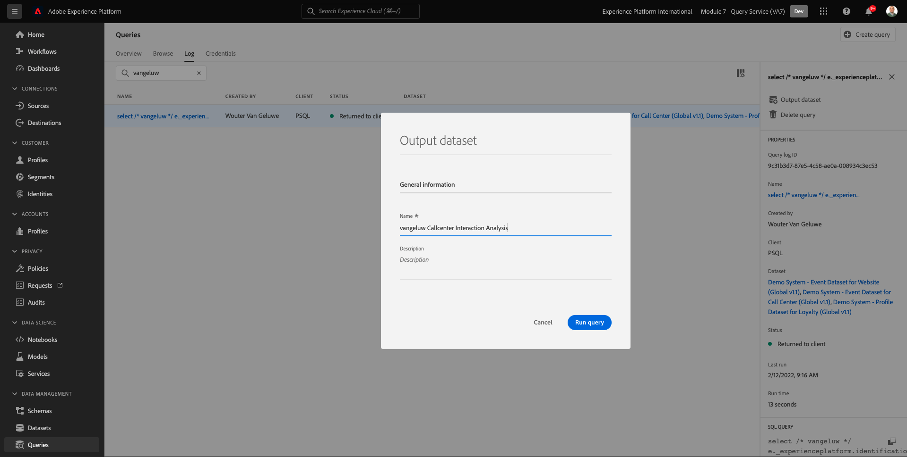

# 4.4 쿼리에서 데이터 세트 생성

## 목표

쿼리 결과에서 데이터 세트를 생성하는 방법 알아보기 Microsoft Power BI Desktop/Tableau를 직접 쿼리 서비스에 연결 Microsoft Desktop/Tableau Desktop에서 보고서 만들기

## 단원 컨텍스트

데이터를 쿼리하는 명령줄 인터페이스는 흥미로울 수 있지만 제대로 표시되지 않습니다. 이 단원에서는 Microsoft Power BI Desktop/Tableau를 사용하여 이해 당사자를 위한 시각적 보고서를 직접 만드는 방법에 대한 권장 워크플로우를 안내합니다.

## 4.4.1 SQL 쿼리에서 데이터 집합 만들기

쿼리의 복잡성은 Query Service가 결과를 반환하는 데 걸리는 시간에 영향을 줍니다. 그리고 명령줄에서 직접 또는 Microsoft Power BI/타블로와 같은 다른 솔루션을 쿼리할 때 쿼리 서비스는 5분 시간 제한(600초)으로 구성됩니다. 그리고 경우에 따라 이러한 솔루션은 짧은 시간 초과로 구성됩니다. 더 큰 쿼리를 실행하고 결과를 반환하는 데 걸리는 시간을 미리 로드하기 위해 쿼리 결과에서 데이터 세트를 생성하는 기능을 제공합니다. 이 기능은 CTAS(Create Table As Select)라는 표준 SQL 기능을 사용합니다. 이 기능은 쿼리 목록의 플랫폼 UI에서 사용할 수 있으며 PSQL을 사용하는 명령줄에서 직접 실행할 수도 있습니다.

이전 버전에서는 **이름 입력** PSQL에서 실행하기 전에 사용자 자신의 ldap를 사용하여 실행 중입니다.

```sql
select /* enter your name */
       e.--aepTenantId--.identification.core.ecid as ecid,
       e.placeContext.geo.city as city,
       e.placeContext.geo._schema.latitude latitude,
       e.placeContext.geo._schema.longitude longitude,
       e.placeContext.geo.countryCode as countrycode,
       c.--aepTenantId--.interactionDetails.core.callCenterAgent.callFeeling as callFeeling,
       c.--aepTenantId--.interactionDetails.core.callCenterAgent.callTopic as callTopic,
       c.--aepTenantId--.interactionDetails.core.callCenterAgent.callContractCancelled as contractCancelled,
       l.--aepTenantId--.loyaltyDetails.level as loyaltystatus,
       l.--aepTenantId--.loyaltyDetails.points as loyaltypoints,
       l.--aepTenantId--.identification.core.loyaltyId as crmid
from   demo_system_event_dataset_for_website_global_v1_1 e
      ,demo_system_event_dataset_for_call_center_global_v1_1 c
      ,demo_system_profile_dataset_for_loyalty_global_v1_1 l
where  e.--aepTenantId--.demoEnvironment.brandName IN ('Luma Telco', 'Citi Signal')
and    e.web.webPageDetails.name in ('Cancel Service', 'Call Start')
and    e.--aepTenantId--.identification.core.ecid = c.--aepTenantId--.identification.core.ecid
and    l.--aepTenantId--.identification.core.ecid = e.--aepTenantId--.identification.core.ecid;
```

Adobe Experience Platform UI로 이동 - [https://experience.adobe.com/platform](https://experience.adobe.com/platform)

검색 필드에 ldap를 입력하여 Adobe Experience Platform 쿼리 UI에서 실행된 문을 검색합니다.

선택 **쿼리**, 이동 **로그** 검색 필드에 ldap를 입력합니다.


쿼리를 선택하고 **출력 데이터 세트**.



Enter 키 `--demoProfileLdap-- Callcenter Interaction Analysis` 데이터 세트에 대한 이름 및 설명과 함께 를 누르고 **쿼리 실행** 버튼



그 결과 상태가 있는 새 쿼리가 표시됩니다 **제출됨**.


완료되면, 새 항목이 표시됩니다. **생성된 데이터 세트** (페이지를 새로 고쳐야 할 수 있습니다.)


데이터 세트를 만드는 즉시(5~10분 정도 걸릴 수 있음) 연습을 계속할 수 있습니다.

다음 단계 - 옵션 A: [4.5 쿼리 서비스 및 Power BI](./ex5.md)

다음 단계 - 옵션 B: [4.6 쿼리 서비스 및 타블로](./ex6.md)

[모듈 4로 돌아가기](./query-service.md)

[모든 모듈로 돌아가기](../../overview.md)
