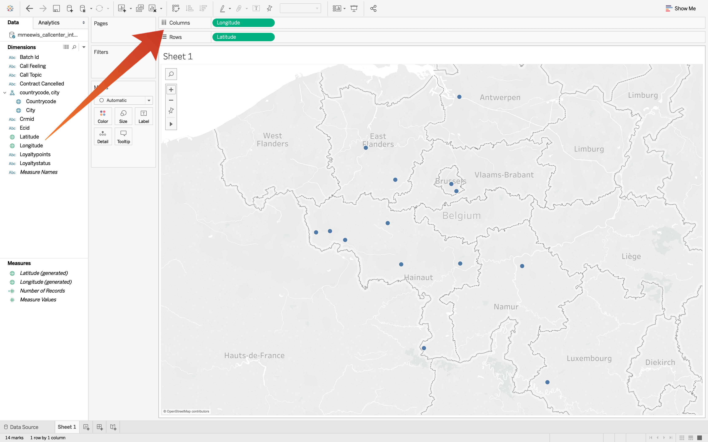

# 4.6 쿼리 서비스 및 타블로

타블로를 엽니다.

in **서버에 연결** 선택 **PostgreSQL**:

Adobe Experience Platform으로 이동하여 **쿼리** 및 **자격 증명**.

에서 **자격 증명** Adobe Experience Platform에서 페이지를 복사합니다. **호스트** 여기에 붙여넣습니다 **서버** 필드, 복사 **데이터베이스** 여기에 붙여넣습니다 **데이터베이스** 타블로의 필드에서 **포트** 필드에 붙여넣습니다. **포트**&#x200B;타블로에서는 같은 방법으로 하십시오 **사용자 이름** 및 **암호**. 다음을 클릭합니다. **로그인**.

로그인:

검색(1)을 클릭하고 **ldap** 검색 필드로 테이블 이름을 지정하고 (3) 이 테이블을 명명된 위치로 드래그합니다. **표를 여기로 드래그하십시오.**. 완료되면 을(를) 클릭합니다. **시트 1** (3).

맵에서 데이터를 시각화하려면 경도 및 위도를 차원으로 변환해야 합니다. in **측정 단위** 선택 **위도** (1) 필드의 드롭다운을 열고 을(를) 선택합니다. **Dimension으로 변환** (2). 에 대해서도 동일한 작업을 수행합니다 **경도** 측정.

을(를) 드래그합니다. **경도** 다음으로 측정 **열** 그리고 **위도** 측정 **행**. 맵 자동 **벨기에** 은 데이터 세트에서 도시를 나타내는 작은 점이 있는 상태로 나타납니다.

선택 **측정값 이름** (1) 드롭다운을 열고 을 선택합니다. **시트에 추가** (2):

이제 다양한 크기의 점이 있는 지도가 있습니다. 크기는 특정 도시에 대한 콜 센터 상호 작용 수를 나타냅니다. 점의 크기를 변경하려면 오른쪽 패널로 이동하여 엽니다 **측정값 값** ( 드롭다운 아이콘 사용) 드롭다운 목록에서 을(를) 선택합니다 **크기 편집**. 크기가 다른 곳에서 게임을 하세요.

데이터를에 추가로 표시하려면 **통화 항목**&#x200B;를 클릭하고 (1) **통화 항목** 차원 켜기 **페이지**. 다른 탐색 **통화 항목** 사용 **통화 항목** (2) 화면의 오른쪽:

이제 이 운동을 끝마쳤습니다.

다음 단계: [4.7 Query Service API](./ex7.md)

[모듈 4로 돌아가기](./query-service.md)

[모든 모듈로 돌아가기](../../overview.md)
