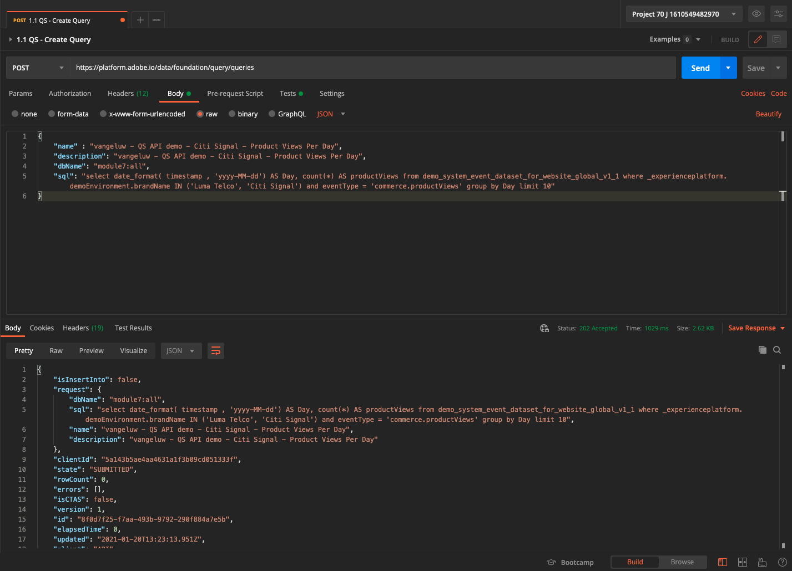

# 4.7 Query Service API

## 목표

- 쿼리 서비스 API를 사용하여 쿼리 템플릿 및 쿼리 일정을 관리합니다

## 컨텍스트

이 연습에서는 Postman 컬렉션을 사용하여 쿼리 템플릿 및 쿼리 일정을 관리하는 API 호출을 실행합니다. 쿼리 템플릿을 정의하고 일반 쿼리 및 CTAS 쿼리를 실행합니다. A **CTAS** 쿼리(선택 쿼리로 테이블 만들기)는 그 결과를 명시적 데이터 세트에 저장합니다. 일반 쿼리는 암시적(또는 시스템 생성) 데이터 세트에 저장되지만 일반적으로 parquet 파일 형식으로 내보내집니다.

## 설명서

- [Adobe Experience Platform 쿼리 서비스 도움말](https://experienceleague.adobe.com/docs/experience-platform/query/api/getting-started.html)
- [쿼리 서비스 API](https://www.adobe.io/apis/experienceplatform/home/api-reference.html#!acpdr/swagger-specs/qs-api.yaml)

## 4.7.1 Query Service API

Query Service API를 사용하면 Adobe Experience Platform 데이터 레이크에 대한 비대화형 쿼리를 관리할 수 있습니다.

비대화형 은 쿼리 실행 요청이 즉시 응답을 하지 않는다는 것을 의미합니다. 쿼리가 처리되고 그 결과 세트가 암시적 또는 명시적(CTAS: (선택한 대로 테이블 만들기) 데이터 세트.

## 4.7.2 샘플 쿼리

샘플 쿼리는 [4.3 - 쿼리, 쿼리, 쿼리.. 및 이탈 분석](./ex3.md):

제품 보기는 일별로 몇 개나 됩니까?

**SQL**

```sql
select date_format( timestamp , 'yyyy-MM-dd') AS Day,
       count(*) AS productViews
from   demo_system_event_dataset_for_website_global_v1_1
where  --aepTenantId--.demoEnvironment.brandName IN ('Luma Telco', 'Citi Signal')
and eventType = 'commerce.productViews'
group by Day
limit 10;
```

## 4.7.3 쿼리

컴퓨터에서 Postman을 엽니다. 모듈 3의 일부로 Postman 환경을 만들고 Postman 컬렉션을 가져왔습니다. 다음 지침을 따르십시오. [연습 3.3.3](./../module3/ex3.md) 아직 안 했을 수도 있어요

가져온 Postman 컬렉션의 일부로 폴더가 표시됩니다 **3. 쿼리 서비스**. 이 폴더가 표시되지 않으면 [Postman 컬렉션](../../assets/postman/postman_profile.zip) 및 의 지침에 따라 Postman에서 해당 컬렉션을 다시 가져옵니다 [연습 3.3.3](./../module3/ex3.md).


>[!NOTE]
>
>현재 폴더만 **1. 쿼리** 에 요청이 들어 있습니다. 다른 요청은 계층 단계에서 추가됩니다.

해당 폴더를 열고 쿼리 결과 세트를 실행, 모니터링 및 다운로드할 수 있는 Query Service API 호출을 알 수 있습니다.

에 대한 POST 호출 [/query/queries] 다음 페이로드를 사용하여 쿼리의 실행을 트리거합니다.

### 4.7.3.1 쿼리 만들기

이름이 지정된 요청을 클릭합니다. **1.1 QS - 쿼리 만들기** 그리고 **머리글**. 그러면 다음 내용이 표시됩니다.


이 헤더 필드에 초점을 맞추겠습니다.

| 키 | 값 |
| ----------- | ----------- |
| x-sandbox-name | `--module7sandbox--` |

>[!NOTE]
>
>사용 중인 Adobe Experience Platform 샌드박스의 이름을 지정해야 합니다. 헤더 필드 **x-sandbox-name** 다음과 같습니다. `--module7sandbox--`.

다음 작업을 수행합니다. **본문** 섹션을 참조하십시오. 에서 **본문** 이 요청의 경우 다음 내용이 표시됩니다.


```sql
{
    "name" : "ldap - QS API demo - Citi Signal - Product Views Per Day",
	"description": "ldap - QS API demo - Citi Signal - Product Views Per Day",
	"dbName": "module7:all",
	"sql": "select date_format( timestamp , 'yyyy-MM-dd') AS Day, count(*) AS productViews from demo_system_event_dataset_for_website_global_v1_1 where _experienceplatform.demoEnvironment.brandName IN ('Luma Telco', 'Citi Signal') and eventType = 'commerce.productViews' group by Day limit 10"
}
```

주의: 변수를 업데이트하십시오 **이름** 아래 요청에서 **ldap** 특정 **ldap**.

특정 **ldap**&#x200B;로 지정하는 경우 본문은 다음과 유사해야 합니다.

```json
{
    "name" : "vangeluw - QS API demo - Citi Signal - Product Views Per Day",
	"description": "vangeluw - QS API demo - Citi Signal - Product Views Per Day",
	"dbName": "module7:all",
	"sql": "select date_format( timestamp , 'yyyy-MM-dd') AS Day, count(*) AS productViews from demo_system_event_dataset_for_website_global_v1_1 where _experienceplatform.demoEnvironment.brandName IN ('Luma Telco', 'Citi Signal') and eventType = 'commerce.productViews' group by Day limit 10"
}
```

>[!NOTE]
>
>키 **dbName** 위의 JSON 본문에서 Adobe Experience Platform 인스턴스에 사용되는 샌드박스를 참조합니다. PROD 샌드박스를 사용하는 경우 dbName은 **prod:all**&#x200B;와 같은 다른 샌드박스를 사용하는 경우 **모듈7**&#x200B;이면 dbName은 다음과 같아야 합니다. **모듈7:모두**.

그런 다음 파란색을 클릭합니다 **보내기** 버튼을 클릭하여 세그먼트를 만들고 그 결과를 확인합니다.



요청이 성공하면 다음 응답을 반환합니다.

```json
{
    "isInsertInto": false,
    "request": {
        "dbName": "module7:all",
        "sql": "select date_format( timestamp , 'yyyy-MM-dd') AS Day, count(*) AS productViews from demo_system_event_dataset_for_website_global_v1_1 where _experienceplatform.demoEnvironment.brandName IN ('Luma Telco', 'Citi Signal') and eventType = 'commerce.productViews' group by Day limit 10",
        "name": "vangeluw - QS API demo - Citi Signal - Product Views Per Day",
        "description": "vangeluw - QS API demo - Citi Signal - Product Views Per Day"
    },
    "clientId": "5a143b5ae4aa4631a1f3b09cd051333f",
    "state": "SUBMITTED",
    "rowCount": 0,
    "errors": [],
    "isCTAS": false,
    "version": 1,
    "id": "8f0d7f25-f7aa-493b-9792-290f884a7e5b",
    "elapsedTime": 0,
    "updated": "2021-01-20T13:23:13.951Z",
    "client": "API",
    "userId": "A3392DB95FFF08EE0A495E87@techacct.adobe.com",
    "created": "2021-01-20T13:23:13.951Z",
    "_links": {
        "self": {
            "href": "https://platform-va7.adobe.io/data/foundation/query/queries/8f0d7f25-f7aa-493b-9792-290f884a7e5b",
            "method": "GET"
        },
        "soft_delete": {
            "href": "https://platform-va7.adobe.io/data/foundation/query/queries/8f0d7f25-f7aa-493b-9792-290f884a7e5b",
            "method": "PATCH",
            "body": "{ \"op\": \"soft_delete\"}"
        },
        "cancel": {
            "href": "https://platform-va7.adobe.io/data/foundation/query/queries/8f0d7f25-f7aa-493b-9792-290f884a7e5b",
            "method": "PATCH",
            "body": "{ \"op\": \"cancel\"}"
        }
    }
}
```

현재 **state** 쿼리의 **제출됨**, 일단 실행되면 상태가 **성공**.

Adobe Experience Platform UI를 통해 제출된 쿼리를 조회하고 [Adobe Experience Platform](https://experience.adobe.com/#/@experienceplatform/platform/home), 다음 위치로 이동합니다. **쿼리**&#x200B;에 대해 **로그** 쿼리를 선택합니다.


### 4.7.3.2 쿼리 가져오기

이름이 지정된 요청을 클릭합니다. **1.2 QS - 쿼리 가져오기** 그리고 **머리글**. 그러면 다음 내용이 표시됩니다.


이 헤더 필드에 초점을 맞추겠습니다.

| 키 | 값 |
| ----------- | ----------- |
| x-sandbox-name | `--module7sandbox--` |

>[!NOTE]
>
>사용 중인 Adobe Experience Platform 샌드박스의 이름을 지정해야 합니다. 헤더 필드 **x-sandbox-name** 다음과 같습니다. `--module7sandbox--`.

이동 **매개 변수**. 그러면 다음 내용이 표시됩니다.


다음 **orderby** 매개 변수를 사용하면 **생성됨** 속성을 사용합니다. 다음 사항에 주의하십시오. **&#39;-&#39;** 만든 사람 앞에 로그인. 즉, 쿼리 목록이 반환되는 순서대로 작성된 날짜를 사용합니다. **내림차순** 주문. 쿼리가 목록 맨 위에 있어야 합니다.

그런 다음 파란색을 클릭합니다 **보내기** 버튼을 클릭하여 세그먼트를 만들고 그 결과를 확인합니다.


요청이 성공하면 아래 요청과 유사한 응답을 반환합니다. 다음 **state** 응답 중 **제출됨**, **IN_PROGRESS** 또는 **성공**. 쿼리에 다음이 포함되려면 몇 분 정도 걸릴 수 있습니다 **성공** state. 이 요청이 표시될 때까지 여러 번 이 요청 전송을 반복할 수 있습니다. **성공** state.

```json
{
    "queries": [
        {
            "isInsertInto": false,
            "request": {
                "dbName": "module7:all",
                "sql": "select date_format( timestamp , 'yyyy-MM-dd') AS Day, count(*) AS productViews from demo_system_event_dataset_for_website_global_v1_1 where _experienceplatform.demoEnvironment.brandName IN ('Luma Telco', 'Citi Signal') and eventType = 'commerce.productViews' group by Day limit 10",
                "name": "vangeluw - QS API demo - Citi Signal - Product Views Per Day",
                "description": "vangeluw - QS API demo - Citi Signal - Product Views Per Day"
            },
            "clientId": "5a143b5ae4aa4631a1f3b09cd051333f",
            "state": "SUCCESS",
            "rowCount": 1,
            "errors": [],
            "isCTAS": false,
            "version": 1,
            "id": "8f0d7f25-f7aa-493b-9792-290f884a7e5b",
            "elapsedTime": 217481,
            "updated": "2021-01-20T13:26:51.432Z",
            "client": "API",
            "userId": "A3392DB95FFF08EE0A495E87@techacct.adobe.com",
            "created": "2021-01-20T13:23:13.951Z",
            "_links": {
                "self": {
                    "href": "https://platform-va7.adobe.io/data/foundation/query/queries/8f0d7f25-f7aa-493b-9792-290f884a7e5b",
                    "method": "GET"
                },
                "soft_delete": {
                    "href": "https://platform-va7.adobe.io/data/foundation/query/queries/8f0d7f25-f7aa-493b-9792-290f884a7e5b",
                    "method": "PATCH",
                    "body": "{ \"op\": \"soft_delete\"}"
                },
                "referenced_datasets": [
                    {
                        "id": "60080ace62c49a19490c5870",
                        "href": "https://platform-va7.adobe.io/data/foundation/catalog/dataSets/60080ace62c49a19490c5870"
                    }
                ]
            }
        }
     ]
    },
    "version": 1
}
```

상태가 **성공**&#x200B;다음 요청을 계속 진행하십시오.

### 4.7.3.3 쿼리 상태 가져오기

이름이 지정된 요청을 클릭합니다. **1.3 QS - 쿼리 상태 가져오기** 그리고 **머리글**. 그러면 다음 내용이 표시됩니다.


이 헤더 필드에 초점을 맞추겠습니다.

| 키 | 값 |
| ----------- | ----------- |
| x-sandbox-name | `--module7sandbox--` |

>[!NOTE]
>
>사용 중인 Adobe Experience Platform 샌드박스의 이름을 지정해야 합니다. 헤더 필드 **x-sandbox-name** 다음과 같습니다. `--module7sandbox--`.

그런 다음 파란색을 클릭합니다 **보내기** 버튼을 클릭하여 세그먼트를 만들고 그 결과를 확인합니다.


요청이 성공하면 아래 요청과 유사한 응답을 반환합니다.

```json
{
    "isInsertInto": false,
    "request": {
        "dbName": "module7:all",
        "sql": "select date_format( timestamp , 'yyyy-MM-dd') AS Day, count(*) AS productViews from demo_system_event_dataset_for_website_global_v1_1 where _experienceplatform.demoEnvironment.brandName IN ('Luma Telco', 'Citi Signal') and eventType = 'commerce.productViews' group by Day limit 10",
        "name": "vangeluw - QS API demo - Citi Signal - Product Views Per Day",
        "description": "vangeluw - QS API demo - Citi Signal - Product Views Per Day"
    },
    "clientId": "5a143b5ae4aa4631a1f3b09cd051333f",
    "state": "SUCCESS",
    "rowCount": 1,
    "errors": [],
    "isCTAS": false,
    "version": 1,
    "id": "8f0d7f25-f7aa-493b-9792-290f884a7e5b",
    "elapsedTime": 217481,
    "updated": "2021-01-20T13:26:51.432Z",
    "client": "API",
    "userId": "A3392DB95FFF08EE0A495E87@techacct.adobe.com",
    "created": "2021-01-20T13:23:13.951Z",
    "_links": {
        "self": {
            "href": "https://platform-va7.adobe.io/data/foundation/query/queries/8f0d7f25-f7aa-493b-9792-290f884a7e5b",
            "method": "GET"
        },
        "soft_delete": {
            "href": "https://platform-va7.adobe.io/data/foundation/query/queries/8f0d7f25-f7aa-493b-9792-290f884a7e5b",
            "method": "PATCH",
            "body": "{ \"op\": \"soft_delete\"}"
        },
        "referenced_datasets": [
            {
                "id": "60080ace62c49a19490c5870",
                "href": "https://platform-va7.adobe.io/data/foundation/catalog/dataSets/60080ace62c49a19490c5870"
            }
        ]
    }
}
```

쿼리가 **성공**&#x200B;를 입력하면 을 통해 쿼리가 검색한 행 수도 표시됩니다. **rowCount** 속성을 사용합니다. 예제에서는 쿼리에 의해 10개의 행이 반환됩니다. 다음 섹션에서 10개의 행을 검색하는 방법을 살펴보겠습니다.

### 4.7.3.4 쿼리 결과 검색

다음 **성공** 위의 응답에는 다음이 포함됩니다 **referenced_datasets** 쿼리 결과를 저장하는 암시적 데이터 세트를 가리키는 속성입니다. 결과에 액세스하기 위해 **href** 또는 **id** 속성을 사용합니다.

이름이 지정된 요청을 클릭합니다. **1.4 QS - 쿼리 결과 가져오기** 그리고 **머리글**. 그러면 다음 내용이 표시됩니다.


이 헤더 필드에 초점을 맞추겠습니다.

| 키 | 값 |
| ----------- | ----------- |
| x-sandbox-name | `--module7sandbox--` |

>[!NOTE]
>
>사용 중인 Adobe Experience Platform 샌드박스의 이름을 지정해야 합니다. 헤더 필드 **x-sandbox-name** 다음과 같습니다. `--module7sandbox--`.

그런 다음 파란색을 클릭합니다 **보내기** 버튼을 클릭하여 세그먼트를 만들고 그 결과를 확인합니다.


이 요청의 응답은 데이터 세트 파일을 가리킵니다.

```json
{
    "60080ace62c49a19490c5870": {
        "name": "Demo System - Event Dataset for Website (Global v1.1)",
        "description": "Demo System - Event Dataset for Website (Global v1.1)",
        "enableErrorDiagnostics": false,
        "tags": {
            "adobe/siphon/partition/definition": [
                "day(timestamp, _ACP_DATE)",
                "identity(_ACP_BATCHID)"
            ],
            "aep/siphon/partitions": [
                "_ACP_DATE",
                "_ACP_BATCHID"
            ],
            "acp_granular_plugin_validation_flags": [
                "identity:enabled",
                "profile:enabled"
            ],
            "adobe/siphon/buffered-promotion-recency": [
                "live"
            ],
            "adobe/siphon/use-buffered-promotion": [
                "true"
            ],
            "adobe/pqs/table": [
                "demo_system_event_dataset_for_website_global_v1_1"
            ],
            "aep/siphon/expire-snapshot-timestamp": [
                "1611141272703"
            ],
            "acp_granular_validation_flags": [
                "requiredFieldCheck:enabled"
            ],
            "acp_validationContext": [
                "enabled"
            ],
            "adobe/siphon/table/format": [
                "iceberg"
            ],
            "unifiedProfile": [
                "enabled:true",
                "enabledAt:2021-01-20 10:49:51"
            ],
            "unifiedIdentity": [
                "enabled:true"
            ]
        },
        "namespace": "ACP",
        "state": "DRAFT",
        "imsOrg": "907075E95BF479EC0A495C73@AdobeOrg",
        "sandboxId": "62cd9f38-8529-4b05-8d9f-388529db0540",
        "lastBatchId": "01EWFQZ15XRNNB1FPKPW5ETRVP",
        "lastBatchStatus": "success",
        "lastSuccessfulBatch": "01EWFQZ15XRNNB1FPKPW5ETRVP",
        "version": "1.0.6",
        "created": 1611139790698,
        "updated": 1611149266031,
        "createdClient": "750e24ee855b4ac18ccc4f4817f96ee1",
        "createdUser": "3A260B485E909A170A495E76@techacct.adobe.com",
        "updatedUser": "acp_foundation_dataTracker@AdobeID",
        "viewId": "60080ace62c49a19490c5871",
        "fileDescription": {
            "persisted": true,
            "containerFormat": "parquet",
            "format": "parquet"
        },
        "files": "@/dataSets/60080ace62c49a19490c5870/views/60080ace62c49a19490c5871/files",
        "schemaMetadata": {
            "delta": [],
            "gdpr": []
        },
        "schemaRef": {
            "id": "https://ns.adobe.com/experienceplatform/schemas/d9b88a044ad96154637965a97ed63c7b20bdf2ab3b4f642e",
            "contentType": "application/vnd.adobe.xed-full+json;version=1"
        }
    }
}
```

>[!NOTE]
>
>Query Service API와 상호 작용하는 데 도움이 되도록 추가 연습이 곧 추가됩니다.

다음 단계: [요약 및 이점](./summary.md)

[모듈 4로 돌아가기](./query-service.md)

[모든 모듈로 돌아가기](../../overview.md)
