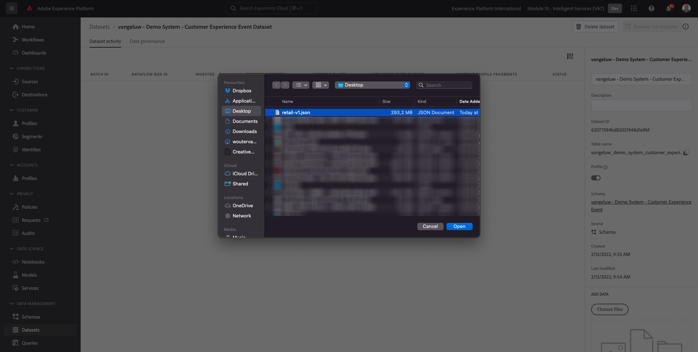
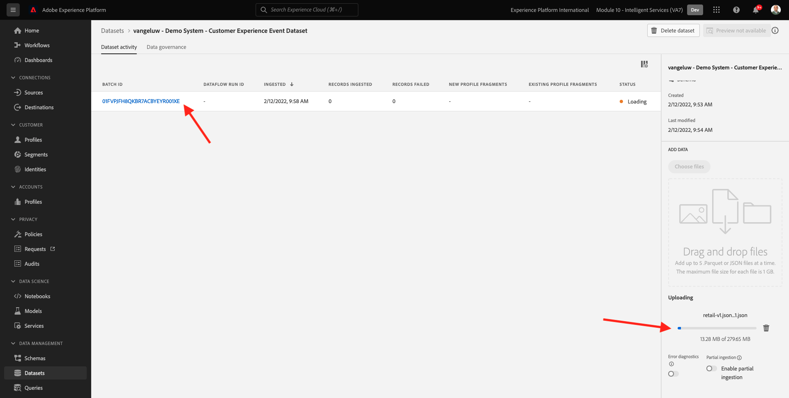

# 5.1 Customer AI - 데이터 준비(수집)

Intelligent Services에서 마케팅 이벤트 데이터에서 통찰력을 검색하려면 데이터를 표준 구조로 의미상 보강하고 유지 관리해야 합니다. Intelligent Services는 이를 위해 Adobe의 XDM(Experience Data Model) 스키마를 활용합니다.
특히 Intelligent Services에서 사용되는 모든 데이터 세트는 **소비자 경험 이벤트** XDM 스키마.

## 5.1.1 스키마 만들기

이 연습에서는 **소비자 경험 이벤트 mixin**&#x200B;에 필요한 **고객 AI** Intelligent Service.

다음 URL로 이동하여 Adobe Experience Platform에 로그인합니다. [https://experience.adobe.com/platform](https://experience.adobe.com/platform).

로그인하면 Adobe Experience Platform 홈 페이지가 표시됩니다.

계속하기 전에 **샌드박스**. 선택할 샌드박스의 이름은 다음과 같습니다 ``--module10sandbox--``. 이 작업은 텍스트를 클릭하여 수행할 수 있습니다 **[!UICONTROL 프로덕션 제품]** 화면 상단에 있는 파란색 줄에 표시됩니다. 적절한 샌드박스를 선택하면 화면 변경 사항이 표시되고 이제 전용 샌드박스에 있습니다.

왼쪽 메뉴에서 **스키마** 그리고 **찾아보기**. 클릭 **스키마 만들기**.

팝업에서 **XDM ExperienceEvent**.

그러면 이게 보입니다.

다음을 검색하고 선택합니다 **Mixin** 이 스키마에 추가하려면 다음을 수행합니다.

- 소비자 경험 이벤트

   

- 최종 사용자 ID 세부 정보

   

클릭 **필드 그룹 추가**.

그러면 이게 보입니다. Mixin 선택 **최종 사용자 ID 세부 정보**.

필드로 이동합니다 **endUserIDs._experience.emailid.id**.

필드의 오른쪽 메뉴에서 **endUserIDs._experience.emailid.id**, 아래로 스크롤하여 확인란을 선택합니다. **ID**&#x200B;에 대한 확인란을 선택합니다. **기본 ID** 을(를) 선택하고 을(를) 선택합니다. **ID 네임스페이스** 의 **이메일**.

필드로 이동합니다 **endUserIDs._experience.mcid.id**. 에 대한 확인란을 선택합니다. **ID** 을(를) 선택하고 을(를) 선택합니다. **ID 네임스페이스** 의 **ECID**. **적용**&#x200B;을 클릭합니다.

지금 스키마에 이름을 지정합니다.

스키마 이름으로 다음 항목을 사용합니다.

- `--demoProfileLdap-- - Demo System - Customer Experience Event`

예를 들어 ldap의 경우 **vangeluw**, 스키마 이름이어야 합니다.

- **vangeluw - 데모 시스템 - 고객 경험 이벤트**

그러면 이런 걸 줄 거예요 을(를) 클릭합니다. **+ 추가** 새 항목 추가 단추 **Mixin**.

스키마 이름을 선택합니다. 이제 스키마를 활성화 해야 합니다 **프로필**&#x200B;를 클릭하여 레코드 추가를 클릭합니다. **프로필** 토글.

그러면 이게 보입니다. 클릭 **활성화**.

이제 이걸 가져가세요 클릭 **저장** 스키마를 저장하려면 을 클릭합니다.

## 5.1.2 데이터 집합 만들기

왼쪽 메뉴에서 **데이터 세트** 그리고 **찾아보기**. 클릭 **데이터 집합 만들기**.

**스키마에서 데이터 세트 만들기**&#x200B;를 클릭합니다.

다음 화면에서 이전 연습에서 만든 데이터 세트를 선택하고 이 이름을 지정합니다 **[!UICONTROL ldap - 데모 시스템 - 고객 경험 이벤트]**. **다음**&#x200B;을 클릭합니다.

데이터 세트의 이름으로 `--demoProfileLdap-- - Demo System - Customer Experience Event Dataset`. **마침을 클릭합니다**.

이제 데이터 세트가 생성됩니다. 를 활성화합니다 **프로필** 토글.

클릭 **활성화**.

이제 다음을 수행해야 합니다.

이제 소비자 경험 이벤트 데이터 섭취를 시작하고 고객 AI 서비스 사용을 시작할 준비가 되었습니다.

## 5.1.3 Experience Event 테스트 데이터 다운로드

한 번 **스키마** 및 **데이터 집합** 구성되었으므로 이제 경험 이벤트 데이터를 수집할 준비가 되었습니다. 고객 AI에는 **적어도 2분기**: 외부에서 준비된 데이터를 수집해야 합니다.

경험 이벤트에 대해 준비된 데이터는 [소비자 경험 이벤트 XDM Mixin](https://github.com/adobe/xdm/blob/797cf4930d5a80799a095256302675b1362c9a15/docs/reference/context/experienceevent-consumer.schema.md).

다음 위치에서 샘플 데이터가 포함된 파일을 다운로드하십시오. [https://dashboard.adobedemo.com/data](https://dashboard.adobedemo.com/data). 을(를) 클릭합니다. **다운로드** 버튼을 클릭합니다.

이제 이름이 인 파일을 다운로드했습니다. **retail-v1-2020-xl.json.zip**. 컴퓨터의 바탕 화면에 파일을 놓고 압축을 풀면 파일 이름이 표시됩니다 **retail-v1.json**. 다음 연습에서는 이 파일이 필요합니다.

## 5.1.4 경험 이벤트 테스트 데이터 수집

Adobe Experience Platform에서 **데이터 세트** 및 이름이 인 데이터 세트를 엽니다 **[!UICONTROL ldap - 데모 시스템 - 고객 경험 이벤트 데이터 세트]**.

데이터 세트에서 **파일 선택** 를 눌러 데이터를 추가합니다.

팝업에서 파일을 선택합니다 **retail-v1.json** 을(를) 클릭합니다. **열기**.

그러면 가져오는 데이터가 표시되고 **로드 중** state. 파일이 업로드될 때까지 이 페이지에서 멀리 탐색하지 마십시오.

파일이 업로드되면 배치 상태 변경사항이 표시됩니다. **로드 중** to **처리 중**.

데이터를 수집 및 처리하는 데 10~20분이 걸릴 수 있습니다.

데이터 수집이 성공하면 배치 상태가 (으)로 변경됩니다 **성공**.

다음 단계: [5.2 Customer AI - 새 인스턴스 만들기(구성)](./ex2.md)

[모듈 5로 돌아가기](./intelligent-services.md)

[모든 모듈로 돌아가기](./../../overview.md)
