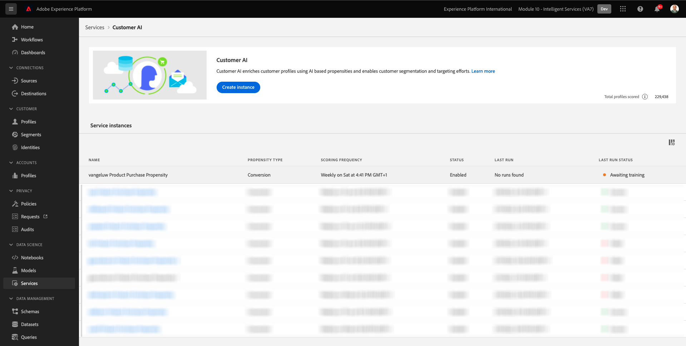

# 5.2 Customer AI - 새 인스턴스 만들기(구성)

고객 AI는 기존 소비자 경험 이벤트 데이터를 분석하여 이탈이나 전환 성향 점수를 예측하여 작동합니다. 새로운 Customer AI 인스턴스를 만들면 마케터가 목표 및 측정 단위를 정의할 수 있습니다.

## 5.2.1 새 Customer AI 인스턴스 설정

Adobe Experience Platform에서 **서비스** 왼쪽 메뉴에 있습니다. 다음 **서비스** 브라우저가 나타나고 사용 가능한 모든 서비스를 원하는 대로 표시합니다. Customer AI용 카드에서 **열기**.

클릭 **인스턴스 만들기**.

그러면 이게 보입니다.

고객 AI 인스턴스에 필요한 세부 정보를 입력합니다.

- 이름: 사용 `--demoProfileLdap-- Product Purchase Propensity`
- 설명: 사용: **고객이 제품을 구매할 가능성 예측**
- 성향 유형: 선택 **전환**

**다음**&#x200B;을 클릭합니다.

그러면 이게 보입니다. 이전 연습에서 만든 데이터 세트를 선택하고 이름을 지정합니다 `--demoProfileLdap - Demo System - Customer Experience Event Dataset`. **다음**&#x200B;을 클릭합니다.

선택 **이 발생합니다** 필드를 정의하고 정의합니다 **commerce.purchases.value** 를 target 변수로 사용하십시오.

**다음**&#x200B;을 클릭합니다.

그런 다음 실행할 일정을 설정합니다 **주별** 그리고 시간을 현재 시간으로 최대한 가깝게 설정합니다. 전환 확인 **프로필에 대한 점수 활성화** 이 활성화되어 있습니다.

**마침을 클릭합니다**.

그러면 이 팝업이 표시됩니다. **확인**&#x200B;을 클릭합니다.

인스턴스를 구성한 후 Customer AI 인스턴스 목록에서 인스턴스를 볼 수 있으며, Customer AI 인스턴스 행을 클릭하여 설정 및 실행 세부 사항의 요약을 미리 볼 수도 있습니다. 오류가 발견된 경우 요약 패널에는 오류 세부 정보도 표시됩니다.

>[!NOTE]
>
>고객 AI 인스턴스의 상태가 다음 중 하나인 경우 정의나 속성을 수정할 수 있습니다 **교육 대기 중** 또는 **오류**

다음 단계: [5.3 Customer AI - 점수 대시보드 및 세그멘테이션(예측 및 수행)](./ex3.md)

[모듈 5로 돌아가기](./intelligent-services.md)

[모든 모듈로 돌아가기](./../../overview.md)
