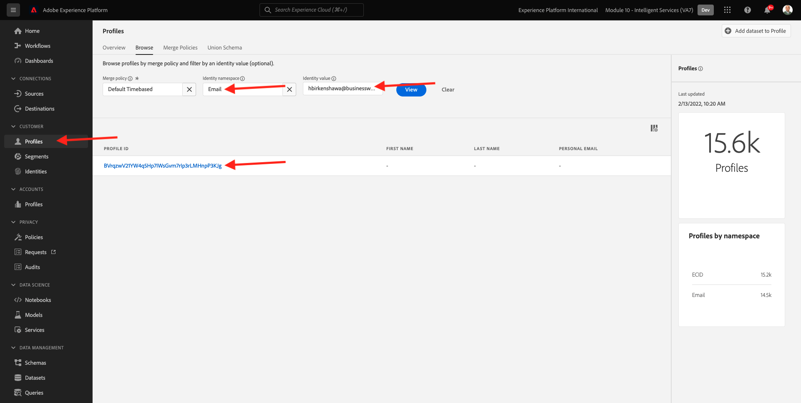

# 5.3 Customer AI - 점수 대시보드 및 세그멘테이션(예측 및 수행)

고객 AI 인스턴스가 모델 실행을 완료하면 향후 30일 내에 구매를 수행하는 고객을 예측하도록 평가되는 성향 점수를 시각화할 수 있습니다.

>[!NOTE]
>
>상태가 인 고객 AI 인스턴스만 **성공** 을 사용하면 서비스의 통찰력을 미리 볼 수 있습니다.

## 5.3.1 성향 예측

이제 고객 AI 인스턴스 모델에서 생성된 예측된 성향 여부를 살펴보겠습니다. 인스턴스 이름을 클릭하여 대시보드를 봅니다.

고객 AI 대시보드에는 점수, 모집단 분포 및 평가할 모델에 대한 영향력 있는 요소에 대한 요약이 표시됩니다.

영향력 있는 요소를 마우스로 가리키면 데이터 분배의 세부 분류를 볼 수 있습니다.

## 5.3.2 비즈니스 작업

### 5.3.2.1 고객 세그먼트화

Customer AI 대시보드를 사용하면 한 번의 클릭으로 세그먼트를 정의할 수 있습니다. 을(를) 클릭합니다. **세그먼트 만들기** 단추를 클릭합니다.

세그먼트 정의가 자동으로 생성됨을 알 수 있습니다.

세그먼트에 다음 명명 규칙에 따라 이름을 지정하십시오. `--demoProfileLdap-- - Customer AI High Propensity`. **저장**&#x200B;을 클릭합니다.

이제 실시간 CDP, Journey Orchestration 및 Adobe Target과 같이 를 사용하여 타깃팅하는 데 이 세그먼트를 사용할 수 있습니다.

### 5.3.2.2 프로필 개요

고객 AI 성향 점수가 실시간 고객 프로필의 일부가 되므로 개별 고객의 점수를 볼 수 있습니다.

Adobe Experience Platform에서 **프로필** 왼쪽 메뉴에서 **찾아보기**.

예를 들어 다음과 같이 식별자를 사용하여 프로필을 검색합니다 **이메일 hbirkenshawa@businessweek.com**: 수집된 JSON 파일에서 사용할 수 있습니다. 을(를) 클릭합니다. **프로필 ID** 를 클릭하여 프로필을 엽니다.

그러면 다음 내용이 표시됩니다.

이동 **속성**: 고객 AI 모델의 출력을 포함합니다.

아래로 스크롤하여 고객 AI 모델에서 계산된 성향 점수를 확인합니다.

다음 단계: [요약 및 이점](./summary.md)

[모듈 5로 돌아가기](./intelligent-services.md)

[모든 모듈로 돌아가기](./../../overview.md)
