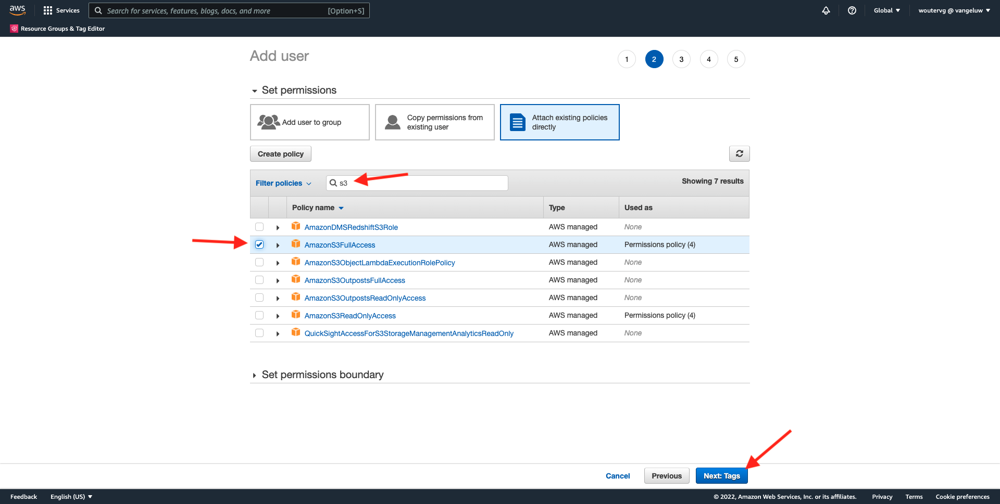
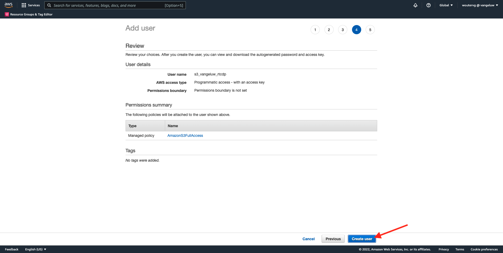

# 6.4 조치 수행: S3 대상에 세그먼트 보내기

또한 Adobe Experience Platform은 Salesforce Marketing Cloud, Oracle Eloqua, Responsys Oracle 및 Adobe Campaign과 같은 이메일 마케팅 대상에 대상을 공유할 수 있습니다.

이러한 각 이메일 마케팅 대상에 대한 전용 대상의 일부로 FTP 또는 SFTP를 사용하거나, AWS S3를 사용하여 Adobe Experience Platform과 이러한 이메일 마케팅 대상 간 고객 목록을 교환할 수 있습니다.

이 모듈에서는 AWS S3 버킷을 사용하여 이러한 대상을 구성합니다.

## 6.4.1 S3 버킷 만들기

이동 [https://console.aws.amazon.com](https://console.aws.amazon.com) 이전에 만든 Amazon 계정으로 로그인합니다.

로그인하면 **AWS Management Console**.

에서 **서비스 찾기** 메뉴, 검색 **s3**. 첫 번째 검색 결과를 클릭합니다. **S3 - 클라우드의 확장 가능한 스토리지**.

그러면 **Amazon S3** 홈 페이지. 클릭 **버킷 만들기**.

에서 **버킷 만들기** 화면에서 다음 두 가지 사항을 구성해야 합니다.

- 이름: 이름 사용 `aepmodulertcdp--demoProfileLdap--`. 예를 들어 이 연습에서는 버킷 이름이 입니다. **aepmoduertcdpvangeluw**
- 지역: 지역 사용 **EU(프랑크푸르트) eu-central-1**

다른 모든 기본 설정은 그대로 둡니다. 아래로 스크롤하여 클릭 **버킷 만들기**.

그러면 버킷이 만들어지고 Amazon S3 홈 페이지로 리디렉션됩니다.

## 6.4.2 S3 버킷에 액세스할 권한 설정

다음 단계는 S3 버킷에 대한 액세스를 설정하는 것입니다.

이렇게 하려면 다음 위치로 이동하십시오. [https://console.aws.amazon.com/iam/home](https://console.aws.amazon.com/iam/home).

AWS 리소스에 대한 액세스는 Amazon Identity and Access Management(IAM)에 의해 제어됩니다.

이제 이 페이지가 표시됩니다.

왼쪽 메뉴에서 **사용자**. 그러면 **사용자** 화면. 클릭 **사용자 추가**.

다음으로, 사용자를 구성합니다.

- 사용자 이름: 사용 `s3_--demoProfileLdap--_rtcdp` 따라서 이 예제에서 이름은 `s3_vangeluw_rtcdp`.
- AWS 액세스 유형: 선택 **Access 키 - 프로그래밍 방식 액세스**.

클릭 **다음: 권한**.

그러면 이 권한 화면이 표시됩니다. 클릭 **기존 정책을 직접 연결**.

검색어 입력 **s3** 관련 S3 정책을 모두 확인합니다. 정책을 선택합니다 **AmazonS3FullAccess**. 클릭 **다음: 태그**.

설정 **태그** 화면에서는 아무것도 구성할 필요가 없습니다. 클릭 **다음: 검토**.

구성을 검토합니다. 클릭 **사용자 만들기**.

이제 사용자가 만들어졌고 S3 환경에 액세스할 수 있는 자격 증명이 표시됩니다. 이 시간에만 자격 증명을 볼 수 있으니 적어주세요

클릭 **표시** 비밀 액세스 키를 보려면 다음을 수행하십시오.

>[!IMPORTANT]
>
>컴퓨터의 텍스트 파일에 자격 증명을 저장합니다.
>
> - 액세스 키 ID: ...
> - 비밀 액세스 키: ...
>
> 클릭하면 **닫기** 자격 증명을 다시 못 보게 될 거야!

Click **Close**.

이제 AWS S3 버킷을 생성했으며 이 버킷에 액세스할 수 있는 권한이 있는 사용자를 만들었습니다.

## 6.4.3 Adobe Experience Platform에서 대상 구성

이동 [Adobe Experience Platform](https://experience.adobe.com/platform). 로그인하면 Adobe Experience Platform 홈 페이지가 표시됩니다.

계속하기 전에 **샌드박스**. 선택할 샌드박스의 이름은 다음과 같습니다 ``--aepSandboxId--``. 이 작업은 텍스트를 클릭하여 수행할 수 있습니다 **[!UICONTROL 프로덕션 제품]** 화면 상단에 있는 파란색 줄에 표시됩니다. 적절한 [!UICONTROL 샌드박스]이렇게 하면 화면 변경 사항이 표시되고 이제 전용 화면에 표시됩니다 [!UICONTROL 샌드박스].

왼쪽 메뉴에서 **대상**, 그런 다음 **카탈로그**. 그러면 **대상 카탈로그**.

클릭 **클라우드 스토리지**&#x200B;를 클릭한 다음 **설정** 버튼(또는 켜기) **세그먼트 활성화**(사용자 환경에 따라) **Amazon S3** 카드.

사용자 환경에 따라 **+ 새 대상 구성** 대상 만들기를 시작하려면 다음을 수행하십시오.

선택 **새 계정** 을 계정 유형으로 사용할 수 있습니다. 이전 단계에서 제공한 S3 자격 증명을 사용하십시오.

| 액세스 키 ID | 비밀 액세스 키 |
|:-----------------------:| :-----------------------:|
| AKIA.... | Cm5Ln..... |

클릭 **대상에 연결**.

그러면 이 대상이 이제 연결되었다는 시각적 확인이 표시됩니다.

Adobe Experience Platform이 S3 버킷에 연결할 수 있도록 이름과 폴더를 제공해야 합니다.

명명 규칙으로, 다음을 사용하십시오.

| 액세스 키 ID | 비밀 액세스 키 |
|:-----------------------:| :-----------------------:|
| 이름 | `AWS - S3 - --demoProfileLdap--` |
| 설명 | `AWS - S3 - --demoProfileLdap--` |
| 버킷 이름 | `aepmodulertcdp--demoProfileLdap--` |
| 폴더 경로 | / |

**다음**&#x200B;을 클릭합니다.

이제 선택적으로 새 대상에 데이터 거버넌스 정책을 첨부할 수 있습니다. **다음**&#x200B;을 클릭합니다.

세그먼트 목록에서 연습 1에서 만든 세그먼트를 검색하고 선택합니다. **다음**&#x200B;을 클릭합니다.

그러면 이게 보입니다. 원하는 경우 **연필** 아이콘. **예약 만들기**.

원하는 일정을 정의합니다. 선택 **증분 파일 내보내기** 빈도를 (으)로 설정합니다. **시간별** 매 **3시간**. **만들기**&#x200B;를 클릭합니다.

그럼 이걸로 주세요 **다음**&#x200B;을 클릭합니다.

이제 AWS S3로 내보낼 속성을 선택할 수 있습니다. 클릭 **새 필드 추가** 그리고 필드를 확인합니다 `--aepTenantId--.identification.core.ecid` 가 추가되고 다음으로 표시됨 **중복 제거 키**.

필요에 따라 다른 필드를 필요한 만큼 추가할 수 있습니다.

모든 필드를 추가한 후에는 **다음**.

구성을 검토합니다. 클릭 **완료** 구성을 완료합니다.

그런 다음 대상 활성화 화면으로 돌아보면 세그먼트가 이 대상에 추가됩니다.

세그먼트 내보내기를 더 추가하려면 **세그먼트 활성화** 프로세스를 다시 시작하고 세그먼트를 더 추가하려면 다음을 수행하십시오.

다음 단계: [6.5 조치 수행: Adobe Target에 세그먼트 보내기](./ex5.md)

[모듈 6으로 돌아가기](./real-time-cdp-build-a-segment-take-action.md)

[모든 모듈로 돌아가기](../../overview.md)
