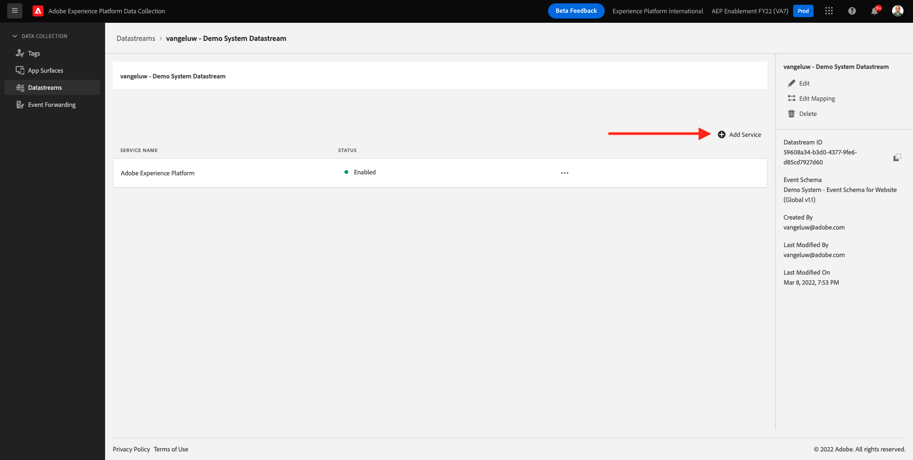
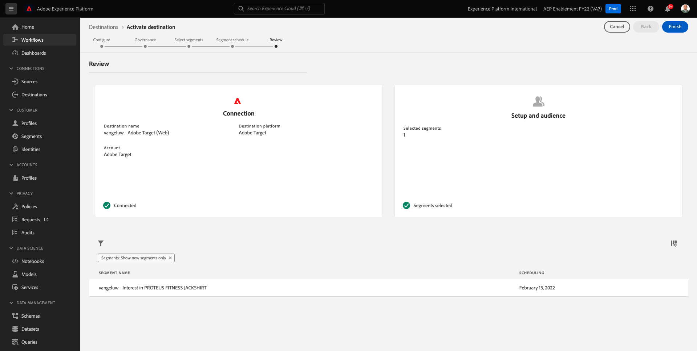
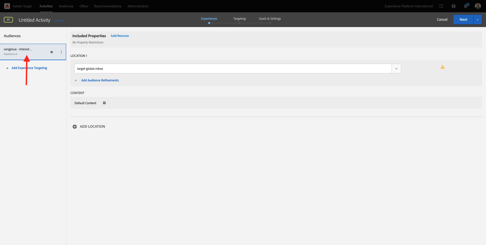

# 6.5 조치 수행: Adobe Target에 세그먼트 보내기

이동 [Adobe Experience Platform](https://experience.adobe.com/platform). 로그인하면 Adobe Experience Platform 홈 페이지가 표시됩니다.


계속하기 전에 **샌드박스**. 선택할 샌드박스의 이름은 다음과 같습니다 ``--aepSandboxId--``. 이 작업은 텍스트를 클릭하여 수행할 수 있습니다 **[!UICONTROL 프로덕션 제품]** 화면 상단에 있는 파란색 줄에 표시됩니다. 적절한 [!UICONTROL 샌드박스]이렇게 하면 화면 변경 사항이 표시되고 이제 전용 화면에 표시됩니다 [!UICONTROL 샌드박스].


## 6.5.1 데이터 스트림 확인

Real-Time CDP의 Adobe Target 대상은 Adobe 에지 네트워크에 데이터를 수집하는 데 사용되는 데이터 스트림에 연결됩니다. Adobe Target 대상을 설정하려면 먼저 데이터 스트림이 Adobe Target에 대해 이미 활성화되어 있는지 확인해야 합니다. 데이터 스트람이 [연습 0.2 데이터 스트림 만들기](./../module0/ex2.md) 및 `--demoProfileLdap-- - Demo System Datastream`.

이동 [https://experience.adobe.com/#/data-collection/](https://experience.adobe.com/#/data-collection/)를 클릭한 다음 **데이터 스트림** 또는 **데이터 스트림(베타)**.


화면의 오른쪽 상단 모서리에서 샌드박스 이름을 선택합니다. 샌드박스 이름은 다음과 같습니다. `--aepSandboxId--`.


데이터 세트에서 이름이 인 데이터 스트림을 검색합니다 `--demoProfileLdap-- - Demo System Datastream`. 데이터 스트림을 클릭하여 엽니다.


그러면 이 항목이 표시되고 **...** 다음 **Adobe Experience Platform** 을 클릭한 다음 **편집**.


두 확인란 모두 선택 **에지 세그멘테이션** 및 **개인화 대상**. **저장**&#x200B;을 클릭합니다.


다음을 클릭합니다. **+ 서비스 추가**.



서비스를 선택합니다 **Adobe Target**. **저장**&#x200B;을 클릭합니다.


이제 데이터 스트림이 Adobe Target용으로 구성되었습니다.


## 6.5.2 Adobe Target 대상 구성

Adobe Target은 Real-Time CDP의 대상으로 사용할 수 있습니다. Adobe Target 통합을 설정하려면 다음 위치로 이동하십시오. **대상**&#x200B;에 대해 **카탈로그**.


클릭 **개인화** 에서 **카테고리** 메뉴 아래의 제품에서 사용할 수 있습니다. 그러면 **Adobe Target** 대상 카드. 클릭 **세그먼트 활성화** 또는 **설정** 환경에 따라 다름).


사용자 환경에 따라 **+ 새 대상 구성** 대상 만들기를 시작하려면 다음을 수행하십시오.


그러면 이게 보입니다.


에서 **새 대상 구성** 화면에서 다음 두 가지 사항을 구성해야 합니다.

- 이름: 이름 사용 `--demoProfileLdap-- - Adobe Target (Web)`와 같이 표시되어야 합니다. **vangeluw - Adobe Target(웹)**.
- 데이터 스트림 ID: 에서 구성한 데이터 스트림을 선택해야 합니다. [연습 0.2 데이터 스트림 만들기](./../module0/ex2.md). 데이터 스트림의 이름은 다음과 같습니다. `--demoProfileLdap-- - Demo System Datastream`.

**다음**&#x200B;을 클릭합니다.


다음 화면에서 선택적으로 거버넌스 정책을 선택할 수 있습니다. 하나를 선택할 필요는 없습니다. 이 경우 하나를 선택할 필요가 없으므로 **만들기**.


이제 대상이 만들어지고 목록에 표시됩니다. 대상을 선택하고 을(를) 클릭합니다 **다음** 세그먼트 전송을 대상에 시작하려면 다음을 수행하십시오.


사용 가능한 세그먼트 목록에서 만든 세그먼트를 선택합니다 [연습 6.1 세그먼트 만들기](./ex1.md): `--demoProfileLdap-- - Interest in PROTEUS FITNESS JACKSHIRT`. 그런 다음 **다음**.


다음 페이지에서 **다음**.


**마침을 클릭합니다**.



이제 세그먼트가 Adobe Target에 대해 활성화됩니다.


>[!IMPORTANT]
>
>Real-Time CDP에서 Adobe Target 대상을 방금 만든 경우 대상이 라이브로 전환되려면 최대 1시간이 걸릴 수 있습니다. 백엔드 구성 설정으로 인해 일회성 대기 시간입니다. 초기 1시간 대기 시간 및 백엔드 구성이 완료되면 Adobe Target 대상으로 전송되는 새로 추가된 Edge 세그먼트를 실시간으로 타깃팅할 수 있습니다.

## 6.5.3 Adobe Target 양식 기반 활동 구성

이제 Real-Time CDP 세그먼트가 Adobe Target으로 전송되도록 구성되었으므로 Adobe Target에서 경험 타깃팅 활동을 구성할 수 있습니다. 이 연습에서는 양식 기반 활동을 구성합니다.

이동하여 Adobe Experience Cloud 홈 페이지로 이동합니다. [https://experiencecloud.adobe.com/](https://experiencecloud.adobe.com/). 클릭 **Target** 열려고


설정 **Adobe Target** homepage에는 기존의 모든 활동이 표시됩니다.


클릭 **+ 활동 만들기** 새 활동을 만들려면


선택 **경험 타깃팅**.


선택 **양식** 을(를) 선택합니다. **속성 제한 없음**. **다음**&#x200B;을 클릭합니다.


이제 양식 기반 활동 작성기에 있습니다.


필드 **위치 1**, 선택 **target-global-mbox**.


현재 기본 대상은 입니다 **모든 방문자**. 을(를) 클릭합니다. **세 점** 다음 **모든 방문자** 을(를) 클릭합니다. **대상 변경**.


이제 사용 가능한 대상자 목록이 표시되고, 이전에 만들어서 Adobe Target으로 보낸 Adobe Experience Platform 세그먼트가 이제 이 목록에 포함됩니다. Adobe Experience Platform에서 이전에 만든 세그먼트를 선택합니다. 클릭 **대상 할당**.


이제 Adobe Experience Platform 세그먼트가 이 경험 타깃팅 활동의 일부입니다.



이제 웹 사이트의 홈 페이지에서 Hero Image를 변경하겠습니다. 옆에 있는 드롭다운 목록을 클릭하여 엽니다. **기본 컨텐츠** 을(를) 클릭합니다. **HTML 오퍼 만들기**.


다음 코드를 붙여넣습니다. 그런 다음 **다음**.

```javascript
<script>document.querySelector("#home > div > div > div > div > div.banner_img.d-none.d-lg-block > img").src="https://parsefiles.back4app.com/hgJBdVOS2eff03JCn6qXXOxT5jJFzialLAHJixD9/ff92fdc3885972c0090ad5419e0ef4d4_Luma - Product - Proteus - Hero Banner.png"; document.querySelector(".banner_text > *").remove()</script>
```


그러면 선택한 대상에 대해 새 이미지가 포함된 새 경험이 표시됩니다.


왼쪽 위 모서리에 있는 활동 제목을 클릭하여 이름을 변경합니다.


이름은 다음을 사용하십시오.

- `--demoProfileLdap-- - RTCDP - XT (Form)`


**다음**&#x200B;을 클릭합니다.


설정 **목표 및 설정** - 페이지, 이동 **목표 지표**.


기본 목표를 다음으로 설정 **참여** - **사이트에서 보낸 시간**.


**저장 및 닫기**&#x200B;를 클릭합니다.


이제 **활동 개요** 페이지. 활동을 활성화해야 합니다.


필드를 클릭합니다 **비활성** 을(를) 선택합니다. **활성화**.


그러면 활동이 이제 라이브 상태가 된다는 시각적 확인이 제공됩니다.


이제 활동이 라이브 상태가 되어 데모 웹 사이트에서 테스트할 수 있습니다.

>[!IMPORTANT]
>
>Real-Time CDP에서 Adobe Target 대상을 방금 만든 경우 대상이 라이브로 전환되려면 최대 1시간이 걸릴 수 있습니다. 백엔드 구성 설정으로 인해 일회성 대기 시간입니다. 초기 1시간 대기 시간 및 백엔드 구성이 완료되면 Adobe Target 대상으로 전송되는 새로 추가된 Edge 세그먼트를 실시간으로 타깃팅할 수 있습니다.

이제 데모 웹 사이트로 돌아가서 PROTEUS FITNESS JACKTSHIRT용 제품 페이지를 방문하면 만든 세그먼트에 대한 자격이 즉시 부여되고 홈 페이지에 Adobe Target 활동이 실시간으로 표시됩니다.


다음 단계: [6.6 외부 대상](./ex6.md)

[모듈 6으로 돌아가기](./real-time-cdp-build-a-segment-take-action.md)

[모든 모듈로 돌아가기](../../overview.md)
