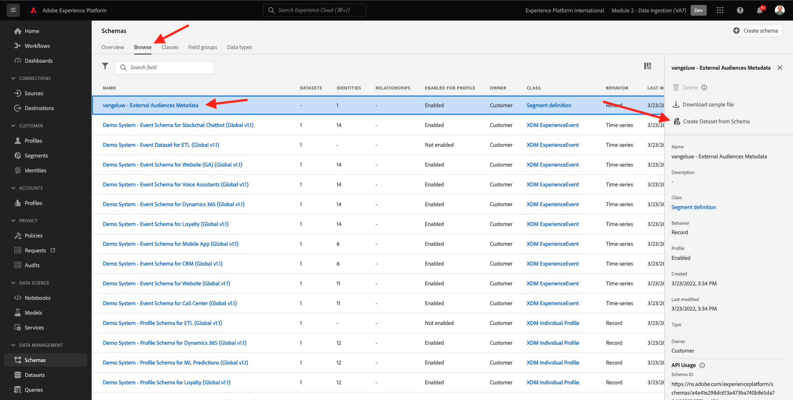
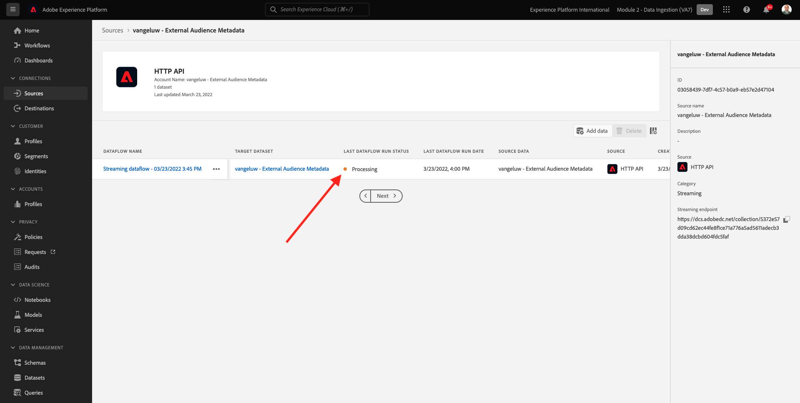
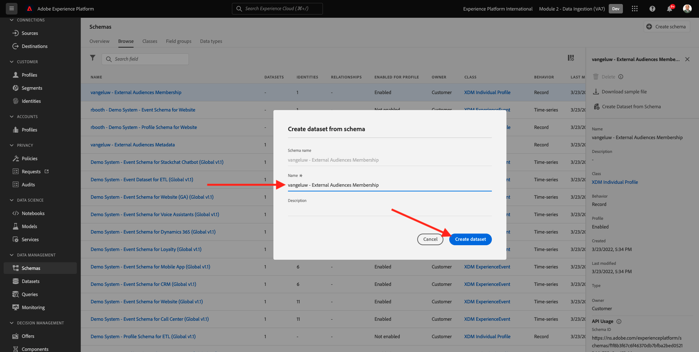
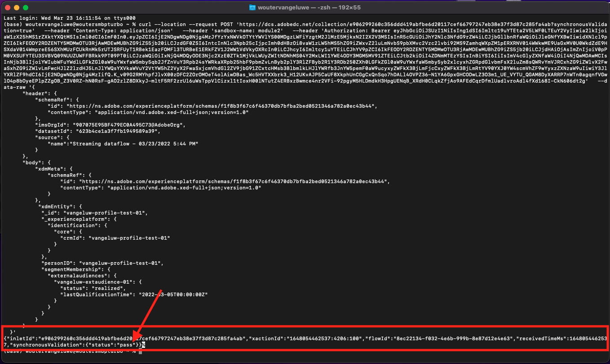

# 6.6 외부 대상

대부분의 경우 귀사는 다른 애플리케이션의 기존 세그먼트를 사용하여 Adobe Experience Platform에서 고객 프로필을 보강할 수 있습니다.
이러한 외부 대상은 데이터 과학 모델을 기반으로 또는 외부 데이터 플랫폼을 사용하여 정의되었을 수 있습니다.

Adobe Experience Platform의 외부 대상 기능을 사용하면 Adobe Experience Platform에서 해당 세그먼트 정의를 자세히 재정의할 필요 없이 외부 대상을 섭취하고 해당 활성화를 위해 집중할 수 있습니다.

전체 프로세스는 다음 세 가지 주요 단계로 나누어집니다.

- 외부 대상 메타데이터를 가져옵니다: 이 단계는 대상 이름과 같은 외부 대상 메타데이터를 Adobe Experience Platform에 수집하기 위한 것입니다.
- 외부 대상 구성원을 고객 프로필에 할당합니다. 이 단계는 외부 세그먼트 멤버십 속성으로 고객 프로필을 보강하기 위한 것입니다.
- Adobe Experience Platform에서 세그먼트를 만듭니다. 이 단계는 외부 대상 멤버십을 기반으로 실행 가능한 세그먼트를 만들기 위한 것입니다.

## 6.6.1 메타데이터

이동 [Adobe Experience Platform](https://experience.adobe.com/platform). 로그인하면 Adobe Experience Platform 홈 페이지가 표시됩니다.


>[!IMPORTANT]
>
>이 연습에 사용할 샌드박스는 다음과 같습니다 ``--module2sandbox--``!

계속하기 전에 **샌드박스**. 선택할 샌드박스의 이름은 다음과 같습니다 ``--module2sandbox--``. 이 작업은 텍스트를 클릭하여 수행할 수 있습니다 **[!UICONTROL 프로덕션 제품]** 화면 상단에 있는 파란색 줄에 표시됩니다. 적절한 [!UICONTROL 샌드박스]이렇게 하면 화면 변경 사항이 표시되고 이제 전용 화면에 표시됩니다 [!UICONTROL 샌드박스].


세그먼트 데이터는 프로필이 세그먼트의 일부가 되는 조건을 정의하는 동안 세그먼트 메타데이터는 세그먼트 이름, 설명 및 세그먼트 상태와 같은 세그먼트 관련 정보입니다. 외부 대상 메타데이터가 Adobe Experience Platform에 저장되므로 ID 네임스페이스를 사용하여 Adobe Experience Platform에서 메타데이터를 수집해야 합니다.

## 6.6.1.1 외부 대상을 위한 ID 네임스페이스

을 사용하도록 ID 네임스페이스를 이미 만들었습니다. **외부 대상**.
이미 생성된 ID를 보려면 다음 위치로 이동하십시오. **ID**, 및 을 검색합니다. **외부**. 외부 대상 항목을 클릭합니다.

참고:

- ID 기호 **외부 대상** 다음 단계에서 외부 대상 id를 참조하는 데 사용됩니다.
- 다음 **비사용자 식별자** 이 네임스페이스는 고객 프로필을 식별하기 위한 것이 아니라 세그먼트를 식별하기 위한 것이므로 이 id 네임스페이스에 유형이 사용됩니다.


## 6.6.1.2 외부 대상 메타데이터 스키마 만들기

외부 대상 메타데이터는 **세그먼트 정의 스키마**. 자세한 내용은 [XDM Github 저장소](https://github.com/adobe/xdm/blob/master/docs/reference/classes/segmentdefinition.schema.md).

왼쪽 메뉴에서 스키마로 이동합니다. 클릭 **+ 스키마 만들기** 을 클릭한 다음 **찾아보기**.


클래스를 할당하려면 **세그먼트 정의**. 을(를) 선택합니다 **세그먼트 정의** 클래스 및 클릭 **클래스 할당**.


그러면 이게 보입니다. 클릭 **취소**.


그러면 이게 보입니다. 필드를 선택합니다 **_id**. 오른쪽 메뉴에서 아래로 스크롤하여 **ID** 그리고 **기본 ID** 확인란을 선택합니다. 을(를) 선택합니다 **외부 대상** id 네임스페이스입니다. **적용**&#x200B;을 클릭합니다.


다음으로 스키마 이름을 선택합니다 **제목 없는 스키마**. 이름을 로 변경합니다. `--demoProfileLdap-- - External Audiences Metadata`.


를 활성화합니다 **프로필** 전환 및 확인. 마지막으로 **저장**.


## 6.6.1.3 외부 대상 메타데이터 데이터 세트 만들기

in **스키마**, 이동 **찾아보기**. 을(를) 검색하고 클릭합니다. `--demoProfileLdap-- - External Audiences Metadata` 이전 단계에서 만든 스키마. 다음을 클릭합니다. **스키마에서 데이터 집합 만들기**.



필드 **이름**, 입력 `--demoProfileLdap-- - External Audience Metadata`. 클릭 **데이터 집합 만들기**.


그러면 이게 보입니다. 를 활성화하는 것을 잊지 마십시오 **프로필** 토글!


## 6.6.1.4 HTTP API 소스 연결 만들기

다음으로 메타데이터를 데이터 집합에 수집하는 데 사용할 HTTP API 소스 커넥터를 구성해야 합니다.

이동 **소스**. 검색 필드에 를 입력합니다. **HTTP**. **데이터 추가**&#x200B;를 클릭합니다.


다음 정보를 입력합니다.

- **계정 유형**: 선택 **새 계정**
- **계정 이름**: enter `--demoProfileLdap-- - External Audience Metadata`
- 확인란을 선택합니다 **XDM 호환 상자**

다음을 클릭합니다. **소스에 연결**.


그러면 이게 보입니다. **다음**&#x200B;을 클릭합니다.


선택 **기존 데이터 세트** 드롭다운 메뉴에서 데이터 세트를 검색하고 선택합니다 `--demoProfileLdap-- - External Audience Metadata`.

확인 **데이터 흐름 세부 정보** 을 클릭한 다음 **다음**.


그러면 이게 보입니다.

다음 **매핑** XDM 호환 페이로드를 HTTP API 소스 커넥터로 수집할 때 마법사 단계가 비어 있으므로 매핑이 필요하지 않습니다. **다음**&#x200B;을 클릭합니다.


에서 **검토** 단계 연결 및 매핑 세부 정보를 선택적으로 검토할 수 있습니다. **마침을 클릭합니다**.


그러면 이게 보입니다.


## 6.6.1.5 외부 대상 메타데이터 수집

소스 커넥터 개요 탭에서 **...** 을 클릭한 다음 **스키마 페이로드 복사**.


컴퓨터에서 텍스트 편집기 응용 프로그램을 열고 방금 복사한 페이로드를 붙여 넣습니다. 이렇게 표시됩니다. 다음으로, **xdmEntity** 이 페이로드의 개체.


개체 **xdmEntity** 는 아래 코드로 대체해야 합니다. 아래 코드를 복사하여 텍스트 파일에 붙여넣습니다. **xdmEntity** 텍스트 편집기에서 객체입니다.

```
"xdmEntity": {
    "_id": "--demoProfileLdap---extaudience-01",
    "description": "--demoProfileLdap---extaudience-01 description",
    "segmentIdentity": {
      "_id": "--demoProfileLdap---extaudience-01",
      "namespace": {
        "code": "externalaudiences"
      }
    },
    "segmentName": "--demoProfileLdap---extaudience-01 name",
    "segmentStatus": "ACTIVE",
    "version": "1.0"
  }
```

그러면 다음이 표시됩니다.


그런 다음 새 **터미널** 창을 엽니다. 텍스트 편집기의 모든 텍스트를 복사하여 터미널 창에 붙여넣습니다.


다음, 히트 **Enter 키**.

터미널 창에 데이터 수집 확인이 표시됩니다.


HTTP API 소스 커넥터 화면을 새로 고치면 데이터가 처리 중인 것이 표시됩니다.



## 6.6.1.6 외부 대상 메타데이터 섭취 확인

처리가 완료되면 쿼리 서비스를 사용하여 데이터 집합에 있는 데이터 가용성을 확인할 수 있습니다.

오른쪽 메뉴에서 **데이터 세트** 을(를) 선택하고 을(를) 선택합니다. `--demoProfileLdap-- - External Audience Metadata` 이전에 만든 데이터 집합입니다.


오른쪽 메뉴에서 쿼리로 이동하고 **쿼리 만들기**.


다음 코드를 입력한 다음 를 누릅니다 **SHIFT + ENTER**:

```
select * from --demoProfileLdap--_external_audience_metadata
```

쿼리 결과에 수집한 외부 대상의 메타데이터가 표시됩니다.


## 6.6.2 세그먼트 멤버십

이제 외부 대상 메타데이터를 사용할 수 있으므로 특정 고객 프로필에 대한 세그먼트 멤버십을 수집할 수 있습니다.

이제 세그먼트 멤버십 스키마에 대해 보강된 프로필 데이터 세트를 준비해야 합니다. 자세한 내용은 [XDM Github 저장소](https://github.com/adobe/xdm/blob/master/docs/reference/datatypes/segmentmembership.schema.md).

## 6.6.2.1 외부 대상 멤버십 스키마 만들기

오른쪽 메뉴에서 **스키마**. 클릭 **스키마 만들기** 을 클릭한 다음 **XDM 개별 프로필**.


에서 **필드 그룹 추가** 팝업, 검색 **프로필 코어**. 을(를) 선택합니다 **프로필 코어 v2** 필드 그룹.


다음, **필드 그룹 추가** 팝업, 검색 **세그먼트 멤버십**. 을(를) 선택합니다 **세그먼트 멤버십 세부 정보** 필드 그룹. 다음을 클릭합니다. **필드 그룹 추가**.


그러면 이게 보입니다. 필드로 이동합니다 `--aepTenantId--.identification.core`. 을(를) 클릭합니다. **crmId** 필드. 오른쪽 메뉴에서 아래로 스크롤하여 **ID** 그리고 **기본 ID** 확인란. 대상 **ID 네임스페이스** 선택 **데모 시스템 - CRMID**.

**적용**&#x200B;을 클릭합니다.


다음으로 스키마 이름을 선택합니다 **제목 없는 스키마**. 표시 이름 필드에 를 입력합니다. `--demoProfileLdap-- - External Audiences Membership`.


다음으로, **프로필** 전환 및 확인. **저장**&#x200B;을 클릭합니다.


## 6.6.2.2 외부 대상 멤버십 데이터 세트 만들기

in **스키마**, 이동 **찾아보기**. 을(를) 검색하고 클릭합니다. `--demoProfileLdap-- - External Audiences Membership` 이전 단계에서 만든 스키마. 다음을 클릭합니다. **스키마에서 데이터 집합 만들기**.


필드 **이름**, 입력 `--demoProfileLdap-- - External Audiences Membership`. 클릭 **데이터 집합 만들기**.



그러면 이게 보입니다. 를 활성화하는 것을 잊지 마십시오 **프로필** 토글!


## 6.6.2.3 HTTP API 소스 연결 만들기


다음으로 메타데이터를 데이터 집합에 수집하는 데 사용할 HTTP API 소스 커넥터를 구성해야 합니다.

이동 **소스**. 검색 필드에 를 입력합니다. **HTTP**. **데이터 추가**&#x200B;를 클릭합니다.


다음 정보를 입력합니다.

- **계정 유형**: 선택 **새 계정**
- **계정 이름**: enter `--demoProfileLdap-- - External Audience Membership`
- 확인란을 선택합니다 **XDM 호환 상자**

다음을 클릭합니다. **소스에 연결**.


그러면 이게 보입니다. **다음**&#x200B;을 클릭합니다.


선택 **기존 데이터 세트** 드롭다운 메뉴에서 데이터 세트를 검색하고 선택합니다 `--demoProfileLdap-- - External Audiences Membership`.

확인 **데이터 흐름 세부 정보** 을 클릭한 다음 **다음**.


그러면 이게 보입니다.

다음 **매핑** XDM 호환 페이로드를 HTTP API 소스 커넥터로 수집할 때 마법사 단계가 비어 있으므로 매핑이 필요하지 않습니다. **다음**&#x200B;을 클릭합니다.


에서 **검토** 단계 연결 및 매핑 세부 정보를 선택적으로 검토할 수 있습니다. **마침을 클릭합니다**.


그러면 이게 보입니다.


## 6.6.2.4 외부 대상 멤버십 데이터 수집

소스 커넥터 개요 탭에서 **...** 을 클릭한 다음 **스키마 페이로드 복사**.


컴퓨터에서 텍스트 편집기 응용 프로그램을 열고 방금 복사한 페이로드를 붙여 넣습니다. 이렇게 표시됩니다. 다음으로, **xdmEntity** 이 페이로드의 개체.


개체 **xdmEntity** 는 아래 코드로 대체해야 합니다. 아래 코드를 복사하여 텍스트 파일에 붙여넣습니다. **xdmEntity** 텍스트 편집기에서 객체입니다.

```
  "xdmEntity": {
    "_id": "--demoProfileLdap---profile-test-01",
    "_experienceplatform": {
      "identification": {
        "core": {
          "crmId": "--demoProfileLdap---profile-test-01"
        }
      }
    },
    "personID": "--demoProfileLdap---profile-test-01",
    "segmentMembership": {
      "externalaudiences": {
        "--demoProfileLdap---extaudience-01": {
          "status": "realized",
          "lastQualificationTime": "2022-03-05T00:00:00Z"
        }
      }
    }
  }
```

그러면 다음이 표시됩니다.


그런 다음 새 **터미널** 창을 엽니다. 텍스트 편집기의 모든 텍스트를 복사하여 터미널 창에 붙여넣습니다.


다음, 히트 **Enter 키**.

터미널 창에 데이터 수집 확인이 표시됩니다.



HTTP API 소스 커넥터 화면을 새로 고치면 몇 분 후에 데이터가 처리 중인 것을 볼 수 있습니다.


## 6.6.2.5 외부 대상 멤버십 수집 유효성 확인

처리가 완료되면 쿼리 서비스를 사용하여 데이터 집합에 있는 데이터 가용성을 확인할 수 있습니다.

오른쪽 메뉴에서 **데이터 세트** 을(를) 선택하고 을(를) 선택합니다. `--demoProfileLdap-- - External Audiences Membership ` 이전에 만든 데이터 집합입니다.


오른쪽 메뉴에서 쿼리로 이동하고 **쿼리 만들기**.


다음 코드를 입력한 다음 를 누릅니다 **SHIFT + ENTER**:

```
select * from --demoProfileLdap--_external_audiences_membership
```

쿼리 결과에 수집한 외부 대상의 메타데이터가 표시됩니다.


## 6.6.3 세그먼트 만들기

이제 외부 대상에 대해 작업을 수행할 준비가 되었습니다.
Adobe Experience Platform에서 수행하는 작업은 세그먼트를 만들고, 각 대상을 채우고, 대상에 해당 대상을 공유함으로써 수행됩니다.
이제 방금 만든 외부 대상을 사용하여 세그먼트를 만듭니다.

왼쪽 메뉴에서 **세그먼트** 을(를) 클릭합니다. **세그먼트 만들기**.


이동 **대상**. 그러면 이게 보입니다. 클릭 **외부 대상**.


앞에서 만든 외부 대상(이름이 지정된 대상)을 선택합니다 `--demoProfileLdap---extaudience-01`. 대상자를 캔버스에 끌어다 놓습니다.


세그먼트에 이름을 지정하고 `--demoProfileLdap-- - extaudience-01`. **저장 후 닫기**&#x200B;를 클릭합니다.


그러면 이게 보입니다. 이제 세그먼트 멤버십을 수집한 프로필이 다음 목록에 표시된다는 것을 알 수 있습니다 **샘플 프로필**.


이제 세그먼트가 준비되었으며, 활성화 대상으로 전송할 수 있습니다.

## 6.6.4 고객 프로필 시각화

이제 고객 프로필에서 세그먼트 자격을 시각화할 수도 있습니다. 이동 **프로필**, id 네임스페이스 사용 **데모 시스템 - CRMID** ID를 제공하고 `--demoProfileLdap---profile-test-01`를 클릭합니다. 이 파일은 연습 6.6.2.4의 일부로 사용되었으며, **보기**. 그런 다음 **프로필 ID** 를 클릭하여 프로필을 엽니다.


이동 **세그먼트 멤버십**: 외부 대상이 표시되는 곳입니다.


다음 단계: [6.7 대상 SDK](./ex7.md)

[모듈 6으로 돌아가기](./real-time-cdp-build-a-segment-take-action.md)

[모든 모듈로 돌아가기](../../overview.md)
