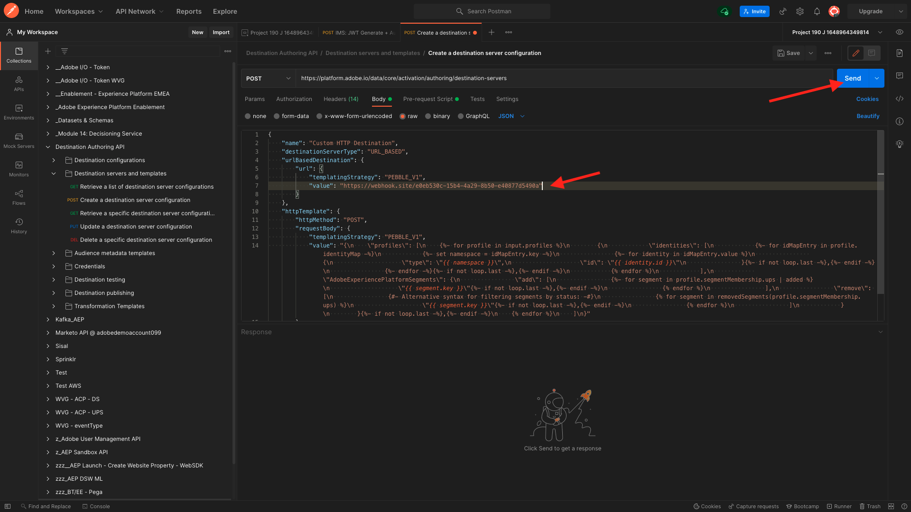
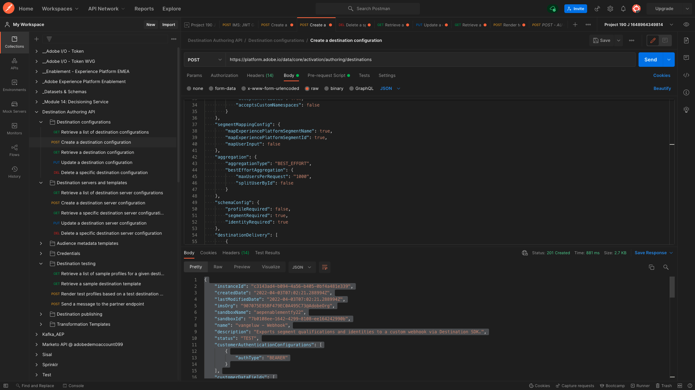

# 6.7 대상 SDK

## 6.7.1 Adobe I/O 프로젝트 설정

>[!IMPORTANT]
>
>2021년 12월 이후에 Adobe I/O 프로젝트를 만든 경우 해당 프로젝트를 다시 사용하고, 이 연습을 건너뛰고, 즉시 6.7.2로 이동할 수 있습니다.
>
>2021년 12월 이전에 Adobe I/O 프로젝트를 만든 경우 대상 작성 API와 호환되는지 확인하기 위해 새 프로젝트를 만드십시오.

이 연습에서는 Adobe I/O을 사용하여 플랫폼의 API에 대해 집중적으로 쿼리합니다. 아래 단계에 따라 Adobe I/O을 설정하십시오.

이동 [https://developer.adobe.com/console/home](https://developer.adobe.com/console/home)


화면의 오른쪽 상단 모서리에서 올바른 Adobe Experience Platform 인스턴스를 선택해야 합니다. 인스턴스는 `--envName--`.


**새 프로젝트 만들기**&#x200B;를 클릭합니다.

 또는


선택 **+ 프로젝트에 추가** 을(를) 선택합니다. **API**.


그러면 다음 내용이 표시됩니다.


을(를) 클릭합니다. **Adobe Experience Platform** 아이콘.


클릭 **Experience Platform API**.


**다음**&#x200B;을 클릭합니다.


이제 Adobe I/O에서 보안 키 쌍을 생성하도록 선택하거나 기존 키 쌍을 업로드할 수 있습니다.

선택 **옵션 1 - 키 쌍 생성**.


클릭 **키 쌍 생성**.


약 30초 동안 스피너가 보일 거예요.


그러면 이렇게 표시되고 생성된 키 쌍이 zip 파일로 다운로드됩니다. **config.zip**.

파일 압축 해제 **config.zip** 데스크탑에는 다음 2개의 파일이 포함되어 있습니다.


- **certificate_pub.crt** 는 공개 키 인증서입니다. 보안 관점에서 볼 때, 온라인 애플리케이션과의 통합을 설정하는 데 자유롭게 사용되는 인증서입니다.
- **private.key** 은 개인 키입니다. 이것은 절대로 누구와도 공유되어서는 안 된다. 개인 키는 API 구현을 인증하는 데 사용하는 것으로, 비밀 키여야 합니다. 개인 키를 공유하는 경우 해당 사용자는 구현에 액세스하고 API를 남용하여 악의적인 데이터를 Platform으로 수집하고 Platform에 있는 모든 데이터를 추출할 수 있습니다.


를 저장해야 합니다. **config.zip** 다음 단계에 필요한 경우 Adobe I/O 및 Adobe Experience Platform API에 나중에 액세스할 수 있도록 안전한 위치에 파일을 저장합니다.

**다음**&#x200B;을 클릭합니다.


이제 **제품 프로필** 를 사용하도록 선택할 수 있습니다.

필요한 제품 프로필을 선택합니다.

**FYI**: Adobe Experience Platform 인스턴스에서 제품 프로필의 이름이 서로 다릅니다. 적절한 액세스 권한이 있는 제품 프로필을 하나 이상 선택해야 합니다. 제품 프로필은 Adobe Admin Console에서 설정됩니다.


클릭 **구성된 API 저장**.


몇 초 동안 스피너가 보일 거예요.


다음으로, 통합이 표시됩니다.


을(를) 클릭합니다. **Postman 다운로드** 단추를 클릭한 다음 **서비스 계정(JWT)** Postman 환경을 다운로드하려면(환경이 다운로드될 때까지 기다리십시오. 2초 정도 걸릴 수 있습니다.)


표시될 때까지 아래로 스크롤합니다. **서비스 계정(JWT)**: Adobe Experience Platform과의 통합을 구성하는 데 사용되는 모든 통합 세부 사항을 찾을 수 있는 위치입니다.


현재 IO 프로젝트에 일반 이름이 있습니다. 통합에 친숙한 이름을 지정해야 합니다. 클릭 **프로젝트 1** (또는 유사한 이름)으로 표시됩니다


클릭 **프로젝트 편집**.


통합에 사용할 이름 및 설명을 입력합니다. 명명 규칙으로, `AEP API --demoProfileLdap--`. ldap를 ldap로 바꿉니다.
예를 들어 ldap가 vangeluw인 경우 통합에 대한 이름과 설명은 AEP API vangeluw가 됩니다.

Enter 키 `AEP API --demoProfileLdap--` 로서의 **프로젝트 제목**. **저장**&#x200B;을 클릭합니다.


이제 Adobe I/O 통합이 끝났습니다.


## 6.7.2 Adobe I/O에 대한 Postman 인증

이동 [https://www.getpostman.com/](https://www.getpostman.com/).

클릭 **시작하기**.


그런 다음 Postman을 다운로드하여 설치합니다.


Postman을 설치한 후 애플리케이션을 시작합니다.

Postman에는 두 가지 개념이 있습니다. 환경 및 컬렉션.

- 환경에는 일관성에 가까운 모든 환경 변수가 포함되어 있습니다. 환경에서는 개인 키 및 기타 와 같은 보안 자격 증명과 함께 플랫폼 환경의 IMSOrg와 같은 항목을 찾을 수 있습니다. 환경 파일은 이전 연습에서 Adobe I/O 설정 중에 다운로드한 파일이며, 이 파일의 이름은 다음과 같습니다. **service.postman_environment.json**.

- Collection에는 사용할 수 있는 많은 API 요청이 포함되어 있습니다. 2개의 컬렉션을 사용합니다
   - Adobe I/0에 대한 인증을 위한 1 수집
   - 1 이 모듈의 연습에 대한 컬렉션
   - 대상 작성용 Real-Time CDP 모듈의 연습에 대한 1개 컬렉션

파일을 다운로드하십시오 [postman.zip](../../assets/postman/postman_profile.zip) 로컬 데스크탑으로 이동합니다.

이 **postman.zip** 파일, 다음 파일을 찾을 수 있습니다.

- `_Adobe I-O - Token.postman_collection.json`
- `_Adobe Experience Platform Enablement.postman_collection.json`
- `Destination_Authoring_API.json`

압축 해제 **postman.zip** 이 3개의 파일을 Adobe I/O에서 다운로드한 Postman 환경과 함께 데스크탑의 폴더에 저장합니다. 해당 폴더에 다음 4개의 파일이 있어야 합니다.


Postman으로 돌아갑니다. **가져오기**&#x200B;를 클릭합니다.


클릭 **파일 업로드**.


다운로드한 4개의 파일을 추출한 바탕 화면의 폴더로 이동합니다. 이 4개의 파일을 동시에 선택하고 **열기**.


클릭한 후 **열기**, Postman에서는 가져오려는 환경 및 컬렉션에 대한 개요를 표시합니다. **가져오기**&#x200B;를 클릭합니다.


이제 API를 통해 Adobe Experience Platform과 상호 작용할 수 있도록 Postman에 필요한 모든 것이 제공됩니다.

첫 번째 방법은 제대로 인증되었는지 확인하는 것입니다. 인증하려면 액세스 토큰을 요청해야 합니다.

요청을 실행하기 전에 올바른 환경이 선택되었는지 확인하십시오. 오른쪽 상단 모서리에서 환경 드롭다운 목록을 확인하여 현재 선택한 환경을 확인할 수 있습니다.

선택한 환경의 이름은 다음과 유사해야 합니다.


을(를) 클릭합니다. **눈** 아이콘을 클릭한 다음 **편집** 환경 파일에서 개인 키를 업데이트하려면


그러면 이게 보입니다. 필드를 제외하고 모든 필드가 미리 채워집니다 **PRIVATE_KEY**.


Adobe I/O 프로젝트를 만들 때 개인 키가 생성되었습니다. zip 파일로 다운로드되었으며, 이름이 지정됩니다. **config.zip**. 해당 zip 파일을 바탕 화면에 추출합니다.


폴더를 엽니다. **config** 파일을 열고 **private.key** 원하는 텍스트 편집기로 작업할 수 있습니다.


그러면 이와 비슷한 것이 보입니다. 모든 텍스트를 클립보드에 복사합니다.


Postman으로 돌아가서 변수 옆에 있는 필드에 개인 키를 붙여 넣습니다 **PRIVATE_KEY**&#x200B;두 열 모두에 대해 **초기값** 및 **현재 값**. **저장**&#x200B;을 클릭합니다.


이제 Postman 환경 및 컬렉션이 구성 및 작동합니다. 이제 Postman에서 Adobe I/O으로 인증할 수 있습니다.

이렇게 하려면 통신의 암호화 및 암호 해독을 처리할 외부 라이브러리를 로드해야 합니다. 이 라이브러리를 로드하려면 이름으로 요청을 실행해야 합니다 **초기화: RS256용 암호화 라이브러리 로드**. 에서 이 요청을 선택합니다. **_Adobe I/O - 토큰 컬렉션** 화면 중간에 표시되실 겁니다.


파란색 클릭 **보내기** 버튼을 클릭합니다. 2초 후에 **본문** Postman 섹션:


이제 암호화 라이브러리가 로드되면 Adobe I/O을 인증할 수 있습니다.

에서 **\_Adobe I/O - 토큰 컬렉션**&#x200B;를 클릭하고 이름을 사용하여 요청을 선택합니다 **IMS: JWT 생성 + 인증**. 화면 중간에 요청 세부 사항이 표시됩니다.


파란색 클릭 **보내기** 버튼을 클릭합니다. 2초 후에 **본문** Postman 섹션:


구성이 성공하면 다음 정보가 포함된 유사한 응답이 표시됩니다.

| 키 | 값 |
|:-------------:| :---------------:| 
| token_type | **bearer** |
| access_token | **eyJ4NXUiOiJpbXNfbmEx..QT7mqZkumN1tdsPEioOEl4087Dg** |
| expires_in | **86399973** |

Adobe I/O이 **bearer**-token - 특정 값(이 매우 긴 access_token)과 만료 창이 있는 경우

우리가 받은 토큰은 이제 24시간 동안 유효합니다. 즉, 24시간 후에 Postman을 사용하여 Adobe I/O을 인증하려는 경우 이 요청을 다시 실행하여 새 토큰을 생성해야 합니다.

## 6.7.3 끝점 및 형식 정의

이 연습에서는 세그먼트가 적격일 때 자격 이벤트를 해당 종단점으로 스트리밍할 수 있도록 를 구성할 종단점이 필요합니다. 이 연습에서는 [https://webhook.site/](https://webhook.site/). 이동 [https://webhook.site/](https://webhook.site/)과 유사한 것을 볼 수 있습니다. 클릭 **클립보드에 복사** 를 눌러 url을 복사합니다. 다음 연습에서 이 URL을 지정해야 합니다. 이 예제의 URL은 `https://webhook.site/e0eb530c-15b4-4a29-8b50-e40877d5490a`.


형식에 대해서는 고객 식별자 등의 메타데이터와 함께 세그먼트 자격 또는 자격 요건을 분류하는 표준 템플릿을 사용합니다. 특정 종단점의 기대를 충족하도록 템플릿을 사용자 지정할 수 있지만, 이 연습에서는 표준 템플릿을 재사용할 것이며, 이렇게 되면 종단점으로 스트리밍되는 페이로드가 발생합니다.

```json
{
  "profiles": [
    {
      "identities": [
        {
          "type": "ecid",
          "id": "64626768309422151580190219823409897678"
        }
      ],
      "AdobeExperiencePlatformSegments": {
        "add": [
          "f58c723c-f1e5-40dd-8c79-7bb4ab47f041"
        ],
        "remove": []
      }
    }
  ]
}
```

## 6.7.4 서버 및 템플릿 구성 만들기

Adobe Experience Platform에서 고유한 대상을 만드는 첫 번째 단계는 서버 및 템플릿 구성을 만드는 것입니다.

이렇게 하려면 다음 위치로 이동하십시오. **대상 작성 API**&#x200B;에 대해 **대상 서버 및 템플릿** 을(를) 클릭하여 요청을 엽니다 **POST - 대상 서버 구성 만들기**. 그러면 이게 보입니다. 아래 **머리글**, 키에 대한 값을 수동으로 업데이트해야 합니다. **x-sandbox-name** 다음으로 설정 `--aepSandboxId--`. 값을 선택합니다 **{{SANDBOX_NAME}}**.


다음으로 바꾸기 `--aepSandboxId--`.


다음으로 이동 **본문**. 자리 표시자 선택 **{{body}}**.


이제 자리 표시자를 바꿔야 합니다 **{{body}}** 다음 코드를 통해 다음을 수행합니다.

```json
{
    "name": "Custom HTTP Destination",
    "destinationServerType": "URL_BASED",
    "urlBasedDestination": {
        "url": {
            "templatingStrategy": "PEBBLE_V1",
            "value": "yourURL"
        }
    },
    "httpTemplate": {
        "httpMethod": "POST",
        "requestBody": {
            "templatingStrategy": "PEBBLE_V1",
            "value": "{\n    \"profiles\": [\n    \n        {\n            \"identities\": [\n            \n            \n                \n                {\n                    \"type\": \"{{ namespace }}\",\n                    \"id\": \"{{ identity.id }}\"\n                },\n                ,\n            \n            ],\n            \"AdobeExperiencePlatformSegments\": {\n                \"add\": [\n                \n                    \"{{ segment.key }}\",\n                \n                ],\n                \"remove\": [\n                {#- Alternative syntax for filtering segments by status: -#}\n                \n                    \"{{ segment.key }}\",\n                \n                ]\n            }\n        },\n    \n    ]\n}"
        },
        "contentType": "application/json"
    }
}
```

위의 코드를 붙여넣은 후 필드를 수동으로 업데이트해야 합니다 **urlBasedDestination.url.value**&#x200B;를 설정하고 이전 단계에서 만든 웹 후크의 url로 설정해야 합니다. `https://webhook.site/e0eb530c-15b4-4a29-8b50-e40877d5490a` 이 예에서


필드를 업데이트한 후 **urlBasedDesign.url.value**&#x200B;이렇게 표시되어야 합니다. **보내기**&#x200B;를 클릭합니다.



클릭 후 **보내기**, 서버 템플릿이 생성되며 응답의 일부로 이름이 인 필드가 표시됩니다. **instanceId**. 다음 단계에서 필요할 테니 적어 주세요. 이 예에서 **instanceId** is
`eb0f436f-dcf5-4993-a82d-0fcc09a6b36c`.


## 6.7.5 대상 구성 만들기

Postman에서 **대상 작성 API**, 이동 **대상 구성** 을(를) 클릭하여 요청을 엽니다 **POST - 대상 구성 만들기**. 그러면 이게 보입니다. 아래 **머리글**, 키에 대한 값을 수동으로 업데이트해야 합니다. **x-sandbox-name** 다음으로 설정 `--aepSandboxId--`. 값을 선택합니다 **{{SANDBOX_NAME}}**.


다음으로 바꾸기 `--aepSandboxId--`.


다음으로 이동 **본문**. 자리 표시자 선택 **{{body}}**.


이제 자리 표시자를 바꿔야 합니다 **{{body}}** 다음 코드를 통해 다음을 수행합니다.

```json
{
    "name": "--demoProfileLdap-- - Webhook",
    "description": "Exports segment qualifications and identities to a custom webhook via Destination SDK.",
    "status": "TEST",
    "customerAuthenticationConfigurations": [
        {
            "authType": "BEARER"
        }
    ],
    "customerDataFields": [
        {
            "name": "endpointsInstance",
            "type": "string",
            "title": "Select Endpoint",
            "description": "We could manage several instances across the globe for REST endpoints that our customers are provisioned for. Select your endpoint in the dropdown list.",
            "isRequired": true,
            "enum": [
                "US",
                "EU",
                "APAC",
                "NZ"
            ]
        }
    ],
    "uiAttributes": {
        "documentationLink": "https://experienceleague.adobe.com/docs/experience-platform/destinations/home.html?lang=en",
        "category": "streaming",
        "connectionType": "Server-to-server",
        "frequency": "Streaming"
    },
    "identityNamespaces": {
        "ecid": {
            "acceptsAttributes": true,
            "acceptsCustomNamespaces": false
        }
    },
    "segmentMappingConfig": {
        "mapExperiencePlatformSegmentName": true,
        "mapExperiencePlatformSegmentId": true,
        "mapUserInput": false
    },
    "aggregation": {
        "aggregationType": "BEST_EFFORT",
        "bestEffortAggregation": {
            "maxUsersPerRequest": "1000",
            "splitUserById": false
        }
    },
    "schemaConfig": {
        "profileRequired": false,
        "segmentRequired": true,
        "identityRequired": true
    },
    "destinationDelivery": [
        {
            "authenticationRule": "NONE",
            "destinationServerId": "yourTemplateInstanceID"
        }
    ]
}
```


위의 코드를 붙여넣은 후 필드를 수동으로 업데이트해야 합니다 **destinationDelivery. destinationServerId**, 및에 설정해야 합니다. **instanceId** 이전 단계에서 만든 대상 서버 템플릿의 `eb0f436f-dcf5-4993-a82d-0fcc09a6b36c` 이 예에서 다음 을 클릭합니다. **보내기**.


그러면 이 응답이 표시됩니다.



이제 Adobe Experience Platform에서 대상이 만들어집니다. 가서 확인해 봅시다.

이동 [Adobe Experience Platform](https://experience.adobe.com/platform). 로그인하면 Adobe Experience Platform 홈 페이지가 표시됩니다.


계속하기 전에 **샌드박스**. 선택할 샌드박스의 이름은 다음과 같습니다 ``--aepSandboxId--``. 이 작업은 텍스트를 클릭하여 수행할 수 있습니다 **[!UICONTROL 프로덕션 제품]** 화면 상단에 있는 파란색 줄에 표시됩니다. 적절한 [!UICONTROL 샌드박스]이렇게 하면 화면 변경 사항이 표시되고 이제 전용 화면에 표시됩니다 [!UICONTROL 샌드박스].


왼쪽 메뉴에서 **대상**&#x200B;를 클릭합니다. **카탈로그** 카테고리로 아래로 스크롤합니다. **스트리밍**. 지금 거기서 목적지를 사용할 수 있습니다.


## 6.7.6 세그먼트를 대상에 연결

in **대상** > **카탈로그**&#x200B;를 클릭합니다. **설정** 대상에서 세그먼트 추가를 시작합니다.


와 같은 더미 베어러 토큰을 입력합니다. **1234년**. 클릭 **대상에 연결**.


그러면 이게 보입니다. 대상의 이름으로 다음 공식을 사용하십시오. `--demoProfileLdap-- - Webhook`. 선택한 끝점을 선택합니다. 이 예제에서는 **EU**. **다음**&#x200B;을 클릭합니다.


선택적으로 데이터 거버넌스 정책을 선택할 수 있습니다. **다음**&#x200B;을 클릭합니다.


이전에 만든 세그먼트를 선택합니다. 이 세그먼트는 이름이 지정됩니다 `--demoProfileLdap-- - Interest in PROTEUS FITNESS JACKSHIRT`. **다음**&#x200B;을 클릭합니다.


그러면 이게 보입니다. 에 매핑해야 합니다 **소스 필드** `--aepTenantId--.identification.core.ecid` 아래와 같이 변경하는 것을 의미합니다 `Identity: ecid`. **다음**&#x200B;을 클릭합니다.


**마침을 클릭합니다**.


이제 대상이 라이브되고 새로운 세그먼트 자격이 사용자 지정 웹 후크로 스트리밍됩니다.


## 6.7.7 세그먼트 활성화 테스트

이동 [https://builder.adobedemo.com/projects](https://builder.adobedemo.com/projects). Adobe ID으로 로그인하면 다음이 표시됩니다. 웹 사이트 프로젝트를 클릭하여 엽니다.


이제 아래 흐름을 따라 웹 사이트에 액세스할 수 있습니다. 클릭 **통합**.


설정 **통합** 페이지에서 연습 0.1에서 생성된 데이터 수집 속성을 선택해야 합니다.


그러면 데모 웹 사이트가 열립니다. URL을 선택하고 클립보드에 복사합니다.


새 시크릿 브라우저 창을 엽니다.


이전 단계에서 복사한 데모 웹 사이트의 URL을 붙여넣습니다. 그런 다음 Adobe ID을 사용하여 로그인하라는 메시지가 표시됩니다.


계정 유형을 선택하고 로그인 프로세스를 완료합니다.


그러면 시크릿 브라우저 창에서 로드되는 웹 사이트가 표시됩니다. 모든 데모에서는 신선하고 시크릿 브라우저 창을 사용하여 데모 웹 사이트 URL을 로드해야 합니다.


에서 **루마** homepage, **남성**&#x200B;를 클릭하고 제품을 클릭합니다. **프로테우스 피트니스 자크셔츠**.


이제 제품 페이지에 **프로테우스 피트니스 자크셔츠**: 이 연습에서 이전에 만든 세그먼트에 대한 자격이 부여됩니다.


프로필 뷰어를 열고 **세그먼트**, 세그먼트 자격이 표시됩니다.


이제 열린 웹 후크로 돌아갑니다. [https://webhook.site/](https://webhook.site/): Adobe Experience Platform에서 유래하고 세그먼트 자격 이벤트가 포함된 새로운 수신 요청이 표시되는 경우입니다.


다음 단계: [요약 및 이점](./summary.md)

[모듈 6으로 돌아가기](./real-time-cdp-build-a-segment-take-action.md)

[모든 모듈로 돌아가기](../../overview.md)
