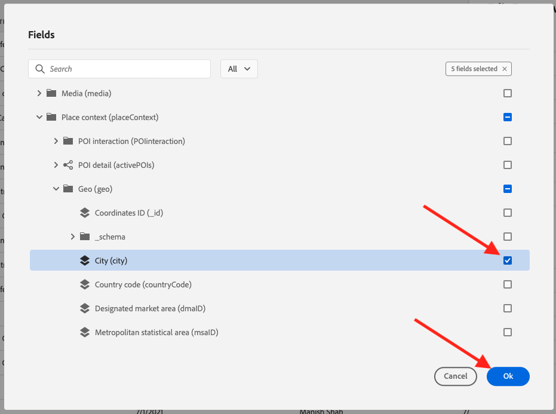
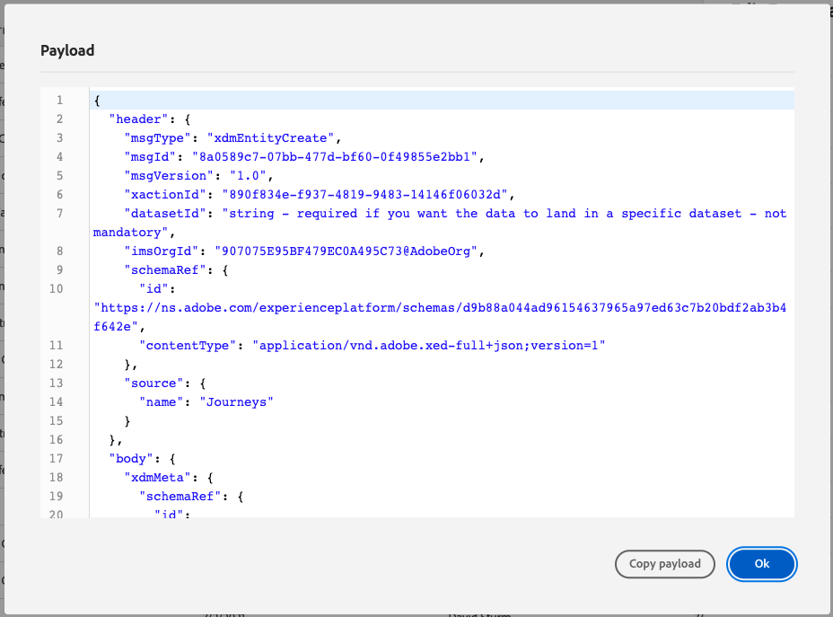

# 8.1 이벤트 정의

다음 위치로 이동하여 Adobe Journey Optimizer에 로그인합니다 [Adobe Experience Cloud](https://experience.adobe.com). 클릭 **Journey Optimizer**.

으로 리디렉션됩니다. **홈**  Journey Optimizer에서 보기. 먼저 올바른 샌드박스를 사용하고 있는지 확인하십시오. 사용할 샌드박스를 이라고 합니다 `--aepSandboxId--`. 한 샌드박스에서 다른 샌드박스로 변경하려면 **프로덕션 제품(VA7)** 및 목록에서 샌드박스를 선택합니다. 이 예제에서 샌드박스의 이름은 다음과 같습니다 **AEP Enablement FY22**. 그러면 **홈** 샌드박스 보기 `--aepSandboxId--`.

왼쪽 메뉴에서 아래로 스크롤하여 **구성**. 그런 다음 **관리** 버튼 아래 **이벤트**.

사용 가능한 모든 이벤트에 대한 개요를 볼 수 있습니다. 클릭 **이벤트 만들기** 을 클릭하여 고유한 이벤트 만들기를 시작합니다.

그러면 빈 이벤트 창이 새로 나타납니다.

이벤트의 이름으로, `--demoProfileLdap--GeofenceEntry`. 이 예에서 이벤트 이름은 `vangeluwGeofenceEntry`.

설명을 다음으로 설정: `Geofence Entry Event`.

다음으로, **유형** 가 로 설정되어 있습니다. **단일**, 및에 대해 **이벤트 ID 유형** 선택 **시스템 생성**

그런 다음 스키마를 선택해야 합니다. 여기에 표시되는 모든 스키마는 Adobe Experience Platform 스키마입니다.

일부 스키마가 표시되지 않습니다. Adobe Experience Platform에서는 더 많은 스키마를 사용할 수 있습니다.
이 목록에 표시하려면 스키마에 특정 필드 그룹이 연결되어 있어야 합니다. 여기에 표시되는 데 필요한 필드 그룹을 라고 합니다. `Orchestration eventID`.

Adobe Experience Platform에서 이러한 스키마를 정의하는 방법을 간략하게 살펴보겠습니다.

왼쪽 메뉴에서 **스키마** 새 브라우저 탭에서 엽니다. in **스키마**, 이동 **찾아보기** 를 클릭하여 사용 가능한 스키마 목록을 확인합니다.
스키마 열기 `Demo System - Event Schema for Website (Global v1.1)`.

스키마를 열면 필드 그룹이 표시됩니다 `Orchestration eventID` 는 스키마의 일부입니다.
이 필드 그룹에는 두 개의 필드만 있습니다. `_experience.campaign.orchestration.eventID` 및 `originJourneyID`.

이 필드 그룹과 특정 eventID 필드가 스키마의 일부이면 Adobe Journey Optimizer에서 해당 스키마를 사용할 수 있습니다.

Adobe Journey Optimizer의 이벤트 구성으로 돌아갑니다.

이 사용 사례에서는 고객이 특정 위치에 있는지 파악하기 위해 대상 이벤트 를 수신하려고 하므로 이제 스키마를 선택합니다 `Demo System - Event Schema for Website (Global v1.1)` 를 이벤트의 스키마로 사용.

그러면 Adobe Journey Optimizer에서 일부 필수 필드를 자동으로 선택하지만 Adobe Journey Optimizer에서 사용할 수 있도록 만들어진 필드를 편집할 수 있습니다.

을(를) 클릭합니다. **연필** 아이콘을 클릭하여 필드를 편집합니다.

그러면 필드를 선택할 수 있는 스키마 계층 구조의 팝업 창이 표시됩니다.

ECID 및 Orchestration 이벤트 ID와 같은 필드가 필요하며 이러한 필드를 미리 선택해야 합니다.

그러나 마케터는 여정에 컨텍스트를 제공하는 모든 데이터 포인트에 대한 유연한 액세스 권한이 있어야 합니다. 따라서 다음 필드도 최소한으로 선택하도록 하겠습니다(위치 컨텍스트 노드 내에 있음).

- 구/군/시

완료되면 을(를) 클릭합니다. **확인**.

Adobe Journey Optimizer에는 고객을 식별하기 위한 식별자도 필요합니다. Adobe Journey Optimizer은 Adobe Experience Platform에 연결되어 있으므로 스키마의 기본 식별자가 여정의 식별자로 자동으로 사용됩니다.
기본 식별자는 Adobe Experience Platform의 전체 ID 그래프도 자동으로 고려하며, 사용 가능한 모든 ID, 장치 및 채널의 모든 동작을 동일한 프로필에 연결하여 Adobe Journey Optimizer이 상황에 맞는, 연관성 및 일관되도록 합니다.

클릭 **저장** 사용자 지정 이벤트를 저장하려면 을 클릭합니다.

그러면 이벤트가 사용 가능한 이벤트 목록에 포함됩니다.

마지막으로, `Orchestration eventID` 참조하십시오.

이벤트 목록에서 이벤트를 클릭하여 다시 엽니다.
이벤트에서 **페이로드 보기** 아이콘 옆에 있는 아이콘 **필드**.

클릭 **페이로드 보기** 아이콘을 클릭하면 이 이벤트에 대한 샘플 XDM 페이로드가 열립니다.

에서 아래로 스크롤합니다. **페이로드** 줄이 보일 때까지 `eventID`.

다음 내용을 적어 두십시오 `eventID` 구성을 테스트하는 데 마지막 단계에 이 기능이 필요합니다.

이 예에서 `eventID` is `fa42ab7982ba55f039eacec24c1e32e5c51b310c67f0fa559ab49b89b63f4934`.

이제 빌드하고 있는 여정을 트리거할 이벤트를 정의했습니다. 여정이 트리거되면 도시 및 선택한 다른 모든 필드(예: 국가, 위도 및 경도)가 여정에 제공됩니다.

사용 사례 설명에서 설명한 대로 날씨에 따라 상황별 프로모션을 제공해야 합니다. 날씨 정보를 얻기 위해서는 해당 지역의 날씨 정보를 제공하는 외부 데이터 소스를 정의해야 합니다. 다음 코드를 사용합니다 **OpenWeather** 2의 일부로 해당 정보를 제공하는 서비스입니다.

다음 단계: [8.2 외부 데이터 소스 정의](./ex2.md)

[모듈 8로 돌아가기](journey-orchestration-external-weather-api-sms.md)

[모든 모듈로 돌아가기](../../overview.md)
