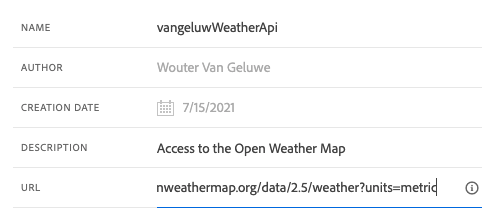

# 8.2 외부 데이터 소스 정의

이 연습에서는 Adobe Journey Optimizer을 사용하여 사용자 지정 외부 데이터 소스를 만듭니다.

다음 위치로 이동하여 Adobe Journey Optimizer에 로그인합니다 [Adobe Experience Cloud](https://experience.adobe.com). 클릭 **Journey Optimizer**.


으로 리디렉션됩니다. **홈**  Journey Optimizer에서 보기. 먼저 올바른 샌드박스를 사용하고 있는지 확인하십시오. 사용할 샌드박스를 이라고 합니다 `--aepSandboxId--`. 한 샌드박스에서 다른 샌드박스로 변경하려면 **프로덕션 제품(VA7)** 및 목록에서 샌드박스를 선택합니다. 이 예제에서 샌드박스의 이름은 다음과 같습니다 **AEP Enablement FY22**. 그러면 **홈** 샌드박스 보기 `--aepSandboxId--`.


왼쪽 메뉴에서 아래로 스크롤하여 **구성**. 그런 다음 **관리** 버튼 아래 **데이터 소스**.


그러면 **데이터 소스** 목록.
클릭 **데이터 소스 만들기** 데이터 소스 추가를 시작합니다.


빈 데이터 소스 팝업이 표시됩니다.


이 구성을 시작하려면 먼저 **날씨 맵 열기** 서비스. 다음 단계에 따라 계정을 만들고 API 키를 가져옵니다.

이동 [https://openweathermap.org/](https://openweathermap.org/). 홈 페이지에서 **로그인**.


클릭 **계정 만들기**.


세부 사항을 기입합니다.


클릭 **계정 만들기**.


그러면 계정 페이지로 리디렉션됩니다.


메뉴에서 **API 키** api 키를 검색하려면 사용자 지정 외부 데이터 소스를 설정해야 합니다.


An **API 키** 의 모습은 다음과 같습니다. `b2c4c36b6bb59c3458d6686b05311dc3`.

다음 항목이 있습니다. **API 설명서** 대상 **현재 날씨** [여기](https://openweathermap.org/current).

사용 사례에서는 고객이 거주하는 도시를 기반으로 Open Weather Map과의 연결을 구현합니다.


로 돌아갑니다. **Adobe Journey Optimizer**: 빈 **외부 데이터 소스** 팝업.


데이터 소스의 이름으로 `--demoProfileLdap--WeatherApi`. 이 예에서 데이터 소스 이름 은 `vangeluwWeatherApi `.

설명을 다음으로 설정: `Access to the Open Weather Map`.

Open Weather Map API의 URL은 다음과 같습니다. **http://api.openweathermap.org/data/2.5/weather?units=metric**



다음으로 사용할 인증 을 선택해야 합니다.

다음 변수를 사용합니다.

| 필드 | 값 |
|:-----------------------:| :-----------------------|
| 유형 | **API 키** |
| 이름 | **APPID** |
| 값 | **API 키** |
| 위치 | **쿼리 매개 변수** |


마지막으로 다음을 정의해야 합니다 **필드 그룹**: 기본적으로 날씨 API로 전송할 요청입니다. 이 경우, 우리는 도시의 이름을 사용하여 그 도시의 현재 날씨를 요청하려고 합니다.


날씨 API 설명서에 따라 매개 변수를 보내야 합니다 `q=City`.


예상 API 요청과 일치하도록 FieldGroup을 다음과 같이 구성합니다.

>[!IMPORTANT]
>
>필드 그룹 이름은 고유해야 합니다. 다음 명명 규칙을 사용하십시오. `--demoProfileLdap--WeatherByCity` 따라서 이 경우 이름은 `vangeluwWeatherByCity`


응답 페이로드의 경우 날씨 API에서 전송할 응답의 예를 붙여넣어야 합니다.

API 설명서 페이지에서 필요한 API JSON 응답을 찾을 수 있습니다 [여기](https://openweathermap.org/current).


또는 다음에서 JSON 응답을 복사할 수 있습니다.

```json
{"coord": { "lon": 139,"lat": 35},
  "weather": [
    {
      "id": 800,
      "main": "Clear",
      "description": "clear sky",
      "icon": "01n"
    }
  ],
  "base": "stations",
  "main": {
    "temp": 281.52,
    "feels_like": 278.99,
    "temp_min": 280.15,
    "temp_max": 283.71,
    "pressure": 1016,
    "humidity": 93
  },
  "wind": {
    "speed": 0.47,
    "deg": 107.538
  },
  "clouds": {
    "all": 2
  },
  "dt": 1560350192,
  "sys": {
    "type": 3,
    "id": 2019346,
    "message": 0.0065,
    "country": "JP",
    "sunrise": 1560281377,
    "sunset": 1560333478
  },
  "timezone": 32400,
  "id": 1851632,
  "name": "Shuzenji",
  "cod": 200
}
```

위의 JSON 응답을 클립보드에 복사한 다음 사용자 지정 데이터 소스 구성 화면으로 이동합니다.

을(를) 클릭합니다. **페이로드 편집** 아이콘.


이제 위의 JSON 응답을 붙여 넣어야 하는 팝업이 표시됩니다.


JSON 응답을 붙여 넣으십시오. 그러면 이것이 표시됩니다. **저장**&#x200B;을 클릭합니다.


이제 사용자 지정 데이터 소스 구성이 완료되었습니다. 위로 스크롤하여 클릭 **저장**.


이제 데이터 소스가 생성되었으며 이(가) 의 일부입니다 **데이터 소스** 목록.


다음 단계: [8.3 사용자 지정 작업 정의](./ex3.md)

[모듈 8로 돌아가기](journey-orchestration-external-weather-api-sms.md)

[모든 모듈로 돌아가기](../../overview.md)
