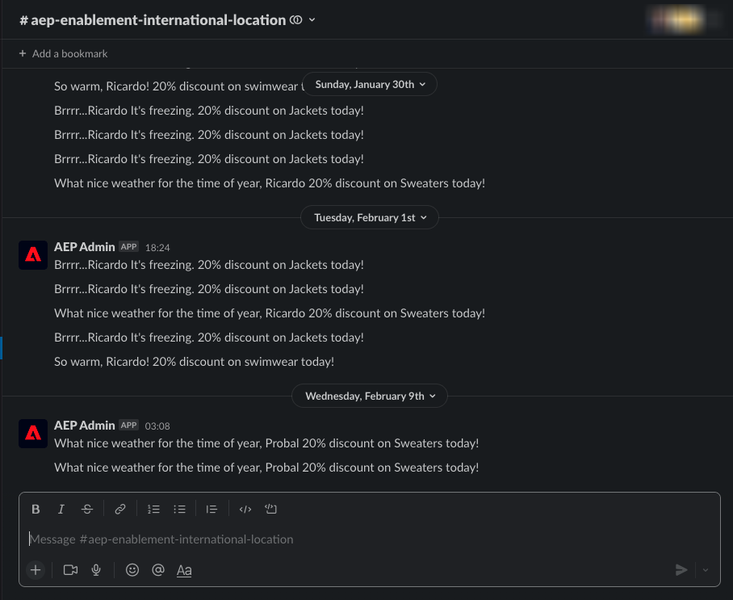

# 8.3 사용자 지정 작업 정의

이 연습에서는 Adobe Journey Optimizer을 함께 사용하여 두 개의 사용자 지정 작업을 만듭니다.

다음 위치로 이동하여 Adobe Journey Optimizer에 로그인합니다 [Adobe Experience Cloud](https://experience.adobe.com). 클릭 **Journey Optimizer**.


으로 리디렉션됩니다. **홈**  Journey Optimizer에서 보기. 먼저 올바른 샌드박스를 사용하고 있는지 확인하십시오. 사용할 샌드박스를 이라고 합니다 `--aepSandboxId--`. 한 샌드박스에서 다른 샌드박스로 변경하려면 **프로덕션 제품(VA7)** 및 목록에서 샌드박스를 선택합니다. 이 예제에서 샌드박스의 이름은 다음과 같습니다 **AEP Enablement FY22**. 그러면 **홈** 샌드박스 보기 `--aepSandboxId--`.


왼쪽 메뉴에서 아래로 스크롤하여 **구성**. 그런 다음 **관리** 버튼 아래 **작업**.


그러면 **작업** 목록.


Slack 채널으로 텍스트를 전송하는 작업을 정의합니다.

## 8.3.1 작업: Slack 채널으로 텍스트 보내기

이제 기존 Slack 채널을 사용하고 메시지를 해당 Slack 채널으로 보냅니다. Slack에는 사용하기 쉬운 API가 있으며 Adobe에서는 Adobe Journey Optimizer을 사용하여 API를 트리거합니다.



클릭 **작업 만들기** 새 작업 추가를 시작하려면 다음을 수행하십시오.


빈 작업 팝업이 표시됩니다.


작업의 이름으로, `--demoProfileLdap--TextSlack`. 이 예에서 작업 이름은 `vangeluwTextSlack`.

설명을 다음으로 설정: `Send Text to Slack`.


대상 **URL 구성**&#x200B;다음 코드를 사용하십시오.

- URL: `https://2mnbfjyrre.execute-api.us-west-2.amazonaws.com/prod`
- 방법: **POST**

>[!NOTE]
>
>위의 URL은 AWS Lambda 함수를 참조하며, 이 함수는 위에서 언급한 대로 Slack 채널에 요청을 전달합니다. 이 작업은 Adobe 소유 Slack 채널에 대한 액세스를 보호하기 위해 수행됩니다. 자체 Slack 채널이 있는 경우 다음을 통해 Slack 앱을 만들어야 합니다 [https://api.slack.com/](https://api.slack.com/)그런 다음 해당 Slack 앱에서 수신 웹 후크를 만든 다음 위의 URL을 수신 웹 후크 URL로 바꿔야 합니다.

헤더 필드를 변경할 필요가 없습니다.


**인증** 는 로 설정되어야 합니다. **인증 없음**.


대상 **작업 매개 변수**&#x200B;를 채울 필드를 Slack에 대해 정의해야 합니다. 논리적으로, Adobe Journey Optimizer과 Adobe Experience Platform이 개인화의 두뇌가 되기를 바랍니다. 따라서 Slack으로 전송할 텍스트는 Adobe Journey Optimizer에서 정의한 다음 실행을 위해 Slack으로 전송되어야 합니다.

그러니까 **작업 매개 변수**&#x200B;를 클릭하고 **페이로드 편집** 아이콘.


그러면 빈 팝업 창이 표시됩니다.


아래 텍스트를 복사하여 빈 팝업 창에 붙여넣습니다.

```json
{
 "text": {
  "toBeMapped": true,
  "dataType": "string",
  "label": "textToSlack"
 }
}
```

FYI: 아래 필드를 지정하면 고객 여정에서 이러한 필드에 액세스할 수 있으며 여정에서 이러한 필드를 동적으로 채울 수 있습니다.

**&quot;toBeMapped&quot;: true,**

**&quot;dataType&quot;: &quot;string&quot;,**

**&quot;label&quot;: &quot;textToSlack&quot;**

그러면 다음 내용이 표시됩니다.


**저장**&#x200B;을 클릭합니다.


위로 스크롤하여 클릭 **저장** 한 번 더 사용자 지정 작업을 저장하십시오.


사용자 지정 작업이 이제 **작업** 목록.


이벤트, 외부 데이터 소스 및 작업을 정의했습니다. 이제 그 모든 것을 하나의 여정으로 통합합시다.

다음 단계: [8.4 여정 및 메시지 만들기](./ex4.md)

[모듈 8로 돌아가기](journey-orchestration-external-weather-api-sms.md)

[모든 모듈로 돌아가기](../../overview.md)
