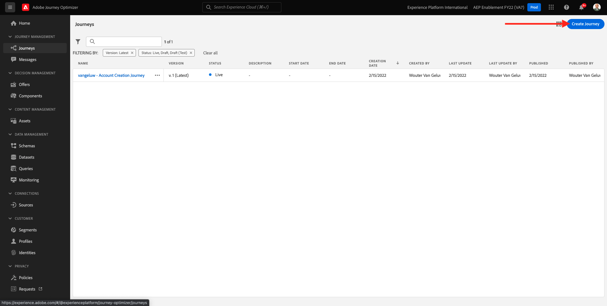
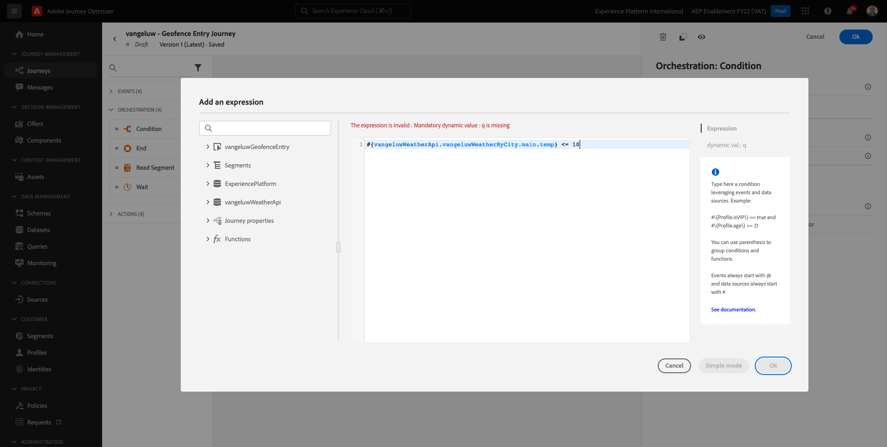
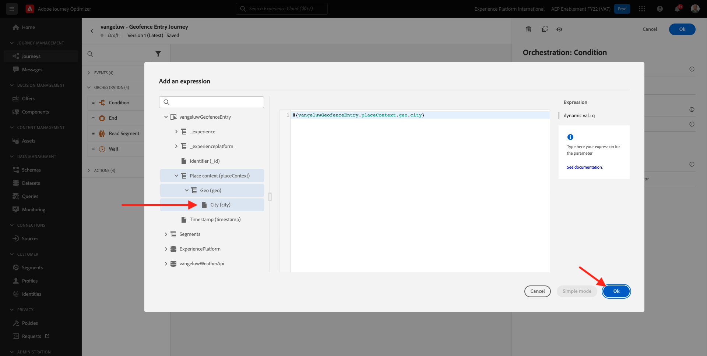
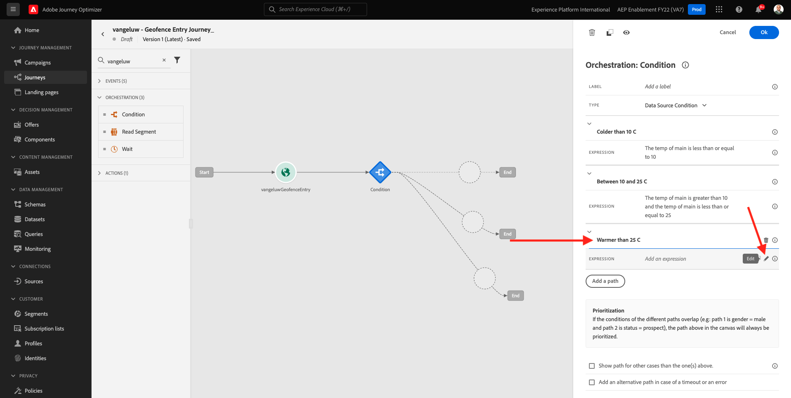
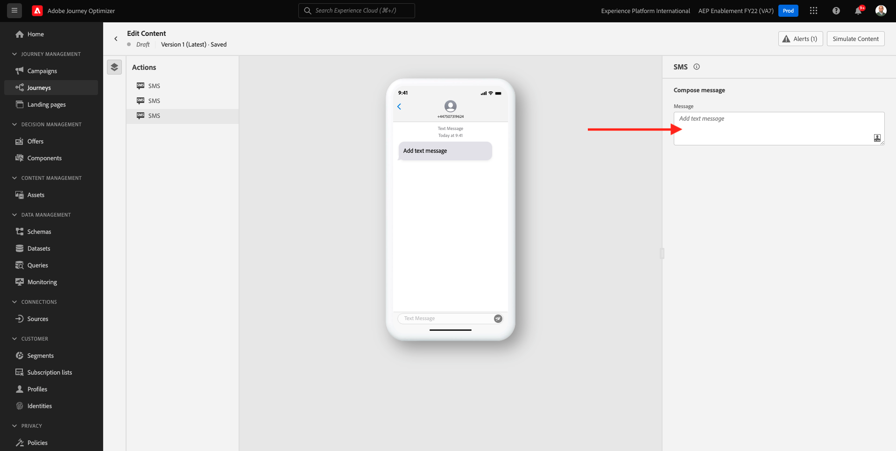
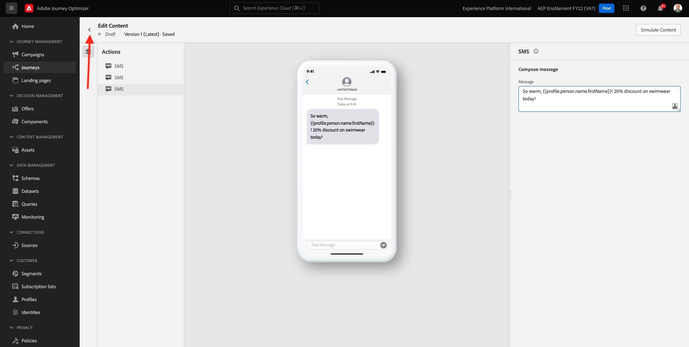
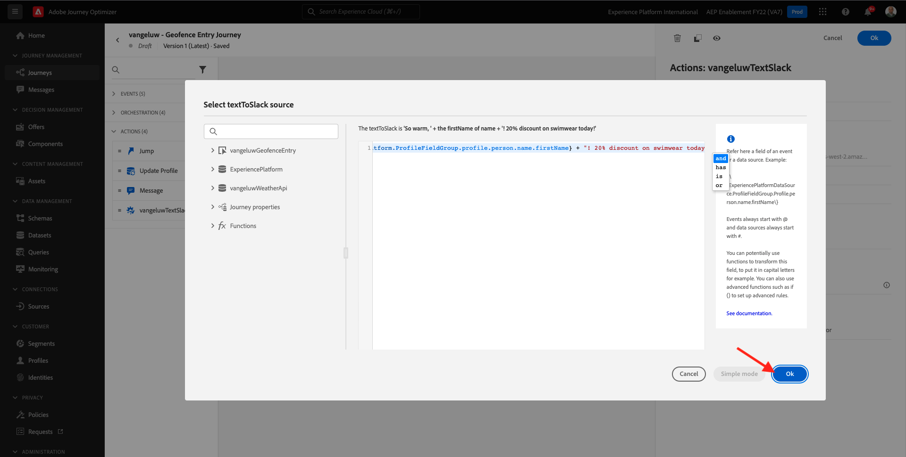

# 8.4 여정 및 메시지 만들기

이 연습에서는 Adobe Journey Optimizer을 사용하여 여정 및 여러 텍스트 메시지를 만듭니다.

이 사용 사례의 경우, 목표는 고객 위치의 날씨 조건에 따라 다른 SMS 메시지를 보내는 것입니다. 3개의 시나리오가 정의되어 있습니다.

- 섭씨 10° 이상 추움
- 섭씨 10°~25° 사이
- 섭씨 25° 이상 따뜻함

이러한 3가지 조건의 경우 Adobe Journey Optimizer에서 3개의 SMS 메시지를 정의해야 합니다.

## 8.4.1 여정 만들기

다음 위치로 이동하여 Adobe Journey Optimizer에 로그인합니다 [Adobe Experience Cloud](https://experience.adobe.com). 클릭 **Journey Optimizer**.


으로 리디렉션됩니다. **홈**  Journey Optimizer에서 보기. 먼저 올바른 샌드박스를 사용하고 있는지 확인하십시오. 사용할 샌드박스를 이라고 합니다 `--aepSandboxId--`. 한 샌드박스에서 다른 샌드박스로 변경하려면 **프로덕션 제품(VA7)** 및 목록에서 샌드박스를 선택합니다. 이 예제에서 샌드박스의 이름은 다음과 같습니다 **AEP Enablement FY22**. 그러면 **홈** 샌드박스 보기 `--aepSandboxId--`.


왼쪽 메뉴에서 **여정** 을(를) 클릭합니다. **여정 만들기** 여정 만들기를 시작합니다.



여정에 이름을 지정해야 합니다.

여정 이름으로, `--demoProfileLdap-- - Geofence Entry Journey`. 이 예에서 여정 이름은 `vangeluw - Geofence Entry Journey`. 현재 다른 값을 설정할 수 없습니다. **확인**&#x200B;을 클릭합니다.


화면 왼쪽에서 **이벤트**. 해당 목록에 이전에 만든 이벤트가 표시됩니다. 선택한 다음 여정 캔버스에 끌어다 놓습니다. 그러면 여정이 다음과 같습니다. 클릭 **확인**.


다음을 클릭합니다. **오케스트레이션**. 이제 사용 가능한 항목이 표시됩니다 **오케스트레이션** 기능. 선택 **조건**&#x200B;그런 다음 여정 캔버스에 끌어다 놓습니다.


이제 세 가지 조건을 정의해야 합니다.

- 섭씨 10°보다 추워요
- 섭씨 10°에서 25° 사이에요
- 섭씨 25°보다 따뜻합니다

첫 번째 조건을 정의하겠습니다.

### 조건 1: 섭씨 10° 이상 추움

을(를) 클릭합니다. **조건**.  클릭 **경로1** 및에 대한 경로 이름을 편집합니다 **10C 이상**. 을(를) 클릭합니다. **편집** Path1 표현식의 아이콘입니다.


그러면 빈 공간이 표시됩니다 **단순 편집기** 화면. 쿼리는 좀 더 고급 기능이므로 **고급 모드**. 클릭 **고급 모드**.


그러면 **고급 편집기** 코드 항목을 입력할 수 있습니다.


아래 코드를 선택하고 **고급 편집기**.

`#{--demoProfileLdap--WeatherApi.--demoProfileLdap--WeatherByCity.main.temp} <= 10`

그러면 이게 보입니다.



이 조건의 일부로서 온도를 검색하려면 고객이 현재 있는 도시를 제공해야 합니다.
다음 **구/군/시** 동적 매개 변수에 연결해야 합니다 `q`이전에 Open Weather API 설명서에서 보았던 것과 같습니다.

필드를 클릭합니다 **동적 간격: q** 스크린샷에 나와 있습니다.


사용 가능한 데이터 소스 중 하나에서 고객의 현재 도시가 들어 있는 필드를 찾아야 합니다.


로 이동하여 필드를 찾을 수 있습니다 `--demoProfileLdap--GeofenceEntry.placeContext.geo.city`.

해당 필드를 클릭하면 매개 변수에 대한 동적 값으로 추가됩니다 `q`. 이 필드는 모바일 앱에서 구현한 지리적 위치 서비스 등에 의해 채워집니다. 이 예제에서는 데모 웹 사이트의 Admin Console을 사용하여 이를 시뮬레이션합니다. **확인**&#x200B;을 클릭합니다.



### 조건 2: 섭씨 10°~25° 사이

첫 번째 조건을 추가한 후에는 이 화면이 표시됩니다. 클릭 **경로 추가**.


두 번 클릭 **경로1** 및에 대한 경로 이름 편집 **10~25C 사이**. 을(를) 클릭합니다. **편집** 아이콘 을 입력합니다.


그러면 빈 공간이 표시됩니다 **단순 편집기** 화면. 쿼리는 좀 더 고급 기능이므로 **고급 모드**. 클릭 **고급 모드**.


그러면 **고급 편집기** 코드 항목을 입력할 수 있습니다.


아래 코드를 선택하고 **고급 편집기**.

`#{--demoProfileLdap--WeatherApi.--demoProfileLdap--WeatherByCity.main.temp} > 10 and #{--demoProfileLdap--WeatherApi.--demoProfileLdap--WeatherByCity.main.temp} <= 25`

그러면 이게 보입니다.


이 조건의 일부로 온도를 검색하려면 고객이 현재 있는 도시를 제공해야 합니다.
다음 **구/군/시** 동적 매개 변수에 연결해야 합니다 **q**&#x200B;이전에 Open Weather API 설명서에서 보았던 것과 같습니다.

필드를 클릭합니다 **동적 간격: q** 스크린샷에 나와 있습니다.


사용 가능한 데이터 소스 중 하나에서 고객의 현재 도시가 들어 있는 필드를 찾아야 합니다.


로 이동하여 필드를 찾을 수 있습니다 `--demoProfileLdap--GeofenceEntry.placeContext.geo.city`. 해당 필드를 클릭하면 매개 변수에 대한 동적 값으로 추가됩니다 **q**. 이 필드는 모바일 앱에서 구현한 지리적 위치 서비스 등에 의해 채워집니다. 이 예제에서는 데모 웹 사이트의 Admin Console을 사용하여 이를 시뮬레이션합니다. **확인**&#x200B;을 클릭합니다.


다음으로, 세 번째 조건을 추가합니다.

### 조건 3: 섭씨 25° 이상 따뜻함

두 번째 조건을 추가한 후에는 이 화면이 표시됩니다. 클릭 **경로 추가**.


Path1을 두 번 클릭하여 이름을 **25C 이상 따뜻함**.
그런 다음 **편집** 아이콘 을 입력합니다.



그러면 빈 공간이 표시됩니다 **단순 편집기** 화면. 쿼리는 좀 더 고급 기능이므로 **고급 모드**. 클릭 **고급 모드**.


그러면 **고급 편집기** 코드 항목을 입력할 수 있습니다.


아래 코드를 선택하고 **고급 편집기**.

`#{--demoProfileLdap--WeatherApi.--demoProfileLdap--WeatherByCity.main.temp} > 25`

그러면 이게 보입니다.


이 조건의 일부로 온도를 검색하려면 고객이 현재 있는 도시를 제공해야 합니다.
다음 **구/군/시** 동적 매개 변수에 연결해야 합니다 **q**&#x200B;이전에 Open Weather API 설명서에서 보았던 것과 같습니다.

필드를 클릭합니다 **동적 간격: q** 스크린샷에 나와 있습니다.


사용 가능한 데이터 소스 중 하나에서 고객의 현재 도시가 들어 있는 필드를 찾아야 합니다.


로 이동하여 필드를 찾을 수 있습니다 ```--demoProfileLdap--GeofenceEntry.placeContext.geo.city```. 해당 필드를 클릭하면 매개 변수에 대한 동적 값으로 추가됩니다 **q**. 이 필드는 모바일 앱에서 구현한 지리적 위치 서비스 등에 의해 채워집니다. 이 예제에서는 데모 웹 사이트의 Admin Console을 사용하여 이를 시뮬레이션합니다. **확인**&#x200B;을 클릭합니다.


이제 세 개의 경로가 구성되었습니다. 클릭 **확인**.


이것은 학습 목적의 여정 이므로 이제 마케터가 메시지를 전달해야 하는 다양한 옵션을 보여주기 위한 몇 가지 작업을 구성하겠습니다.

## 8.4.2 경로에 대한 메시지 보내기: 섭씨 10° 이상 추움

각 온도 상황에 대해 고객에게 문자 메시지를 보내려고 합니다. 고객이 사용할 수 있는 모바일 번호가 있는 경우에만 텍스트 메시지를 보낼 수 있으므로 먼저 해당 번호를 확인해야 합니다.

다음 사항에 집중하겠습니다 **10C 이상**.


다른 걸로 하죠 **조건** 요소를 끌어서 아래 스크린샷에 표시된 대로 드래그합니다. 이 고객의 경우 모바일 번호를 사용할 수 있는지 확인하겠습니다.


이 예와 마찬가지로 고객이 모바일 번호를 사용할 수 있는 옵션만 구성합니다. 레이블 추가 **모바일이 있습니까?**.

을(를) 클릭합니다. **편집** 아이콘에 사용할 표현식 **경로1** 경로.


왼쪽의 데이터 소스에서 **ExperiencePlatform.ProfileFieldGroup.profile.mobilePhone.number**. 이제 Adobe Experience Platform의 실시간 고객 프로필에서 직접 휴대폰 번호를 읽고 있습니다.


필드를 선택합니다 **숫자**&#x200B;를 클릭한 다음 조건 캔버스에 드래그하여 놓습니다.

연산자를 선택합니다 **비어 있지 않음**. 클릭 **확인**.


그러면 이게 보입니다. 클릭 **확인** 다시 한 번


그러면 여정이 다음과 같이 표시됩니다. 클릭 **작업** 스크린샷에 나와 있습니다.


작업을 선택합니다 **SMS**&#x200B;를 클릭한 다음 방금 추가한 조건 뒤에 끌어서 놓습니다.


설정 **카테고리** to **마케팅** sms를 보낼 수 있는 SMS 서피스를 선택합니다. 이 경우 선택할 이메일 표면은 다음과 같습니다 **SMS**.


다음 단계는 메시지를 만드는 것입니다. 이렇게 하려면 **컨텐츠 편집**.


이제 SMS 텍스트를 구성할 수 있는 메시지 대시보드가 표시됩니다. 을(를) 클릭합니다. **메시지 작성** 영역을 사용하여 메시지를 만들 수 있습니다.


다음 텍스트를 입력합니다. `Brrrr... {{profile.person.name.firstName}}, it's freezing. 20% discount on jackets today!`. **저장**&#x200B;을 클릭합니다.


그러면 이게 보입니다. 왼쪽 상단 모서리의 화살표를 클릭하여 여정으로 돌아갑니다.


그럼 다시 오셔야 합니다 클릭 **확인**.


왼쪽 메뉴에서 로 돌아갑니다. **작업**&#x200B;를 클릭하고 작업을 선택합니다 `--demoProfileLdap--TextSlack`을 클릭한 다음 그 다음에 을(를) 끌어다 놓습니다 **메시지** 작업.


이동 **작업 매개 변수** 을 클릭하고 **편집** 매개 변수의 아이콘 `TEXTTOSLACK`.


팝업 창에서 **고급 모드**.


아래 코드를 선택하고 복사하여 **고급 모드 편집기**. 클릭 **확인**.

`"Brrrr..." + #{ExperiencePlatform.ProfileFieldGroup.profile.person.name.firstName} + " It's freezing. 20% discount on Jackets today!"`


완료된 작업이 표시됩니다. 클릭 **확인**.


이제 여정의 이 경로를 사용할 수 있습니다.

## 8.4.3 경로에 대한 메시지 보내기: 섭씨 10°~25° 사이

각 온도 상황에 대해 고객에게 문자 메시지를 보내려고 합니다. 고객이 사용할 수 있는 모바일 번호가 있는 경우에만 텍스트 메시지를 보낼 수 있으므로 먼저 해당 번호를 확인해야 합니다.

다음 사항에 집중하겠습니다 **10~25C 사이** 경로.


다른 걸로 하죠 **조건** 요소를 끌어서 아래 스크린샷에 표시된 대로 드래그합니다. 이 고객의 경우 모바일 번호를 사용할 수 있는지 확인하겠습니다.


이 예와 마찬가지로 고객이 모바일 번호를 사용할 수 있는 옵션만 구성합니다. 레이블 추가 **모바일이 있습니까?**.

을(를) 클릭합니다. **편집** 아이콘에 사용할 표현식 **경로1** 경로.


왼쪽의 데이터 소스에서 **ExperiencePlatform.ProfileFieldGroup.profile.mobilePhone.number**. 이제 Adobe Experience Platform의 실시간 고객 프로필에서 직접 휴대폰 번호를 읽고 있습니다.


필드를 선택합니다 **숫자**&#x200B;를 클릭한 다음 조건 캔버스에 드래그하여 놓습니다.

연산자를 선택합니다 **비어 있지 않음**. 클릭 **확인**.


그러면 이게 보입니다. 클릭 **확인**.


그러면 여정이 다음과 같이 표시됩니다. 클릭 **작업** 스크린샷에 나와 있습니다.


작업을 선택합니다 **SMS**&#x200B;를 클릭한 다음 방금 추가한 조건 뒤에 끌어서 놓습니다.


설정 **카테고리** to **마케팅** sms를 보낼 수 있는 SMS 서피스를 선택합니다. 이 경우 선택할 이메일 표면은 다음과 같습니다 **SMS**.


다음 단계는 메시지를 만드는 것입니다. 이렇게 하려면 **컨텐츠 편집**.


이제 SMS 텍스트를 구성할 수 있는 메시지 대시보드가 표시됩니다. 을(를) 클릭합니다. **메시지 작성** 영역을 사용하여 메시지를 만들 수 있습니다.


다음 텍스트를 입력합니다. `What a nice weather for the time of year, {{profile.person.name.firstName}} - 20% discount on Sweaters today!`. **저장**&#x200B;을 클릭합니다.


그러면 이게 보입니다. 왼쪽 상단 모서리의 화살표를 클릭하여 여정으로 돌아갑니다.


이제 완료된 작업이 표시됩니다. 클릭 **확인**.


왼쪽 메뉴에서 로 돌아갑니다. **작업**&#x200B;를 클릭하고 작업을 선택합니다 `--demoProfileLdap--TextSlack`을 클릭한 다음 그 다음에 을(를) 끌어다 놓습니다 **메시지** 작업.


이동 **작업 매개 변수** 을 클릭하고 **편집** 매개 변수의 아이콘 `TEXTTOSLACK`.


팝업 창에서 **고급 모드**.


아래 코드를 선택하고 복사하여 **고급 모드 편집기**. 클릭 **확인**.

`"What nice weather for the time of year, " + #{ExperiencePlatform.ProfileFieldGroup.profile.person.name.firstName} + " 20% discount on Sweaters today!"`


완료된 작업이 표시됩니다. 클릭 **확인**.


이제 여정의 이 경로를 사용할 수 있습니다.

## 8.4.4 경로에 대한 메시지 보내기: 섭씨 25° 이상 따뜻함

각 온도 상황에 대해 고객에게 문자 메시지를 보내려고 합니다. 고객이 사용할 수 있는 모바일 번호가 있는 경우에만 텍스트 메시지를 보낼 수 있으므로 먼저 해당 번호를 확인해야 합니다.

다음 사항에 집중하겠습니다 **25C 이상 따뜻함** 경로.


다른 걸로 하죠 **조건** 요소를 끌어서 아래 스크린샷에 표시된 대로 드래그합니다. 이 고객의 모바일 번호를 확인할 수 있습니다.


이 예와 마찬가지로 고객이 모바일 번호를 사용할 수 있는 옵션만 구성합니다. 레이블 추가 **모바일이 있습니까?**.

을(를) 클릭합니다. **편집** 아이콘에 사용할 표현식 **경로1** 경로.


왼쪽의 데이터 소스에서 **ExperiencePlatform.ProfileFieldGroup.profile.mobilePhone.number**. 이제 Adobe Experience Platform의 실시간 고객 프로필에서 직접 휴대폰 번호를 읽고 있습니다.


필드를 선택합니다 **숫자**&#x200B;를 클릭한 다음 조건 캔버스에 드래그하여 놓습니다.

연산자를 선택합니다 **비어 있지 않음**. 클릭 **확인**.


그러면 이게 보입니다. **확인**&#x200B;을 클릭합니다.


그러면 여정이 다음과 같이 표시됩니다. 클릭 **작업** 스크린샷에 나와 있습니다.


작업을 선택합니다 **SMS**&#x200B;를 클릭한 다음 방금 추가한 조건 뒤에 끌어서 놓습니다.


설정 **카테고리** to **마케팅** sms를 보낼 수 있는 SMS 서피스를 선택합니다. 이 경우 선택할 이메일 표면은 다음과 같습니다 **SMS**.


다음 단계는 메시지를 만드는 것입니다. 이렇게 하려면 **컨텐츠 편집**.


이제 SMS 텍스트를 구성할 수 있는 메시지 대시보드가 표시됩니다. 을(를) 클릭합니다. **메시지 작성** 영역을 사용하여 메시지를 만들 수 있습니다.



다음 텍스트를 입력합니다. `So warm, {{profile.person.name.firstName}}! 20% discount on swimwear today!`. **저장**&#x200B;을 클릭합니다.


그러면 이게 보입니다. 왼쪽 상단 모서리의 화살표를 클릭하여 여정으로 돌아갑니다.



이제 완료된 작업이 표시됩니다. 클릭 **확인**.


왼쪽 메뉴에서 로 돌아갑니다. **작업**&#x200B;를 클릭하고 작업을 선택합니다 `--demoProfileLdap--TextSlack`을 클릭한 다음 그 다음에 을(를) 끌어다 놓습니다 **메시지** 작업.


이동 **작업 매개 변수** 을 클릭하고 **편집** 매개 변수의 아이콘 `TEXTTOSLACK`.


팝업 창에서 **고급 모드**.


아래 코드를 선택하고 복사하여 **고급 모드 편집기**. 클릭 **확인**.

`"So warm, " + #{ExperiencePlatform.ProfileFieldGroup.profile.person.name.firstName} + "! 20% discount on swimwear today!"`



완료된 작업이 표시됩니다. 클릭 **확인**.


이제 여정의 이 경로를 사용할 수 있습니다.

## 8.4.5 여정 게시

이제 여정이 완전히 구성되었습니다. 클릭 **게시**.


클릭 **게시** 다시 한 번


이제 여정이 게시되었습니다.


다음 단계: [8.5 여정 트리거](./ex5.md)

[모듈 8로 돌아가기](journey-orchestration-external-weather-api-sms.md)

[모든 모듈로 돌아가기](../../overview.md)
