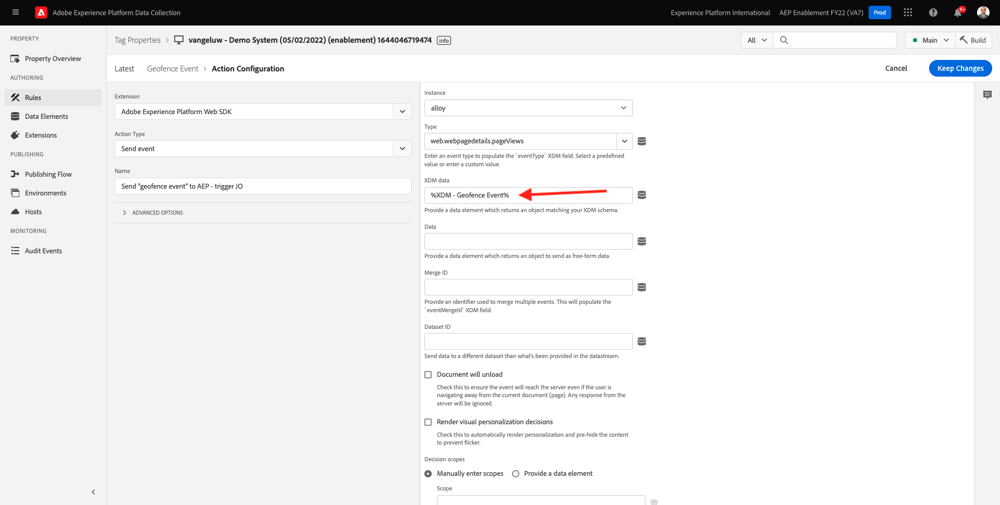
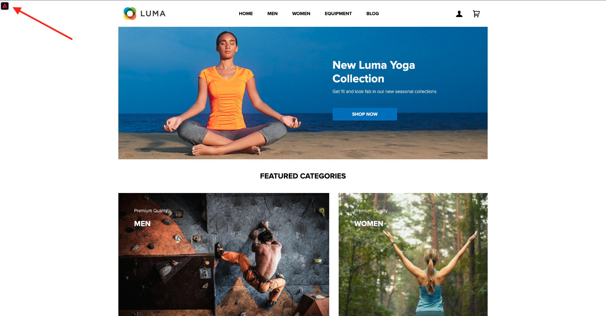
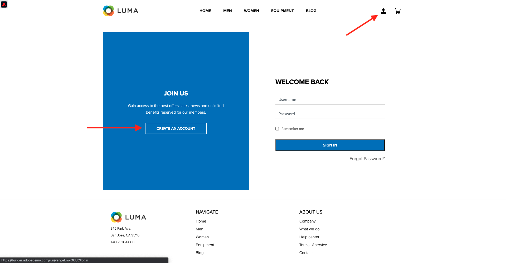

# 8.5 여정 트리거

이 연습에서는 이 모듈에서 구성한 여정을 테스트하고 트리거합니다.

## 8.5.1 지오펜스 이벤트 구성 업데이트

이동 [Adobe Experience Platform 데이터 수집](https://experience.adobe.com/launch/) 을(를) 선택합니다. **태그**.

전에 본 Adobe Experience Platform 데이터 수집 속성 페이지입니다.

모듈 0에서 데모 시스템은 두 개의 클라이언트 속성을 만들었습니다. 웹 사이트용, 모바일 앱용 및 입니다. 을 검색하여 찾습니다. `--demoProfileLdap--` 에서 **[!UICONTROL 검색]** 상자. 를 클릭하여 **웹** 속성을 사용합니다.

그러면 이게 보입니다.

왼쪽 메뉴에서 **규칙** 규칙을 검색하고 **지오펜스 이벤트**. 규칙을 클릭합니다 **지오펜스 이벤트** 열려고

그러면 이 규칙의 세부 사항이 표시됩니다. 를 클릭하여 작업을 엽니다 **AEP에 &quot;지오펜스 이벤트&quot; 보내기 - JO 트리거**.

그러면 이 작업이 트리거되면 특정 데이터 요소를 사용하여 XDM 데이터 구조를 정의합니다. 해당 데이터 요소를 업데이트해야 하며 **이벤트 ID** 다음에서 구성한 이벤트 중 [연습 8.1](./ex1.md).

이제 데이터 요소를 업데이트해야 합니다 **XDM - 지오펜스 이벤트**. 이렇게 하려면 로 이동하십시오. **데이터 요소**. 검색 대상 **XDM - 지오펜스 이벤트** 을 클릭하여 해당 데이터 요소를 엽니다.

그러면 다음 내용이 표시됩니다.

필드로 이동합니다 `_experience.campaign.orchestration.eventID`. 현재 값을 제거하고 eventID를 여기에 붙여 넣습니다.

미리 알림으로 이벤트 ID는 다음 Adobe Journey Optimizer에서 찾을 수 있습니다. **Configurations > Events** 이벤트 ID는 다음과 같은 이벤트 페이로드의 샘플 페이로드에서 확인할 수 있습니다. `"eventID": "fa42ab7982ba55f039eacec24c1e32e5c51b310c67f0fa559ab49b89b63f4934"`.

그런 다음 이 데이터 요소에서 도시를 정의해야 합니다. 이동 **placeContext > geo > city** 원하는 도시로 들어가세요 다음을 클릭합니다. **저장** 또는 **라이브러리에 저장**.

마지막으로 변경 사항을 게시해야 합니다. 이동 **게시 흐름** 왼쪽 메뉴에 있습니다.

클릭 **변경된 모든 리소스 추가** 을 클릭한 다음 **개발에 저장 및 구축**.

## 8.5.2 여정 트리거

이동 [https://builder.adobedemo.com/projects](https://builder.adobedemo.com/projects). Adobe ID으로 로그인하면 다음이 표시됩니다. 웹 사이트 프로젝트를 클릭하여 엽니다.

설정 **Screens** 페이지를 클릭한 다음 **실행**.

그러면 데모 웹 사이트가 열립니다. URL을 선택하고 클립보드에 복사합니다.

새 시크릿 브라우저 창을 엽니다.

이전 단계에서 복사한 데모 웹 사이트의 URL을 붙여넣습니다. 그런 다음 Adobe ID을 사용하여 로그인하라는 메시지가 표시됩니다.

계정 유형을 선택하고 로그인 프로세스를 완료합니다.

그러면 시크릿 브라우저 창에서 로드되는 웹 사이트가 표시됩니다. 모든 데모에서는 신선하고 시크릿 브라우저 창을 사용하여 데모 웹 사이트 URL을 로드해야 합니다.

화면 왼쪽 상단 모서리에서 Adobe 로고 아이콘을 클릭하여 프로필 뷰어를 엽니다.

를 사용하여 프로필 뷰어 패널 및 실시간 고객 프로필을 봅니다. **Experience Cloud ID** 을 현재 알 수 없는 이 고객에 대한 기본 식별자로 사용하십시오.

등록/로그인 페이지로 이동합니다. 클릭 **계정 만들기**.

세부 사항을 입력하고 **등록** 그런 다음 이전 페이지로 리디렉션됩니다.

프로필 뷰어 패널을 열고 실시간 고객 프로필로 이동합니다. 프로필 뷰어 패널에서는 새로 추가한 이메일 및 휴대폰 식별자와 같이 모든 개인 데이터가 표시됩니다.

프로필 뷰어 패널에서 **유틸리티**. Enter 키 `geofenceevent` 을(를) 클릭합니다. **보내기**.

몇 초 후에 Adobe Journey Optimizer에서 SMS를 받게 됩니다.

다음 단계: [요약 및 이점](./summary.md)

[모듈 8로 돌아가기](journey-orchestration-external-weather-api-sms.md)

[모든 모듈로 돌아가기](../../overview.md)
