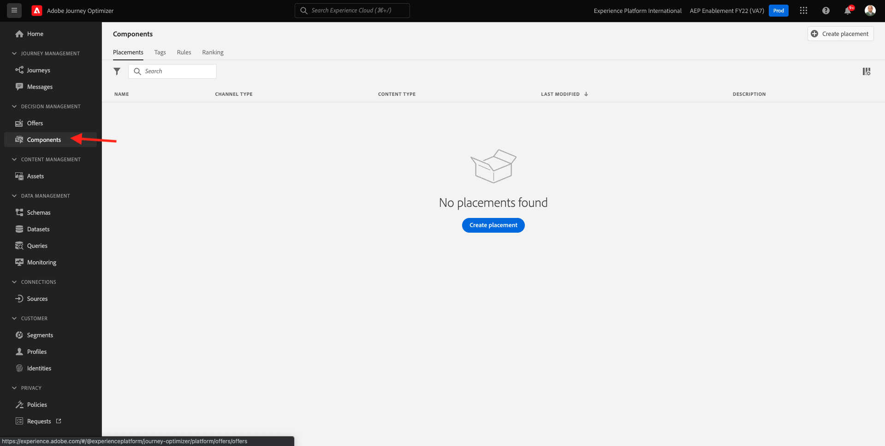

# 9.1 Offer decisioning 101

## 9.1.1 용어

offer decisioning에 대해 더 잘 이해하려면 를 읽는 것이 좋습니다 [개요](https://experienceleague.adobe.com/docs/journey-optimizer/using/offer-decisioniong/get-started-decision/starting-offer-decisioning.html?lang=en) offer decisioning 애플리케이션 서비스가 Adobe Experience Platform과 작동하는 방식에 대해 알아봅니다.

offer decisioning을 사용하여 작업하려면 다음 개념을 이해해야 합니다.

| 용어 | 설명 |
| ------------------------- | -------------------------------------------------------------------------------------------------------------------------------------------------------------------------------------------------------------------------------------------------------- |
| **오퍼** | 오퍼는 오퍼를 볼 수 있는 사용자를 지정하는 규칙과 연관된 규칙이 있을 수 있는 마케팅 메시지입니다. 오퍼의 상태는 다음과 같습니다. 초안, 승인 또는 보관 |
| **배치** | 최종 사용자에 대해 오퍼가 표시되는 위치(또는 채널 유형)와 컨텍스트(또는 컨텐츠 유형)의 조합입니다. 효과적으로 모바일, 웹, 소셜, 인스턴트 메시징 및 비디지털 채널의 텍스트, HTML, 이미지, JSON의 조합입니다. |
| **규칙** | 오퍼에 대한 최종 사용자의 자격을 정의하고 제어하는 로직입니다. |
| **개인화된 오퍼** | 자격 규칙 및 제한을 기반으로 한 사용자 지정 가능한 마케팅 메시지. |
| **대체 오퍼** | 최종 사용자가 사용된 컬렉션의 오퍼에 적합하지 않을 때 표시되는 기본 오퍼입니다. |
| **최대 가용량** | 오퍼를 총 및 특정 사용자에게 제공할 수 있는 횟수를 정의하는 데 오퍼 정의에 사용됩니다. |
| **우선 순위** | 결과 집합 오퍼에서 우선순위 등급을 결정하는 수준입니다. |
| **컬렉션** | offer decisioning 프로세스를 빠르게 하기 위해 개인화된 오퍼 목록에서 오퍼 하위 세트를 필터링하는 데 사용됩니다. |
| **결정** | 마케팅 담당자는 결정 엔진이 최상의 오퍼를 제공하고자 하는 오퍼, 배치 및 프로필 세트를 결합합니다. |
| **AEM Assets 기본 사항** | Adobe Experience Cloud 솔루션 및 Adobe Experience Platform에서 자산을 저장, 검색 및 선택할 수 있는 범용 및 중앙 집중식 경험입니다. |

{style=&quot;table-layout:auto&quot;}

## 9.1.2 Offer decisioning

다음 위치로 이동하여 Adobe Journey Optimizer에 로그인합니다 [Adobe Experience Cloud](https://experience.adobe.com). 클릭 **Journey Optimizer**.

으로 리디렉션됩니다. **홈**  Journey Optimizer에서 보기. 먼저 올바른 샌드박스를 사용하고 있는지 확인하십시오. 사용할 샌드박스를 이라고 합니다 `--aepSandboxId--`. 한 샌드박스에서 다른 샌드박스로 변경하려면 **프로덕션 제품(VA7)** 및 목록에서 샌드박스를 선택합니다. 이 예제에서 샌드박스의 이름은 다음과 같습니다 **AEP Enablement FY22**. 그러면 **홈** 샌드박스 보기 `--aepSandboxId--`.

왼쪽 메뉴에서 **오퍼**. 이제 오퍼, 컬렉션 및 의사 결정 등의 내용이 포함된 오퍼 메뉴가 표시됩니다.

클릭 **구성 요소**. 이제 배치, 태그, 규칙 및 등급과 같은 항목이 포함된 오퍼 메뉴가 표시됩니다.

## 9.1.3 배치

이동 **배치**.

에서 **배치** 탭에서 오퍼에 대한 배치를 정의할 수 있습니다. 결정을 정의할 때 배치에서 결과 오퍼가 나타날 위치(채널 유형)와 어떤 모양 또는 양식(컨텐츠 유형)을 정의합니다.

Adobe Experience Platform 인스턴스에 배치가 표시되지 않는 경우 아래 표시된 대로 만들고 스크린샷에 만드십시오.

| 이름 | 채널 유형 | 콘텐츠 유형 |
| ---------------------- | ------------ | ------------ |
| **비디지털 - 텍스트** | 비디지털 | 텍스트 |
| **웹 - JSON** | 웹 | JSON |
| **웹 - HTML** | 웹 | HTML |
| **웹 - 텍스트** | 웹 | 텍스트 |
| **웹 - 이미지** | 웹 | 이미지 |
| **이메일 - JSON** | 이메일 | JSON |
| **이메일 - HTML** | 이메일 | HTML |
| **이메일 - 텍스트** | 이메일 | 텍스트 |
| **이메일 - 이미지** | 이메일 | 이미지 |

{style=&quot;table-layout:auto&quot;}

**참고**: 이미 사용 가능한 배치를 변경하지 마십시오.

배치를 클릭하여 해당 설정을 시각화합니다.

이제 배치의 모든 필드가 표시됩니다.

- **이름** 배치
- **게재위치 ID**
- **채널 유형** 배치
- **컨텐츠 유형** 배치(Placement)에 대해 **텍스트**, **HTML**, **이미지** 또는 **JSON**
- **설명** 배치에 대한 설명을 추가할 수 있는 필드

## 9.1.4 의사 결정 규칙

규칙(자격 규칙이라고도 함)은 **세그먼트**. 규칙 은 Adobe Experience Platform의 프로필에 최상의 오퍼를 제공하기 위해 오퍼와 함께 규칙을 사용할 수 있다는 유일한 차이로 세그먼트 자체입니다.

이전 지원 모듈을 기반으로 세그먼트를 정의하는 방법을 이미 알고 있으므로 세그멘테이션 환경을 빠르게 다시 살펴보겠습니다.

이동 **규칙**. 클릭 **+ 규칙 만들기**.

그러면 Adobe Experience Platform의 세그먼테이션 환경이 표시됩니다.

이제 실시간 고객 프로필에 대한 결합 스키마의 일부인 모든 필드에 액세스하여 모든 규칙을 작성할 수 있습니다.

Adobe Experience Platform에서 이미 정의된 세그먼트를 **대상** > ``--aepTenantIdSchema--``.

그러면 다음 내용이 표시됩니다.

원할 경우 이제 고유한 규칙을 구성할 수 있습니다. 이 연습에는 두 가지 규칙이 필요합니다.

- 모두 - 남성 고객
- 모두 - 여성 고객

이러한 규칙이 아직 존재하지 않는 경우 만드십시오. 규칙이 이미 존재하는 경우 해당 규칙을 사용하고 새 규칙을 만들지 마십시오.

규칙을 만드는 데 사용할 속성은 다음과 같습니다 **XDM 개별 프로필** > **개인** > **성별**.

예를 들어, 규칙에 대한 규칙 정의는 다음과 같습니다 **모두 - 남성 고객**:

예를 들어, 규칙에 대한 규칙 정의는 다음과 같습니다 **모두 - 여성 고객**:

## 9.1.5 오퍼

이동 **오퍼** 을(를) 선택합니다. **오퍼**. 클릭 **+ 오퍼 만들기**.

그러면 이 팝업이 표시됩니다.

지금 오퍼를 만들지 마십시오. 다음 연습에서 오퍼를 수행합니다.

이제 두 가지 유형의 오퍼가 있습니다.

- 개인화된 오퍼
- 대체 오퍼

개인화된 오퍼는 특정 상황에서 표시되어야 하는 특정 콘텐츠입니다. 개인화된 오퍼는 특정 기준이 충족되는 경우 개인적이고 상황에 맞는 경험을 제공하기 위해 특별히 빌드되었습니다.

대체 오퍼는 개인화된 오퍼에 대한 기준이 충족되지 않은 경우 표시되는 오퍼입니다.

## 9.1.6 결정

이 결정은 우선 순위, 자격 제한 및 총 / 사용자 캡핑과 같은 개별 개인화된 오퍼 특성을 기반으로 특정 프로필에 대한 최상의 오퍼를 찾기 위해 Offer decisioning 엔진에서 궁극적으로 사용할 배치, 개인화된 오퍼 컬렉션 및 대체 오퍼를 결합합니다.

를 구성하려면 **결정**&#x200B;를 클릭합니다. **결정**.

다음 연습에서는 고유한 오퍼와 결정을 구성합니다.

다음 단계: [9.2 오퍼 및 결정 구성](./ex2.md)

[모듈 9로 돌아가기](./offer-decisioning.md)

[모든 모듈로 돌아가기](./../../overview.md)
