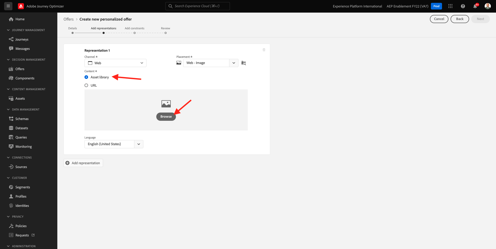
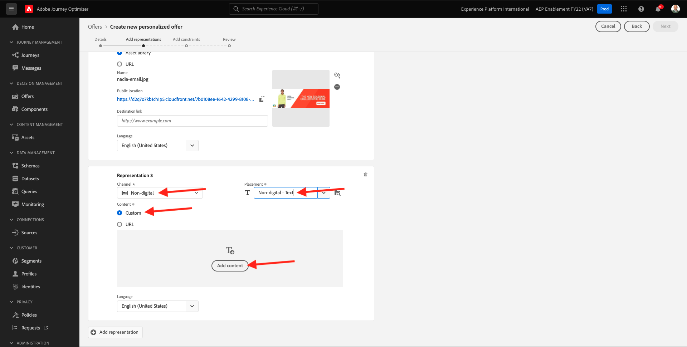
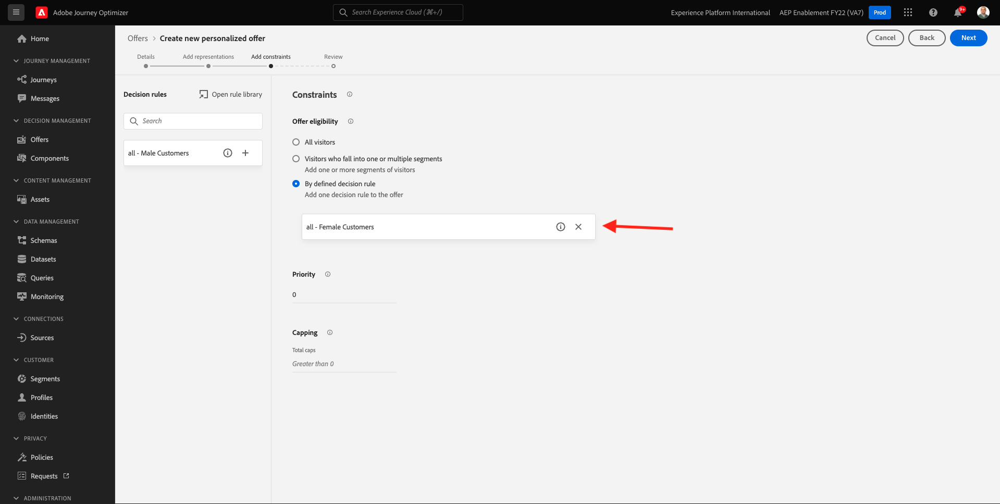
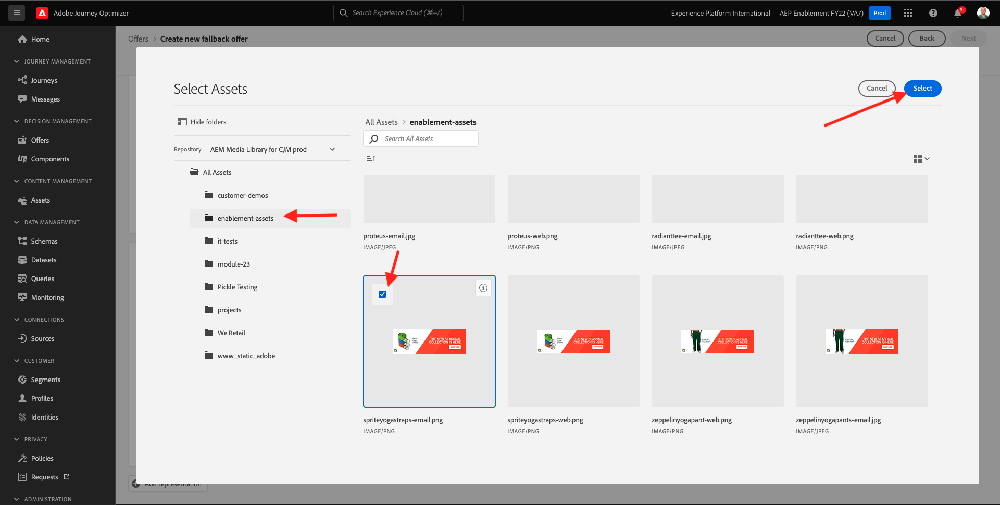
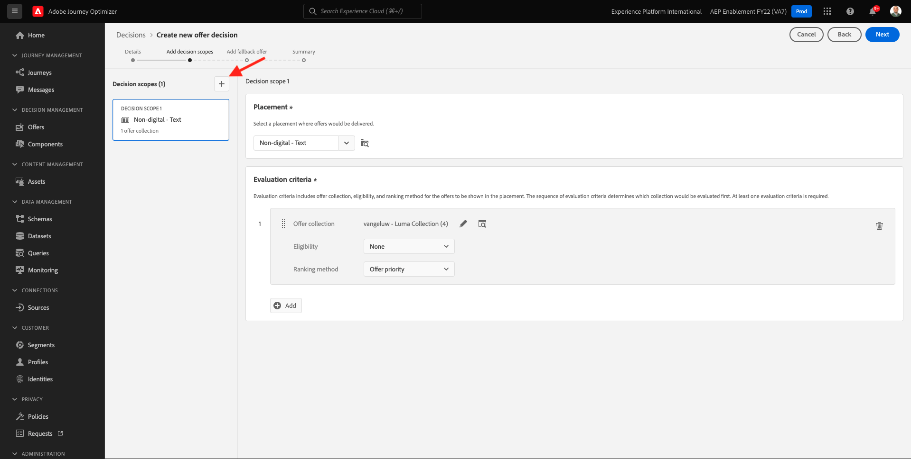
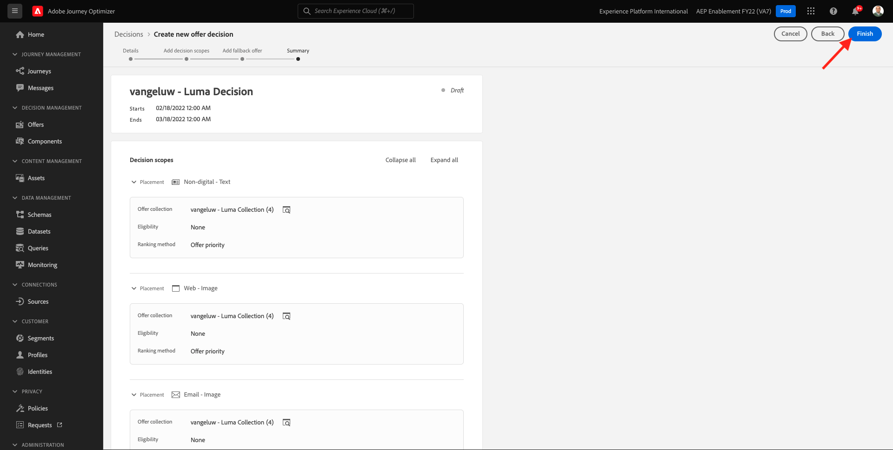

# 9.2 오퍼 및 결정 구성

## 9.2.1 개인화된 오퍼 만들기

이 연습에서는 네 개의 **개인화된 오퍼**. 이러한 오퍼를 만들 때 고려해야 할 세부 사항은 다음과 같습니다.

| 이름 | 날짜 범위 | 이메일에 대한 이미지 링크 | 웹용 이미지 링크 | 텍스트 | 우선 순위 | 자격 | 언어 |
|-----|------------|----------------------|--------------------|------|:--------:|--------------|:-------:|
| `--demoProfileLdap-- - Nadia Elements Shell` | 오늘 - 1개월 후 | https://bit.ly/3nPiwdZ | https://bit.ly/2INwXjt | `{{ profile.person.name.firstName }}, 10% discount on Nadia Elements Shell` | 25 | 모두 - 여성 고객 | 영어(미국) |
| `--demoProfileLdap-- - Radiant Tee` | 오늘 - 1개월 후 | https://bit.ly/2HfA17v | https://bit.ly/3pEIdzn | `{{ profile.person.name.firstName }}, 5% discount on Radiant Tee` | 15 | 모두 - 여성 고객 | 영어(미국) |
| `--demoProfileLdap-- - Zeppelin Yoga Pant` | 오늘 - 1개월 후 | https://bit.ly/2IOaItW | https://bit.ly/2INZHZd | `{{ profile.person.name.firstName }}, 10% discount on Zeppelin Yoga Pant` | 25년 | 모두 - 남성 고객 | 영어(미국) |
| `--demoProfileLdap-- - Proteus Fitness Jackshirt` | 오늘 - 1개월 후 | https://bit.ly/330a43n | https://bit.ly/36USaQW | `{{ profile.person.name.firstName }}, 5% discount on Proteus Fitness Jackshirt` | 15 | 모두 - 남성 고객 | 영어(미국) |

{style=&quot;table-layout:auto&quot;}

다음 위치로 이동하여 Adobe Journey Optimizer에 로그인합니다 [Adobe Experience Cloud](https://experience.adobe.com). 클릭 **Journey Optimizer**.

으로 리디렉션됩니다. **홈**  Journey Optimizer에서 보기. 먼저 올바른 샌드박스를 사용하고 있는지 확인하십시오. 사용할 샌드박스를 이라고 합니다 `--aepSandboxId--`. 한 샌드박스에서 다른 샌드박스로 변경하려면 **프로덕션 제품(VA7)** 및 목록에서 샌드박스를 선택합니다. 이 예제에서 샌드박스의 이름은 다음과 같습니다 **AEP Enablement FY22**. 그러면 **홈** 샌드박스 보기 `--aepSandboxId--`.

왼쪽 메뉴에서 **오퍼** 그리고 나서 **오퍼**. 클릭 **+ 오퍼 만들기**.

그러면 이 팝업이 표시됩니다. 선택 **개인화된 오퍼** 을(를) 클릭합니다. **다음**.

이제 **세부 사항** 보기.

이 경우 오퍼를 구성해야 합니다 `--demoProfileLdap-- - Nadia Elements Shell`. 위의 표에 있는 정보를 사용하여 필드를 채웁니다. 이 예에서 개인화된 오퍼의 이름은 입니다 **vangeluw - 나디아 요소 셸**. 또한, **시작 날짜 및 시간** 를 어제 로 설정하고 **종료 날짜 및 시간** 지금부터 한달 후에 날짜로.

일단 해드리면 됩니다 **다음**&#x200B;을 클릭합니다.

이제 다음을 만들어야 합니다 **표현**. 표현은 **배치** 그리고 진짜 자산.

대상 **표시 1**, 다음을 선택합니다.

- 채널: 웹
- 배치: 웹 - 이미지
- 컨텐츠: URL
- 공용 위치: 열에서 URL 복사 **웹용 이미지 링크** 위 표에서

또는 다음을 선택할 수 있습니다 **자산 라이브러리** 에 대해 을 클릭한 다음 **찾아보기**.

그러면 자산 라이브러리의 팝업이 표시되면 폴더로 이동합니다 **enablement-assets** 이미지 파일을 선택하고 **nadia-web.png**. 그런 다음 **선택**.

그러면 다음 내용이 표시됩니다.

클릭 **+ 표현 추가**.

대상 **표시 2**, 다음을 선택합니다.

- 채널: 이메일
- 배치: 이메일 - 이미지
- 컨텐츠: URL
- 공용 위치: 열에서 URL 복사 **이메일에 대한 이미지 링크** 위 표에서

또는 다음을 선택할 수 있습니다 **자산 라이브러리** 에 대해 을 클릭한 다음 **찾아보기**.

그러면 자산 라이브러리의 팝업이 표시되면 폴더로 이동합니다 **enablement-assets** 이미지 파일을 선택하고 **nadia-email.png**. 그런 다음 **선택**.

그러면 다음 내용이 표시됩니다.

다음을 클릭합니다. **+ 표현 추가**.

대상 **표시 3**, 다음을 선택합니다.

- 채널: 비디지털
- 배치: 비디지털 - 텍스트

다음으로, 컨텐츠를 추가해야 합니다. 이 경우 이는 작업 호출로 사용할 텍스트를 추가하는 것을 의미합니다.

클릭 **컨텐츠 추가**.

그러면 이 팝업이 표시됩니다.

선택 **사용자 정의 텍스트** 다음 필드를 채웁니다.

을(를) 봅니다. **텍스트** 위의 표에서 필드를 작성하고 이 경우 해당 텍스트를 여기에 입력합니다. `{{ profile.person.name.firstName }}, 10% discount on Nadia Elements Shell`.

프로필 속성을 선택하여 오퍼 텍스트에 동적 필드로 포함할 수도 있습니다. 이 예제에서는 필드를 추가합니다 `{{ profile.person.name.firstName }}` 은 이 오퍼를 받을 고객의 이름이 오퍼 텍스트에 포함되도록 합니다.

그러면 이게 보입니다. **저장**&#x200B;을 클릭합니다.

이제 이걸 가지고 있습니다. **다음**&#x200B;을 클릭합니다.

그러면 다음 내용이 표시됩니다.

선택 **정의된 의사 결정 규칙에 의해** 을 클릭하고 **+** 아이콘을 사용하여 규칙 추가 **모두 - 여성 고객**.

그러면 이게 보입니다. 을(를) 입력합니다. **우선순위** 위 표에 표시된 대로. **다음**&#x200B;을 클릭합니다.

그러면 새 버전에 대한 개요를 볼 수 있습니다 **개인화된 오퍼**.

마지막으로 **저장 및 승인**.

그러면 새로 만든 개인화된 오퍼를 오퍼 개요에서 사용할 수 있게 됩니다.

복사티, 제플린 요가 판트, 프로테우스 피트니스 자크셔츠 등 다양한 상품을 위한 3가지 맞춤형 오퍼를 만들려면 위의 단계를 반복합니다.

완료되면 **오퍼 개요** 화면 **개인화된 오퍼** 모든 오퍼를 표시해야 합니다.

## 9.2.2 대체 오퍼 만들기

이제 4개의 개인화된 오퍼를 만든 후, **대체 오퍼**.

에 있는지 확인하십시오. **오퍼** 보기:

클릭 **+ 오퍼 만들기**.

그러면 이 팝업이 표시됩니다. 선택 **대체 오퍼** 을(를) 클릭합니다. **다음**.

그러면 다음 내용이 표시됩니다.

대체 오퍼에 대해 이 이름을 입력합니다. `--demoProfileLdap-- - Luma Fallback Offer`. **다음**&#x200B;을 클릭합니다.

이제 다음을 만들어야 합니다 **표현**. 표현은 **배치** 그리고 진짜 자산.

대상 **표시 1**, 다음을 선택합니다.

- 채널: 웹
- 배치: 웹 - 이미지
- 컨텐츠: URL
- 공용 위치: `https://bit.ly/3nBOt9h`

또는 다음을 선택할 수 있습니다 **자산 라이브러리** 에 대해 을 클릭한 다음 **찾아보기**.

그러면 자산 라이브러리의 팝업이 표시되면 폴더로 이동합니다 **enablement-assets** 이미지 파일을 선택하고 **spriteyosaps.web.png**. 그런 다음 **선택**.

그러면 다음 내용이 표시됩니다.

대상 **표시 2**, 다음을 선택합니다.

- 채널: 이메일
- 배치: 이메일 - 이미지
- 컨텐츠: URL
- 공용 위치: `https://bit.ly/3nF4qvE`

또는 다음을 선택할 수 있습니다 **자산 라이브러리** 에 대해 을 클릭한 다음 **찾아보기**.

그러면 자산 라이브러리의 팝업이 표시되면 폴더로 이동합니다 **enablement-assets** 이미지 파일을 선택하고 **spriteyoguraps-email.png**. 그런 다음 **선택**.

그러면 다음 내용이 표시됩니다.

다음을 클릭합니다. **+ 표현 추가**.

대상 **표시 3**, 다음을 선택합니다.

- 채널: 비디지털
- 배치: 비디지털 - 텍스트

다음으로, 컨텐츠를 추가해야 합니다. 이 경우 이는 이미지 링크를 추가하는 것을 의미합니다.

클릭 **컨텐츠 추가**.

그러면 이 팝업이 표시됩니다.

선택 **사용자 정의 텍스트** 다음 필드를 채웁니다.

텍스트 입력 `{{ profile.person.name.firstName }}, discover our Sprite Yoga Straps!` 을(를) 클릭합니다. **저장**.

그러면 이게 보입니다. **다음**&#x200B;을 클릭합니다.

그러면 새 버전에 대한 개요를 볼 수 있습니다 **대체 오퍼**. **마침을 클릭합니다**.

마지막으로 **저장 및 승인**.

사용자 **오퍼 개요** 화면에 다음이 표시됩니다.

## 9.2.3 컬렉션 만들기

컬렉션은 **필터** 개인화된 오퍼 목록에서 하위 오퍼 세트를 추출하여 결정 프로세스의 일부로 사용하여 결정 프로세스를 가속화합니다.

이동 **컬렉션**. 클릭 **+ 컬렉션 만들기**.

그러면 이 팝업이 표시됩니다. 다음과 같이 컬렉션을 구성합니다. **다음**&#x200B;을 클릭합니다.

- 컬렉션 이름: 사용 `--demoProfileLdap-- - Luma Collection`
- 선택 **정적 컬렉션 만들기**.

다음 화면에서 네 개를 선택합니다 **개인화된 오퍼** 이전 연습에서 작성했습니다. **저장**&#x200B;을 클릭합니다.

이제 다음을 확인할 수 있습니다.

## 9.2.4 결정 만들기

이 결정은 우선 순위, 자격 제한 및 총 / 사용자 캡핑과 같은 개별 개인화된 오퍼 특성을 기반으로 특정 프로필에 대한 최상의 오퍼를 찾기 위해 Offer decisioning 엔진에서 궁극적으로 사용할 배치, 개인화된 오퍼 수집 및 대체 오퍼를 결합합니다.

를 구성하려면 **결정**, 이동 **결정**. 클릭 **+ 활동 만들기**.

그러면 다음 내용이 표시됩니다.

다음과 같은 필드를 채웁니다. **다음**&#x200B;을 클릭합니다.

- 이름: `--demoProfileLdap-- - Luma Decision`
- 시작 날짜 및 시간: 어제
- 종료 날짜 및 시간: 오늘 + 1개월

다음 화면에서 결정 범위에 배치를 추가해야 합니다. 배치에 대한 결정 범위를 만들어야 합니다 **웹 - 이미지**, **이메일 - 이미지** 및 **비디지털 - 텍스트**.

먼저 **비디지털 - 텍스트** 을 클릭하여 드롭다운에서 해당 배치를 선택합니다. 그런 다음 **추가** 평가 기준을 추가하는 단추.

컬렉션 선택 `--demoProfileLdap-- - Luma Collection` 을(를) 클릭합니다. **추가**.

그러면 이게 보입니다. 을(를) 클릭합니다. **-** 새 결정 범위를 추가하는 단추.

배치를 선택합니다 **웹 - 이미지** 컬렉션 추가 `--demoProfileLdap-- - Luma Collection` 평가 기준 아래에 있습니다. 그런 다음 **+** 다시 단추를 클릭하여 새 결정 범위를 추가합니다.

배치를 선택합니다 **이메일 - 이미지** 컬렉션 추가 `--demoProfileLdap-- - Luma Collection` 평가 기준 아래에 있습니다. 그런 다음 **다음**.

이제 을(를) 선택해야 합니다 **대체 오퍼**: `--demoProfileLdap-- - Luma Fallback Offer`. **다음**&#x200B;을 클릭합니다.

결정을 검토합니다. **마침을 클릭합니다**.

팝업에서 **저장 및 활성화**.

그리고 마지막으로, 이제 개요에서 사용자의 결정을 확인할 수 있습니다.

이제 결정을 구성했습니다. 이제 이러한 결정은 실시간으로 고객에게 최적화된 개인화된 오퍼를 전달하는 데 사용할 수 있습니다.

다음 단계: [9.3 Offer decisioning을 위해 데이터 수집 클라이언트 속성 및 Web SDK 설정 준비](./ex3.md)

[모듈 9로 돌아가기](./offer-decisioning.md)

[모든 모듈로 돌아가기](./../../overview.md)
