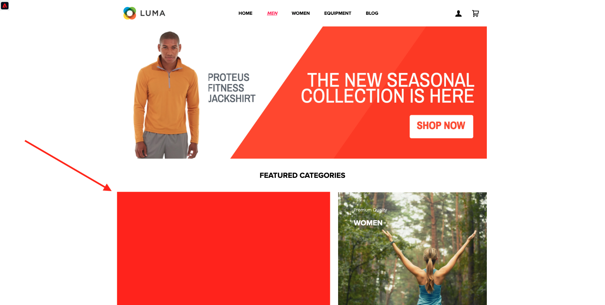
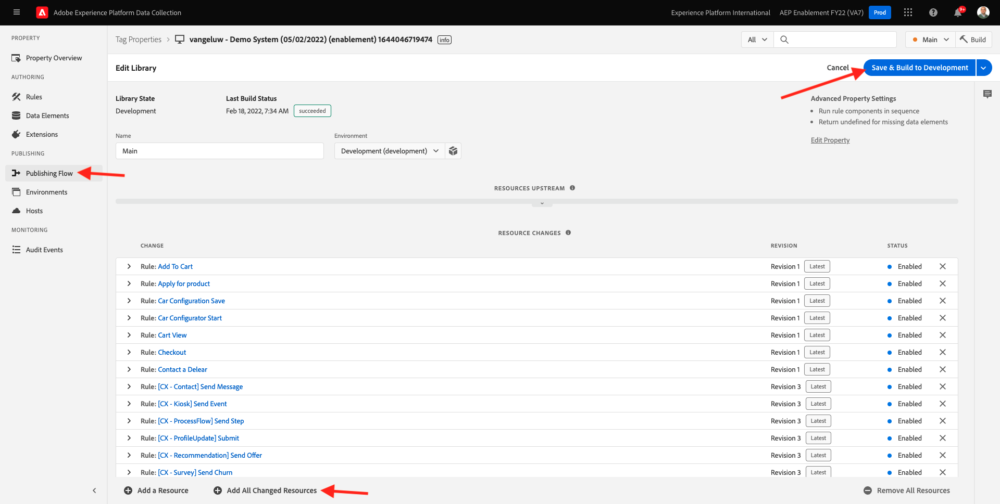
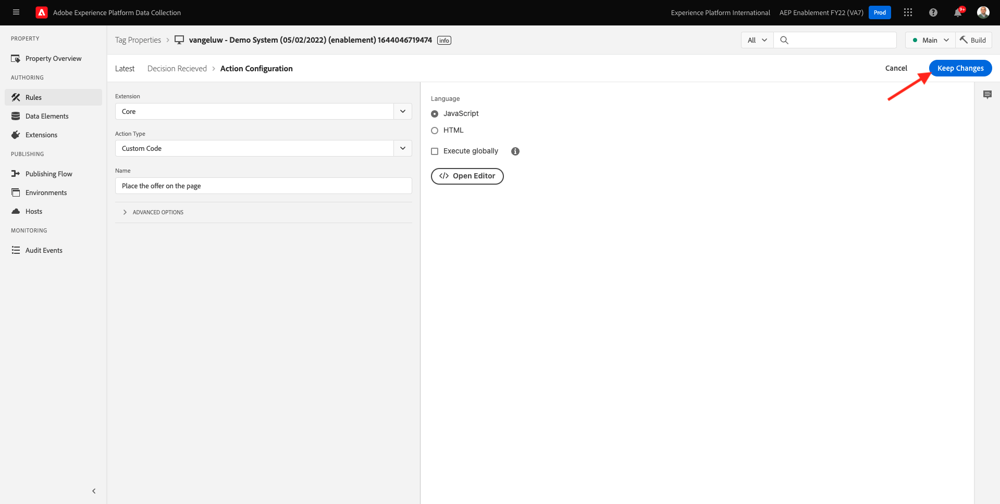
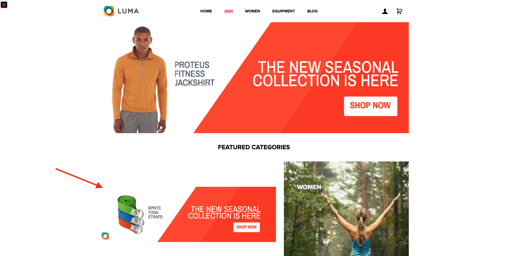

# 9.3 Adobe Experience Platform 데이터 수집 클라이언트 속성 및 웹 SDK 설정을 Offer decisioning 준비

>[!NOTE]
>
>Adobe Experience Platform Web SDK에서 Offer decisioning을 사용하면 현재 사용자를 선택하기 위해 일찍 액세스할 수 있습니다. 모든 IMS 조직에서는 이 기능을 사용할 수 없습니다.

## 9.3.1 데이터 스트림 업데이트

in [연습 0.2](./../../modules/module0/ex2.md)를 직접 만들었습니다 **[!UICONTROL 데이터 스트림]**. 그런 다음 이름을 사용했습니다 `--demoProfileLdap-- - Demo System Datastream`.

이 연습에서는 다음을 구성해야 합니다 **[!UICONTROL 데이터 스트림]** 다음으로 작업 **[!DNL Offer Decisioning]**.

이렇게 하려면 다음 위치로 이동하십시오. [https://experience.adobe.com/#/data-collection/](https://experience.adobe.com/#/data-collection/). 그러면 이게 보입니다. 클릭 **[!UICONTROL 데이터 스트림]** 또는 **[!UICONTROL 데이터 스트림(베타)]**.

화면의 오른쪽 상단 모서리에서 샌드박스 이름을 선택합니다. 샌드박스 이름은 다음과 같습니다. `--aepSandboxId--`.


을 검색합니다. **[!UICONTROL 데이터 스트림]**: `--demoProfileLdap-- - Demo System Datastream`. 을(를) 클릭합니다. **[!UICONTROL 데이터 스트림]** 열려고


그러면 이게 보입니다. 클릭 **...** 다음 **Adobe Experience Platform** 을 클릭한 다음 **편집**.


활성화하려면 **[!DNL Offer Decisioning]**&#x200B;에 대해 상자를 선택합니다. **[!DNL Offer Decisioning]**. **저장**&#x200B;을 클릭합니다.


사용자 **[!UICONTROL 데이터 스트림]** 이제 을(를) 사용하여 작업할 준비가 되었습니다. **[!DNL Offer Decisioning]**.


## 9.3.2 개인화된 오퍼를 요청하도록 Adobe Experience Platform 데이터 수집 클라이언트 속성을 구성합니다

이동 [https://experience.adobe.com/#/data-collection/](https://experience.adobe.com/#/data-collection/)에 대해 **[!UICONTROL 클라이언트]**. 이름이 인 데이터 수집 속성을 검색합니다 `--demoProfileLdap-- - Demo System (DD/MM/YYYY)`. 웹용 데이터 수집 클라이언트 속성을 엽니다.


속성에서 다음 위치로 이동합니다. **[!UICONTROL 규칙]** 규칙을 열고 **[!UICONTROL 페이지 보기]**.


를 클릭하여 [!UICONTROL 작업] **[!UICONTROL AEP 웹 SDK - 이벤트 보내기]**.


그러면 이게 보입니다. 다음 메뉴 옵션을 볼 수 있습니다. **[!UICONTROL 결정 범위]**.


에지 및 Adobe Experience Platform으로 전송되는 모든 요청에 대해 하나 이상을 제공할 수 있습니다 **[!UICONTROL 결정 범위]**. A **[!UICONTROL 결정 범위]** 는 두 요소의 조합입니다.

- [!UICONTROL 의사 결정 ID]
- [!UICONTROL 게재위치 ID]

먼저 이 두 요소를 찾을 수 있는 위치를 살펴보겠습니다.

### 9.3.2.1 검색 [!UICONTROL 배치 ID]

다음 [!UICONTROL 배치 ID] 필요한 자산의 위치 및 유형을 식별합니다. 예를 들어, Luma 웹 사이트 홈 페이지의 영웅 이미지는 [!UICONTROL 배치 ID] 대상 [!UICONTROL 웹 - 이미지].

>[!NOTE]
>
>모듈 6의 일부로, 스크린샷에서 볼 수 있듯이 홈페이지 상의 영웅 위치 이미지를 변경하는 Adobe Target 경험 타깃팅 활동을 이미 구성했습니다. 이제 연습을 위해 스크린샷에 표시된 대로 히어로 이미지 아래의 이미지에 오퍼가 표시되도록 합니다.



를 찾으려면 [!UICONTROL 배치 ID] 대상 [!UICONTROL 웹 - 이미지] 으로 이동하여 Adobe Journey Optimizer으로 이동합니다. [Adobe Experience Cloud](https://experience.adobe.com). 클릭 **Journey Optimizer**.


으로 리디렉션됩니다. **홈**  Journey Optimizer에서 보기. 먼저 올바른 샌드박스를 사용하고 있는지 확인하십시오. 사용할 샌드박스를 이라고 합니다 `--aepSandboxId--`. 한 샌드박스에서 다른 샌드박스로 변경하려면 **프로덕션 제품(VA7)** 및 목록에서 샌드박스를 선택합니다. 이 예제에서 샌드박스의 이름은 다음과 같습니다 **AEP Enablement FY22**. 그러면 **홈** 샌드박스 보기 `--aepSandboxId--`.


다음으로 이동 [!UICONTROL 구성 요소] 그리고 [!UICONTROL 배치]. 을(를) 클릭합니다. [!UICONTROL 웹 - 이미지] 세부 사항을 보기 위한 배치.


위의 이미지에서 볼 수 있듯이 이 예제에서는 [!UICONTROL 배치 ID] is `xcore:offer-placement:14bf09dc4190ebba`. 다음 내용을 적어 두십시오 [!UICONTROL 배치 ID] 배치 [!UICONTROL 웹 - 이미지] 다음 연습에서는 필요하실 거예요

### 9.3.2.2 검색 [!UICONTROL 의사 결정 ID]

다음 [!UICONTROL 의사 결정 ID] 은 사용하려는 개인화된 오퍼와 대체 오퍼의 조합을 식별합니다. 이전 연습에서는 직접 만들었습니다 [!UICONTROL 결정] 이름을 지정해서 `--demoProfileLdap-- - Luma Decision`.

를 찾으려면 [!UICONTROL 의사 결정 ID] 에 대해 `--demoProfileLdap-- - Luma Decision`, 이동 [https://platform.adobe.com](https://platform.adobe.com).

다음으로 이동 [!UICONTROL 오퍼] 그리고 나서 [!UICONTROL 결정]. 을(를) 클릭하여 선택합니다 [!UICONTROL 결정]: `--demoProfileLdap-- - Luma Decision`.


위의 이미지에서 볼 수 있듯이 이 예제에서는 [!UICONTROL 의사 결정 ID] is `xcore:offer-activity:14c052382e1b6505`. 다음 내용을 적어 두십시오 [!UICONTROL 의사 결정 ID] 결정을 내리기 위해 `--demoProfileLdap-- - Luma Decision` 다음 연습에서는 필요하실 거예요

이제 두 요소를 검색했으므로 **[!UICONTROL 결정 범위]**&#x200B;를 누르고 다음 단계를 계속하여 결정 범위를 인코딩할 수 있습니다.

### 9.3.2.3 BASE64 인코딩

다음 **[!UICONTROL 결정 범위]** BASE64로 인코딩된 문자열을 입력해야 합니다. 이 BASE64로 인코딩된 문자열은 [!UICONTROL 배치 ID] 그리고 [!UICONTROL 의사 결정 ID]아래에 표시된 것처럼 Null 포인터 예외가 발생합니다.

```json
{
  "activityId":"xcore:offer-activity:14c052382e1b6505",
  "placementId":"xcore:offer-placement:14bf09dc4190ebba"
}
```

다음 **[!UICONTROL 결정 범위]** 는 다음 두 가지 방법으로 생성할 수 있습니다.

- 다음과 같은 공용 서비스 사용 [https://www.base64encode.org/](https://www.base64encode.org/). 위에 언급된 대로 JSON 코드를 입력하고 를 클릭합니다. **[!UICONTROL 인코딩]** 아래에 BASE64로 인코딩된 문자열을 가져옵니다.

   

- Adobe Experience Platform에서 BASE64 인코딩 문자열을 검색합니다. 이동 [!UICONTROL 결정] 을(를) 클릭하여 [!UICONTROL 결정]: `--demoProfileLdap-- - Luma Decision`.

   

   열기 후 `--demoProfileLdap-- - Luma Decision`이 그림이 표시됩니다. 배치를 찾습니다 [!UICONTROL 웹 - 이미지] 을 클릭하고 **[!UICONTROL 복사]** 버튼을 클릭합니다. 다음을 클릭합니다. **[!UICONTROL 인코딩 결정 범위]**. 다음 **[!UICONTROL 결정 범위]** 이제 가 클립보드에 복사됩니다.

   

다음으로, Launch로 돌아가서 작업을 수행합니다 **[!UICONTROL AEP 웹 SDK - 이벤트 보내기]**.


인코딩된 결정 범위를 입력 필드에 붙여넣습니다.


작업에 변경 사항을 저장합니다 **[!UICONTROL AEP 웹 SDK - 이벤트 보내기]** 를 클릭합니다. **[!UICONTROL 변경 내용 유지]**.


다음을 클릭합니다. **[!UICONTROL 저장]** 또는 **[!UICONTROL 라이브러리에 저장]**


Adobe Experience Platform 데이터 수집에서 **[!UICONTROL 게시 흐름]** 열어서 **[!UICONTROL 개발 라이브러리]** 이름 지정 **[!UICONTROL 기본]**. 클릭 **[!UICONTROL + 변경된 모든 리소스 추가]** 을 클릭한 다음 **[!UICONTROL 개발을 위한 저장 및 구축]**. 이제 변경 사항이 데모 웹 사이트에 게시됩니다.



로드할 때마다 **일반 사항 페이지** 이제, 예를 들어 데모 웹 사이트의 홈 페이지와 같이 Offer decisioning은 해당 오퍼가 무엇인지 평가하고 표시할 오퍼의 세부 정보가 있는 응답을 웹 사이트로 다시 반환합니다. 웹 사이트에 오퍼를 표시하려면 추가 구성이 필요합니다. 이 작업은 다음 단계에서 수행합니다.

## 9.3.3 개인화된 오퍼를 받고 적용할 Adobe Experience Platform 데이터 수집 클라이언트 속성을 구성합니다

이동 [https://experience.adobe.com/#/data-collection/](https://experience.adobe.com/#/data-collection/)에 대해 **[!UICONTROL 속성]**. 이름이 인 데이터 수집 속성을 검색합니다 `--demoProfileLdap-- - Demo System (DD/MM/YYYY)`. 웹용 데이터 수집 속성을 엽니다.


속성에서 다음 위치로 이동합니다. **[!UICONTROL 규칙]**.


규칙을 검색하고 엽니다. **결정 수신**.


그러면 이게 보입니다. 작업을 엽니다. **페이지에 오퍼 배치**.


**[!UICONTROL Open Editor]**&#x200B;를 클릭합니다.


편집기에서 아래 코드를 붙여넣어 코드를 덮어씁니다.

```javascript
if(!Array.isArray(event.decisions)) {
  console.log('No decisions returned')
  return;
}
console.log("decision",event.decisions)

event.decisions.forEach(function(payload) {
  payload.items.forEach(function(item){
    console.log("Response from Offer Decisioning ", item.data.content);
   
    var element = document.querySelector("#root > div > div > div.app-content > div > section.feature_part.padding_top > div > div.row.align-items-center.justify-content-between > div.col-lg-7.col-sm-6.\\30  > div");
    if(!element){
      console.log("Offer Placement Area Selector not found")
      return;
    }
    if(!item.data){
      return
    }
    //check if offer already exists
    var offer = document.querySelector("#root > div > div > div.app-content > div > section.feature_part.padding_top > div > div.row.align-items-center.justify-content-between > div.col-lg-7.col-sm-6.\\30  > div");
    if(!offer){ 
      element.insertAdjacentHTML('afterbegin', item.data.content) 
    }
    else { 
      console.log("item.data.deliveryURL: " + item.data.deliveryURL)
      document.querySelector("#root > div > div > div.app-content > div > section.feature_part.padding_top > div > div.row.align-items-center.justify-content-between > div.col-lg-7.col-sm-6.\\30  > div").style.background="url('"+item.data.deliveryURL+"')";
      document.querySelector("#root > div > div > div.app-content > div > section.feature_part.padding_top > div > div.row.align-items-center.justify-content-between > div.col-lg-7.col-sm-6.\\30  > div").style.backgroundRepeat="no-repeat";
      document.querySelector("#root > div > div > div.app-content > div > section.feature_part.padding_top > div > div.row.align-items-center.justify-content-between > div.col-lg-7.col-sm-6.\\30  > div").style.backgroundPosition="center center";
      document.querySelector("#root > div > div > div.app-content > div > section.feature_part.padding_top > div > div.row.align-items-center.justify-content-between > div.col-lg-7.col-sm-6.\\30  > div").style.backgroundSize = "contain";
    }  
  })
});
```

라인 26-27-28-29은 Offer decisioning에서 반환되는 이미지를 웹 사이트에 적용합니다. **[!UICONTROL 저장]**&#x200B;을 클릭합니다.


**[!UICONTROL 변경사항 유지]**&#x200B;를 클릭합니다.



다음을 클릭합니다. **[!UICONTROL 저장]** 또는 **[!UICONTROL 라이브러리에 저장]**


Adobe Experience Platform 데이터 수집에서 **[!UICONTROL 게시 흐름]** 열어서 **[!UICONTROL 개발 라이브러리]** 이름 지정 **[!UICONTROL 기본]**. 클릭 **[!UICONTROL + 변경된 모든 리소스 추가]** 을 클릭한 다음 **[!UICONTROL 개발을 위한 저장 및 구축]**. 이제 변경 사항이 데모 웹 사이트에 게시됩니다.


이 변경 사항으로 인해 Adobe Experience Platform 데이터 수집의 이 규칙은 이제 웹 SDK 응답의 일부인 Offer decisioning의 응답을 수신하며, 응답을 받으면 오퍼의 이미지가 홈 페이지에 표시됩니다.

데모 웹 사이트를 보면 이 이미지가 이제 대체됩니다.

>[!NOTE]
>
>모듈 6의 일부로, 스크린샷에서 볼 수 있듯이 홈페이지 상의 영웅 위치 이미지를 변경하는 Adobe Target 경험 타깃팅 활동을 이미 구성했습니다. 이제 연습을 위해 스크린샷에 표시된 대로 히어로 이미지 아래의 이미지에 오퍼가 표시되도록 합니다.


이제 기본 Luma 웹 사이트 이미지 대신, 다음과 같은 오퍼가 표시됩니다. 이 경우 대체 오퍼가 표시됩니다.



이제 두 가지 유형의 개인화를 구성했습니다.

- 6모듈에서 Adobe Target을 사용한 1 경험 타깃팅 활동
- 데이터 수집 속성을 사용한 1 Offer decisioning 구현

다음 연습에서는 Adobe Journey Optimizer에서 만든 오퍼와 결정을 Adobe Target 경험 타깃팅 활동과 결합하는 방법을 확인할 수 있습니다.

다음 단계: [9.4 Adobe Target과 Offer decisioning 결합](./ex4.md)

[모듈 9로 돌아가기](./offer-decisioning.md)

[모든 모듈로 돌아가기](./../../overview.md)
